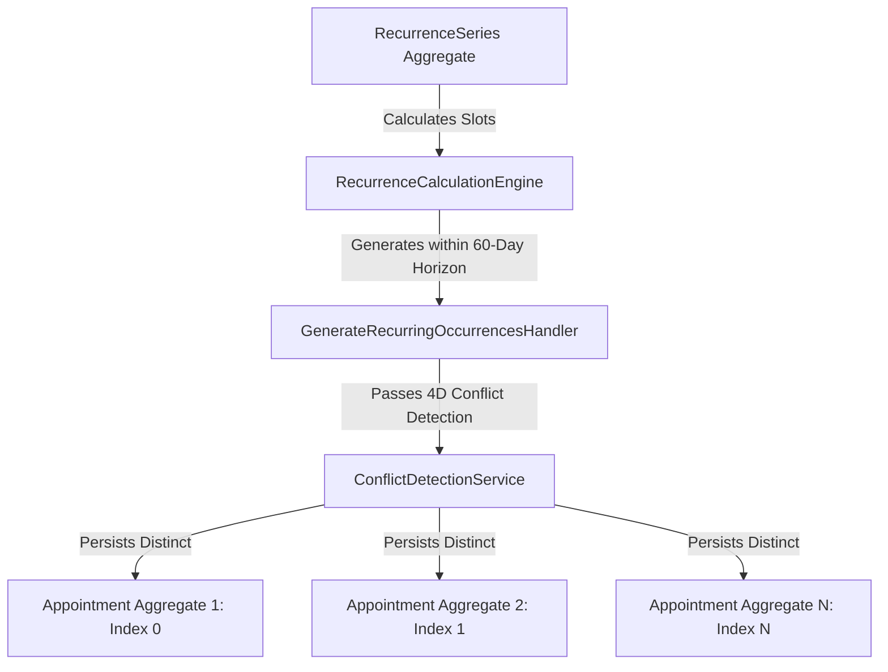

# ADR-0043: Recurring Appointment Scheduling Strategy & Hybrid Horizon Architecture

- **Status**: Accepted
- **Date**: 2026-08-14
- **Context**: Clinical therapy platforms require recurring appointments (e.g., weekly physical therapy, biweekly counseling). Unlike single bookings, recurring appointments present unique challenges: unbounded time horizons, clinical exceptions (e.g., patient travels, single-session room reassignments), Daylight Saving Time (DST) shifts, and transactional concurrency.

---

## 1. Context & Problem Statement

In a clinical practice, a client often needs long-term therapy on a regular schedule (e.g., "every Tuesday at 10:00 AM for 12 weeks" or "indefinitely"). However:

1. **Clinical Mutability**: Any single session in a series may be individually rescheduled, moved to a different room, assigned to a substitute therapist, or skipped, without breaking the rest of the schedule.
2. **Transactional Integrity**: Materializing hundreds of future appointments inside a single database transaction creates extreme lock contention and performance bottlenecks.
3. **Temporal Invariance**: Sessions must occur at the same local wall-clock time (e.g., 10:00 AM) regardless of DST shifts (UTC-5 $\leftrightarrow$ UTC-4).
4. **Relational Interoperability**: Receptionist dashboards, practitioner schedules, and conflict detection engines require relational `Appointment` aggregates for fast indexed querying.

---

## 2. Architectural Decision

Kinergy adopts a **Hybrid Rolling-Window Generation Architecture** separating the recurrence definition aggregate from materialized appointment aggregates:

### Key Architectural Pillars

1. **`RecurrenceSeries` Aggregate Root**:
   - Manages the series lifecycle (`ACTIVE`, `COMPLETED`, `CANCELLED`), recurrence pattern rules (`frequency`, `startDate`, `endDate`, `maxOccurrences`, `localStartTime`, `durationMinutes`, `timezone`), and exception log (`SKIPPED`, `MODIFIED`, `RESCHEDULED`).
   - Represents the _intent_ of recurrence, not the physical appointment instances.

2. **Independent `Appointment` Aggregates**:
   - Each materialized occurrence is a fully formed, independent `Appointment` aggregate root with its own lifecycle (`SCHEDULED`, `CONFIRMED`, `CHECKED_IN`, `COMPLETED`, `CANCELLED`).
   - Stores `seriesId`, `occurrenceIndex` (0-indexed), and `isDetachedFromSeries` boolean flag.

3. **Hybrid Rolling-Window Generation**:
   - Occurrences are materialized ahead within a rolling horizon window (default 60 days, configurable 30–90 days).
   - As time advances, background or on-demand generation extends the materialized horizon.

---

## 3. Temporal Model & Timezone Strategy

Conforming strictly to **ADR-005 (UTC Temporal Normalization)**:

1. **UTC Core Normalization**: All timestamps are persisted as UTC ISO 8601 `Date` instances.
2. **Local Wall-Clock Preservation**: The `RecurrencePattern` stores `localStartTime: { hour, minute }` and an IANA timezone string (e.g., `'America/New_York'`).
3. **DST Invariance**:
   - The `RecurrenceCalculationEngine` calculates each occurrence date by converting the target date to the local IANA timezone, applying `{ hour, minute }`, and resolving the exact UTC instant.
   - During US Eastern Spring Forward (EST $\rightarrow$ EDT), a 10:00 AM appointment shifts from 15:00 UTC to 14:00 UTC automatically, preserving 10:00 AM local clinic wall-clock time.
4. **Month-End Clamping Policy**:
   - For `MONTHLY` frequency starting on the 31st (or 29th/30th), shorter months are clamped to their valid last day (e.g., Jan 31 $\rightarrow$ Feb 28/29 $\rightarrow$ Mar 31 $\rightarrow$ Apr 30).
   - Leap years (Feb 29 on 2028, 2032) are accurately respected vs non-leap years (Feb 28).

---

## 4. Generation, Idempotency & Conflict Detection

1. **Deterministic Occurrence Identity**:
   - Each slot is assigned an integer `occurrenceIndex` starting at `0`.
   - Database constraint: `@@unique([seriesId, occurrenceIndex])` guarantees physical uniqueness.
2. **Idempotency**:
   - Successive generation runs inspect existing non-cancelled appointments matching `seriesId` and skip already materialized indices.
   - Overlapping or duplicate generation requests produce zero duplicate appointments.
3. **Conflict Detection Pipeline**:
   - Every candidate occurrence is evaluated via `ConflictDetectionService` across 4 dimensions: Therapist availability, Room availability/features, Client overlaps, and Facility Operating Hours.
   - If a conflict exists, the occurrence is skipped and recorded in `conflictingOccurrences` diagnostics without aborting unconflicted occurrences (partial generation resilience).
4. **Retry Behavior**:
   - Resolving a scheduling conflict (e.g., reassigning an overlapping booking) allows the next generation run to automatically materialize the previously skipped slot.

---

## 5. Concurrency & Transaction Boundaries

1. **Aggregate Isolation**: `RecurrenceSeries` and `Appointment` aggregates are persisted in separate transaction boundaries.
2. **Optimistic Locking**: Aggregates track an integer `version` property to prevent lost updates under race conditions.
3. **Database Uniqueness**: Prisma schema enforces `@@unique([seriesId, occurrenceIndex])`, ensuring concurrent generator runs cannot insert conflicting duplicate slots.

---

## 6. Exceptions & Editing Semantics

1. **Skip Occurrence**:
   - Appends `RecurrenceException.create({ occurrenceIndex, type: 'SKIPPED' })` to the series.
   - Cancels any existing materialized appointment at that index.
   - Future generation runs will permanently ignore this index.
2. **Edit Single Occurrence (Detachment)**:
   - Updates the specific `Appointment` aggregate (new time, room, or therapist) and sets `isDetachedFromSeries = true`.
   - Records `MODIFIED` exception in the series.
   - Future generation runs recognize the existing detached appointment and will not overwrite or duplicate it.
3. **Edit Future Occurrences (Cutoff-and-Fork)**:
   - Sets `endDate` / `maxOccurrences` on the existing `RecurrenceSeries` aggregate, truncating it prior to the cutoff date.
   - Cancels all future uncompleted, non-detached appointments on the old series.
   - Spawns a new `RecurrenceSeries` aggregate starting from the cutoff date with updated frequency, time, therapist, or room.
4. **Cancel Series**:
   - Transitions `RecurrenceSeries` status to `CANCELLED`.
   - Cancels all future non-detached appointments while strictly preserving completed/historical appointment records.
   - Rejects future generation attempts.

---

## 7. Alternatives Evaluated & Rejected

| Alternative                                          | Evaluation & Rationale for Rejection                                                                                                                                                                                  |
| :--------------------------------------------------- | :-------------------------------------------------------------------------------------------------------------------------------------------------------------------------------------------------------------------- |
| **1. Generate Every Occurrence Indefinitely**        | **Rejected.** Creating years of appointments up front bloats the database with empty records, causes massive transaction timeouts, and renders schedule restructuring impractical.                                    |
| **2. Dynamic Calculation Without Materialization**   | **Rejected.** Virtual on-the-fly recurrence calculation breaks standard relational SQL queries, room utilization tracking, clinic receptionist daily views, check-in state machines, and billing workflows.           |
| **3. Giant Single `RecurringAppointment` Aggregate** | **Rejected.** Bundling all occurrences inside a single aggregate root violates DDD boundary guidelines, causes intense database locking contention on high-frequency edits, and complicates single-session workflows. |
| **4. Cron-Only Background Scheduling**               | **Rejected.** Standard cron jobs lack patient-specific clinical recurrence awareness, timezone/DST wall-clock stability, and cannot handle clinical exceptions (e.g., skip, detach, fork).                            |
| **5. External Library (e.g. `rrule.js`)**            | **Rejected.** External libraries add heavy runtime dependencies, lack tight integration with DDD value objects (`TimeRange`, `Duration`, `Clock`), and do not provide clinical conflict or exception semantics.       |

---

## 8. Consequences

### Positive

- High query performance for reception and therapist daily views using standard `Appointment` indexing.
- Complete clinical flexibility: patients can modify or skip single sessions without corrupting the master schedule.
- Immune to DST shifts and timezone drift.
- Highly resilient to partial generation failures and concurrency races.

### Negative / Trade-offs

- Requires rolling horizon generation (on series creation and via periodic background extension).
- Requires Cutoff-and-Fork aggregate lifecycle for modifying future recurring patterns.
