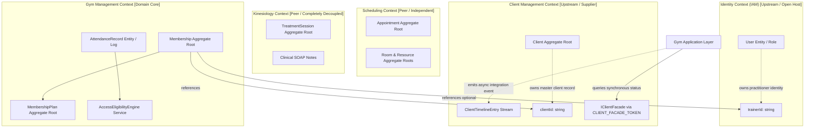
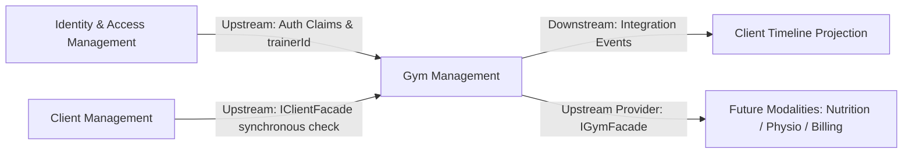

# ADR-0054: Gym Management Bounded Context Ownership, Context Map & Architectural Invariants

- **Status**: Accepted
- **Date**: 2026-08-18
- **Deciders**: Principal Domain Architect, Senior Platform Engineer
- **Context**: Kinergy Platform is expanding to Phase 5 (Gym Management & Membership Operations). The platform must support membership subscriptions, plan configurations, automated renewals, freeze/expiration lifecycles, and front-desk attendance/turnstile check-ins without violating established bounded context boundaries (Identity, Client Management, Scheduling, Kinesiology) or duplicating domain models.

---

## 1. Context & Problem Statement

In integrated wellness and fitness facility management systems:

1. **Model Duplication Hazard**: High risk of creating a duplicate `GymMember` or `GymUser` domain entity that copies client demographics or user authentication credentials.
2. **Context Bleed Hazard**: Conflating gym access control with clinical treatment records (Kinesiology) or calendar appointments (Scheduling) leads to bloated god-aggregates, circular dependencies, and security regressions.
3. **Distributed Transaction Hazard**: Synchronously linking membership status checks, attendance check-ins, and client profile updates in multi-table database transactions introduces distributed locks and database contention.
4. **Unclear Ubiquitous Language**: Confusion regarding where membership eligibility, renewal, freeze, and attendance rules reside.

A formal architectural decision is required to establish the **Gym Management Bounded Context**, delineate authoritative data ownership, define the Context Map, and enforce strict architectural boundary invariants.

---

## 2. Architectural Decision

Kinergy establishes a dedicated **Gym Management Bounded Context** located in `packages/core/src/gym/` (and exposed via API in `apps/api/src/gym/` and frontend in `apps/web/src/modules/gym/`).

### 2.1 The Mandatory Architectural Invariant

> **Gym Management is the sole authoritative owner of gym membership lifecycle states, membership plan terms & validity policies, recurring membership renewal & expiration logic, facility entry eligibility evaluation, attendance tracking & turnstile check-in logs, and operational trainer-member service allocation within the fitness facility.**

No other bounded context may define, mutate, or govern gym membership lifecycle, attendance verification, or plan eligibility rules.

---

## 3. Authoritative Ownership Matrix

| Domain Concept             | Owning Bounded Context | Ownership Classification        | Allowed Consumers                                                        | Strictly Forbidden Owners                    |
| :------------------------- | :--------------------- | :------------------------------ | :----------------------------------------------------------------------- | :------------------------------------------- |
| **`Client`**               | **Client Management**  | Master Aggregate Root           | Scheduling, Kinesiology, Gym, Billing (via `clientId` / `IClientFacade`) | ❌ Gym, Scheduling, Kinesiology, Identity    |
| **`User`**                 | **Identity (IAM)**     | Master Aggregate Root           | All contexts (via request actor ID / `trainerId` / `therapistId`)        | ❌ Gym, Client, Scheduling, Kinesiology      |
| **`Membership`**           | **Gym Management**     | Master Aggregate Root           | Client Timeline, Gym API, Billing, Future Modalities                     | ❌ Client, Identity, Scheduling, Kinesiology |
| **`MembershipPlan`**       | **Gym Management**     | Master Aggregate Root           | Gym API, Front Desk, Billing                                             | ❌ Client, Scheduling, Kinesiology           |
| **`MembershipStatus`**     | **Gym Management**     | Value Object / State Machine    | Gym Application, Client Summary, Front Desk UI                           | ❌ Client, Scheduling, Identity              |
| **`MembershipPeriod`**     | **Gym Management**     | Immutable Value Object          | Gym Application, Billing                                                 | ❌ Client, Scheduling                        |
| **`Renewal`**              | **Gym Management**     | Domain Policy / Use Case        | Gym Application, Billing Integration                                     | ❌ Client, Scheduling, Identity              |
| **`AttendanceRecord`**     | **Gym Management**     | Entity / Append-Only Log        | Front Desk UI, Client Timeline, Analytics                                | ❌ Client, Scheduling, Identity              |
| **`Trainer` (Assignment)** | **Gym Management**     | Scalar `trainerId: string` Link | Gym Desk, Scheduling, Mobile App                                         | ❌ Gym duplicating User credentials/profile  |
| **`Appointment`**          | **Scheduling**         | Master Aggregate Root           | Kinesiology, Gym, Reception UI                                           | ❌ Gym, Kinesiology, Client                  |
| **`TreatmentSession`**     | **Kinesiology**        | Master Aggregate Root           | Clinical Workspace, Client Timeline                                      | ❌ Gym, Scheduling, Client                   |
| **`Room`**                 | **Scheduling**         | Master Aggregate Root           | Scheduling Calendar, Maintenance                                         | ❌ Gym, Kinesiology, Client                  |

---

## 4. Upstream & Downstream Integration Boundaries

### Integration Boundary Specification

| Relationship                      | Contexts Involved                                        | Direction & Mechanism                                                   | Transferred Contract                                                        | Forbidden Coupling                                                              |
| :-------------------------------- | :------------------------------------------------------- | :---------------------------------------------------------------------- | :-------------------------------------------------------------------------- | :------------------------------------------------------------------------------ |
| **Gym $\rightarrow$ Client**      | Gym (Customer) $\leftarrow$ Client (Supplier)            | Downstream consumes upstream via in-process `IClientFacade`             | `ClientSummaryDto`, `isClientActive(clientId)`                              | ❌ Importing `Client` aggregate or querying `clients` DB table directly         |
| **Gym $\rightarrow$ Identity**    | Gym (Downstream) $\leftarrow$ Identity (Upstream)        | Consumes request context (`ReqUser`) and references `trainerId: string` | Scalar UUID string (`usr_...`)                                              | ❌ Importing `User` aggregate, password hashing, or querying `users` table      |
| **Gym $\rightarrow$ Scheduling**  | Gym (Peer) $\leftrightarrow$ Scheduling (Peer)           | Independent bounded contexts; optional correlation via `appointmentId`  | Scalar UUID string (`appt_...`)                                             | ❌ Importing `Appointment` aggregate, room recurrence engines, or booking slots |
| **Gym $\rightarrow$ Kinesiology** | Gym $\leftrightarrow$ Kinesiology                        | Completely isolated; zero runtime dependency                            | None (Zero direct communication)                                            | ❌ Importing `TreatmentSession`, SOAP clinical notes, or clinical history       |
| **Gym $\rightarrow$ Timeline**    | Gym (Publisher) $\rightarrow$ Client Timeline (Consumer) | Asynchronous Integration Event dispatch                                 | `MembershipPurchasedIntegrationEvent`, `AttendanceRecordedIntegrationEvent` | ❌ Synchronous $2\text{PC}$ database transactions or shared SQL triggers        |
| **Gym $\rightarrow$ Billing**     | Gym (Supplier) $\rightarrow$ Billing (Customer)          | Published Language / Facade query                                       | `MembershipPlanDto`, `MembershipBillingScheduleDto`                         | ❌ Billing mutating membership lifecycle states directly                        |

---

## 5. Architectural Invariants for Automated Enforcement

1. **Invariant 1 (Membership Sovereignty)**: Gym Management is the sole authoritative owner of membership lifecycle, plan rules, validity periods, renewals, freezes, and expirations.
2. **Invariant 2 (Attendance Sovereignty)**: Gym Management is the sole authoritative owner of attendance verification, check-in validation, and turnstile entry history.
3. **Invariant 3 (Client Identity Decoupling)**: Master client records and personal profiles are strictly owned by Client Management. Gym entities store only scalar `clientId: string`.
4. **Invariant 4 (Identity & Credential Isolation)**: User accounts, passwords, and tokens are strictly owned by Identity. Gym references staff/trainers strictly via scalar `trainerId: string`.
5. **Invariant 5 (Clinical Boundary Protection)**: Medico-legal SOAP clinical notes and kinesiology treatment sessions are strictly inaccessible and uncoupled from Gym Management.
6. **Invariant 6 (Zero Foreign Domain Imports)**: Gym domain production code (`packages/core/src/gym/domain/`) MUST NOT import from `@nestjs/*`, `@prisma/*`, `express`, or foreign bounded context internals (`scheduling/domain`, `kinesiology/domain`, `modules/client/domain`).
7. **Invariant 7 (Zero Distributed Transactions)**: State transitions in Gym Management execute locally with optimistic concurrency (`version: number`); no $2\text{PC}$ or cross-context SQL foreign keys.
8. **Invariant 8 (Asynchronous Timeline Projection)**: Cross-context activity feed updates use immutable integration event contracts (`schemaVersion = 1 as const`, all properties `readonly`).

---

## 6. Alternatives Considered

### Alternative A: Embedding Memberships in Client Management (`modules/client/`)

- _Description_: Add `Membership` as an entity inside the `Client` aggregate root.
- _Rejection Reason_: Violates Single Responsibility and Clean Architecture. Blooms the `Client` aggregate into a god-object, forces schema locks on client profile edits during gym check-ins, and tightly couples fitness business logic with generic CRM identity.

### Alternative B: Direct Database Joins Across Contexts

- _Description_: Query `clients`, `users`, and `memberships` tables via Prisma relational `$include` in a single SQL query.
- _Rejection Reason_: Breaks bounded context autonomy, couples schema evolution, prevents isolated microservice extraction, and bypasses domain invariant guards.

---

## 7. Consequences

### Positive

- **Architectural Purity**: Clean separation between customer identity (Client), staff authentication (Identity), clinical encounters (Kinesiology), calendar slots (Scheduling), and fitness memberships (Gym).
- **High Concurrency**: Gym turnstile check-ins execute in milliseconds against local `AttendanceRecord` and cached membership status without lock contention on master client or booking tables.
- **Automated Verification**: Boundary purity enforced via Jest architectural unit tests.

### Negative / Trade-offs

- Cross-context profile hydration (e.g. displaying member full name on turnstile screens) requires in-memory assembly via `IClientFacade` rather than raw SQL joins.

---

## 8. References

- [Gym Management Context Specification](../architecture/contexts/gym.md)
- [ADR-0002: Client Domain Foundation & Identity Decoupling](./0002-client-domain-foundation.md)
- [ADR-0010: Backend Clean Architecture & Layering](./0010-backend-clean-architecture-layering.md)
- [ADR-0045: Kinesiology Bounded Context Ownership](./0045-kinesiology-bounded-context-and-cross-context-identifiers.md)
- [ADR-0048: Anti-Corruption Layer Port Architecture](./0048-scheduling-to-kinesiology-anti-corruption-layer-port-architecture.md)
