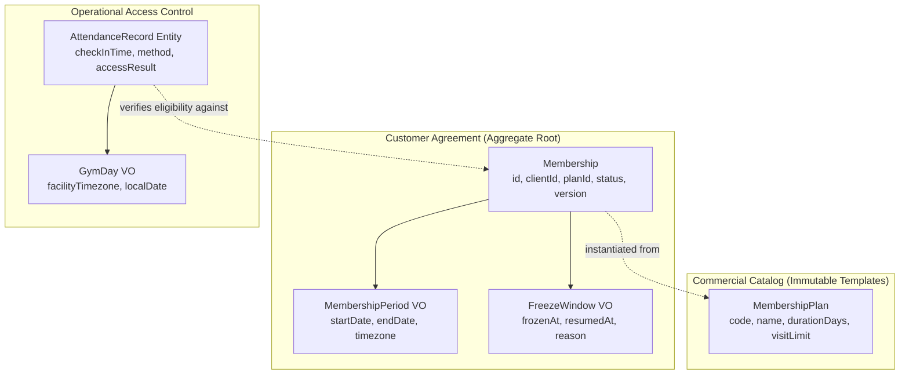

# ADR-0055: Gym Management Canonical Domain Vocabulary & Semantic Contracts

- **Status**: Accepted
- **Date**: 2026-08-18
- **Deciders**: Principal Domain Architect, Senior Domain Modeler & Business Analyst
- **Context**: Kinergy Platform Phase 5 (Gym Management). To prevent domain model corruption, ambiguous aggregate boundaries, inconsistent API contracts, and contradictory business rules, the ubiquitous language for Gym Management must be formally established and strictly governed before domain behavior code is implemented.

---

## 1. Context & Problem Statement

In fitness facility and health club software engineering, terminology ambiguity introduces severe design defects:

1. **Plan vs Subscription vs Membership**: Conflating the commercial catalog template (`MembershipPlan`) with the customer's active agreement (`Membership`) leads to accidental mutation of historical customer terms when commercial pricing updates.
2. **Temporal vs Stored Expiration**: Confusing the scheduled expiration date with the lifecycle state transition causes race conditions where expired members enter facilities because a background batch job has not yet updated the database row.
3. **Attendance Collision**: Scheduling uses "attendance" to denote kept appointment ratios, whereas Gym Management uses "attendance" to denote physical turnstile/kiosk facility check-ins.
4. **Trainer Identity Bloom**: Fabricating a duplicate `Trainer` aggregate inside Gym Management duplicates user accounts already governed by Identity (IAM).
5. **UTC Date Drift (Gym Day)**: Evaluating daily visit limits in raw UTC causes member check-ins late at night (e.g. 11:30 PM local time) to count towards the following day's quota.

A formal Architectural Decision Record is required to establish the canonical terminology, semantic models, and prohibited aliases for Gym Management.

---

## 2. Architectural Decisions & Semantic Resolutions

### 2.1 Core Domain Semantic Decisions

#### 1. `Membership` vs `MembershipPeriod`

- **`Membership`** is the long-lived consistency-enforcing **Aggregate Root**. It maintains the continuous commercial agreement, identity, status lifecycle, and concurrency version (`version: number`).
- **`MembershipPeriod`** is an **Immutable Value Object** encapsulated within the `Membership`. It defines the specific validity interval (`startDate: Date`, `endDate: Date`).
- _Decision_: Renewals extend or replace the internal `MembershipPeriod` while maintaining aggregate ID continuity and historical audit links.

#### 2. `MembershipPlan` vs `Membership`

- **`MembershipPlan`** is the catalog definition (the commercial product offering) containing duration, pricing tier, visit quotas, and allowed entry hours.
- **`Membership`** is the customer's acquired contract instance. When a membership is purchased, plan terms are captured; subsequent edits to a `MembershipPlan` never alter active memberships retroactively.

#### 3. Stored Status vs Derived Access Eligibility

- **Stored `MembershipStatus`**: Explicit finite state machine value (`PENDING`, `ACTIVE`, `FROZEN`, `EXPIRED`, `CANCELLED`, `TERMINATED`).
- **Derived `AccessEligibility`**: Real-time evaluation combining stored status (`ACTIVE`), temporal interval (`clock.now() <= period.endDate`), and client active standing via `IClientFacade`.
- _Decision_: Turnstile check-in fast-paths evaluate real-time temporal validity even if a background state-machine expiration transition has not yet persisted.

#### 4. Renewal vs New Membership

- **`Renewal`** is a domain action that calculates an extended `MembershipPeriod` on an existing `Membership` aggregate upon payment receipt, retaining historical tenure and member ID.
- **`New Membership`** creates a new `Membership` aggregate root instance when a client acquires a different product tier or re-enrolls following termination.

#### 5. Expiration Disambiguation

- **Scheduled Expiration**: The planned target timestamp (`period.endDate`).
- **State Expiration**: The formal lifecycle transition `expire()` setting status to `EXPIRED`.
- **Administrative Cancellation**: Explicit human or policy termination (`cancel(reason)`) moving status to `CANCELLED` prior to `endDate`.

#### 6. Attendance & Physical Facility Entry

- **`CheckIn`**: The momentary physical access event attempt at a turnstile or front desk.
- **`AttendanceRecord`**: The persisted append-only domain entity documenting timestamp, method (`BARCODE`, `RFID`, `MANUAL`, `BIOMETRIC`, `QR_CODE`), facility gate, and outcome (`GRANTED`, `DENIED_EXPIRED`, `DENIED_FROZEN`, `DENIED_INACTIVE_CLIENT`, `DENIED_LIMIT_REACHED`).
- _Collision Prevention_: The term `Attendance` in Gym Management strictly denotes physical facility presence. Appointment attendance in Scheduling is termed `AppointmentAttendanceCompliance`.

#### 7. Trainer Representation

- `Trainer` is **NOT** a Gym-owned aggregate root.
- Staff trainers are identity entities in IAM (`User` with role `TRAINER`).
- Gym Management models trainer relationships strictly as scalar references (`trainerId: string`) in operational service allocations.

#### 8. `GymDay` & Timezone Boundaries

- **`GymDay`** is a domain Value Object representing the facility's local calendar day (`facilityId`, `timezone`, `localDate: string [YYYY-MM-DD]`).
- All daily visit limits, operating hours, and attendance reporting calculate against `GymDay`, preventing UTC boundary errors.

---

## 3. Canonical Vocabulary Table

| Canonical Term          | Conceptual Domain Definition                                                                      | Owning Context     | DDD Type                | Lifecycle / State                                                   | Prohibited Synonyms / Rejected Aliases                                          |
| :---------------------- | :------------------------------------------------------------------------------------------------ | :----------------- | :---------------------- | :------------------------------------------------------------------ | :------------------------------------------------------------------------------ |
| **`Membership`**        | Long-lived agreement granting a client facility access privileges under specific plan terms.      | **Gym Management** | Aggregate Root          | `PENDING`, `ACTIVE`, `FROZEN`, `EXPIRED`, `CANCELLED`, `TERMINATED` | ❌ `Subscription`, `Pass`, `GymContract`, `GymCard`, `UserMembership`, `Member` |
| **`MembershipPlan`**    | Commercial product catalog definition detailing validity duration, visit limits, and access tier. | **Gym Management** | Aggregate Root / Entity | `DRAFT`, `ACTIVE`, `ARCHIVED`                                       | ❌ `Package`, `Tariff`, `PricingPlan`, `Tier`, `GymPackage`, `ServicePlan`      |
| **`MembershipStatus`**  | Explicit lifecycle state enum of a `Membership`.                                                  | **Gym Management** | Value Object / Enum     | Static Enum                                                         | ❌ `SubscriptionState`, `MemberState`, `CardStatus`, `ContractStatus`           |
| **`MembershipPeriod`**  | Immutable validity time interval (`startDate`, `endDate`) of a membership.                        | **Gym Management** | Value Object            | Immutable                                                           | ❌ `ValidityWindow`, `DateRange`, `DurationPeriod`, `ContractTerm`              |
| **`Renewal`**           | Domain operation extending a membership's validity interval upon re-subscription.                 | **Gym Management** | Domain Action / Policy  | N/A (Event / Command)                                               | ❌ `Re-subscription`, `Extension`, `Re-bill`, `Top-Up`                          |
| **`FreezeWindow`**      | Approved temporary suspension interval halting access and extending expiration.                   | **Gym Management** | Value Object            | `PENDING`, `ACTIVE`, `COMPLETED`                                    | ❌ `PausePeriod`, `SuspensionWindow`, `Hold`, `VacationTime`                    |
| **`AttendanceRecord`**  | Immutable append-only audit record of a physical check-in attempt at a facility.                  | **Gym Management** | Entity / Log            | Immutable                                                           | ❌ `VisitRecord`, `TurnstileLog`, `EntryLog`, `Swipe`, `AccessLog`              |
| **`CheckIn`**           | The physical entry verification action at a facility turnstile or kiosk.                          | **Gym Management** | Domain Command / Action | N/A (Command)                                                       | ❌ `Swipe`, `Tap`, `Scan`, `ClockIn`, `Entry`, `GatePass`                       |
| **`AccessEligibility`** | Evaluated access decision outcome (`GRANTED`, `DENIED_EXPIRED`, `DENIED_FROZEN`, etc.).           | **Gym Management** | Value Object / Result   | Immutable                                                           | ❌ `PassStatus`, `EntryPermission`, `AllowAccess`, `GateResponse`               |
| **`GymDay`**            | Timezone-aware local business date (`YYYY-MM-DD`) for quota and operating calculations.           | **Gym Management** | Value Object            | Immutable                                                           | ❌ `BusinessDate`, `CalendarDay`, `FacilityDate`, `ShiftDate`                   |
| **`TrainerAssignment`** | Operational link associating a client/membership with an assigned fitness trainer.                | **Gym Management** | Value Object            | `ACTIVE`, `INACTIVE`                                                | ❌ `TrainerUser`, `Coach`, `Instructor`, `PersonalTrainer`                      |

---

## 4. Glossary & Governance Rules

1. **Strict Terminology Enforcement**: All code symbols (classes, methods, variables), API endpoints, DTOs, database tables, and UI text must strictly use the **Canonical Terms**.
2. **Prohibited Synonyms**: Using `Subscription` instead of `Membership`, `Package` instead of `MembershipPlan`, or `Swipe` instead of `CheckIn` is an architectural violation.
3. **Pluralization Standards**:
   - Aggregate roots and entities use singular PascalCase (`Membership`, `MembershipPlan`, `AttendanceRecord`).
   - Database tables use snake_case plural (`memberships`, `membership_plans`, `attendance_records`).
   - REST API endpoints use kebab-case plural (`/api/v1/gym/memberships`, `/api/v1/gym/plans`, `/api/v1/gym/attendance`).

---

## 5. Consequences

### Positive

- **Deterministic Modeling**: Eliminates semantic collisions between subscriptions, packages, and passes.
- **Resilient Temporal Logic**: `GymDay` and `MembershipPeriod` isolate timezone and leap-year edge cases.
- **Decoupled Identity**: Preserves clean boundary with Identity (`User`) and Client Management (`Client`).

### Negative / Trade-offs

- Developers accustomed to calling gym memberships "subscriptions" or "packages" must adhere to the standardized vocabulary.

---

## 6. References

- [Gym Management Vocabulary Specification](../business/gym-vocabulary.md)
- [ADR-0054: Gym Management Bounded Context Ownership](./0054-gym-management-bounded-context-ownership-and-context-map.md)
- [Platform Glossary](../glossary.md)
