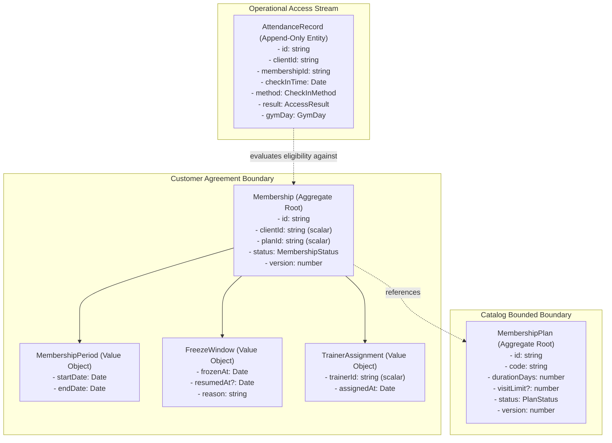

# ADR-0056: Gym Management Aggregate Discovery & Boundary Decisions

- **Status**: Accepted
- **Date**: 2026-08-18
- **Deciders**: Principal DDD Architect, Senior Domain Modeler & Business Analyst
- **Context**: Kinergy Platform Phase 5 (Gym Management). Having established context boundaries (ADR-0054) and canonical vocabulary (ADR-0055), we must determine the smallest coherent transactional boundaries (Aggregates) that protect domain business invariants without introducing unnecessary contention, bloated entities, or cross-aggregate coupling.

---

## 1. Context & Problem Statement

Designing aggregates by intuition or database table mapping introduces severe anti-patterns in DDD:

1. **Overly Large Aggregates**: Bundling `Membership`, `MembershipPlan`, and `AttendanceRecord` into a single cluster causes high transactional contention on check-ins and plan updates.
2. **Anemic Fragmented Aggregates**: Splitting `MembershipPeriod` or `FreezeWindow` into separate independent aggregates leads to broken invariants where periods are modified without validating the parent membership state machine.
3. **Duplicate Identity Aggregates**: Creating a `Trainer` aggregate in Gym duplicates IAM `User` entities.
4. **Mutating Check-In Aggregates**: Treating `Attendance` as a mutating stateful aggregate creates lock serialization on front-desk turnstiles during peak hours.

We require definitive architectural decisions on aggregate boundaries, entity compositions, value objects, and concurrency models.

---

## 2. Selected Aggregates & Domain Entities

### 2.1 Summary of Architectural Decisions

| Domain Concept          | DDD Classification           | Owning Boundary             | Primary Responsibility / Protected Invariant                                                                                       |
| :---------------------- | :--------------------------- | :-------------------------- | :--------------------------------------------------------------------------------------------------------------------------------- |
| **`Membership`**        | **Aggregate Root**           | Customer Agreement Boundary | Governs membership lifecycle state machine, period calculation, freeze extensions, renewal continuity, and optimistic concurrency. |
| **`MembershipPlan`**    | **Aggregate Root**           | Commercial Catalog Boundary | Governs commercial plan definitions, pricing tiers, duration policies, visit quotas, and catalog publication lifecycles.           |
| **`AttendanceRecord`**  | **Append-Only Entity / Log** | Operational Access Stream   | Immutable audit record of a physical check-in event. High-throughput write-once stream; zero mutating state transitions.           |
| **`TrainerAssignment`** | **Value Object**             | Customer Agreement Boundary | Operational link storing scalar `trainerId: string` inside `Membership`. Trainer identity is owned by IAM (`User`).                |

---

## 3. Deep Aggregate Boundary Specifications

### 3.1 Aggregate Root: `Membership`

- **Root Entity**: `Membership`
- **Internal Entities**: None.
- **Value Objects**: `MembershipPeriod`, `FreezeWindow[]`, `TrainerAssignment?`, `MembershipStatus` (enum).
- **Protected Invariants**:
  1. **Strict State Transitions**: Only valid transitions permitted (`PENDING` $\rightarrow$ `ACTIVE` $\rightleftharpoons$ `FROZEN` $\rightarrow$ `EXPIRED` / `CANCELLED` $\rightarrow$ `TERMINATED`).
  2. **Period Validity**: `startDate` must be prior to or equal to `endDate`.
  3. **Freeze Integrity**: Cannot freeze unless `ACTIVE`; cannot unfreeze unless `FROZEN`; unfreezing recalculates `period.endDate` by extending it exactly by the elapsed freeze duration.
  4. **Renewal Continuity**: Renewing an active or recently expired membership extends the `period.endDate` and increments `version`, preserving aggregate history.
  5. **Optimistic Concurrency**: Every state mutation increments `version: number`.
- **External References**: Strictly scalar UUIDs (`clientId: string`, `planId: string`, `trainerId?: string`).
- **Repository Boundary**: `IMembershipRepository` (`save`, `findById`, `findActiveByClientId`).

### 3.2 Aggregate Root: `MembershipPlan`

- **Root Entity**: `MembershipPlan`
- **Internal Value Objects**: `PlanCode`, `PlanPricingTier`, `AccessTimeWindow`.
- **Protected Invariants**:
  1. **Plan Code Uniqueness**: Unique business code per facility/catalog.
  2. **Positive Duration**: `durationDays` must be an integer $\ge 1$.
  3. **Non-Negative Quotas**: `visitLimit` if defined must be $\ge 1$.
  4. **Catalog Lifecycle**: Once `ARCHIVED`, a plan cannot be purchased for new memberships, but existing memberships retain their contractual terms.
- **External References**: None.
- **Repository Boundary**: `IMembershipPlanRepository` (`save`, `findById`, `findByCode`, `listActivePlans`).

### 3.3 Append-Only Entity: `AttendanceRecord`

- **Why NOT an Aggregate Root?**
  - Check-in records are write-once, immutable logs.
  - A check-in is never modified, rescheduled, or cancelled after the fact.
  - Forcing aggregate root locking on turnstiles would serialize concurrent check-ins and create database row lock contention.
  - Access eligibility is evaluated by a stateless domain service against `Membership` prior to inserting the `AttendanceRecord`.
- **Composition**: `id`, `clientId`, `membershipId`, `checkInTime`, `checkInMethod`, `accessResult`, `gateId`, `gymDay`.
- **Repository Boundary**: `IAttendanceRecordRepository` (`append(record)`, `findRecentByClientId`, `findByGymDay`).

### 3.4 Operational Role: Trainer

- **Gym Management does NOT own a Trainer aggregate root**.
- Staff trainers are IAM `User` entities with role `TRAINER`.
- Gym Management models trainer relationships strictly as `TrainerAssignment` value objects holding scalar `trainerId: string`.

---

## 4. Rejected Alternatives & Architectural Trade-offs

### Alternative A: Single Monolithic `GymMember` Aggregate

- _Proposal_: Combine `Client`, `Membership`, `MembershipPlan`, and `AttendanceRecord` into one giant aggregate root.
- _Reason for Rejection_: Violates Single Responsibility and Bounded Context isolation. Turnstile check-ins would acquire write locks on client master records, causing massive concurrency bottlenecks across the entire platform.

### Alternative B: `MembershipPeriod` as an Independent Aggregate Root

- _Proposal_: Separate `MembershipPeriod` from `Membership` as its own aggregate root.
- _Reason for Rejection_: A membership period has zero meaning or lifecycle outside its parent `Membership`. Splitting it would require distributed cross-aggregate transactions to validate freeze extensions and renewals.

### Alternative C: `Attendance` as a Mutating Aggregate Root

- _Proposal_: Model `Attendance` as an aggregate root with states like `CHECKED_IN`, `IN_FACILITY`, `CHECKED_OUT`.
- _Reason for Rejection_: Most fitness facilities operate with rapid turnstile badge taps and no mandatory turnstile checkout. Creating stateful checkout tracking complicates the core domain and adds overhead. An append-only log satisfies all security audit, billing, and capacity tracking requirements.

### Alternative D: Creating a `Trainer` Aggregate in Gym Management

- _Proposal_: Create a `Trainer` aggregate root in `packages/core/src/gym/domain/trainer/`.
- _Reason for Rejection_: Duplicates IAM `User` data and introduces split-brain authentication states.

---

## 5. Consequences

### Positive

- **High Concurrency**: Turnstile check-ins write to an append-only table without locking `Membership` or `Client` rows.
- **Clean Invariant Protection**: `Membership` encapsulates period, freeze, and status logic within a tight transactional boundary.
- **Zero Cross-Aggregate Mutation**: Plan updates and membership lifecycles remain completely decoupled.

### Negative / Trade-offs

- Downstream views requiring member name + membership status + plan name must compose read models using `IClientFacade` and DTO projections rather than direct SQL joins across aggregates.

---

## 6. References

- [ADR-0054: Gym Management Bounded Context Ownership](./0054-gym-management-bounded-context-ownership-and-context-map.md)
- [ADR-0055: Gym Management Canonical Domain Vocabulary](./0055-gym-management-canonical-domain-vocabulary-and-semantic-contracts.md)
- [Gym Bounded Context Specification](../architecture/contexts/gym.md)
