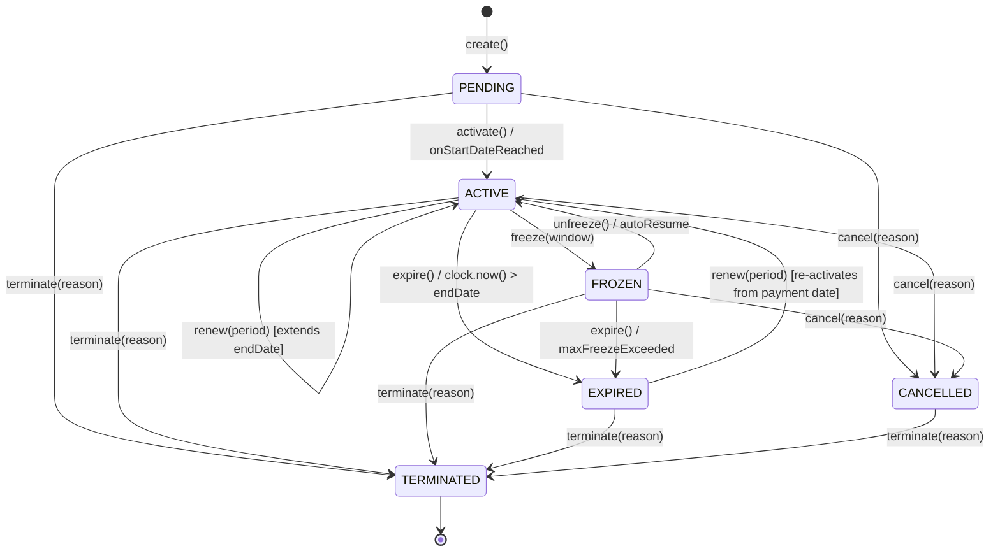
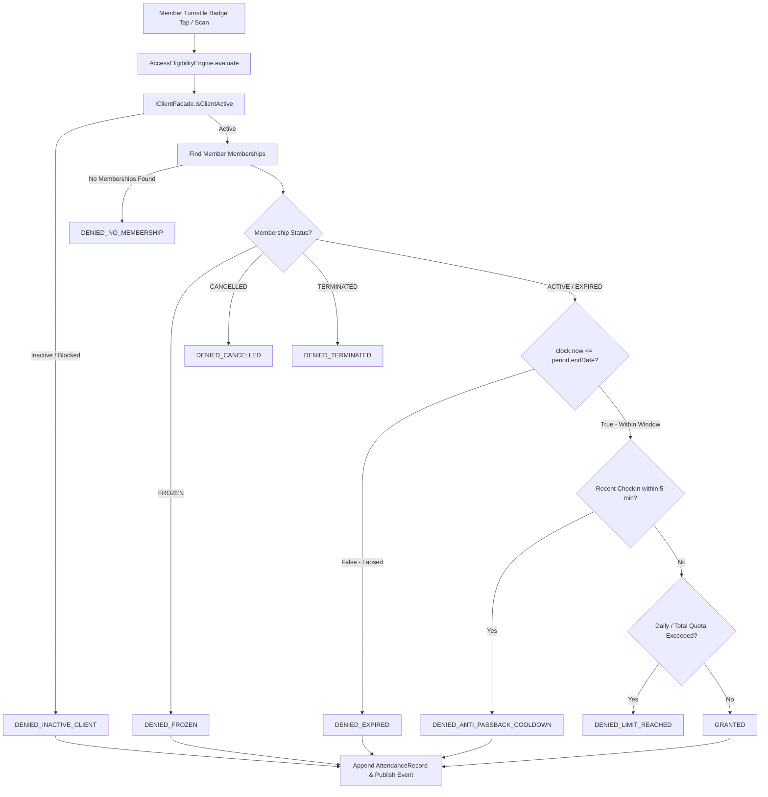

# ADR-0057: Gym Management Domain Invariants & Lifecycle Model

- **Status**: Accepted
- **Date**: 2026-08-18
- **Deciders**: Principal Domain Engineer, Principal Software Architect
- **Context**: Kinergy Platform Phase 5 (Gym Management). Having established bounded context ownership (ADR-0054), ubiquitous vocabulary (ADR-0055), and aggregate boundaries (ADR-0056), we must formally define the deterministic state-transition lifecycle, temporal invariant calculation rules, renewal policies, expiration models, attendance access eligibility engine, and timezone abstraction.

---

## 1. Context & Problem Statement

Fitness facility operations require unambiguous, mathematically rigorous business rules. Without formalization:

1. **Renewal Edge Cases**: Renewing an active membership before it expires might accidentally overwrite remaining days or leave gaps between validity periods.
2. **Freeze Duration Drift**: Freezing and unfreezing a membership could fail to accurately extend the `endDate`, cheating the customer or granting free days.
3. **Temporal Race Conditions**: Relying solely on asynchronous batch jobs to transition status from `ACTIVE` to `EXPIRED` allows lapsed members to access turnstiles after midnight.
4. **Timezone Boundary Discrepancies**: Raw UTC date math causes late-night facility check-ins (e.g. 23:45 local time) to increment the next calendar day's daily visit quota.
5. **Anti-Passback Vulnerabilities**: Rapid duplicate card taps at turnstiles allow multiple people to enter simultaneously using a single membership.

A comprehensive Architectural Decision Record is required to encode all lifecycle invariants, state matrices, renewal policies, and time model contracts.

---

## 2. Membership Lifecycle State Machine

### 2.1 Deterministic State Transition Matrix

| Current State    | Command / Trigger   | Preconditions & Guard Rules                                                                     | Allowed? | Target State | Side Effect / Domain Event        |
| :--------------- | :------------------ | :---------------------------------------------------------------------------------------------- | :------: | :----------- | :-------------------------------- |
| `PENDING`        | `activate(clock)`   | `clock.now() >= period.startDate` and client active                                             |    ✅    | `ACTIVE`     | `MembershipActivatedEvent`        |
| `PENDING`        | `cancel(reason)`    | Explicit administrative / member request                                                        |    ✅    | `CANCELLED`  | `MembershipCancelledEvent`        |
| `PENDING`        | `terminate(reason)` | Fraud / policy breach / client archived                                                         |    ✅    | `TERMINATED` | `MembershipTerminatedEvent`       |
| `PENDING`        | `freeze(window)`    | Cannot freeze un-activated membership                                                           |    ❌    | —            | `InvalidStateTransitionException` |
| `PENDING`        | `expire()`          | Cannot expire un-activated membership                                                           |    ❌    | —            | `InvalidStateTransitionException` |
| **`ACTIVE`**     | `freeze(window)`    | No active freeze window; freeze duration $\le$ max allowed                                      |    ✅    | `FROZEN`     | `MembershipFrozenEvent`           |
| **`ACTIVE`**     | `renew(period)`     | Valid payment receipt; extends `period.endDate`                                                 |    ✅    | `ACTIVE`     | `MembershipRenewedEvent`          |
| **`ACTIVE`**     | `expire(clock)`     | `clock.now() > period.endDate`                                                                  |    ✅    | `EXPIRED`    | `MembershipExpiredEvent`          |
| **`ACTIVE`**     | `cancel(reason)`    | Voluntary cancellation or contract exit                                                         |    ✅    | `CANCELLED`  | `MembershipCancelledEvent`        |
| **`ACTIVE`**     | `terminate(reason)` | Irrevocable breach / client archived                                                            |    ✅    | `TERMINATED` | `MembershipTerminatedEvent`       |
| **`FROZEN`**     | `unfreeze(clock)`   | Active freeze exists; recalculates `endDate = endDate + freezeDuration`                         |    ✅    | `ACTIVE`     | `MembershipResumedEvent`          |
| **`FROZEN`**     | `cancel(reason)`    | Member cancels while on freeze                                                                  |    ✅    | `CANCELLED`  | `MembershipCancelledEvent`        |
| **`FROZEN`**     | `terminate(reason)` | Irrevocable breach / fraud                                                                      |    ✅    | `TERMINATED` | `MembershipTerminatedEvent`       |
| **`FROZEN`**     | `freeze(window)`    | Already frozen                                                                                  |    ❌    | —            | `InvalidStateTransitionException` |
| **`EXPIRED`**    | `renew(period)`     | Renewed during grace period; sets `startDate = paymentDate`, `endDate = paymentDate + duration` |    ✅    | `ACTIVE`     | `MembershipRenewedEvent`          |
| **`EXPIRED`**    | `terminate(reason)` | Purge / archival / fraud                                                                        |    ✅    | `TERMINATED` | `MembershipTerminatedEvent`       |
| **`EXPIRED`**    | `freeze(window)`    | Cannot freeze lapsed contract                                                                   |    ❌    | —            | `InvalidStateTransitionException` |
| **`CANCELLED`**  | `terminate(reason)` | Final purge                                                                                     |    ✅    | `TERMINATED` | `MembershipTerminatedEvent`       |
| **`CANCELLED`**  | Any other cmd       | Terminal state cannot transition                                                                |    ❌    | —            | `InvalidStateTransitionException` |
| **`TERMINATED`** | Any command         | Irrevocable terminal state                                                                      |    ❌    | —            | `InvalidStateTransitionException` |

---

## 3. Membership Mathematical & Invariant Calculation Rules

### 3.1 Period Temporal Invariant

$$\text{period.startDate} \le \text{period.endDate}$$

- Attempting to instantiate a `MembershipPeriod` where `startDate > endDate` throws `InvalidMembershipPeriodException`.

### 3.2 Freeze & Resumption Math

When a membership is frozen at timestamp $T_{\text{freeze}}$ and unfreezes at $T_{\text{resume}}$:
$$\Delta_{\text{freezeDays}} = \max\left(1, \left\lceil \frac{T_{\text{resume}} - T_{\text{freeze}}}{86400 \times 1000} \right\rceil \right)$$
$$\text{newEndDate} = \text{oldEndDate} + \Delta_{\text{freezeDays}}$$

- The member is never penalized for frozen time; valid access days are strictly conserved.
- System enforces a configurable maximum total freeze allowance (e.g. max 90 days per annual membership).

### 3.3 Renewal Rules & Continuity

1. **Early Renewal (while `ACTIVE`)**:
   $$\text{newStartDate} = \text{currentEndDate}$$
   $$\text{newEndDate} = \text{currentEndDate} + \text{planDurationDays}$$
   - Seamless extension: Member loses zero paid days, and no validity gaps are introduced.
2. **Lapsed Renewal (while `EXPIRED`)**:
   $$\text{newStartDate} = T_{\text{payment}}$$
   $$\text{newEndDate} = T_{\text{payment}} + \text{planDurationDays}$$
   - Re-activation starts fresh from the moment payment is received.
3. **Plan Upgrades / Changes on Renewal**:
   - Renewal may adopt a new `planId`. The new plan's duration and access rules apply strictly to the new period.

---

## 4. Dual-Layer Expiration & Access Eligibility Engine

### 4.1 Real-Time Date Evaluation vs Asynchronous State Expiration

- **Real-Time Turnstile Guard**: Even if an asynchronous batch job has not yet executed `membership.expire()`, the `AccessEligibilityEngine` evaluates:
  $$\text{isTemporallyValid} = (\text{clock.now()} \le \text{period.endDate})$$
  Turnstile entry is immediately denied if $\text{clock.now()} > \text{period.endDate}$ (`DENIED_EXPIRED`).
- **Asynchronous Batch Expiration**: Periodic maintenance jobs query memberships where `status == ACTIVE AND endDate < clock.now()` and invoke `membership.expire()`, publishing `MembershipExpiredEvent` for downstream timeline synchronization and customer notification triggers.

### 4.2 Anti-Passback Policy

- Minimum cooldown threshold of 300 seconds (5 minutes) between successful entries at the same facility zone for the same `clientId`. Prevents tailgating or pass-sharing.

---

## 5. Canonical Time & Timezone Model

1. **Storage & Event Transport**: All timestamps are stored and transmitted in standard **UTC (ISO 8601)** (`YYYY-MM-DDTHH:mm:ss.sssZ`).
2. **Business Calendar Day (`GymDay`)**:
   - Daily quotas, opening/closing hours, and attendance reporting calculate against the facility's local timezone (e.g. `America/Guayaquil`):
     $$\text{localGymDay} = \text{formatDateInTimezone}(\text{clock.now()}, \text{facilityTimezone})$$
   - Eliminates UTC midnight boundary rollover defects where late-night check-ins count toward the wrong day.
3. **Deterministic Clock Abstraction**:
   - All domain services, state machines, and temporal value objects accept an injected `Clock` interface (`now(): Date`, `timezone(): string`). Production uses `SystemClock`; tests use `TestClock`. Direct calls to `Date.now()` or `new Date()` inside domain logic are prohibited.

---

## 6. Invariant Classification Matrix

| Invariant / Rule                            | Classification      | Enforcement Mechanism                                                      |
| :------------------------------------------ | :------------------ | :------------------------------------------------------------------------- |
| **`period.startDate <= period.endDate`**    | Aggregate Invariant | Value Object constructor (`MembershipPeriod`).                             |
| **State machine transition validity**       | Aggregate Invariant | Aggregate root methods (`Membership.activate`, `freeze`, etc.).            |
| **Freeze duration calculation & extension** | Aggregate Invariant | `Membership.unfreeze()` internal calculation.                              |
| **Optimistic concurrency increment**        | Aggregate Invariant | Aggregate root `this._version++`.                                          |
| **Anti-passback cooldown (5 min)**          | Domain Policy       | `AntiPassbackPolicy` in `packages/core/src/gym/domain/policies/`.          |
| **Turnstile access evaluation**             | Domain Service      | `AccessEligibilityEngine` evaluating client standing + membership periods. |
| **Asynchronous expiration scheduler**       | Application / Cron  | Scheduled application task executing `ExpireMembershipsUseCase`.           |
| **Prisma schema & database foreign keys**   | Infrastructure      | Prisma schema and PostgreSQL transactions.                                 |

---

## 7. Consequences

### Positive

- **100% Deterministic**: Every business rule is testable with simulated time (`TestClock`).
- **Zero Race Conditions**: Turnstiles never rely on batch jobs to prevent expired entry.
- **Auditable & Fair**: Freeze and renewal calculations conserve member value to the exact day.

---

## 8. References

- [Gym Management Vocabulary (Phase 5.1-C)](../business/gym-vocabulary.md)
- [ADR-0054: Bounded Context Ownership](./0054-gym-management-bounded-context-ownership-and-context-map.md)
- [ADR-0056: Aggregate Discovery & Boundaries](./0056-gym-management-aggregate-discovery-and-boundary-decisions.md)
