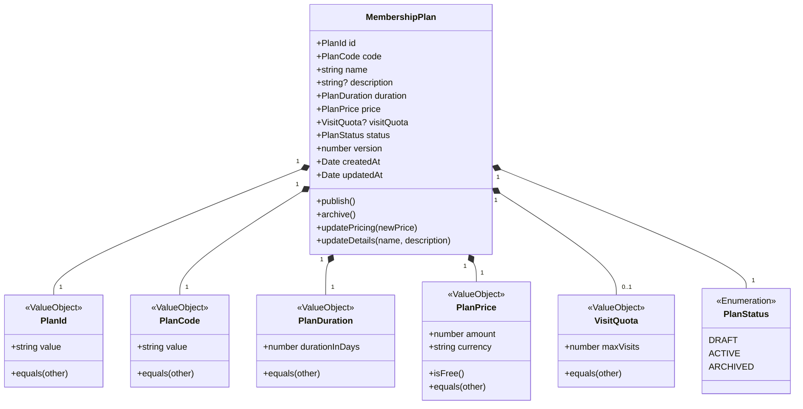

# ADR-0058: Gym Management MembershipPlan Aggregate Commercial & Pricing Model

- **Status**: Accepted
- **Date**: 2026-08-18
- **Deciders**: Principal Domain Architect, Senior Domain Modeler & Business Analyst
- **Context**: Kinergy Platform Phase 5.3 (Membership Plans Discovery). Following the initial baseline aggregate decisions (ADR-0056), we must establish the formal commercial model, property specifications, duration semantics, pricing value objects, availability states, and historical preservation rules for `MembershipPlan`.

---

## 1. Context & Problem Statement

Gyms offer diverse commercial membership products (e.g. 1-Month Standard, 3-Month Student, 1-Year VIP, Complimentary Trial). Modeling these commercial plans naively leads to critical domain flaws:

1. **Hardcoded Enums (`MONTHLY`, `ANNUAL`)**: Prevents facility administrators from configuring custom durations (e.g. 14-day promo, 6-week seasonal challenge).
2. **Ambiguous Calendar Math vs. Fixed Days**: Treating "1 month" as 30 days vs calendar month creates date drift, leap-year bugs, and turnstile eligibility discrepancies.
3. **Anemic Price Representations**: Storing raw floating-point numbers without explicit currency or decimal precision leads to rounding errors and multi-currency corruption.
4. **Retroactive Mutation**: Updating a plan's price or archiving a plan must never mutate or cancel active existing customer memberships.

We require explicit architectural decisions for the `MembershipPlan` aggregate, its value objects, duration model, pricing model, availability lifecycles, and historical integrity guarantees.

---

## 2. Decision Summary



### 2.1 Commercial Concept & DDD Classification

- **DDD Classification**: `MembershipPlan` is an **Aggregate Root** within the Commercial Catalog boundary of Gym Management.
- **Root Entity Identity**: `PlanId` (Canonical typed UUID/string identifier).
- **Business Code**: `PlanCode` (Immutable uppercase alphanumeric slug, e.g. `MONTHLY_STANDARD`, `ANNUAL_VIP`).

---

## 3. Detailed Property & Value Object Specifications

### 3.1 Properties Matrix

| Property      | Type / Value Object | Required | Invariant / Validation                                                              | Mutable | Impact on Existing Memberships                  |
| :------------ | :------------------ | :------: | :---------------------------------------------------------------------------------- | :-----: | :---------------------------------------------- |
| `id`          | `PlanId`            |   Yes    | Non-empty valid string identifier.                                                  |   No    | None.                                           |
| `code`        | `PlanCode`          |   Yes    | Upper-case alphanumeric + underscore (`^[A-Z0-9_]{3,50}$`), unique within facility. |   No    | None.                                           |
| `name`        | `string`            |   Yes    | Non-empty, trimmed, 1–100 characters.                                               |   Yes   | None (forward-looking only).                    |
| `description` | `string?`           |    No    | Trimmed, max 500 characters.                                                        |   Yes   | None.                                           |
| `duration`    | `PlanDuration`      |   Yes    | Integer `durationInDays >= 1`.                                                      |   No    | None (immutable commercial term).               |
| `price`       | `PlanPrice`         |   Yes    | Monetary amount in minor units / cents (`amount >= 0`) and ISO-4217 currency.       |   Yes   | None (existing agreements keep purchased rate). |
| `visitQuota`  | `VisitQuota?`       |    No    | Optional integer `maxVisits >= 1` (null = unlimited).                               |   Yes   | None (forward-looking).                         |
| `status`      | `PlanStatus`        |   Yes    | `DRAFT`, `ACTIVE`, or `ARCHIVED`.                                                   |   Yes   | None (existing active agreements continue).     |
| `version`     | `number`            |   Yes    | Monotonically incremented integer for optimistic locking.                           |   Yes   | Internal aggregate concurrency control.         |

---

## 4. Duration Semantics

- **Decision**: Plan duration is modeled strictly as **fixed integer days** (`durationInDays >= 1`) encapsulated inside `PlanDuration`.
- **Rationale**:
  - Eliminates daylight saving time, leap year, and calendar month length discrepancies (28, 29, 30, 31 days).
  - Ensures mathematical determinism across turnstile validation engines and period extension calculations:
    $$\text{endDate} = \text{startDate} + (\text{durationInDays} \times 86,400,000 \text{ ms})$$
  - Standard commercial offerings configure standard day multiples (e.g. 30 days for monthly, 90 days for quarterly, 365 days for annual, or custom promotional durations like 14 days).

---

## 5. Price & Monetary Semantics

- **Decision**: Price is modeled as a dedicated value object `PlanPrice`:
  - `amount: number`: Non-negative integer representing the amount in minor currency units (cents) or 2-decimal precision ($\text{amount} \ge 0$).
  - `currency: string`: 3-letter uppercase ISO-4217 code (e.g. `USD`, `EUR`, `CAD`, `MXN`).
- **Free Plans**: Plans with $\text{amount} = 0$ are permitted to model complimentary passes, promotional trials, or staff benefits.
- **Negative Prices**: Strictly rejected with `MembershipPlanInvariantViolationException`.
- **Price Adjustments**: Modifying a plan's price creates a new version of the plan for subsequent purchases; active memberships retain their original purchased terms.

---

## 6. Catalog Availability Lifecycle

The `PlanStatus` state machine governs commercial catalog visibility:

```text
       ┌─────────┐
       │  DRAFT  │ (Staging / Under Construction)
       └────┬────┘
            │ (publish)
            ▼
       ┌─────────┐
       │ ACTIVE  │ (Publicly available for purchase & renewal)
       └────┬────┘
            │ (archive)
            ▼
       ┌──────────┐
       │ ARCHIVED │ (Retired from sale; immutable terminal state)
       └──────────┘
```

- **`DRAFT`**:
  - New plan created by club administrators.
  - Cannot be selected for new customer memberships or renewals.
  - Fully editable (name, description, duration, price, quota).
- **`ACTIVE`**:
  - Published and active in the commercial catalog.
  - Available for purchase and renewal.
  - Duration is locked to preserve plan integrity; pricing and metadata can be updated.
- **`ARCHIVED`**:
  - Deprecated / retired from commercial sale.
  - Cannot be purchased for new memberships.
  - Standard renewals cannot select this plan unless grandfathered by an explicit application workflow.
  - Existing active memberships referencing this plan continue their contract without interruption until expiration.

---

## 7. Historical Integrity Decision

> **Core Commercial Rule**: Changing a `MembershipPlan` (price, name, quota, or status) must never silently or retroactively alter active or historical `Membership` instances.

- `Membership` aggregates store:
  - `planId: string` (Scalar reference)
  - Evaluated `period: MembershipPeriod` (Calculated at creation/renewal based on the plan's duration at that time).
- When a plan's price or terms change, only future memberships or future renewal transactions observe the updated terms.

---

## 8. Rejected Alternatives

1. **Enum-Based Plan Types (`PlanType.MONTHLY`, `PlanType.ANNUAL`)**:
   - _Rejected_: Prevents facility operators from offering non-standard durations (e.g. 10-day trial, 6-week bootcamp).
2. **Calendar-Month Relative Duration (`durationMonths: number`)**:
   - _Rejected_: Introduces edge-case ambiguities when starting on the 31st of January vs February, causing non-deterministic contract expiration dates. Fixed days provide 100% deterministic arithmetic.
3. **Raw Float Pricing (`price: number`)**:
   - _Rejected_: Lacks currency context and causes floating-point precision bugs in financial calculations.
4. **Anemic Reference Data / DB Table Only**:
   - _Rejected_: Bypasses domain invariant checks (e.g. positive duration, valid plan code format, lifecycle status guards).

---

## 9. Consequences

### Positive

- Fully configurable commercial offerings without code deployment.
- 100% deterministic expiration math for facility turnstiles and access gates.
- Strict protection of historical contract terms.

### Negative / Trade-offs

- UI displaying calendar-month approximations (e.g. "Monthly") must map 30 days to user-friendly display labels.

---

## 10. References

- [ADR-0056: Gym Management Aggregate Discovery & Boundaries](./0056-gym-management-aggregate-discovery-and-boundary-decisions.md)
- [ADR-0057: Gym Management Domain Invariants & Lifecycle Model](./0057-gym-management-domain-invariants-and-lifecycle-model.md)
- [Gym Commercial Model Specification](../architecture/gym-commercial-model.md)
