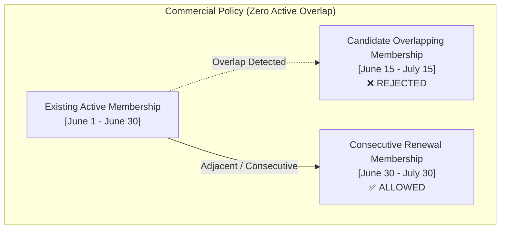

# ADR-0060: Gym Management Duplicate and Overlapping Membership Policy & Concurrency Control

- **Status**: Accepted
- **Date**: 2026-08-18
- **Deciders**: Principal Domain Architect, Senior Application Architect
- **Context**: Kinergy Platform Phase 5.3-E (Membership Duplicate & Overlapping Membership Policy). We must define whether a client can hold multiple overlapping or duplicate gym memberships and establish the domain and application concurrency mechanisms governing multi-membership lifecycles.

---

## 1. Context & Business Invariants

Gym facilities sell time-based facility access memberships (e.g. 30 days, 90 days, 365 days). Key business questions arise regarding multiple memberships belonging to the same client:

1. Can a client hold multiple active memberships simultaneously?
2. Can a member renew their contract before the current period expires?
3. How are overlapping periods prevented under high-concurrency requests (e.g. rapid double-clicks on frontend checkout)?
4. What happens when a previous membership is expired, cancelled, or frozen?

---

## 2. Decision Summary

### 2.1 The Selected Policy: Consecutive Single Active Commitment (Policy B)

- **Zero Concurrent Active Overlap**: A single client can hold at most **one active, pending, or frozen general facility membership** during any given point in calendar time.
- **Consecutive Pre-Scheduled Renewals Allowed**: A client may purchase a subsequent membership _before_ their current one expires, provided the candidate period is strictly adjacent or future-dated (`candidate.startDate >= current.endDate`).
- **Inactive / Terminal Lifecycles Do Not Block**: Memberships in `EXPIRED`, `CANCELLED`, or `TERMINATED` status do not occupy time and do not prevent creating a new membership.
- **Frozen Memberships Block Overlapping Purchases**: A frozen membership still represents an active commitment; clients cannot bypass freezes by buying a second overlapping membership.

---

## 3. Domain vs Application vs Persistence Responsibilities

| Responsibility                    | Layer / Component                                                                                                                                               | Description                                                                                                                                                                                    |
| :-------------------------------- | :-------------------------------------------------------------------------------------------------------------------------------------------------------------- | :--------------------------------------------------------------------------------------------------------------------------------------------------------------------------------------------- |
| **Period Overlap Calculation**    | Domain Value Object ([`MembershipPeriod.overlaps`](file:///c:/Projects/kinergy-platform/packages/core/src/gym/domain/membership/membership-period.vo.ts))       | Mathematical interval comparison `startA < endB && endA > startB`.                                                                                                                             |
| **Multi-Aggregate Policy**        | Domain Policy ([`MembershipOverlapPolicy`](file:///c:/Projects/kinergy-platform/packages/core/src/gym/domain/policies/membership-overlap.policy.ts))            | Pure domain logic evaluating candidate period against client's existing non-terminal memberships.                                                                                              |
| **Orchestration & Verification**  | Application Handler ([`CreateMembershipHandler`](file:///c:/Projects/kinergy-platform/packages/core/src/gym/application/handlers/create-membership.handler.ts)) | Queries `MembershipRepository.findByClientId` and evaluates `MembershipOverlapPolicy`.                                                                                                         |
| **Concurrency & Race Conditions** | Infrastructure / Database                                                                                                                                       | Enforced at the transaction boundary via serializable isolation, transactional client locking (`SELECT ... FOR UPDATE`), or partial unique indices on `(client_id, status)` where appropriate. |

---

## 4. Specific Business Scenarios

| Scenario                           |   Allowed?    | Domain Rule & Outcome                                                                                                                                                 |
| :--------------------------------- | :-----------: | :-------------------------------------------------------------------------------------------------------------------------------------------------------------------- |
| **Duplicate identical membership** |     ❌ No     | Rejected with `OverlappingMembershipException`.                                                                                                                       |
| **Partial interval overlap**       |     ❌ No     | Rejected (`candidate.startDate < current.endDate`).                                                                                                                   |
| **Consecutive early renewal**      |    ✅ Yes     | Permitted (`candidate.startDate >= current.endDate`).                                                                                                                 |
| **Purchase after expiration**      |    ✅ Yes     | Permitted immediately (old membership is `EXPIRED`).                                                                                                                  |
| **Purchase after cancellation**    |    ✅ Yes     | Permitted immediately (old membership is `CANCELLED`).                                                                                                                |
| **Purchase while frozen**          |     ❌ No     | Blocked if overlapping with frozen period. Member must unfreeze or renew consecutively.                                                                               |
| **Manual administrative override** | ⚠️ Controlled | If staff must prematurely transition a plan, they execute explicit domain operations (e.g. `cancel()` current + issue new) rather than breaking aggregate invariants. |

---

## 5. Architectural Invariants

1. **Deterministic Period Disjointness**: For any client $C$, for all $M_a, M_b \in \text{Memberships}(C)$ with status $\in \{\text{ACTIVE}, \text{FROZEN}, \text{PENDING}\}$, $M_a.\text{period} \cap M_b.\text{period} = \emptyset$.
2. **Domain Purity**: `MembershipOverlapPolicy` is pure TypeScript and executes in memory without database or network calls.

---

## 6. References

- [ADR-0056: Gym Management Aggregate Discovery & Boundaries](./0056-gym-management-aggregate-discovery-and-boundary-decisions.md)
- [ADR-0057: Gym Management Domain Invariants & Lifecycle Model](./0057-gym-management-domain-invariants-and-lifecycle-model.md)
- [ADR-0059: Gym Management Membership Historical Integrity & Plan Decoupling Strategy](./0059-gym-management-membership-historical-integrity-and-plan-decoupling-strategy.md)
- [Create Membership Use Case Specification](../architecture/gym-create-membership-use-case.md)
