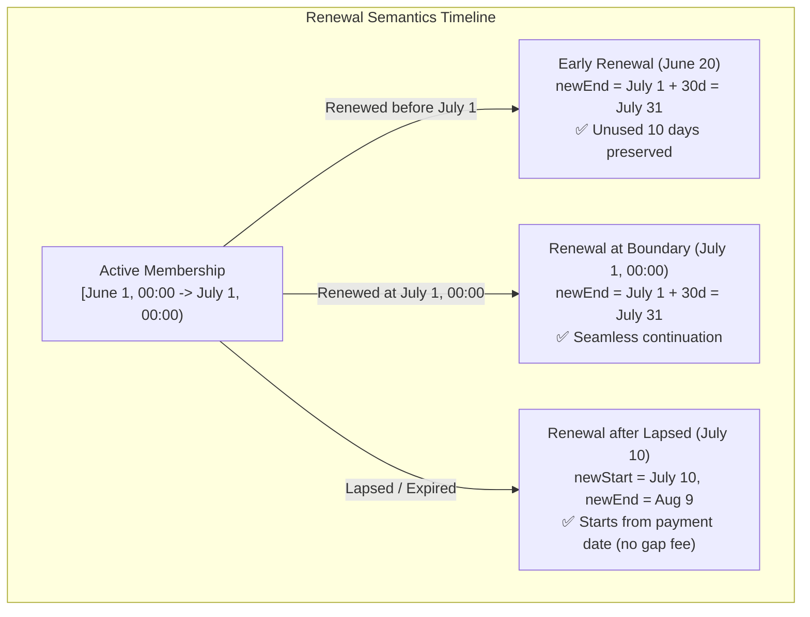
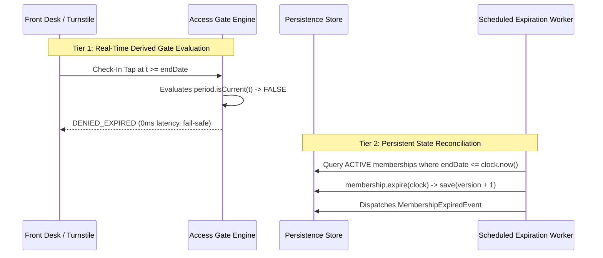

# ADR-0061: Gym Management Membership Renewal Semantics & Expiration Lifecycle Rules

- **Status**: Accepted
- **Date**: 2026-08-18
- **Deciders**: Principal Domain Architect, Senior Application Architect, Test Architect
- **Context**: Kinergy Platform Phase 5.4-A (Renewal Semantics & Membership Lifecycle Rules). We must define the exact temporal semantics of membership renewal (before, at, and after expiration), the mathematical definition of the expiration boundary, real-time vs persistent expiration processing, and the attendance eligibility contract for facility entry.

---

## 1. Context & Temporal Invariants

In Gym Management, members purchase time-bounded facility access privileges (`MembershipPeriod`). Precise temporal rules are essential to eliminate ambiguity across renewal workflows, automated expiration processing, turnstile access checks, and financial reporting.

Key questions addressed by this ADR:

1. What happens when a member renews before expiration? Does unused time carry over?
2. What is the exact mathematical boundary of expiration ($now == endDate$)?
3. What happens when a member renews after their membership has already expired?
4. Is renewal an in-place aggregate mutation or a new Membership creation?
5. How is expiration detected and persisted without discrepancies between turnstiles and the database?
6. What is the authoritative attendance eligibility contract for physical facility entry?

---

## 2. Decision Summary

### 2.1 The Canonical Time Model & Half-Open Intervals

In accordance with ADR-0055 and ADR-0057:

- All membership time intervals are **half-open**: $[startDate, endDate)$ (start-inclusive, end-exclusive).
- All timestamps are stored and manipulated in **UTC (ISO 8601)** (`YYYY-MM-DDTHH:mm:ss.sssZ`).
- An active membership is current at instant $t$ if and only if:
  $$\text{startDate} \le t < \text{endDate}$$
- **At the exact boundary instant** $t = \text{endDate}$, the membership is **strictly expired** (`isCurrent(t) === false`).

---

## 3. Detailed Renewal Semantics

### 3.1 Renewal Before Expiration ($now < endDate$)

- **Semantics**: Extends the existing commitment forward from the current `endDate`.
  $$\text{newEndDate} = \text{currentEndDate} + \text{planDurationDays}$$
- **Unused Time Preservation**: 100% of the remaining paid days are preserved. The new expiration date shifts into the future without shortening the current period.
- **Identity & Aggregate Decision**:
  - **Same Plan / Direct Extension**: In-place mutation via `membership.renew(additionalPeriod, clock)`, bumping `version` and emitting `MembershipRenewedEvent`.
  - **Plan Switch / Pre-Scheduled Contract**: Creates a new consecutive `Membership` aggregate with $\text{startDate} = \text{current.endDate}$, compliant with ADR-0060 (zero active overlap).

### 3.2 Renewal Exactly at Expiration Boundary ($now == endDate$)

- **Semantics**: Seamless continuation.
  $$\text{newStartDate} = \text{currentEndDate} = now, \quad \text{newEndDate} = \text{newStartDate} + \text{planDurationDays}$$
- **Result**: Aggregate transitions or renews seamlessly into `ACTIVE` state with zero interruption of access privileges.

### 3.3 Renewal After Expiration ($now > endDate$)

- **Semantics**: Re-activation from the effective payment/renewal date ($now$).
  $$\text{newStartDate} = now, \quad \text{newEndDate} = now + \text{planDurationDays}$$
- **No Gap Charging**: The system does **not** backdate renewal to the previous `endDate`. The member is not billed for elapsed lapsed days during which facility entry was denied.
- **State Transition**: Transitions aggregate from `EXPIRED` $\rightarrow$ `ACTIVE` and emits `MembershipRenewedEvent`.

---

## 4. Comprehensive Renewal State Matrix

| Current State    | Temporal Position           | Action / Command | Allowed? | Target State | New Start Date             | New End Date                               | Emitted Event                          |
| :--------------- | :-------------------------- | :--------------- | :------: | :----------- | :------------------------- | :----------------------------------------- | :------------------------------------- |
| **`ACTIVE`**     | $now < endDate$ (Early)     | `renew(period)`  |    ✅    | `ACTIVE`     | $\text{current.startDate}$ | $\text{current.endDate} + \text{duration}$ | `MembershipRenewedEvent`               |
| **`ACTIVE`**     | $now == endDate$ (Boundary) | `renew(period)`  |    ✅    | `ACTIVE`     | $\text{current.startDate}$ | $\text{current.endDate} + \text{duration}$ | `MembershipRenewedEvent`               |
| **`ACTIVE`**     | $now > endDate$ (Late)      | `renew(period)`  |    ✅    | `ACTIVE`     | $now$                      | $now + \text{duration}$                    | `MembershipRenewedEvent`               |
| **`EXPIRED`**    | $now > endDate$ (Lapsed)    | `renew(period)`  |    ✅    | `ACTIVE`     | $now$                      | $now + \text{duration}$                    | `MembershipRenewedEvent`               |
| **`FROZEN`**     | $now < endDate$             | `renew(period)`  |    ✅    | `FROZEN`     | $\text{current.startDate}$ | $\text{current.endDate} + \text{duration}$ | `MembershipRenewedEvent`               |
| **`PENDING`**    | $now < startDate$           | `renew(period)`  |    ✅    | `PENDING`    | $\text{current.startDate}$ | $\text{current.endDate} + \text{duration}$ | `MembershipRenewedEvent`               |
| **`CANCELLED`**  | Any                         | `renew(period)`  |    ❌    | —            | —                          | —                                          | `InvalidMembershipTransitionException` |
| **`TERMINATED`** | Any                         | `renew(period)`  |    ❌    | —            | —                          | —                                          | `InvalidMembershipTransitionException` |

---

## 5. Expiration Processing: Two-Tier Architectural Model

1. **Tier 1 — Real-Time Derived Gate Evaluation (Fail-Safe)**:
   - Physical turnstiles and check-in kiosks verify temporal validity in memory: `period.isCurrent(clock.now()) && status === ACTIVE`.
   - If $now \ge endDate$, entry is **immediately denied** (`DENIED_EXPIRED`), regardless of whether a background database worker has updated the record.
2. **Tier 2 — Asynchronous Persistent Lifecycle Reconciliation**:
   - A scheduled command (`ExpireMembershipsCommand`) runs periodically (e.g. hourly or nightly).
   - Identifies records where `status = ACTIVE` and `endDate <= clock.now()`.
   - Invokes domain method `membership.expire(clock)`, transitions state to `EXPIRED`, persists optimistic version increment, and dispatches `MembershipExpiredEvent`.
   - **Idempotency**: Executing the worker multiple times is safe and produces zero duplicate state transitions or duplicate events.

---

## 6. Authoritative Attendance Eligibility Contract (Phase 5.5 Specification)

A membership grants physical gym entry if and only if **all** of the following conditions evaluate to `true` at the instant of check-in:

$$ \text{Eligible} \iff \begin{cases}
1. & \text{membership.status} == \text{ACTIVE} \\
2. & \text{membership.period.startDate} \le \text{clock.now()} < \text{membership.period.endDate} \\
3. & \text{membership.isCurrentlyFrozen(clock.now())} == \text{false} \\
4. & \text{client.status} == \text{ACTIVE} \quad (\text{via } \text{ClientLookupPort}) \\
5. & \text{membership.quotaRemaining} > 0 \quad (\text{if limited-visit plan}) \\
6. & \text{antiPassbackElapsed} \ge 300\text{s} \quad (\text{cooldown guard})
\end{cases}$$

---

## 7. Plan Selection & Historical Integrity During Renewal

1. **Plan Catalog Status**: Any plan selected for renewal must be in `ACTIVE` status in the commercial catalog (`plan.isAvailableForPurchase() === true`).
2. **Historical Integrity**: Renewing an existing membership does **not** alter the financial records, pricing snapshots, or historical terms under which the original agreement was created (ADR-0059).
3. **Price Independence**: The renewal price is billed at the plan's *current* active catalog rate at the time of renewal payment.

---

## 8. Consequences & Compliance

### Positive
- **Deterministic Time Math**: Single unified interpretation of $[startDate, endDate)$ across the platform.
- **Fair Commercial Policy**: Unused days are fully protected during early renewals; lapsed members are not billed for gap days.
- **Fail-Safe Access Control**: Real-time turnstiles never allow expired members access even if the background cron worker is delayed.
- **Zero Ambiguity**: Clear state matrix for all domain operations.

### Negative / Trade-offs
- Background reconciliation worker is required to synchronize reporting dashboards with physical time passage.
$$
