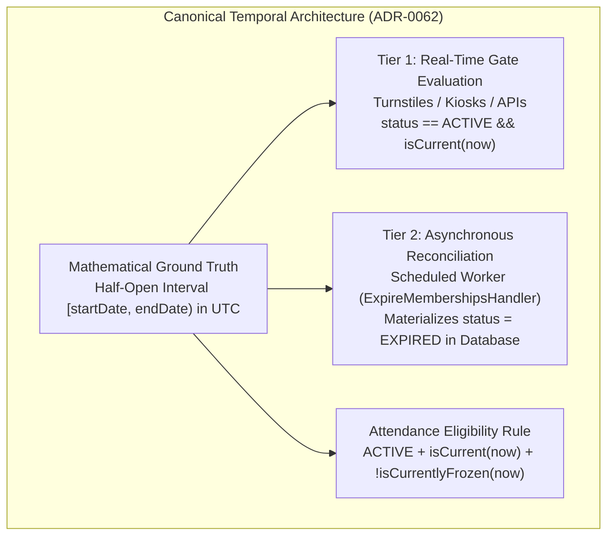

# ADR-0062: Gym Management Membership Expiration Temporal Semantics & Canonical Eligibility Model

- **Status**: Accepted
- **Date**: 2026-08-18
- **Deciders**: Principal Architect, Domain Architect, Security & Test Architect
- **Context**: Kinergy Platform Phase 5.4-D (Membership Expiration — Temporal Semantics). We must establish one canonical, mathematically rigorous expiration model across all system entry points (HTTP API, Turnstiles, Reception UI, Background Workers, and Cross-Context Lookups) so that the platform never produces conflicting answers to whether a Membership is expired.

---

## 1. Context & Problem Statement

In Gym Management, determining whether a client's `Membership` is expired governs physical facility entry, commercial renewals, attendance tracking, and financial reconciliation.

If different subsystems (turnstiles, reporting dashboards, renewal handlers, API controllers) interpret time, boundaries, or state transitions differently, serious commercial and security failures occur:

1. **Turnstile / Database Discrepancy**: A turnstile allows entry to an expired member because a background cron job has not yet updated the database.
2. **Timezone Ambiguity**: A member's access expires prematurely or late depending on whether the server, database, client browser, or gym facility timezone is used.
3. **Boundary Ambiguity**: "Expires on August 31" is ambiguous (does it expire at 00:00:00 or 23:59:59.999?).

---

## 2. Decision Summary



---

## 3. The Canonical Time Model

### 3.1 UTC Storage & Serialization

- All timestamps (`startDate`, `endDate`, `createdAt`, `updatedAt`, event timestamps) are stored and transmitted in **UTC (ISO 8601)** (`YYYY-MM-DDTHH:mm:ss.sssZ`).
- Zero ambient `Date.now()` or `new Date()` calls are permitted in domain logic. Time must be injected via the [`Clock`](file:///c:/Projects/kinergy-platform/packages/core/src/gym/domain/shared/clock.ts) interface (`now(): Date`, `timezone(): string`).

### 3.2 Half-Open Interval Representation $[startDate, endDate)$

- All membership periods are mathematically represented as **half-open intervals**:
  $$[startDate, endDate) = \{ t \in \text{Time} \mid startDate \le t < endDate \}$$
- **Start Boundary**: Inclusive ($t == startDate \implies \text{valid}$).
- **End Boundary**: Exclusive ($t == endDate \implies \text{expired}$).
- **Elimination of Natural Language Ambiguity**: The platform strictly rejects ambiguous phrases such as "expires at the end of the day". An expiration date of `2026-09-01T00:00:00.000Z` means the member had access through `2026-08-31T23:59:59.999Z` and access ceased at exactly `2026-09-01T00:00:00.000Z`.

---

## 4. Exact Expiration Predicate

The canonical expiration predicate across all domain aggregates, value objects, and query handlers is:

$$\text{isCurrent}(t) \iff startDate \le t < endDate$$
$$\text{isExpiredAt}(t) \iff t \ge endDate$$

Where $t$ is the authoritative UTC timestamp provided by `clock.now()`.

---

## 5. Timezone & Business Date Semantics

1. **Facility Business Timezone**:
   - Every Gym Facility operates in an authoritative business timezone (e.g., `America/Guayaquil` or `America/New_York`).
2. **Business Day Anchoring**:
   - When a membership plan is created for $N$ calendar days starting on date $D$, the start timestamp is anchored to **00:00:00.000 in the facility's business timezone** and converted to UTC.
   - The end timestamp is $\text{start} + N \text{ days}$ at 00:00:00.000 in the facility's business timezone converted to UTC.
3. **Isolation from Execution Contexts**:
   - The server host machine timezone, database server timezone, and user browser timezone have **zero authority** over membership validity or expiration boundaries.

---

## 6. Persisted State vs. Derived Eligibility: Model C (Hybrid Dual-Tier)

Kinergy adopts **Model C (Ground Truth Temporal Interval + Dual-Tier Lifecycle Processing)**:

### Tier 1: Real-Time Derived Gate Evaluation (Fail-Safe Physical Access)

- Access turnstiles and real-time gate queries evaluate validity in memory:
  $$\text{AccessAllowed}(t) \iff \text{status} == \text{ACTIVE} \land \text{period.isCurrent}(t) \land \neg\text{isCurrentlyFrozen}(t)$$
- If $t \ge endDate$, physical entry is **immediately denied** (`DENIED_EXPIRED`) with 0ms latency, even if background batch jobs have not yet run.

### Tier 2: Asynchronous Persistent State Materialization (Database Reconciliation)

- A scheduled background process executes periodically to reconcile database status:
  - Query: `SELECT * FROM Membership WHERE status = 'ACTIVE' AND endDate <= :now`
  - Action: Invokes `membership.expire(clock)`, updates `status = EXPIRED`, increments optimistic `version`, and publishes `MembershipExpiredEvent`.
- **Purpose**: Keeps database queries, reception dashboards, CRM outreach lists, and billing reports synchronized without adding latency to high-throughput turnstile gates.

---

## 7. Canonical Attendance Eligibility Rule (Phase 5.5 Specification)

The pure domain predicate for attendance eligibility on the `Membership` aggregate is:

```typescript
public isEligibleForAttendance(atDate: Date = new Date()): boolean {
  if (this._status !== MembershipStatus.ACTIVE) {
    return false;
  }
  if (this.isCurrentlyFrozen(atDate)) {
    return false;
  }
  return this._period.contains(atDate);
}
```

_Note: In Phase 5.5, the comprehensive facility access check combines `membership.isEligibleForAttendance(now)` with client account status (`ClientLookupPort`) and anti-passback cooldown rules._

---

## 8. API & Read Consistency

When an API reads an aggregate whose database status is still `ACTIVE` but $now \ge endDate$:

1. The DTO returns the stored status `ACTIVE` alongside accurate temporal period fields.
2. The DTO exposes derived helper flags `isCurrent: false` and `isExpired: true`.
3. If the member attempts attendance or renewal, the domain immediately executes according to temporal truth ($now \ge endDate$), eliminating stale data anomalies.

---

## 9. Background Processing Strategy (Requirements for Phase 5.4-E)

- **Command**: `ExpireMembershipsCommand`.
- **Frequency**: Configurable periodic worker (e.g. hourly at minute :00 or nightly at 00:05 facility time).
- **Query Filter**: `status = ACTIVE` AND `endDate <= clock.now()`.
- **Batching**: Chunked processing (e.g., 500 records per transaction batch).
- **Concurrency Protection**: Optimistic Concurrency Control (`version`). If a member renews simultaneously with worker execution, the version check detects the update and skips expiration.
- **Idempotency**: Executing the worker multiple times produces zero duplicate events or invalid state transitions.

---

## 10. Consequences & Compliance

### Positive

- **Single Deterministic Truth**: Zero divergence between turnstiles, API endpoints, background workers, and reports.
- **Zero Ambiguity**: Mathematical half-open interval $[startDate, endDate)$ eliminates "end of day" edge case bugs.
- **Fail-Safe Gate Control**: Physical security never depends on background worker latency or database job queues.
- **Timezone Resilience**: Business calendar operations are anchored to facility timezone while stored cleanly in UTC.

### Negative / Trade-offs

- Requires scheduled background worker (Phase 5.4-E) to keep materialized `status` column in sync for SQL aggregation/reporting.
