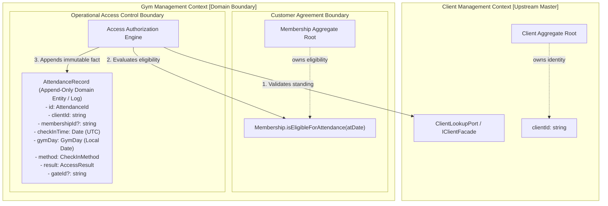

# ADR-0064: Gym Management Attendance Domain Boundary, Identity & Append-Only Log Model

- **Status**: Accepted
- **Date**: 2026-08-19
- **Deciders**: Principal Domain Architect, Senior Platform Engineer, Test Architect
- **Context**: Kinergy Platform Phase 5.5 (Gym Attendance & Facility Access Control). Following the completion of Membership Lifecycle (Phase 5.2), Commercial Plans (Phase 5.3), and Renewal/Expiration Temporal Semantics (Phase 5.4), the platform must establish Attendance as a coherent, high-throughput, historically explainable component of the Gym Management bounded context. We must delineate attendance ownership, identity, cross-context references, lifecycle decisions, temporal models, duplicate check-in policies, and read-model boundaries before implementing database schemas, domain entities, or API endpoints.

---

## 1. Context & Problem Statement

In integrated healthcare, sports, and fitness management architectures, attendance and access control systems frequently suffer from critical architectural anti-patterns:

1. **God-Aggregate / Mutating Lock Contention**: Modeling attendance as a mutable aggregate or embedding attendance records inside a `Membership` or `Client` aggregate causes row-level write locks during peak check-in hours (e.g., 7:00–9:00 AM and 5:00–8:00 PM), paralyzing turnstiles, reception kiosks, and concurrent membership operations.
2. **Duplicate Identity / Demographics Leaking**: Creating a separate `GymMember` or copying client demographic data (name, email, medical notes) into attendance records introduces data duplication, privacy risks, and synchronization drift.
3. **Temporal Incoherence & Timezone Collision**: Evaluating daily attendance or visit limits using server-local time or raw UTC causes check-ins occurring late at night (e.g., 11:30 PM in a local gym) to be erroneously recorded on the next day's UTC date, breaking client quotas.
4. **Historical Disconnection**: Storing only `clientId` without referencing the authorizing `membershipId` makes it impossible to reconstruct which contractual agreement granted physical admission after subsequent renewals, plan upgrades, or cancellations.
5. **Over-Engineered Lifecycle**: Inventing artificial mutable states (`PENDING`, `IN_PROGRESS`, `COMPLETED`, `CANCELLED`) for instantaneous physical entries, rather than recognizing check-in as an immutable, append-only historical business fact.

A formal Architectural Decision Record is required to define the boundary, identity, lifecycle, temporal model, and integration contracts for Gym Attendance.

---

## 2. Architectural Decisions

### 2.1 The Mandatory Attendance Ownership Invariant

> **Gym Management is the sole authoritative owner of facility attendance tracking, turnstile access authorization decisions, physical check-in audit logs, and operational facility occupancy streams.**
>
> **Attendance owns the immutable business fact that: A person was admitted to / recorded as attempting entry to the gym at a specific point in time according to the gym's check-in policy.**

Attendance does **NOT** own:

- Client identity, master records, or demographics (owned exclusively by `Client Management`).
- User authentication credentials or staff roles (owned exclusively by `Identity IAM`).
- Membership lifecycle, agreements, pricing, freeze windows, expiration, or renewal (owned exclusively by `Membership` in Gym Management).
- Appointment attendance compliance or room bookings (owned exclusively by `Scheduling`).
- Clinical treatment logs or therapy notes (owned exclusively by `Kinesiology`).



---

### 2.2 Canonical Attendance Vocabulary

| Term                   | Domain Classification       | Authoritative Semantic Definition                                                                                                                                                                    | Prohibited Aliases                                                |
| :--------------------- | :-------------------------- | :--------------------------------------------------------------------------------------------------------------------------------------------------------------------------------------------------- | :---------------------------------------------------------------- |
| **`AttendanceRecord`** | Domain Entity (Append-Only) | The persisted immutable domain record representing a physical check-in attempt or grant at the facility.                                                                                             | `GymVisit`, `TurnstileEvent`, `AttendanceEntry`, `MemberPresence` |
| **`CheckIn`**          | Domain Action / Command     | The operational physical attempt by a client to enter the facility via barcode, RFID, QR code, or manual front-desk entry.                                                                           | `Scan`, `Admission`, `Login`, `PunchIn`                           |
| **`CheckInTimestamp`** | Value Object / Instant      | The exact UTC instant (`checkInTime: Date`) when the check-in event occurred.                                                                                                                        | `timestamp`, `scannedAt`, `entryTime`                             |
| **`GymDay`**           | Value Object                | The facility-local operational business date (`facilityId`, `timezone`, `localDate: YYYY-MM-DD`), governing daily quotas and operational reporting.                                                  | `BusinessDate`, `CalendarDay`, `LocalDay`                         |
| **`AccessResult`**     | Value Object / Enum         | The definitive outcome of the check-in attempt (`GRANTED`, `DENIED_INACTIVE_CLIENT`, `DENIED_NO_MEMBERSHIP`, `DENIED_EXPIRED`, `DENIED_FROZEN`, `DENIED_LIMIT_REACHED`, `DENIED_DUPLICATE_CHECKIN`). | `AttendanceStatus`, `ScanStatus`, `ResultCode`                    |
| **`CheckInMethod`**    | Value Object / Enum         | The physical mechanism used for identification (`BARCODE`, `RFID`, `QR_CODE`, `MANUAL_RECEPTION`, `BIOMETRIC`).                                                                                      | `InputSource`, `ScanType`                                         |
| **`DuplicateCheckIn`** | Domain Policy / Predicate   | Re-presenting credentials within a short debounce window (anti-passback) or exceeding daily allowed visits.                                                                                          | `DoubleScan`, `ReEntry`                                           |
| **`DailyAttendance`**  | Read Model / Projection     | Aggregated metrics and list of granted check-ins for a specified `GymDay`.                                                                                                                           | `DailyVisits`, `Roster`                                           |

---

### 2.3 Attendance Identity Model

The domain entity `AttendanceRecord` is uniquely identified by `AttendanceId` and structured with strict domain meaning:

```typescript
export interface AttendanceRecordProps {
  readonly id: AttendanceId;
  readonly clientId: string;
  readonly membershipId: string | null;
  readonly checkInTime: Date; // UTC instant
  readonly gymDay: GymDay; // Facility-local date
  readonly method: CheckInMethod;
  readonly result: AccessResult;
  readonly gateId: string | null;
  readonly receptionistId: string | null;
  readonly notes: string | null;
}
```

- **`AttendanceId`**: Globally unique domain identifier (`att_...`).
- **`clientId`**: Mandatory scalar reference to the existing Client master record.
- **`membershipId`**: Scalar reference to the specific `Membership` that authorized access (nullable for denied attempts or guest day passes).
- **`checkInTime`**: Strict UTC Date object supplied by `Clock`.
- **`gymDay`**: Facility-local business date calculated from `checkInTime` + facility timezone.
- **`method`**: Explicit enumeration of the ingress channel.
- **`result`**: Explicit enumeration of access grant or specific rejection invariant.
- **`gateId` / `receptionistId`**: Optional operational audit metadata.

---

### 2.4 Client & Membership Association Strategies

1. **Client Association**:
   - Strictly references scalar `clientId: string`.
   - **Zero Demographics Duplication**: No client name, email, phone, or medical notes are stored inside `AttendanceRecord`.
   - Standing is verified in real-time via `ClientLookupPort` (`IClientFacade`).
2. **Membership Association**:
   - Stores the scalar `membershipId: string` that was evaluated and active at the time of entry.
   - **Historical Explainability**: When a client renews their membership (extending the period or switching plans), historical attendance records remain permanently linked to the specific membership ID active when the visit occurred.
   - **No Aggregate Encapsulation**: `AttendanceRecord` is **NOT** a child entity inside `Membership`. Aggregates must remain small transactional units.

---

### 2.5 Aggregate Discovery: Append-Only Entity Log

#### Decision: **Option C — Append-Only Domain Entity / Event Log**

- **Why NOT an Aggregate Root with Mutating Lifecycle?**
  - Check-in records are write-once, immutable facts.
  - An attendance record is never rescheduled, paused, reactivated, or edited after the fact.
  - Treating Attendance as a mutating aggregate root would require pessimistic or optimistic locking, introducing database contention at physical turnstiles during peak hours.
  - Consistency invariants (client standing, membership validity, anti-passback) are evaluated by the application use case / domain service _before_ appending the record.
- **Consistency Boundary**:
  - The repository provides atomic `append(record: AttendanceRecord): Promise<void>`.
  - Queries operate over indexed streams (`findByClientId`, `findByGymDay`, `countByGymDay`).

---

### 2.6 Attendance Lifecycle Decision: Immutable Business Fact

- **Lifecycle**: **`RECORDED` (Static / Immutable)**.
- We explicitly reject mutable states such as `PENDING`, `IN_PROGRESS`, `COMPLETED`, `CANCELLED`.
- Physical check-in is an instantaneous, point-in-time domain event. Once recorded, it is a permanent historical fact.
- Erroneous check-ins (e.g. accidental scan by staff) are corrected via administrative audit compensation events, never by mutating or deleting historical records.

---

### 2.7 Check-Out Decision: Check-In Only for MVP

- **MVP Scope**: **Check-In Only**.
- **Rationale**: Standard fitness and health facilities operate unidirectional entry control (turnstiles/kiosks allow entry; exits are free-turn or unmonitored). Enforcing check-out in MVP would create phantom open visits for members who leave without badging out.
- **Extension Point**: If future requirements demand facility occupancy limits or visit duration metrics, an optional `CheckOutRecord` or `VisitSession` projection can be added downstream without breaking the core `AttendanceRecord` append-only log.

---

### 2.8 Temporal Model & Business Date (`GymDay`)

- **Authoritative Timestamp**: Strict UTC instant (`checkInTime: Date`) provided by the injected `Clock` (`clock.now()`).
- **Gym Business Date (`GymDay`)**:
  - Encapsulates `facilityId`, `timezone` (e.g., `America/Montevideo`), and computed `localDate` (`YYYY-MM-DD`).
  - Converts UTC `checkInTime` to the facility's local calendar day.
  - Prevents timezone drift where night-time visits (e.g. 23:30 local time) are attributed to the next day in UTC.
- **DST Safety**: Day boundaries are calculated using timezone-aware calendar conversion; UTC persistence ensures zero loss of chronological ordering.

---

### 2.9 Duplicate Check-In & Anti-Passback Policy

1. **Policy Levels**:
   - **Anti-Passback (Debounce Window)**: Re-scanning the same credential within a configurable threshold (e.g., 5 minutes) is rejected or flagged as `DENIED_DUPLICATE_CHECKIN` to prevent passing cards to companions.
   - **Daily Visit Limit**: For plans with a daily limit (e.g., 1 visit/day), the access engine queries the existing granted check-ins for the current `GymDay`. If count $\ge limit$, access is `DENIED_LIMIT_REACHED`.
   - **Unlimited Plans**: Clients with unlimited plans may enter multiple times per day (e.g. morning workout + evening class), subject only to the anti-passback debounce window.
2. **Enforcement Location**: Evaluated by the check-in domain service / use case handler against `IAttendanceRepository` before persisting the new record.

---

### 2.10 Read-Model & CQRS Separation

- **Command Path**:
  - `RecordCheckInCommand` $\rightarrow$ `RecordCheckInHandler`.
  - Fast-path verification: loads Client standing + active Membership eligibility, checks anti-passback, appends `AttendanceRecord`, and publishes `AttendanceRecordedEvent`.
- **Query Path (Read Models)**:
  - `GetTodayAttendanceQuery` $\rightarrow$ Returns high-speed operational list for front-desk reception dashboards.
  - `GetClientAttendanceHistoryQuery` $\rightarrow$ Returns chronological paginated visits for a client profile.
  - `GetFacilityOccupancySummaryQuery` $\rightarrow$ Aggregates real-time daily metrics without loading domain entities into memory.

---

## 3. Consequences

### Positive

- **High Concurrency & Low Latency**: Write-once append-only design eliminates database row-lock serialization at turnstiles.
- **Historical Integrity**: Clear linkage between visit and authorizing membership without coupling to future renewal mutations.
- **Zero Demographics Duplication**: Respects Client Management as the sole master of client records.
- **Timezone Invariant Protected**: `GymDay` guarantees accurate local business day calculations across DST transitions.
- **Seamless Phase 5.5 Execution**: Establishes unambiguous contracts for use cases, repositories, and UI dashboards.

### Negative / Trade-offs

- Check-out duration is not tracked in MVP (acceptable per business requirements).
- Anti-passback requires an index on `(clientId, checkInTime)` for sub-second lookups.

---

## 4. References

- [ADR-0054: Gym Management Bounded Context Ownership & Context Map](0054-gym-management-bounded-context-ownership-and-context-map.md)
- [ADR-0055: Gym Management Canonical Domain Vocabulary](0055-gym-management-canonical-domain-vocabulary-and-semantic-contracts.md)
- [ADR-0056: Gym Management Aggregate Discovery & Boundaries](0056-gym-management-aggregate-discovery-and-boundary-decisions.md)
- [ADR-0062: Membership Expiration & Canonical Eligibility Model](0062-gym-management-membership-expiration-temporal-semantics-and-canonical-eligibility-model.md)
