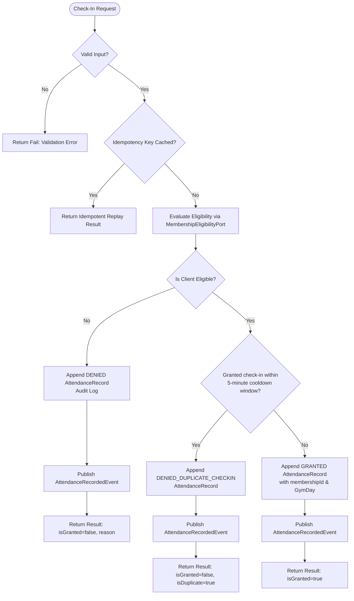

# ADR-0066: Gym Management Record Check-In Use Case, Anti-Passback & Idempotency Architecture

- **Status**: Accepted
- **Date**: 2026-08-19
- **Deciders**: Principal Application Architect, Senior DDD Engineer, Security & Test Architect
- **Context**: Kinergy Platform Phase 5.5-D (Record Gym Check-In Use Case). The gym check-in process represents the operational convergence of cross-context client validation, membership temporal eligibility evaluation, anti-passback duplicate protection, immutable audit persistence, domain event distribution, and network retry idempotency.

---

## 1. Context & Problem Statement

Turnstiles, QR scanners, and front-desk reception terminals execute high-frequency check-in requests. A naive check-in implementation causes severe production defects:

1. **Passback Vulnerability**: A member scans their badge/app, passes the turnstile, and immediately hands the badge/phone backward over the barrier to allow an unpaid friend to enter ("passback").
2. **Double-Scanning / Network Retries**: Mobile network jitter or impatient front-desk double-clicking causes duplicate attendance records, distorting facility occupancy analytics.
3. **Loss of Failed Ingress Auditability**: If access denials (e.g. expired memberships, frozen accounts, non-existent clients) are merely rejected with HTTP 400 without persistence, security and front-desk staff have no audit trail to investigate tailgating or fraudulent credential sharing.
4. **Lifecycle Logic Duplication**: If the check-in handler replicates membership state-machine evaluations, business rule drift is inevitable.

---

## 2. Architectural Decisions

### 2.1 The Operational Use Case Workflow (`RecordCheckInHandler`)

1. **Input Validation**: Sanitizes and validates `clientId` and `CheckInMethod` (`BARCODE`, `RFID`, `QR_CODE`, `MANUAL_RECEPTION`, `BIOMETRIC`).
2. **Idempotency Protection**: Evaluates `input.idempotencyKey` against a 10-minute cache TTL. Matches return cached results with `isIdempotentReplay: true` without appending duplicate rows.
3. **Membership Eligibility Delegation**: Invokes canonical `MembershipEligibilityPort.evaluateEligibility(clientId, now)` (ADR-0065). Zero lifecycle duplication.
4. **Comprehensive Ingress Audit Trail**:
   - Ineligible attempts are appended to `AttendanceRecordRepository` with specific denial codes (`DENIED_INACTIVE_CLIENT`, `DENIED_NO_MEMBERSHIP`, `DENIED_EXPIRED`, `DENIED_FROZEN`).
5. **Anti-Passback & Rapid Re-Scan Cooldown**:
   - Evaluates `findRecentByClientId(clientId, now - cooldownWindow)` (default 5 minutes / 300,000 ms).
   - If a prior `GRANTED` check-in exists within the cooldown window, access is denied (`DENIED_DUPLICATE_CHECKIN`), appended to the audit log, and reported with `isDuplicate: true`.
   - Prior _denied_ check-ins do NOT trigger anti-passback (allowing instant retry after payment/unfreeze).
6. **Immutable Append-Only Persistence**: Granted entries are appended with `result: AccessResult.GRANTED`, the authorizing `membershipId`, and derived facility `GymDay`.
7. **Domain Event Distribution**: Dispatches `AttendanceRecordedEvent` for downstream occupancy counters and telemetry.

---

### 2.2 Concurrency & Transaction Boundaries

- **Append-Only Safety**: Because `AttendanceRecord` is an append-only log, multiple concurrent check-ins create independent immutable records without write-lock contention.
- **Turnstile Concurrency Guarantee**: Physical turnstile hardware operates sequential entry gates. At the application layer, anti-passback lookups are backed by database indexed queries on `(clientId, checkInTime DESC)`.

---

## 3. Consequences

### Positive

- **Deterministic & Observable**: Every check-in attempt (whether granted or denied) creates an immutable point-in-time audit record.
- **Zero Lifecycle Coupling**: Attendance consumes eligibility decisions through `MembershipEligibilityPort`.
- **Turnstile Anti-Passback**: Prevents badge sharing and double scanning.
- **Idempotency Safety**: Network retries replay seamlessly without record duplication.

### Negative / Trade-offs

- Audit logging of denied attempts increases database insert volume (mitigated by append-only table structure and index partitioning).

---

## 4. References

- [ADR-0054: Gym Management Bounded Context Ownership](0054-gym-management-bounded-context-ownership-and-context-map.md)
- [ADR-0062: Membership Expiration Temporal Semantics](0062-gym-management-membership-expiration-temporal-semantics-and-canonical-eligibility-model.md)
- [ADR-0064: Attendance Domain Boundary & Append-Only Log Model](0064-gym-management-attendance-domain-boundary-identity-and-append-only-log-model.md)
- [ADR-0065: Membership Eligibility Contract & Cross-Context Integration](0065-gym-management-membership-eligibility-contract-and-cross-context-integration.md)
