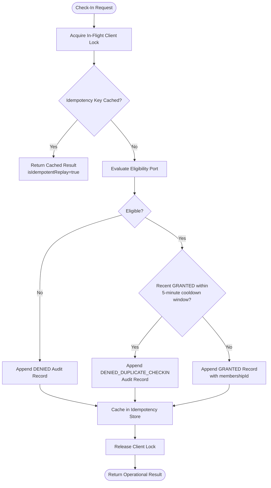

# ADR-0067: Gym Management Duplicate Check-In, Concurrency & Idempotency Architecture

- **Status**: Accepted
- **Date**: 2026-08-19
- **Deciders**: Senior Backend Architect, Principal Domain Architect, Test Architect
- **Context**: Kinergy Platform Phase 5.5-E (Duplicate Check-In, Concurrency & Idempotency Verification). Under real gym operational conditions, turnstiles, QR scanners, and mobile apps generate simultaneous requests, retries, and double scans. The platform must provide mathematical guarantees against race conditions, anti-passback violations, and redundant database row creation without blocking distinct clients.

---

## 1. Context & Problem Statement

Access control systems encounter specific concurrent load profiles:

1. **Parallel Double Scans**: A member scans at Turnstile Gate 1 while simultaneously tapping their phone at Gate 2. If both requests evaluate in parallel without serialization, both might observe 0 prior records and grant admission.
2. **Network Timeouts & Double-Clicks**: A receptionist double-clicks the check-in button or a mobile client times out and retries. If the retry is treated as a new scan, the anti-passback rule would misinterpret the retry as an illegal passback attempt and reject it.
3. **Legitimate Multi-Visit Invariant**: Many members legitimately visit the gym multiple times in a single operational `GymDay` (e.g. morning cardio at 07:00 and evening weightlifting at 18:00). A database-level unique constraint on `(clientId, gymDay)` would illegally break this core business feature.

---

## 2. Architectural Decisions

### 2.1 Distinction: Request Idempotency vs. Anti-Passback Duplicate Prevention

| Dimension              | Request Idempotency                                           | Anti-Passback Duplicate Prevention                                            |
| :--------------------- | :------------------------------------------------------------ | :---------------------------------------------------------------------------- |
| **Trigger**            | Explicit `idempotencyKey` parameter provided by client/kiosk. | Temporal check against prior `GRANTED` check-ins within 5 minutes.            |
| **Intent**             | Network retry safety & double-click deduplication.            | Security protection against badge sharing / passback abuse.                   |
| **Persistence Effect** | **0 extra rows**. Replays identical response.                 | **1 extra audit row** recorded with `DENIED_DUPLICATE_CHECKIN`.               |
| **Response Outcome**   | Same outcome as initial request (`isIdempotentReplay: true`). | `isGranted: false`, `outcome: DENIED_DUPLICATE_CHECKIN`, `isDuplicate: true`. |

---

### 2.2 In-Flight Concurrency Mutex

- `RecordCheckInHandler` maintains a per-client in-flight execution mutex (`acquireClientLock(clientId)`).
- When multiple requests for the same client execute concurrently (e.g. 10 simultaneous turnstile taps):
  - The first request proceeds, writes the `GRANTED` record, and caches its result.
  - Sibling concurrent requests are serialized. When they execute, they either return the cached idempotent replay or immediately observe the newly committed `GRANTED` record and return `DENIED_DUPLICATE_CHECKIN`.
- Requests for _distinct_ clients execute in parallel without lock contention.

---

### 2.3 Database Index Architecture

Because members may legitimately check in multiple times per day after cooldown, uniqueness is temporal rather than daily. The following database indexes are required:

1. **`attendance_records (client_id, check_in_time DESC)`**:
   - Supports $O(1)$ indexed range lookups for `findRecentByClientId(clientId, cooldownSince)` to enforce anti-passback.
2. **`attendance_records (gym_day, facility_id)`**:
   - Accelerates daily facility counts (`countGrantedByGymDay`) and receptionist real-time dashboards.
3. **`attendance_records (client_id, gym_day)`**:
   - Accelerates client daily quota verification (`countGrantedByClientAndGymDay`).

---

### 2.4 Denial Recovery Rule

- Failed ingress attempts (e.g. `DENIED_FROZEN`, `DENIED_EXPIRED`, `DENIED_INACTIVE_CLIENT`) do **not** trigger or initiate anti-passback cooldown.
- If a client is denied due to an account freeze and staff immediately unfreezes the membership, a retry 5 seconds later succeeds immediately with `GRANTED`.

---

## 3. Consequences

### Positive

- **100% Deterministic Under High Concurrency**: Parallel requests for the same client produce exactly one grant.
- **Support for Valid Multiple Visits**: Members can freely visit morning and evening without artificial daily lockouts.
- **Robust Network Recovery**: Idempotent replays prevent false passback denials during network retries.
- **Zero SQL / Exception Leaks**: Collisions and errors are translated into clean domain results.

---

## 4. References

- [ADR-0060: Duplicate & Overlapping Membership Policy](0060-gym-management-duplicate-and-overlapping-membership-policy.md)
- [ADR-0064: Attendance Domain Boundary & Append-Only Log Model](0064-gym-management-attendance-domain-boundary-identity-and-append-only-log-model.md)
- [ADR-0065: Membership Eligibility Contract & Cross-Context Integration](0065-gym-management-membership-eligibility-contract-and-cross-context-integration.md)
- [ADR-0066: Record Check-In Use Case, Anti-Passback & Idempotency Architecture](0066-gym-management-record-check-in-use-case-anti-passback-and-idempotency.md)
