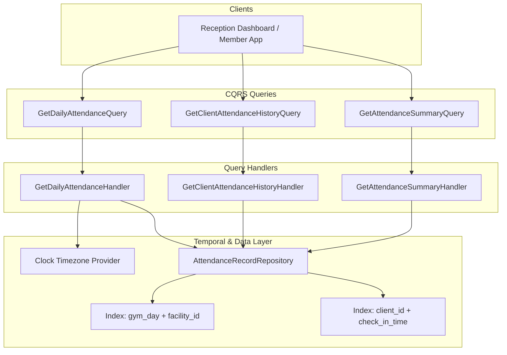

# ADR-0068: Gym Management Attendance History & Operational Read Models

- **Status**: Accepted
- **Date**: 2026-08-19
- **Deciders**: Senior Query/Application Architect, Principal Domain Architect, Test Architect
- **Context**: Kinergy Platform Phase 5.5-F (Attendance History & Operational Read Models). Reception desks, gym managers, and mobile applications require fast, structured read queries for today's live check-in feed, member visit history, and date-range attendance analytics. The append-only write model must not be overloaded to serve reporting needs, and historical integrity must remain explainable without depending on mutable client/plan states.

---

## 1. Context & Problem Statement

Operational facilities generate continuous ingress check-in records. Front-desk staff, turnstile monitoring screens, and mobile member profiles require:

1. **Live Daily Feed**: Real-time chronological log of today's access attempts (both granted and denied) with daily KPIs.
2. **Member Attendance Timeline**: Paginated historical visits for a specific client across date ranges.
3. **Operational Analytics & Traffic Heatmaps**: Date-range aggregates, daily visit counts, peak hourly traffic, and access method distributions.
4. **Current-Day Visitor Semantics**: A clear, unambiguous definition of what "today's visitors" represents in an environment where physical checkout does not exist.

---

## 2. Architectural Decisions

### 2.1 Current-Day Visitors Semantic Definition

Because physical gym checkout is intentionally omitted in Kinergy (ADR-0064):

- **`totalCheckIns`**: The total count of all recorded ingress attempts today (including security denials like expired memberships or anti-passback re-scans).
- **`grantedVisits`**: The total count of authorized entries today (`result === AccessResult.GRANTED`).
- **`uniqueVisitors`**: The count of distinct `clientId` values with at least 1 granted admission on that `GymDay`.
- **Occupancy Guarantee**: The platform explicitly does **not** report real-time building occupancy ("currently inside") to avoid false operational assumptions.

---

### 2.2 Facility-Local Business Timezone Anchoring

- `GetDailyAttendanceHandler` determines "today" strictly using the facility's configured business timezone via `Clock` and `GymDay.fromUtc(clock.now(), clock.timezone(), facilityId)`.
- Never relies on UTC date strings or browser client time to determine the operational business day.

---

### 2.3 Historical Immutability & Decoupling

- Ingress log records snapshot `membershipId`, `gymDay`, `method`, `result`, and `checkInTime` at the moment of scan.
- Subsequent changes to client names, membership plan pricing, or membership renewals do not alter historical records.
- Historical queries never join against mutable future state to reinterpret past admissions.

---

### 2.4 Pagination & Query Parameters

- Uses standard 1-indexed pagination (`page >= 1`, `1 <= limit <= 100`, default `page=1, limit=20`).
- Deterministic sorting: `checkInTime DESC, id DESC`.
- Safe clamping ensures queries cannot request unbounded row sets.

---

## 3. Consequences

### Positive

- **High Performance**: $O(1)$ and $O(\log N)$ indexed lookups for reception dashboards and member histories.
- **Zero Ambiguity on Daily Visitors**: Clear separation between total scans, granted visits, and unique visitors.
- **Strict Boundary Preservation**: Query handlers return dedicated DTOs; internal aggregate methods and Prisma entities are never leaked.

---

## 4. References

- [ADR-0064: Attendance Domain Boundary, Identity & Append-Only Log Model](0064-gym-management-attendance-domain-boundary-identity-and-append-only-log-model.md)
- [ADR-0065: Membership Eligibility Contract & Cross-Context Integration](0065-gym-management-membership-eligibility-contract-and-cross-context-integration.md)
- [ADR-0066: Record Check-In Use Case, Anti-Passback & Idempotency Architecture](0066-gym-management-record-check-in-use-case-anti-passback-and-idempotency.md)
- [ADR-0067: Duplicate Check-In, Concurrency & Idempotency Architecture](0067-gym-management-duplicate-check-in-concurrency-and-idempotency-architecture.md)
