# ADR-0070: Gym Management Attendance & Daily Operations Comprehensive Verification Suite

- **Status**: Accepted
- **Date**: 2026-08-19
- **Deciders**: Senior Test Architect, Principal Backend Architect, Domain Architect
- **Context**: Kinergy Platform Phase 5.5-H (Attendance & Daily Operations — Comprehensive Test Suite). To certify Phase 5.5 for production reception operations, an exhaustive, deterministic, multi-layer verification suite must prove that Membership eligibility is authoritative, check-in operations are concurrency-safe and idempotent, historical audit trails are immutable, and read-model queries calculate correct business statistics.

---

## 1. Context & Verification Goals

Gym attendance records the physical admission of people into facilities. In high-throughput reception environments, subtle defects can lead to security breaches, turnstile deadlocks, incorrect billing, or double-entry discrepancies.
The comprehensive verification suite proves:

1. **Eligibility Authoritativeness**: The frontend and reception desk cannot grant admission to ineligible, frozen, expired, or terminated members.
2. **Deterministic Time Boundaries**: Millisecond-precise evaluations at $T_{exp}-1\text{ms}$ (GRANTED) vs $T_{exp}$ (DENIED_EXPIRED).
3. **Anti-Passback Enforcement**: Rejection of duplicate badge scans within the 5-minute cooldown window.
4. **Race-Condition & Mutex Safety**: 10 simultaneous parallel check-ins for the same client result in exactly 1 GRANTED admission and 9 DENIED_DUPLICATE_CHECKIN responses with zero deadlocks.
5. **Idempotent Network Replay**: Retrying with an existing `idempotencyKey` returns the original cached admission without creating duplicate attendance rows.
6. **Historical Immutability**: Historical records remain unaffected when memberships are subsequently renewed, frozen, expired, or terminated.
7. **Daily Operational Read Models**: Correct grouping, local GymDay timezone calculations, and KPI aggregations.

---

## 2. Comprehensive Verification Architecture

```mermaid
flowchart TD
    subgraph Phase 5.5 Master Verification Suite
        Matrix[1. Eligibility Matrix<br/>8 Canonical Permutations] --> Boundaries[2. Temporal Boundaries<br/>1ms Before / Exact / 1ms After]
        Boundaries --> Timezones[3. Facility Timezone & Midnight<br/>Guayaquil UTC-5 Ingress]
        Timezones --> AntiPassback[4. Anti-Passback Policy<br/>5-Min Cooldown Rejection]
        AntiPassback --> Concurrency[5. High-Concurrency Mutex<br/>10 Concurrent Requests per Client]
        Concurrency --> Idempotency[6. Idempotency Nonce Safety<br/>Safe Network Retry]
        Idempotency --> Immutability[7. Historical Immutability<br/>Post-Admission Mutation Isolation]
        Immutability --> Queries[8. Operational Read Models<br/>Daily KPI Feed & Range Summary]
    end
```

---

## 3. Verified Matrix Permutations

| Client State | Membership State | Evaluated Window      | Access Result            | Enforced Invariant               |
| ------------ | ---------------- | --------------------- | ------------------------ | -------------------------------- |
| Active       | ACTIVE           | In Range              | `GRANTED`                | Full admission granted           |
| Active       | EXPIRED          | Past Expiration       | `DENIED_EXPIRED`         | Expired contract rejected        |
| Active       | FROZEN           | Inside Freeze Window  | `DENIED_FROZEN`          | Suspended contract rejected      |
| Active       | TERMINATED       | Post Termination      | `DENIED_NO_MEMBERSHIP`   | Cancelled contract rejected      |
| Active       | PENDING (Future) | Before Start Date     | `DENIED_NO_MEMBERSHIP`   | Future agreement rejected        |
| Active       | None             | No Record             | `DENIED_NO_MEMBERSHIP`   | Unregistered client rejected     |
| Inactive     | Any              | Any                   | `DENIED_INACTIVE_CLIENT` | Inactive client context rejected |
| Active       | Multiple         | Overlapping / Renewed | `GRANTED`                | Deterministic active resolution  |

---

## 4. Consequences

### Positive

- **100% Deterministic & Non-Flaky**: Zero dependence on wall-clock system time; all tests use controlled `ControllableClock` / `TestClock`.
- **Exhaustive Monorepo Quality Gate**: Complete validation across domain aggregate, application use cases, operational read models, and UI workflows.
- **Architectural Boundary Enforcement**: Certified zero leaks of foreign ORM or framework internals into domain code.

---

## 5. References

- [ADR-0064: Attendance Domain Boundary & Append-Only Log Model](0064-gym-management-attendance-domain-boundary-identity-and-append-only-log-model.md)
- [ADR-0065: Membership Eligibility Contract & Cross-Context Integration](0065-gym-management-membership-eligibility-contract-and-cross-context-integration.md)
- [ADR-0066: Record Check-In Use Case, Anti-Passback & Idempotency](0066-gym-management-record-check-in-use-case-anti-passback-and-idempotency.md)
- [ADR-0067: Duplicate Check-In, Concurrency & Idempotency Architecture](0067-gym-management-duplicate-check-in-concurrency-and-idempotency-architecture.md)
- [ADR-0068: Attendance History & Operational Read Models](0068-gym-management-attendance-history-and-operational-read-models.md)
- [ADR-0069: Daily Reception Workflow & Frontend Access Architecture](0069-gym-management-daily-reception-workflow-frontend-architecture.md)
