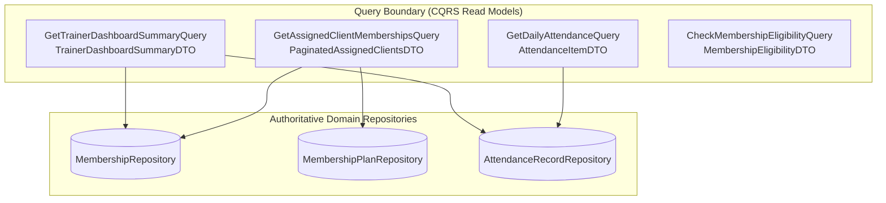

# ADR-0076: Trainer Operational Read Model and KPI Summary Projection

- **Status**: Accepted
- **Date**: 2026-08-22
- **Deciders**: Senior Query Architect, Domain Architect
- **Context**: Kinergy Platform Phase 5.6-D (Trainer Operational Read Model). Implements dedicated read models and queries for the Trainer Operational Dashboard without creating duplicate domain aggregates, monolithic SQL queries, or violating context boundaries.

---

## 1. Context & Problem Statement

The Trainer Dashboard requires high-performance operational metrics (active clients, expiring agreements, freeze counts, today's arrivals) and paginated assigned client rosters.
Creating a second domain aggregate (`TrainerDashboard`) or persistence table introduces duplicate sources of truth and state synchronization nightmares.

---

## 2. Decision Summary

---

## 3. Key Architectural Decisions

### 3.1 Separate Summary and Detail Read Models

- **Summary Query** (`GetTrainerDashboardSummaryQuery`):
  - Projects `TrainerDashboardSummaryDTO` containing aggregated operational counts (`totalAssignedClients`, `activeMembershipsCount`, `expiringMembershipsCount`, `frozenMembershipsCount`, `todayCheckInsCount`).
  - Executes rapidly in $O(M + A)$ time across authoritative repositories.
- **Detail Queries** (`GetAssignedClientMembershipsQuery`, `GetDailyAttendanceQuery`):
  - Return granular entity projections (`AssignedClientMembershipDTO`, `AttendanceItemDTO`) with deterministic pagination (`page`, `limit`) and field sorting (`sortBy`, `sortOrder`).

### 3.2 Pure View Projections, Zero Domain Authority

- The read models hold **no business authority**:
  - Expiry status is calculated via `Membership.isExpiringSoon(evalDate, horizonDays)` using domain rules.
  - Freeze state is evaluated via `Membership.isFrozenAt(evalDate)`.
  - Check-in eligibility is determined by `MembershipEligibilityPort`.
- No `TrainerDashboard` entity table or database synchronization trigger exists.

### 3.3 Temporal and Timezone Determinism

- "Today" is authoritatively computed using `GymDay.fromUtc(clock.now(), timezone, facilityId)` rather than system local clocks or browser timestamps.

---

## 4. Consequences

- Pure CQRS read projections decouple frontend presentation from backend domain aggregates.
- Fast query execution with bounded memory footprints.
- Deterministic pagination and sorting prevent memory overflow for large client bases.

---

## 5. References

- [ADR-0073: Trainer Operational Dashboard Domain Boundaries](./0073-trainer-operational-dashboard-domain-boundaries-and-read-model-architecture.md)
- [ADR-0074: Trainer Authorization Boundary](./0074-trainer-operational-authorization-boundary-and-object-level-scoping-policy.md)
- [ADR-0075: Cross-Context Query Contracts](./0075-trainer-dashboard-cross-context-query-contracts-and-resilience-model.md)
