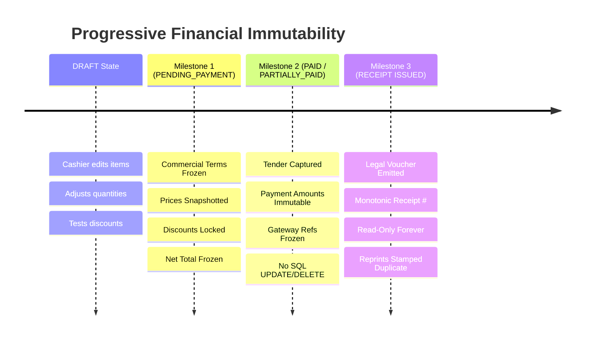

# 0108. Deterministic Financial Representation and Currency Modeling

- **Status**: Accepted
- **Date**: 2026-09-17
- **Deciders**: Principal Financial Domain Architect, Principal Software Architect, Staff Platform Engineer
- **Context**: Kinergy Platform Phase 7 (Sales & Payments). The platform must process commercial transactions, calculate line subtotals, apply percentage and fixed-amount discounts, compute tax levies, capture multi-tender payments, and issue legal receipts across clinical, fitness, and retail operations without rounding drift, floating-point corruption, or financial ledger discrepancies.

---

## 1. Context and Problem Statement

Financial software must guarantee **exact, deterministic arithmetic**. In a multi-service health and wellness platform (kinesiology sessions, gym memberships, bulk consumables, ad-hoc rentals), financial amounts are subjected to:

1. Fractional quantities (e.g. 1.25 kg of protein powder, 0.75 hours of therapy).
2. Fractional tax rates (e.g. 8.875% city/state sales tax, 19% VAT).
3. Percentage discounts (e.g. 15% VIP member discount on a $49.99 item).
4. Multi-tender split payments (e.g. $33.33 cash + $66.67 credit card on a $100.00 bill).

Using standard binary floating-point numbers (IEEE 754 `number` in JavaScript/TypeScript) introduces critical precision bugs (e.g. `0.1 + 0.2 = 0.30000000000000004`, `19.99 * 3 = 59.970000000000006`). In accounting and billing, cumulative floating-point errors cause balance sheets to fail reconciliation, receipts to display fractional cents, and payment gateway authorizations to fail due to penny discrepancies.

We must establish a unified, deterministic financial representation across all layers of the Kinergy platform:

- Domain Kernel (`packages/core`)
- Relational Persistence (PostgreSQL via Prisma ORM)
- REST API Serialization (`apps/api`)
- Frontend Display & State (`apps/web`)
- External Payment Gateways (Stripe, POS terminals, banks)

---

## 2. Decision Drivers

- **Mathematical Determinism**: Identical calculations must yield identical integer-cent results across all environments.
- **Reconciliation Guarantee**: Subtotals minus discounts plus taxes must equal the final total to the exact cent; settled payments plus outstanding balance must equal the total.
- **Relational Integrity**: PostgreSQL and Prisma must enforce scale and precision constraints at the database column level.
- **Gateway Compatibility**: Payment processors (Stripe, card acquirers) require integer minor units (cents); the model must convert cleanly without rounding loss.
- **Single Source of Truth**: Eliminate fragmented price/money abstractions across bounded contexts (`PlanPrice` in Gym, `Money` in Resources, new monetary types in Sales).

---

## 3. Considered Options

1. **Option 1: Native JavaScript Floating-Point (`number`)**:
   Store and calculate money using standard floating-point numbers.
2. **Option 2: Integer Minor Units Everywhere (Raw Cents as `number` or `bigint`)**:
   Represent all monetary values as integer cents (e.g. $10.50 represented as `1050`).
3. **Option 3: Pure Domain `Money` Value Object with Cent-Guarded Integer Arithmetic + PostgreSQL Fixed-Point `Decimal(12, 2)` via Prisma**:
   Represent money in the domain as an immutable `Money` Value Object storing major units with fixed scale of 2 decimal places, performing all operations via integer-cents arithmetic (`Math.round`), persisted in PostgreSQL as `Decimal(12, 2)`.

---

## 4. Decision Outcome

Chosen Option: **Option 3: Pure Domain `Money` Value Object with Cent-Guarded Integer Arithmetic + PostgreSQL Fixed-Point `Decimal(12, 2)` via Prisma**.

### 4.1 Specification of the Chosen Model

```
┌────────────────────────────────────────────────────────────────────────┐
│                   DETERMINISTIC FINANCIAL TIERS                        │
│                                                                        │
│  DOMAIN LAYER: Pure Money Value Object                                 │
│  - amount: number (Validated: finite, non-negative, 2 decimal places) │
│  - currency: string (Normalized ISO-4217, e.g. "USD")                  │
│  - Arithmetic: Computed in integer cents:                              │
│    add(a, b)      = (round(a*100) + round(b*100)) / 100               │
│    subtract(a, b) = (round(a*100) - round(b*100)) / 100               │
│    multiply(a, q) = round(a * 100 * q) / 100                          │
│  - Rounding Mode: Half-Up (Math.round) at cent boundary                │
│                                                                        │
│  PERSISTENCE LAYER: PostgreSQL & Prisma                                │
│  - Column Type: Decimal @db.Decimal(12, 2)                             │
│  - Capacity: Up to 9,999,999,999.99 (10 billion minus 1 cent)          │
│  - Currency Column: String @default("USD") @db.VarChar(3)              │
│                                                                        │
│  API LAYER: Structured DTO Serialization                               │
│  - JSON Schema: { amount: 49.99, currency: "USD" }                     │
│                                                                        │
│  EXTERNAL GATEWAY ADAPTERS: Explicit Minor Unit Conversion             │
│  - To Gateway:   amountInCents = Math.round(money.amount * 100)        │
│  - From Gateway: money = Money.create(cents / 100, currency)           │
└────────────────────────────────────────────────────────────────────────┘
```

### 4.2 Single Currency Scope for Phase 7.0

1. **Mono-Currency per Tenant**:
   - Each business organization (`tenantId`) configures a single functional operating currency (default: `"USD"`).
   - Every `Sale`, `SaleItem`, `Discount`, `TaxRate`, and `Payment` within that tenant must use the tenant's configured currency.
   - Mixed-currency transactions within a single sale are strictly rejected by the domain aggregate.
2. **Extension Path for Future Multi-Currency / Multi-Branch**:
   - The relational schema and domain Value Object already mandate explicit ISO-4217 currency tracking (`currency: string`).
   - When international branches or multi-currency POS terminals are introduced in future phases, the data model supports currency per branch without schema migrations.

---

## 5. In-Depth Analysis of Options & Rejected Alternatives

### 5.1 Option 1: Native JavaScript Floating-Point (`number`) — REJECTED

- **Why Rejected**:
  - Inherent binary representation limits cause fatal rounding errors:
    ```javascript
    0.1 + 0.2 === 0.3; // false (0.30000000000000004)
    49.99 * 3; // 149.97000000000003
    ```
  - Over thousands of transactions, accumulated pennies create severe reconciliation failures between the sub-ledger and physical bank deposits.
  - Completely unacceptable for commercial accounting, auditing, and tax compliance.

### 5.2 Option 2: Raw Integer Cents Everywhere (`1050`) — REJECTED FOR DOMAIN CORE

- **Why Rejected as Primary Domain Surface**:
  - While attractive for simple retail checkout, raw integer cents fail when dealing with:
    1. **Fractional Quantities**: In wellness facilities, bulk supplements or tea blends are sold by weight (e.g. 0.35 kg at $24.50/kg). Multiplying integer cents by fractional quantities requires immediate floating-point math and manual division anyway.
    2. **Fractional Tax & Discount Rates**: Sales tax rates frequently carry fractional percentages (e.g. 8.875% NYC tax, 7.25% California).
    3. **Developer Cognitive Load & Confusion**: If a developer forgets whether a raw number is in dollars or cents, catastrophic errors occur (e.g. charging $5000.00 instead of $50.00).
    4. **Prisma Relational Incompatibility**: Storing raw cents in relational databases requires integer columns (`Int` or `BigInt`), conflicting with PostgreSQL standard monetary/financial reporting tools (Metabase, Tableau, accounting exports) which expect standard decimal currency notation (`$10.50`).

---

## 6. Reconciliation & Rounding Formulas

To guarantee that a `Sale` reconciles to the exact cent across line items, discounts, taxes, and payments, the following deterministic formulas are codified:

1. **Line Subtotal**:
   $$\text{lineSubtotal} = \frac{\text{round}(\text{quantity} \times \text{unitPrice.amount} \times 100)}{100}$$

2. **Line Discount**:
   - Percentage:
     $$\text{lineDiscountAmount} = \min\left(\text{lineSubtotal}, \frac{\text{round}\left(\text{lineSubtotal} \times \frac{\text{percentage}}{100} \times 100\right)}{100}\right)$$
   - Fixed Amount:
     $$\text{lineDiscountAmount} = \min(\text{lineSubtotal}, \text{fixedDiscount.amount})$$

3. **Line Net Total (Pre-Tax)**:
   $$\text{lineNet} = \text{lineSubtotal} - \text{lineDiscountAmount}$$

4. **Line Tax**:
   $$\text{lineTaxAmount} = \frac{\text{round}(\text{lineNet} \times \text{taxRate} \times 100)}{100}$$

5. **Line Total**:
   $$\text{lineTotal} = \text{lineNet} + \text{lineTaxAmount}$$

6. **Order-Level Discount Allocation**:
   - Applied to the net order subtotal:
     $$\text{saleNetPreOrderDisc} = \sum (\text{lineNet}_{i})$$
     $$\text{orderDiscountAmount} = \min\left(\text{saleNetPreOrderDisc}, \text{orderDiscount.calculateReduction}(\text{saleNetPreOrderDisc})\right)$$

7. **Sale Net Total (Net Payable)**:
   $$\text{saleTotal} = \sum (\text{lineSubtotal}_{i}) - \left(\sum \text{lineDiscount}_{i} + \text{orderDiscountAmount}\right) + \sum (\text{lineTaxAmount}_{i})$$
   _Net total is guaranteed non-negative: $\text{saleTotal} \ge 0$._

8. **Payment Settlement & Outstanding Balance**:
   $$\text{totalSettled} = \sum_{p \in \text{SettledPayments}} p.\text{amount}$$
   $$\text{balanceRemaining} = \max(0, \text{saleTotal} - \text{totalSettled})$$

---

## 7. Financial Immutability Milestones

The lifecycle enforces progressive financial immutability across three explicit milestones:



1. **Milestone 1 — Order Finalization (`PENDING_PAYMENT`)**:
   - Line items, descriptions, quantities, unit prices, discounts, tax rates, and net total are **permanently frozen**.
   - Line items can no longer be added, modified, or removed.
2. **Milestone 2 — Payment Settlement (`SETTLED`)**:
   - Captured payment records become **permanently immutable**.
   - Tender amounts and payment methods cannot be edited. Corrections require an explicit compensating transaction (`REFUND` or `VOID`).
3. **Milestone 3 — Receipt Issuance (`Receipt`)**:
   - The legal receipt voucher is **read-only forever**.
   - Reprints re-render the identical frozen JSON payload with a duplicate watermark without altering the stored record.

---

## 8. Implementation & Shared Kernel Elevation

### 8.1 Shared Kernel Promotion

In Phase 6, the platform created `Money` in `packages/core/src/resources/domain/shared/value-objects/money.vo.ts`.  
To prevent fragmentation:

- Elevate `Money` to a platform-wide shared kernel:  
  `packages/core/src/shared/kernel/value-objects/money.vo.ts`.
- Both Phase 6 (Resources), Phase 5 (Gym), and Phase 7 (Sales & Payments) will import and utilize this canonical Value Object.
- Deprecate isolated ad-hoc pricing types (`PlanPrice` in Gym) in favor of the canonical `Money` value object during subsequent unified refactoring.

### 8.2 Database / Prisma Conventions

In `prisma/schema.prisma`:

```prisma
model Sale {
  // ...
  subtotalAmount      Decimal  @db.Decimal(12, 2) @map("subtotal_amount")
  discountTotalAmount Decimal  @default(0) @db.Decimal(12, 2) @map("discount_total_amount")
  taxTotalAmount      Decimal  @default(0) @db.Decimal(12, 2) @map("tax_total_amount")
  totalAmount         Decimal  @db.Decimal(12, 2) @map("total_amount")
  currency            String   @default("USD") @db.VarChar(3)
  // ...
}

model SaleItem {
  // ...
  unitPriceAmount     Decimal  @db.Decimal(12, 2) @map("unit_price_amount")
  lineSubtotalAmount  Decimal  @db.Decimal(12, 2) @map("line_subtotal_amount")
  discountAmount      Decimal  @default(0) @db.Decimal(12, 2) @map("discount_amount")
  taxAmount           Decimal  @default(0) @db.Decimal(12, 2) @map("tax_amount")
  lineTotalAmount     Decimal  @db.Decimal(12, 2) @map("line_total_amount")
  currency            String   @default("USD") @db.VarChar(3)
  // ...
}

model Payment {
  // ...
  amount              Decimal  @db.Decimal(12, 2)
  currency            String   @default("USD") @db.VarChar(3)
  // ...
}
```

---

## 9. Consequences

### Positive Consequences

- **Zero Floating-Point Drift**: Calculations across cart checkout, split tenders, discounts, and taxes reconcile to the exact cent.
- **Auditing Confidence**: Corporate balance sheets, daily register totals, and bank statements match with zero rounding discrepancies.
- **Relational Integrity**: PostgreSQL `Decimal(12, 2)` enforces financial boundaries at the storage engine level.
- **Clean Gateway Interoperability**: Adapters convert deterministically to/from gateway minor units via single-line integer rounding.

### Negative / Neutral Consequences

- **Intermediate Integer Rounding Discipline**: Developers must strictly use `Money` and `Discount` methods rather than native `+`, `-`, `*` arithmetic. (Enforced via linting and domain tests).
