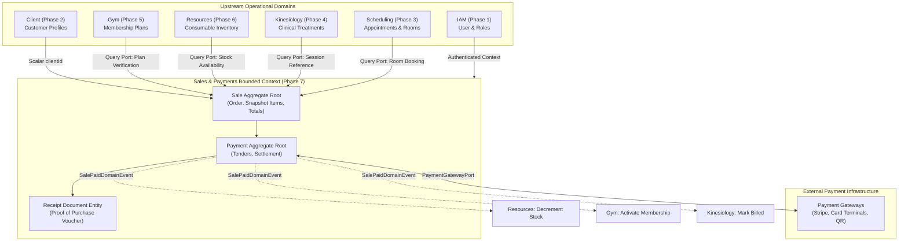

# 0112. Sales & Payments Bounded Context Establishment

- **Status**: Accepted
- **Date**: 2026-09-17
- **Deciders**: Architecture Review Board, Principal Domain Architect, Staff Platform Engineer, Security Architect
- **Context**: Kinergy Platform Phase 7 (Sales & Payments). The platform integrates clinical kinesiology treatments (Phase 4), gym memberships (Phase 5), consumable wellness inventory (Phase 6), and facility scheduling. A unified commercial checkout and settlement architecture is required to process customer purchases without compromising the autonomy of existing operational bounded contexts.

---

## 1. Context and Problem Statement

In an integrated health, fitness, and wellness business, revenue-generating activities occur across distinct operational departments:

- A client attends a post-injury kinesiology rehabilitation session.
- A member renews a 1-month gym membership plan at the front desk.
- A visitor purchases protein supplements, bottled water, or a healthy smoothie from the kitchen counter.
- A client books a specialized rehabilitation workshop or amenity room.

In the absence of a dedicated commercial bounded context, software architectures typically devolve into one of two damaging anti-patterns:

1. **The Distributed Siloed Billing Anti-Pattern**: Each domain builds its own invoicing, checkout UI, payment gateway integration, and receipt printing. Clients cannot execute a combined checkout (e.g. membership renewal + therapy session + smoothie); cash drawers cannot be balanced globally; and payment gateway API secrets leak into clinical and inventory modules.
2. **The "Everything Financial" Monolithic Anti-Pattern**: The billing module expands into a catch-all ERP that takes ownership of product inventories, stock replenishment ledgers, turnstile access rules, and clinical session documentation. This destroys domain autonomy and creates massive circular dependencies.

We must define the bounded context boundary for **Sales & Payments**, establish its exact scope of authority, document what it must never own, and define its relationships with upstream operational contexts.

---

## 2. Decision Drivers

- **Unified Checkout Experience**: Front-desk staff must be able to assemble heterogeneous items (goods, services, memberships) into a single commercial checkout session with split-tender payments and a single unified receipt.
- **Bounded Context Autonomy**: Existing domains (Gym, Resources, Kinesiology, Scheduling, Client, IAM) must maintain complete authority over their core business entities and operational lifecycles.
- **Strict Gateway and Fiscal Isolation**: Third-party payment provider credentials (Stripe, POS terminal bridges, card acquirers) and tax calculation logic must be quarantined inside Sales & Payments.
- **Prevention of Circular Dependencies**: Sales & Payments depends on upstream query ports for price/validity checks, but upstream domains must never depend on Sales & Payments for their internal domain operations.
- **Omnichannel Extensibility**: The commercial checkout model must support front-desk receptionist POS, kitchen retail terminals, client mobile self-checkout, and e-commerce portals.

---

## 3. Considered Options

### Option 1: Distributed Billing in Each Bounded Context

- Each module (Gym, Resources, Kinesiology) owns its own checkout endpoints, payment processing, and receipts.
- **Verdict**: **Rejected**. Makes unified multi-service checkouts impossible, fragments customer receipts, duplicates payment gateway code, and prevents centralized daily financial reconciliation.

### Option 2: Monolithic ERP Domain Subsuming Inventory, Plans, and Sessions

- Expand Sales & Payments to directly own `InventoryItem` stock counts, `MembershipPlan` rules, and `TreatmentSession` records.
- **Verdict**: **Rejected**. Violates DDD bounded context boundaries, couples warehouse logistics and clinical medical records to billing tables, and creates a monolithic failure domain.

### Option 3: Dedicated Downstream Sales & Payments Bounded Context with "References Over Ownership"

- Establish `Sales & Payments` as a dedicated, first-class downstream bounded context.
- Sales exclusively owns: sales orders (`Sale`), line item snapshots (`SaleItem`), discounts (`Discount`), monetary tenders (`Payment`), payment methods (`PaymentMethod`), customer receipts (`Receipt`), and checkout lifecycles.
- Upstream domains retain 100% exclusive authority over their business entities, inventories, access control, and medical charts.
- Sales connects to upstream domains via scalar unconstrained references (`SourceReference`) and interacts through application capability ports.
- **Verdict**: **Selected**.

---

## 4. Decision Outcome

Chosen Option: **Option 3: Dedicated Downstream Sales & Payments Bounded Context with "References Over Ownership"**.

---

## 5. Architectural Specification

### 5.1 Context Boundaries: What It Owns vs. What It Does Not Own

```
┌────────────────────────────────────────────────────────────────────────────────────────┐
│                        SALES & PAYMENTS BOUNDED CONTEXT                                 │
│                                                                                        │
│  WHAT IT OWNS:                                                                         │
│  ✓ Sales Orders & Checkout Sessions (Sale)                                             │
│  ✓ Snapshot Line Items (SaleItem)                                                      │
│  ✓ Discounts & Promotional Adjustments (Discount)                                      │
│  ✓ Payment Transactions & Settlement Records (Payment)                                 │
│  ✓ Payment Method Configurations (PaymentMethod)                                       │
│  ✓ Customer Receipts & Proof-of-Purchase (Receipt)                                     │
│  ✓ Commercial Order Lifecycle (DRAFT → PENDING → PAID → COMPLETED → REFUNDED)          │
│  ✓ Point-of-Sale (POS) Checkout Workflows                                              │
│                                                                                        │
│  WHAT IT DOES NOT OWN:                                                                 │
│  ✗ Master Client Profiles & Identities (Owned by Client Management)                    │
│  ✗ User Authentication & Permissions (Owned by IAM)                                    │
│  ✗ Physical Stock Balances & Movement Ledgers (Owned by Resources / Inventory)         │
│  ✗ Capital Assets & Depreciation (Owned by Resources / Fixed Assets)                   │
│  ✗ Membership Validity Dates & Turnstile Rules (Owned by Gym Management)               │
│  ✗ Clinical Notes, Diagnoses & SOAP Records (Owned by Kinesiology)                     │
│  ✗ Room Schedules & Appointment Calendars (Owned by Scheduling)                        │
│  ✗ General Ledger (GL) Double-Entry Bookkeeping & Fiscal Tax Filings (Accounting)     │
└────────────────────────────────────────────────────────────────────────────────────────┘
```

---

### 5.2 Context Map & Integration Topology

Sales & Payments sits **downstream** of the platform's operational core:



---

### 5.3 Upstream Integration Contracts

1. **Client Context**:
   - `Sale.clientId` is an optional scalar reference (`clientId?: string`).
   - Guest/walk-in retail checkouts are supported without requiring artificial CRM account creation.
2. **Resources Context**:
   - Items are referenced via `SourceReference` (`sourceType: INVENTORY_ITEM`, `sourceId: inventoryItemId`).
   - Sales checks stock via read port, but **never decrements stock directly**. Stock deductions route via `InventoryStockDecrementPort.sellStock()`, ensuring Resources enforces its own OCC and non-negative constraints.
3. **Gym Context**:
   - Memberships are referenced via `SourceReference` (`sourceType: MEMBERSHIP_PLAN`, `sourceId: planId`).
   - Sales collects fees and snapshots the agreed plan price. Upon settlement, Sales notifies `GymMembershipActivationPort` to activate or extend access.
4. **Kinesiology Context**:
   - Clinical encounters are referenced via `SourceReference` (`sourceType: TREATMENT_SESSION`, `sourceId: sessionId`).
   - Sales records the commercial transaction fee; it **never receives, parses, or stores clinical SOAP notes or medical diagnoses**.
5. **No Database Relational Foreign Keys Across Boundaries**:
   - In Prisma persistence, Sales tables store scalar UUID strings (`clientId String?`, `sourceId String`, `cashierId String`). Cross-context `@relation` foreign keys in `schema.prisma` are strictly forbidden.

---

### 5.4 Fulfillment Orchestration

Commercial settlement and operational fulfillment are separated in time:

1. **Step 1 (Commercial Agreement)**: Order items snapshot, discounts applied, total computed (`Sale: DRAFT` $\rightarrow$ `PENDING_PAYMENT`).
2. **Step 2 (Financial Settlement)**: Tenders received, funds captured (`Payment: PENDING` $\rightarrow$ `SETTLED`).
3. **Step 3 (Receipt Issuance)**: Receipt issued automatically upon full settlement (`Receipt: ISSUED`).
4. **Step 4 (Fulfillment)**: Downstream fulfillment handlers decrement inventory, activate memberships, and update session billing status.
5. **Step 5 (Order Completion)**: When all fulfillment ports confirm success, the sale transitions to `COMPLETED`.

---

## 6. Consequences

### Positive

- **Single Source of Commercial Truth**: Complete, unified transaction histories, daily cash drawer balancing, and payment logs across all clinic operations.
- **Zero Domain Pollution**: Clinical records, gym access rules, and physical inventory counts remain strictly quarantined within their owning bounded contexts.
- **Architectural Scalability**: Adding future sellable products or services (e.g. digital video courses, merchandise, venue rentals) requires zero modifications to existing domain entities.

### Negative / Trade-offs

- **Denormalized Snapshots**: Storing frozen descriptions, prices, and tax rates in `SaleItem` requires denormalized persistence. This is an intentional architectural trade-off for audit and legal immutability.
- **Event-Driven Fulfillment**: Asynchronous or outbox-driven post-payment fulfillment introduces eventual consistency requirements across inventory and membership activation.

---

## 7. Rejected Alternatives

- **Embedding Payments into `Sale` Entity**: Rejected because it prevents split-tender payments (e.g. part cash, part card) and partial deposits.
- **Allowing Sales to Update Inventory Directly**: Rejected because it bypasses Resources optimistic locking and audit stock movement ledgers.
- **Cross-Domain Prisma Relational Foreign Keys**: Rejected because it introduces tight schema coupling, preventing future independent deployment or database splitting.

---

## 8. Implementation Implications

- Module structure: `apps/api/src/sales/` (controllers, application use cases, adapters), `packages/core/src/sales/` (pure domain entities, value objects, invariants, events).
- Port interfaces: Outbound capability ports declared in domain/application core (`PaymentGatewayPort`, `InventoryStockDecrementPort`, `GymMembershipActivationPort`, `TreatmentBillingPort`).
- Persistence: Isolated Prisma models (`Sale`, `SaleItem`, `Payment`, `Receipt`) using scalar reference IDs and `@db.Decimal(12, 2)` monetary columns.

---

## 9. Future Considerations

- **Multi-Branch Facility Expansion**: Support for optional `branchId` to enable independent register drawer balancing and branch revenue reporting.
- **Omnichannel / Self-Checkout**: Reusing the same `Sale` aggregate for client-facing mobile POS and web e-commerce.
- **Fiscal Invoicing Compliance**: Dedicated fiscal adapter ports for national tax authorities (e.g. electronic tax signing).
