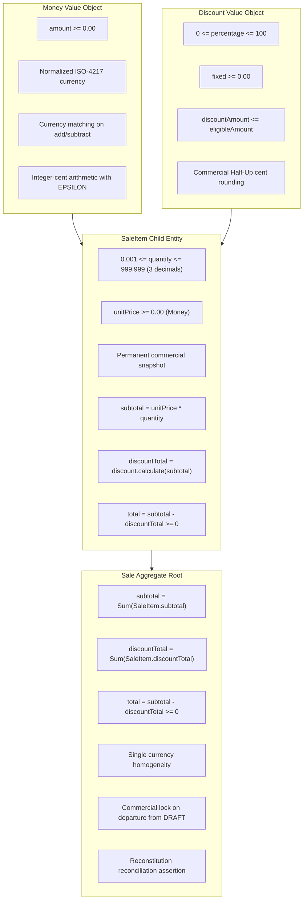

# 0114. Canonical Monetary Policy, Deterministic Arithmetic, and Sale Totals Invariant Enforcement

- **Status**: Accepted
- **Date**: 2026-09-18
- **Deciders**: Principal Financial Domain Architect, Principal Software Architect, Staff Platform Engineer
- **Context**: Kinergy Platform Phase 7 (Sales & Payments — Milestone 7.4: Sale Totals & Money Rules). The platform must calculate commercial sale totals, line-item discounts, inventory consumables, gym memberships, and multi-service therapy checkout sessions with mathematical determinism, zero floating-point drift, and complete auditability across domain, persistence, API, and gateway layers.

---

## 1. Context and Problem Statement

A multi-disciplinary health and wellness business management platform processes high-volume, heterogeneous transactions:

- Weight-based or fractional bulk consumables (e.g. 1.25 kg protein powder, 0.75 L massage oil).
- Percentage-based membership concessions (e.g. 15% VIP discount on a $49.99 item).
- Fixed commercial vouchers (e.g. $10.00 off a promotional therapy evaluation).
- Fractional currency conversions and multi-tender split payments.

Commercial and accounting regulations demand that:

1. Financial calculations must be **100% deterministic**: identical inputs must yield identical cent results across all environments, operating systems, and runtime architectures.
2. Orders must **reconcile to the exact cent**:
   $$\text{subtotal} = \sum (\text{item}.\text{quantity} \times \text{item}.\text{unitPrice})$$
   $$\text{discountTotal} = \sum (\text{valid discounts})$$
   $$\text{total} = \text{subtotal} - \text{discountTotal}$$
   with:
   $$\text{subtotal} \ge 0.00, \quad \text{discountTotal} \ge 0.00, \quad \text{total} \ge 0.00$$
3. No intermediate or cumulative floating-point rounding errors may alter financial records, cause balance sheet reconciliation failures, or trigger payment gateway authorization mismatches.

We must define the **one canonical monetary policy for Phase 7 (Sales & Payments)** governing:

- Currency representation
- Calculation, persistence, and display precision
- Deterministic rounding modes and application timing
- Domain decimal representation and boundary isolation
- API serialization standards
- Prohibited arithmetic practices
- Comprehensive validation rules
- Aggregate invariant ownership

---

## 2. Decision Drivers

- **Zero Floating-Point Drift**: Eliminate binary floating-point rounding errors (`0.1 + 0.2 === 0.30000000000000004`, `19.99 * 3 === 59.970000000000006`).
- **Mathematical Determinism**: Identical financial inputs must produce bit-for-bit identical outputs on any machine at any point in time.
- **Strict Clean Architecture Layering**: Pure domain code must never depend on database drivers (`@prisma/client`, `Prisma.Decimal`), HTTP frameworks (`@nestjs/*`), or transport protocols.
- **Relational Integrity**: Storage in PostgreSQL must enforce scale and precision constraints at the database column level (`DECIMAL(12, 2)`).
- **Payment Processor Interoperability**: External payment gateways (Stripe, card terminals) operate strictly in integer minor units (cents); conversion must be lossless.
- **Single Source of Truth**: Eliminate fragmented price/money types across bounded contexts (`PlanPrice` in Gym, `Money` in Resources, `number` in early prototypes).

---

## 3. Considered Alternatives

### Alternative 1: JavaScript Native Binary Floating-Point (`number`)

- Calculate and store monetary amounts as standard 64-bit IEEE-754 floating-point numbers.
- **Why Rejected**:
  - Inherent binary representation limits introduce sub-cent errors that cascade when accumulating line items and discounts.
  - Subtraction of floating-point numbers (e.g. `1.005 - 1.000 = 0.004999999999999893`) causes Half-Up rounding to truncate cents incorrectly.
  - Completely unacceptable for commercial accounting, legal tax compliance, and financial ledgers.

### Alternative 2: Integer Minor Units Everywhere (Raw Cents as `number` or `bigint`)

- Represent all monetary amounts across domain, persistence, API, and database columns as raw integer cents (e.g. $10.50 represented as `1050`).
- **Why Rejected as Primary Domain Surface**:
  - Fails when dealing with fractional quantities: multiplying fractional quantities (e.g. 1.250 kg $\times$ 2450 cents) requires immediate division and float conversion anyway.
  - Developer cognitive hazard: mixing major units (dollars) and minor units (cents) across function signatures creates catastrophic order-of-magnitude bugs (e.g. billing $1050.00 instead of $10.50).
  - PostgreSQL reporting mismatch: BI, SQL reporting, and accounting tools expect standard decimal currency notation (`10.50`), not raw integer cents.

### Alternative 3: External String/Arbitrary-Precision Decimal Library in Domain (e.g. `decimal.js`, `bignumber.js`)

- Import an external arbitrary-precision arithmetic library into the core domain layer.
- **Why Rejected**:
  - Adds heavy third-party runtime dependencies to the pure domain kernel.
  - Unnecessary overhead: standard commercial currencies in wellness facilities only require fixed 2-decimal scale, where integer cents comfortably fit within JavaScript's safe integer range ($\pm 9 \times 10^{15}$ cents, or $\$90$ trillion).
  - Complicates serialization, JSON conversions, and TypeScript typing.

### Alternative 4: Prisma Decimal Leaking Directly into Domain Entities

- Use `@prisma/client`'s `Decimal` type directly within domain entities and value objects.
- **Why Rejected**:
  - Fatal Clean Architecture violation: binds the pure domain kernel directly to an ORM infrastructure package (`@prisma/client`).
  - Severely complicates co-located unit testing, requiring infrastructure mocking for pure mathematical rules.

### Alternative 5: Dedicated Pure Domain `Money` Value Object with Cent-Guarded Integer Arithmetic (Selected)

- Model `Money` as an immutable Value Object in the domain kernel storing major units as a normalized 2-decimal number and ISO-4217 currency.
- Perform all additions, subtractions, and multiplications internally in integer minor units (cents) with an explicit `Number.EPSILON` Commercial Half-Up guard.
- Map to `Prisma.Decimal` strictly at the persistence boundary and PostgreSQL `@db.Decimal(12, 2)` at the relational table level.
- **Verdict**: **Selected**. Preserves domain purity, guarantees 100% mathematical determinism, and integrates seamlessly with PostgreSQL and external payment gateways.

---

## 4. Decision Outcome

**Selected Alternative: Alternative 5 — Dedicated Pure Domain `Money` Value Object with Cent-Guarded Integer Arithmetic and Hexagonal Boundary Mapping.**

### Summary Statement

> **There is exactly one canonical monetary policy for Sales.**
> All monetary operations in Phase 7 must execute through the canonical `Money` Value Object, using integer minor units with Commercial Half-Up rounding for arithmetic, PostgreSQL `Decimal(12, 2)` for relational persistence, and structured precision-preserving DTOs for API transport.

---

## 5. Architectural Specification & Policy Rules

### 5.1 Currency Policy

1. **ISO-4217 Standard**: Currency is represented strictly as a normalized, uppercase 3-letter ISO-4217 code (e.g. `"USD"`, `"CAD"`, `"EUR"`).
2. **Mono-Currency per Tenant in Phase 7**:
   - Each business organization (`tenantId`) configures a single functional currency (default: `"USD"`).
   - Every `Sale`, `SaleItem`, `Discount`, and `Payment` within a transaction must use the tenant's configured currency.
   - Mixed currencies within a checkout session are strictly prohibited and throw `InvalidSaleStateException`.
3. **Multi-Currency Extensibility**:
   - Currency is explicitly encapsulated in every `Money` instance, domain event, and database column. Future multi-currency or multi-branch support requires zero domain refactoring.

### 5.2 Precision Hierarchy

The policy establishes three distinct precision tiers:

| Precision Tier            | Precision Level                                   | Scale                                | Implementation Mechanism                     | Purpose                                                        |
| :------------------------ | :------------------------------------------------ | :----------------------------------- | :------------------------------------------- | :------------------------------------------------------------- |
| **Calculation Precision** | Integer minor units (cents) with `Number.EPSILON` | 2 decimal places ($0.01$)            | `Math.round((units + Number.EPSILON) * 100)` | Eliminates binary floating-point drift during math operations. |
| **Persistence Precision** | Fixed-point decimal                               | 2 decimal places ($0.01$), 12 digits | PostgreSQL `@db.Decimal(12, 2)`              | Guaranteed column storage up to $\$9,999,999,999.99$.          |
| **Display Precision**     | Fixed 2 decimal places with currency              | 2 decimal places ($0.01$)            | `${amount.toFixed(2)} ${currency}`           | Clear, unambiguous customer and cashier presentation.          |

Quantity precision is distinct: quantities support up to **3 decimal places** ($0.001$, minimum: $0.001$, maximum: $999,999$), normalized with `Math.round((q + Number.EPSILON) * 1000) / 1000`.

### 5.3 Rounding Rules

1. **Rounding Mode**: Commercial Half-Up rounding (`Math.round(x + Number.EPSILON)`) applied exclusively at the cent ($0.01$) boundary. Half-way values (e.g. $\$0.005$) strictly round away from zero (to $\$0.01$).
2. **Timing of Rounding**:
   - **Line Subtotal**: Computed as $\text{round}(\text{unitPriceInCents} \times \text{normalizedQuantity}) / 100$. Rounding occurs immediately at the line item creation boundary.
   - **Line Discount**: Computed as $\text{round}(\text{subtotalInCents} \times \text{percentage} / 100) / 100$. Rounded immediately to integer cents.
   - **Line Net / Total**: Exact integer subtraction of rounded discount cents from rounded subtotal cents: $(\text{subtotalInCents} - \text{discountInCents}) / 100$.
   - **Order Aggregations**: Summation of already-rounded line items:
     $$\text{Sale.subtotal} = \sum \text{SaleItem.subtotal}$$
     $$\text{Sale.discountTotal} = \sum \text{SaleItem.discountTotal}$$
     $$\text{Sale.total} = \text{Sale.subtotal} - \text{Sale.discountTotal}$$
   - **Zero Repeated Rounding**: Because line subtotals and discounts are already rounded to exact integer cents, summing them produces exact cent totals without intermediate fractional leakage or cumulative drift.

### 5.4 Layer-by-Layer Decimal Representation Flow

```
┌────────────────────────────────────────────────────────────────────────┐
│                        CANONICAL FINANCIAL FLOW                        │
│                                                                        │
│  DOMAIN LAYER: Pure Money Value Object                                 │
│  - Immutable: amount: number (2 decimals), currency: string (ISO-4217) │
│  - Arithmetic: Operated entirely in integer cents                      │
│    add(a, b)      = (round(a*100 + eps) + round(b*100 + eps)) / 100    │
│    subtract(a, b) = (round(a*100 + eps) - round(b*100 + eps)) / 100    │
│    multiply(a, q) = round(round(a*100 + eps) * q + eps) / 100          │
│                                                                        │
│  APPLICATION LAYER: Command & Query Orchestration                      │
│  - Operates purely on Money instances and scalar DTOs                  │
│                                                                        │
│  MAPPER LAYER (Infrastructure): Bidirectional Anti-Corruption          │
│  - To Persistence: new Prisma.Decimal(money.amount)                    │
│  - To Domain:      Money.create(raw.amount.toNumber(), raw.currency)   │
│                                                                        │
│  PERSISTENCE LAYER: Relational Database                                │
│  - PostgreSQL Column: DECIMAL(12, 2) NOT NULL                          │
│                                                                        │
│  API TRANSPORT LAYER: Structured DTO Serialization                     │
│  - JSON Schema: { "amount": 49.99, "currency": "USD" }                 │
│                                                                        │
│  EXTERNAL GATEWAY ADAPTER (Stripe / POS Terminal):                     │
│  - amountInCents = Math.round((money.amount + Number.EPSILON) * 100)   │
└────────────────────────────────────────────────────────────────────────┘
```

### 5.5 API Serialization Policy

1. Monetary amounts in API request/response payloads must be deterministic, precision-preserving, and non-ambiguous.
2. Structured representations must serialize as:
   ```json
   {
     "amount": 49.99,
     "currency": "USD"
   }
   ```
3. In flat summary read projections, fields must follow explicit naming:
   - `subtotalAmount: number` (strictly non-negative, guaranteed exact 2-decimal value)
   - `discountTotalAmount: number`
   - `totalAmount: number`
   - `currency: string` (e.g. `"USD"`)
4. Financial values must never be serialized as raw unrounded floats (e.g. `49.99000000000001`).

### 5.6 Prohibited Arithmetic Practices

The following practices are **STRICTLY FORBIDDEN** in domain and application logic:

- Binary floating-point arithmetic on currency amounts (`a + b`, `a - b`, `a * b`).
- Using `parseFloat()` or `Number()` as calculation mechanisms.
- Using `toFixed()` as a financial calculation or rounding mechanism.
- Storing intermediate fractional cents (e.g. sub-cent floats) in entity fields.
- Computing financial totals inside SQL queries, controllers, or Prisma repositories.

### 5.7 Comprehensive Validation Rules

| Dimension                | Invariant Rule                                                                         | Violation Behavior                                                     |
| :----------------------- | :------------------------------------------------------------------------------------- | :--------------------------------------------------------------------- |
| **Negative Amounts**     | $\text{amount} \ge 0.00$                                                               | Throws `InvalidMoneyException`                                         |
| **Zero Amounts**         | Permitted for `unitPrice` (promotional gifts), `subtotal`, `discountTotal`, `total`    | Valid state; no exception thrown                                       |
| **Excessive Discounts**  | Line discount cannot exceed line subtotal; $\text{fixed} > \text{subtotal}$ prohibited | Throws `InvalidDiscountException` (no silent clamping)                 |
| **Percentage Discounts** | $0 \le \text{percentage} \le 100$                                                      | Throws `InvalidDiscountException`                                      |
| **Quantity Bounds**      | $0.001 \le \text{quantity} \le 999,999$                                                | Throws `InvalidSaleItemException`                                      |
| **Negative Totals**      | $\text{total} \ge 0.00$                                                                | Aggregate recalculation invariant guarantees $\text{total} \ge \$0.00$ |
| **Malformed Values**     | `NaN`, `Infinity`, `-Infinity`, empty/invalid currency                                 | Throws typed domain exception                                          |
| **Currency Homogeneity** | Item currency must match parent Sale currency                                          | Throws `InvalidSaleStateException`                                     |

### 5.8 Aggregate Invariant Ownership



---

## 6. Consequences

### Positive Consequences

- **Mathematical Determinism**: Zero rounding discrepancies across platforms, runtimes, and databases.
- **Reconciliation Guarantee**: Subtotals minus discounts match the net total to the exact penny in every transaction.
- **Domain Purity**: Domain layer remains 100% free of ORM and framework dependencies.
- **Audit Compliance**: Financial transactions produce rock-solid ledgers suitable for medical-legal, commercial, and tax auditing.
- **Gateway Readiness**: Adapters convert directly to integer cents without rounding ambiguity.

### Negative / Trade-Off Consequences

- **Discipline Required**: Developers must strictly invoke `Money` methods (`add`, `subtract`, `multiply`) rather than native JavaScript operators. (Enforced via linting and domain tests).

---

## 7. Security and Data-Integrity Implications

- **Fraud Prevention**: Disallowing silent clamping ensures cashier entry errors or tampered inputs are caught immediately rather than silently altering order totals.
- **State Tampering Protection**: Once a sale departs `DRAFT` status, commercial terms freeze permanently. Any attempt to modify prices, quantities, or discounts throws `SaleAlreadyFinalizedException`.
- **Relational Defense-in-Depth**: PostgreSQL `@db.Decimal(12, 2)` prevents out-of-scale data insertion at the database storage engine layer.

---

## 8. Testing Implications

Milestone 7.4 requires dedicated test suites validating:

- Integer-cent addition/subtraction precision without float drift.
- Midpoint rounding boundaries with `Number.EPSILON` (e.g. $0.005 \to 0.01$).
- Fractional quantities (e.g. 1.250 kg $\times$ $24.50 = $30.63).
- Zero-price complimentary items ($0.00).
- Full 100% complimentary discounts ($0.00 net).
- Multi-item heterogeneous baskets with mixed discount types.
- Reconstitution failure when persisted snapshot totals drift from line items by even 1 cent.

---

## 9. Migration and Future Considerations

- **Phase 7.4 Scope**: Implements deterministic domain totals and money rules.
- **Persistence Milestone**: Will introduce `Sale` and `SaleItem` tables into `prisma/schema.prisma` using `@db.Decimal(12, 2)`.
- **Multi-Currency Expansion**: When multi-branch international operations are introduced in future phases, the explicit ISO-4217 tracking in `Money` and database columns ensures immediate compatibility without schema migrations.
