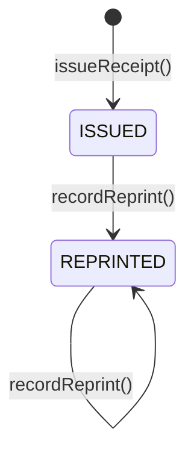

# 0117. Receipt Domain Boundary, Document Model, and Legal Proof-of-Purchase Invariants

- **Status**: Accepted
- **Date**: 2026-09-24
- **Deciders**: Principal Financial Domain Architect, Principal Software Architect, Staff Platform Engineer
- **Context**: Kinergy Platform Phase 7 (Sales & Payments — Milestone 7.7: Receipt Domain). Commercial transactions originate across clinical sessions, gym memberships, and consumable wellness inventory. Following Milestone 7.6 (Payment State Machine), the platform requires an authoritative definition of the `Receipt` domain model, its boundary, persistence strategy, relationship to `Sale` and `Payment`, legal immutability guarantees, snapshot mechanisms, and sequential numbering rules.
- **Consulted ADRs**:
  - [ADR-0108: Deterministic Financial Representation and Currency Modeling](0108-money-representation.md)
  - [ADR-0109: Payment Lifecycle, Multi-Tender Settlement, and Financial Immutability](0109-payment-lifecycle.md)
  - [ADR-0110: Sale Transaction Ownership and Source Bounded-Context Integrity](0110-sale-ownership.md)
  - [ADR-0111: Sales & Payments Authorization, Organization Isolation, and Audit Boundaries](0111-sales-payments-authorization-and-audit.md)
  - [ADR-0112: Sales & Payments Bounded Context Establishment](0112-sales-bounded-context.md)
  - [ADR-0114: Canonical Monetary Policy, Deterministic Arithmetic, and Sale Totals Invariant Enforcement](0114-canonical-monetary-policy-and-sale-totals.md)
  - [ADR-0115: Payment Domain Canonical Architecture, Aggregate Boundaries, and Tender Decoupling](0115-payment-domain-canonical-architecture.md)
  - [ADR-0116: Payment State Machine, Lifecycle Specification, and Financial Transition Determinism](0116-payment-state-machine-and-lifecycle-specification.md)

---

## 1. Context and Problem Statement

In Kinergy Platform Phase 7, commercial agreements are governed by the `Sale` aggregate, and monetary tenders are collected through the autonomous `Payment` aggregate. Once a customer's payment is settled, the business must provide customer-facing documentation confirming the transaction.

However, without explicit architectural boundaries, receipt generation frequently falls into standard architectural traps:

1. **The Second Source of Truth Anti-Pattern**: Allowing the receipt model to recalculate subtotals, re-evaluate discounts, or redefine payment states, leading to reconciliation drift between orders, bank tenders, and customer documents.
2. **The Dynamic Read-Time Join Trap**: Generating receipts on the fly by querying live customer, inventory, and membership tables. When a member changes their legal name, an inventory item SKU is updated, or a catalog price changes next month, past receipts retroactively mutate, violating legal and audit retention requirements.
3. **The Accidental Accounting Monolith**: Conflating customer receipt vouchers with general ledger double-entry bookkeeping, corporate tax accounting, fiscal hardware telemetry, or government e-invoicing.

We must formally define what a `Receipt` is, what it is NOT, its ownership, lifecycle, persistence, and snapshotting rules, while preserving the non-negotiable principle: **Sale is the commercial source of truth; Payment is the tender source of truth; Receipt is an immutable representation of the settled transaction.**

---

## 2. Decision Drivers

- **Legal Proof-of-Purchase Immutability**: Once issued, a customer receipt must remain permanently frozen against subsequent customer, product, or catalog modifications.
- **Single Source of Truth**: `Receipt` must never recalculate, override, or duplicate commercial totals, item pricing, or payment state machines.
- **Clear Bounded-Context Boundaries**: Prevent leaking general ledger accounting, tax accounting, or hardware fiscal protocols into the core Sales domain.
- **Audit Traceability & Tenant Isolation**: Monotonic, gap-free alphanumeric receipt numbering partitioned by tenant (`REC-YYYY-XXXXXX`).
- **Deterministic Reprint Behavior**: Reissuing or viewing an existing receipt must never create a duplicate entity; duplicate copies must be stamped as reprints.

---

## 3. Authoritative Architectural Specification (The 25 Core Invariants)

### 1. What a Receipt Represents

A `Receipt` is an **immutable, customer-facing legal proof-of-purchase voucher**. It documents and evidences an already-finalized and settled commercial transaction (`PAID` or `COMPLETED` Sale) with exact point-in-time customer attribution, itemized breakdown, and settled tender details.

### 2. What a Receipt Does NOT Represent

A `Receipt` is:

- **NOT** a financial source of truth (commercial truth resides in `Sale`; tender truth resides in `Payment`).
- **NOT** an invoice (an invoice is a commercial demand for payment; a receipt is proof that payment has already occurred).
- **NOT** an accounting ledger or sub-ledger.
- **NOT** a tax accounting or VAT reporting declaration entity.
- **NOT** a payment collection or payment gateway orchestration instrument.
- **NOT** a fiscal cash register hardware driver or e-invoicing transmission payload.

### 3. Receipt Ownership

`Receipt` is owned **exclusively by the Sales & Payments bounded context** (`packages/core/src/sales`).

### 4. Receipt Relationship to Sale

A `Receipt` couples to `Sale` via scalar identifier (`saleId: SaleId`). It represents the commercial agreement that achieved `PAID` status. The `Receipt` embeds frozen snapshots of the sale items, order discounts, and calculated totals.

### 5. Receipt Relationship to Payment

A `Receipt` couples to `Payment` via scalar identifier(s) and embedded payment snapshot(s). It documents the settled tender(s) collected for that sale. It does not alter payment lifecycle state.

### 6. Subdomain / Module Topology

`Receipt` is **NOT** an independent bounded context. It is an autonomous document entity / aggregate root residing within the **Sales & Payments bounded context** (`packages/core/src/sales`).

### 7. Persisted vs. Derived

`Receipt` is **PERSISTED**. It is stored as an immutable, append-only document record in the database. Dynamically deriving receipts on read via table joins is **strictly prohibited**, because future edits to customer profiles, product names, or membership terms would corrupt historical legal vouchers.

### 8. Existence Preconditions

A `Receipt` can exist **exclusively after the underlying `Sale` has achieved full financial settlement** (status `PAID` or `COMPLETED`).

### 9. Permitted Sale Lifecycle States for Receipt Existence

- **`DRAFT` Sales**: **PROHIBITED**. An unfinalized cart cannot issue a receipt.
- **`PENDING_PAYMENT` Sales**: **PROHIBITED**. Unsettled commercial orders cannot issue a receipt.
- **`PAID` Sales**: **PERMITTED & MANDATORY**. The official trigger for receipt issuance.
- **`COMPLETED` Sales**: **PERMITTED**. Represents a paid sale whose physical goods or services have been fulfilled.
- **`CANCELLED` Sales**: **PROHIBITED**. Voided or cancelled transactions cannot issue receipts.

### 10. Idempotency of Issuance

Receipt creation is **STRICTLY IDEMPOTENT**. The system enforces a unique constraint on `(tenantId, saleId)` for primary sales receipts. Repeated issuance requests for the same settled sale deterministically return the existing receipt record without creating duplicates.

### 11. Multiplicity: One Sale, One Primary Receipt

One `Sale` maps to **at most ONE primary `Receipt`**. If a customer requests a duplicate copy, the system executes a **reprint operation** on the existing receipt rather than generating a new receipt. _(Note: Compensating refunds in future phases issue a separate `CreditNote` or `RefundReceipt`)_.

### 12. Immutability After Issuance

A `Receipt` is **PERMANENTLY IMMUTABLE (write-once)** upon issuance. All commercial totals, itemized rows, customer details, and issuance timestamps can never be updated or deleted. The only allowed operational modification is incrementing the `reprintCount` and updating `lastReprintedAt`.

### 13. Historical Data Preservation

Historical data is preserved via **embedded point-in-time snapshots**. A receipt query never performs a runtime SQL `JOIN` to `clients`, `inventory_items`, or `membership_plans`. The receipt stands as a self-contained, tamper-proof historical record.

### 14. Snapshot Fields

The following fields are permanently frozen snapshots:

- `clientSnapshot`: Customer legal name, reference number, email, phone.
- `items`: Item descriptions, SKUs/codes, quantities, unit prices, discounts, line totals.
- `paymentSnapshot`: Tender method, payment status, settled amount, payment reference, and `paidAt`.
- `subtotal`, `discountTotal`, `total`: Canonical monetary amounts captured at checkout.

### 15. Reference Fields

The following fields are foreign references:

- `saleId`: Scalar identifier of the parent commercial transaction.
- `tenantId`: Multi-tenant boundary identifier.

### 16. Client Information Representation

Client information is captured as a dedicated, immutable Value Object: `ReceiptClientSnapshot` (`clientId`, `referenceNumber`, `fullName`, `email`, `phone`). Cross-context retrieval occurs solely via `ClientFacade` (`IClientFacade`) and `ClientSummaryDto` at the moment of issuance. Direct relational joins or foreign key navigation to the `Client` entity are prohibited. For anonymous/walk-in cash sales without a registered client, `clientSnapshot` is `null`.

### 17. Sale Items Representation

Sale items are captured as an immutable array of `ReceiptItemSnapshot` Value Objects (`itemId`, `sourceType`, `sourceId`, `description`, `skuOrCode`, `quantity`, `unitPrice: Money`, `discount: DiscountSnapshot | null`, `subtotal: Money`, `total: Money`).

### 18. Payment Information Representation

Payment information is captured as an immutable `ReceiptPaymentSnapshot` (or array for multi-tender): `paymentId`, `method: PaymentMethod`, `amount: Money`, `status: PaymentStatus`, `reference: string | null`, `paidAt: Date`.

### 19. Money Representation

All monetary values inside a `Receipt` are represented using the canonical Phase 7.4 [`Money`](file:///c:/Projects/kinergy-platform/packages/core/src/sales/domain/value-objects/money.vo.ts) Value Object. Amounts use integer minor units (cents), zero floating-point arithmetic drift, and strict ISO-4217 currency homogeneity.

### 20. Receipt Numbering and Sequence Strategy

Receipts receive a **monotonically increasing, gap-free alphanumeric receipt number** per tenant:

```text
REC-YYYY-XXXXXX (e.g. REC-2026-000421)
```

- The counter is strictly partitioned by `tenantId`.
- Receipt numbers are assigned atomically at issuance time and are never client-supplied.

### 21. Completed Payment Requirement

Receipt issuance **strictly requires completed/settled payment**. The sum of settled payment amounts associated with the sale must equal or exceed the total payable amount of the sale, transitioning the sale to `PAID`.

### 22. Multi-Payment Tender Handling

If a `Sale` is settled across multiple payments (e.g. split tender: $30 Cash + $20 QR), the `Receipt` captures all settled tenders in its `payments: ReceiptPaymentSnapshot[]` breakdown. The sum of settled payment amounts in the snapshot must match the receipt total.

### 23. Post-Issuance Payment Status Mutations

In accordance with ADR-0116, settled `Payment` records are terminal (`COMPLETED`) and permanently write-once. They cannot mutate to `FAILED` or `CANCELLED`. If a sale is refunded, the original receipt remains permanently frozen. A distinct compensating document (`CreditNote` / `RefundReceipt`) is issued.

### 24. Historical Snapshots vs. Regeneration

Receipts are **NEVER regenerated**. Customer reprint requests retrieve the frozen stored snapshot and render it stamped with a mandatory `DUPLICATE / REPRINT` watermark, incrementing the operational reprint counter and emitting an audit event.

### 25. Out-of-Scope Accounting Functionality

The following capabilities are **explicitly out of scope** and must NOT be introduced:

- General ledger (GL) double-entry bookkeeping.
- Tax accounting, VAT declaration engines, and tax reporting ledgers.
- Revenue recognition schedules (ASC 606 / IFRS 15).
- Fiscal printer hardware integrations (ESC/POS, serial protocols).
- Government fiscal authority e-invoicing integrations.
- Commercial invoice issuance (accounts receivable / credit billing).

---

## 4. Context Map and Architectural Boundaries

```
┌────────────────────────────────────────────────────────────────────────┐
│                      SALES & PAYMENTS BOUNDED CONTEXT                  │
│                                                                        │
│   ┌────────────────────┐                 ┌─────────────────────────┐   │
│   │   Sale Aggregate   │                 │    Payment Aggregate    │   │
│   │ (Commercial Truth) │                 │     (Settled Tender)    │   │
│   └─────────┬──────────┘                 └────────────┬────────────┘   │
│             │                                         │                │
│             │ references (scalar saleId)              │                │
│             ▼                                         ▼                │
│   ┌───────────────────────────────────────────────────────────────┐    │
│   │                       Receipt Document                        │    │
│   │                  (Legal Voucher & Proof)                      │    │
│   │  - id: ReceiptId                                              │    │
│   │  - receiptNumber: ReceiptNumber (REC-YYYY-XXXXXX)             │    │
│   │  - saleId: SaleId                                             │    │
│   │  - issuedAt: Date                                             │    │
│   │  - clientSnapshot: ReceiptClientSnapshot | null               │    │
│   │  - items: ReceiptItemSnapshot[]                               │    │
│   │  - subtotal, discountTotal, total: Money                      │    │
│   │  - payments: ReceiptPaymentSnapshot[]                         │    │
│   │  - status: ReceiptStatus (ISSUED | REPRINTED)                 │    │
│   │  - reprintCount: number                                       │    │
│   │  - lastReprintedAt: Date | null                               │    │
│   └───────────────────────────────────────────────────────────────┘    │
│                                   ▲                                    │
└───────────────────────────────────┼────────────────────────────────────┘
                                    │ consumes public DTO
                         ┌──────────┴──────────┐
                         │   modules/client    │
                         │    (ClientFacade)   │
                         └─────────────────────┘
```

---

## 5. Receipt Lifecycle State Machine



| Source State | Target State | Business Action   | Invariant / Validation Rule                                                                                                 |
| :----------- | :----------- | :---------------- | :-------------------------------------------------------------------------------------------------------------------------- |
| `[*]`        | `ISSUED`     | `issueReceipt()`  | Sale is in `PAID` status. Payments are fully settled. Monotonic receipt number assigned. All attributes permanently frozen. |
| `ISSUED`     | `REPRINTED`  | `recordReprint()` | Data unchanged. `reprintCount` incremented by 1. `lastReprintedAt` updated to current timestamp.                            |
| `REPRINTED`  | `REPRINTED`  | `recordReprint()` | Data unchanged. `reprintCount` incremented by 1. `lastReprintedAt` updated to current timestamp.                            |

---

## 6. Security and Authorization Permissions

Receipt operations reuse the platform's established permission framework:

- **`receipts.read`**: Read-only permission. Allows viewing and downloading customer receipt vouchers. Assigned to `Owner`, `Manager`, `Receptionist`, `Trainer`, and `Client` (own receipts).
- **`receipts.manage`**: Financially sensitive permission. Allows authorizing duplicate receipt reprints. Assigned to `Owner`, `Manager`, `Receptionist`.
- **Tenant Boundary**: Multi-tenant isolation is strictly enforced on every query and command via `tenantId`.

---

## 7. Consequences

### Positive

- **Guaranteed Legal Immutability**: Historical customer documents remain 100% frozen, immune to downstream product name or client profile modifications.
- **Clean Architecture & Decoupled Models**: Sales and Payment aggregates remain unburdened by customer presentation formatting or fiscal numbering rules.
- **Auditable Duplicates**: Clear distinction between original issuance and subsequent reprint operations.
- **No Accounting Bloat**: Core Sales context remains lightweight, focused strictly on checkout and tender settlement.

### Negative / Trade-offs

- **Storage Denormalization**: Storing snapshot text, descriptions, and customer contact data duplicates storage. This is an intentional and necessary trade-off for legal document immutability.
- **Sequence Coordination**: Generating monotonic, gap-free receipt numbers per tenant requires atomic database sequence management.
