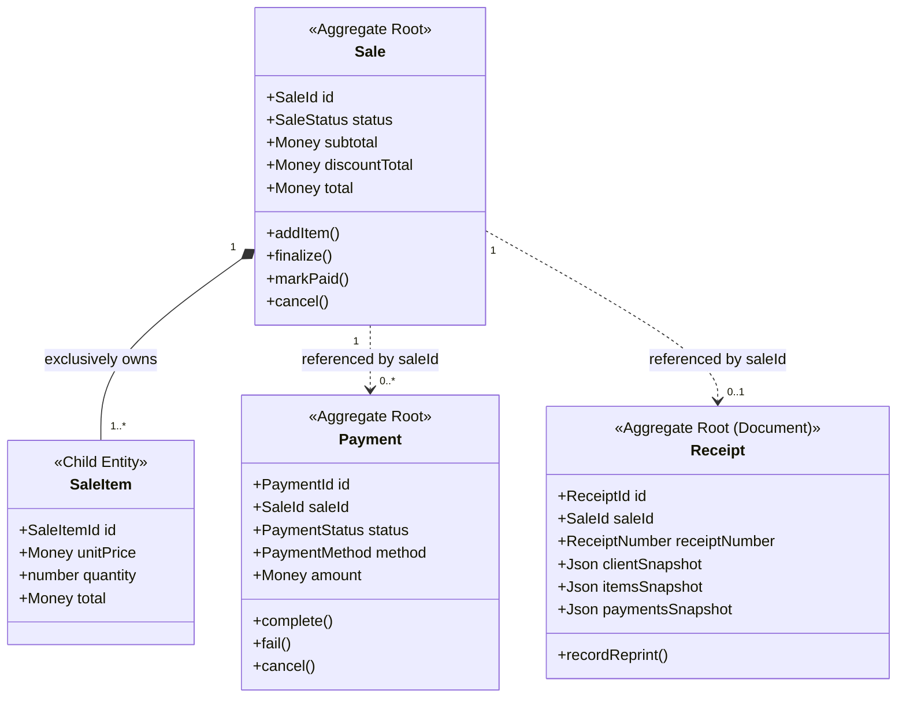

# 0119. Sale Aggregate Boundary, Invariants, and Commercial Transaction Integrity

- **Status**: Accepted
- **Date**: 2026-09-25
- **Deciders**: Principal Domain Architect, Principal Financial Domain Architect, Lead Platform Engineer
- **Context**: Kinergy Platform Phase 7 (Sales & Payments — Milestone 7.8: Sale Aggregate & Invariants). Following the implementation of canonical monetary policy (Milestone 7.4), multi-tender payments (Milestones 7.5 & 7.6), and legal proof-of-purchase receipts (Milestone 7.7), this decision establishes the definitive aggregate consistency boundary for `Sale`, formalizing commercial agreement ownership, child entity lifecycle rules, Optimistic Concurrency Control (OCC) guarantees, cross-aggregate coordination, and strict negative accounting boundaries.
- **Consulted ADRs**:
  - [ADR-0108: Deterministic Financial Representation and Currency Modeling](0108-money-representation.md)
  - [ADR-0109: Payment Lifecycle, Multi-Tender Settlement, and Financial Immutability](0109-payment-lifecycle.md)
  - [ADR-0110: Sale Transaction Ownership and Source Bounded-Context Integrity](0110-sale-ownership.md)
  - [ADR-0111: Sales & Payments Authorization, Organization Isolation, and Audit Boundaries](0111-sales-payments-authorization-and-audit.md)
  - [ADR-0112: Sales & Payments Bounded Context Establishment](0112-sales-bounded-context.md)
  - [ADR-0113: Item-Level Discount Domain Model, Deterministic Calculation, and Invariant Enforcement](0113-item-level-discounts.md)
  - [ADR-0114: Canonical Monetary Policy, Deterministic Arithmetic, and Sale Totals Invariant Enforcement](0114-canonical-monetary-policy-and-sale-totals.md)
  - [ADR-0115: Payment Domain Canonical Architecture, Aggregate Boundaries, and Tender Decoupling](0115-payment-domain-canonical-architecture.md)
  - [ADR-0116: Payment State Machine, Lifecycle Specification, and Financial Transition Determinism](0116-payment-state-machine-and-lifecycle-specification.md)
  - [ADR-0117: Receipt Domain Boundary, Document Model, and Legal Proof-of-Purchase Invariants](0117-receipt-domain-boundary-and-document-model.md)
  - [ADR-0118: Sale Reference and Receipt Identification Strategy](0118-sale-reference-and-receipt-identification-strategy.md)

---

## 1. Context and Problem Statement

In the Kinergy Platform, commercial checkout sessions originate across gym memberships, clinical physiotherapy treatment sessions, and retail consumable supplies. The `Sale` aggregate root is the authoritative commercial agreement establishing what products or services a client is purchasing, at what agreed unit prices, with what applied promotional discounts, and the resulting payable debt obligation.

Previous milestones established specific parts of the commercial pipeline:

- `Money` and `Discount` Value Objects (ADR-0108, ADR-0113, ADR-0114).
- Autonomous `Payment` aggregate and state machine (ADR-0115, ADR-0116).
- Autonomous `Receipt` legal proof-of-purchase document model (ADR-0117, ADR-0118).

However, an exhaustive architectural audit of the Phase 7 codebase revealed specific boundary risks and consistency gaps:

1. **Cart Mutation Concurrency & Persistence Drift**: While status transitions (`finalize`, `markPaid`, `cancel`) incremented aggregate `_version`, cart mutations during the active `DRAFT` checkout session (`addItem`, `updateItemQuantity`, `applyItemDiscount`, `removeItem`) did not increment `_version`. In the persistence layer, this caused optimistic locking collisions to go undetected and multi-step cart creation to risk dropping newly added child items.
2. **Hexagonal Port Inversion Leak**: Application use cases were directly importing persistence repository interfaces from the infrastructure layer rather than adhering to application port abstractions.
3. **Ambiguity Over Boundary Ownership**: Without an explicit ADR codifying the exact boundary of `Sale`, risk exists that `Sale` might inadvertently absorb payment gateway state, receipt document formatting, or general ledger accounting obligations.

We must formally establish the authoritative `Sale` Aggregate boundary, define its invariant ownership, codify its exact lifecycle rules, specify cross-aggregate coordination mechanisms, and enforce strict architectural negative boundaries.

---

## 2. Decision Drivers

- **Domain Integrity & DDD Purity**: `Sale` is the sole consistency boundary for commercial purchase agreements. Child items and discounts must have zero lifecycle outside `Sale`.
- **Zero Floating-Point Financial Drift**: All monetary operations must execute via the canonical `Money` Value Object in integer minor units (cents) using Commercial Half-Up rounding.
- **Strict Progressive Immutability**: Commercial terms are editable _only_ while in `DRAFT` status. Once finalized (`PENDING_PAYMENT`), items, prices, discounts, and totals are permanently frozen.
- **Optimistic Concurrency Control (OCC)**: Every state or data mutation—including adding, editing, or removing cart line items—must increment the aggregate `_version` to prevent concurrent cashier overwrites.
- **Clear Aggregate Separation**:
  - `Sale` owns the commercial agreement and payable balance.
  - `Payment` owns tender collection and payment gateway lifecycle.
  - `Receipt` owns customer-facing historical proof-of-purchase document representation.
- **Explicit Negative Boundaries**: Prevent the "Accidental Accounting Monolith" by strictly forbidding general ledger accounts, tax filing rules, fiscal cash register drivers, and revenue recognition inside `Sale`.

---

## 3. The 25 Authoritative Architectural Dimensions

### 1. Sale as the Aggregate Root

`Sale` is the **Aggregate Root** and transactional consistency boundary for a commercial checkout session. External modules, controllers, and application use cases must never manipulate child line items (`SaleItem`) directly; all interactions must pass through the `Sale` aggregate root methods.

### 2. SaleItem Ownership by Sale

`SaleItem` is a child entity exclusively owned and governed by `Sale`. It has **no standalone repository**, no global HTTP endpoint, and no independent lifecycle. A `SaleItem` cannot exist without its parent `Sale`.

### 3. Discount Ownership by Sale

Discounts exist in two scopes within the `Sale` aggregate:

- **Line-Item Discount**: Embedded inside a `SaleItem`, reducing that specific item's gross subtotal.
- **Order-Level Discount**: Attached directly to `Sale`, reducing the net pre-order discount subtotal across all line items.
  In both cases, discounts are immutable Value Objects (`Discount`) evaluated strictly by `Sale` during totals calculation.

### 4. Financial State Ownership

`Sale` is the **sole authoritative owner of commercial financial state**:

- `subtotal`: Gross sum of all line item subtotals.
- `discountTotal`: Cumulative sum of line discounts plus order discount.
- `total`: Net payable obligation ($\max(0, \text{subtotal} - \text{discountTotal})$).
  Neither `Payment` nor `Receipt` can recalculate, adjust, or override these commercial totals.

### 5. Sale Lifecycle Ownership

`Sale` owns its commercial lifecycle state machine:
$$\text{DRAFT} \longrightarrow \text{PENDING\_PAYMENT} \longrightarrow \text{PARTIALLY\_PAID} \longrightarrow \text{PAID} \longrightarrow \text{COMPLETED}$$
With terminal cancellation available from pre-settlement states:
$$\{\text{DRAFT}, \text{PENDING\_PAYMENT}, \text{PARTIALLY\_PAID}\} \xrightarrow{\text{cancel(reason)}} \text{CANCELLED}$$
And full compensating refund available from settled states:
$$\{\text{PAID}, \text{COMPLETED}\} \xrightarrow{\text{markRefunded(reason)}} \text{REFUNDED}$$

### 6. Invariants That Must Hold Inside Sale

1. **Non-Negative Total Invariant**: $\text{total.cents} \ge 0$.
2. **Single Currency Homogeneity**: `Sale.currency === item.unitPrice.currency === total.currency`. Mixed currencies within a checkout session are strictly rejected.
3. **Deterministic Totals Reconciliation**: Persisted totals must exactly match the sum of item lines according to the 13 canonical formulas (ADR-0114).
4. **Draft Immutability Lock**: Modifying items, quantities, or discounts outside `DRAFT` status is strictly prohibited (`SaleAlreadyFinalizedException`).
5. **Commercial Non-Emptiness**: A sale cannot transition out of `DRAFT` with zero items (`EmptySaleException`).
6. **Cancellation Audit Invariant**: A sale cannot be cancelled without an explicit, non-empty cancellation reason.

### 7. Invariants That Belong Exclusively to Payment

- Validation of payment methods (`CASH`, `QR`, card/gateway).
- Payment lifecycle states (`PENDING`, `COMPLETED` / `SETTLED`, `FAILED`, `CANCELLED`).
- Gateway authorization codes, idempotency references, and cashier cash drawer tags.
- Verification that payment tender amount is strictly positive ($> 0.00$).

### 8. Invariants That Belong Exclusively to Receipt

- Legal proof-of-purchase document snapshotting (freezing customer name, SKU descriptions, and tender details into JSONB).
- Monotonic, gap-free alphanumeric sequential numbering (`REC-YYYY-NNNNNN`) partitioned by tenant.
- Duplicate copy watermarking and reprint audit counting (`reprintCount`, `lastReprintedAt`).

### 9. Permitted Operations on Sale

| Method                      | Permitted Status                             | Effect                                                                                         |
| :-------------------------- | :------------------------------------------- | :--------------------------------------------------------------------------------------------- |
| `addItem(props)`            | `DRAFT` only                                 | Appends line item, recalculates totals, increments `_version++`                                |
| `updateItemQuantity(id, q)` | `DRAFT` only                                 | Updates quantity, recalculates totals, increments `_version++`                                 |
| `applyItemDiscount(id, d)`  | `DRAFT` only                                 | Applies item discount, recalculates totals, increments `_version++`                            |
| `removeItemDiscount(id)`    | `DRAFT` only                                 | Removes item discount, recalculates totals, increments `_version++`                            |
| `removeItem(id)`            | `DRAFT` only                                 | Removes line item, recalculates totals, increments `_version++`                                |
| `applyOrderDiscount(d)`     | `DRAFT` only                                 | Sets order discount, recalculates totals, increments `_version++`                              |
| `removeOrderDiscount()`     | `DRAFT` only                                 | Clears order discount, recalculates totals, increments `_version++`                            |
| `finalize()`                | `DRAFT` only ($\ge 1$ item)                  | Transitions to `PENDING_PAYMENT`, locks terms, increments `_version++`                         |
| `markPartiallyPaid()`       | `PENDING_PAYMENT` only                       | Transitions to `PARTIALLY_PAID`, increments `_version++`                                       |
| `markPaid()`                | `PENDING_PAYMENT` or `PARTIALLY_PAID`        | Transitions to `PAID`, increments `_version++`                                                 |
| `markCompleted()`           | `PAID` only                                  | Sets `completedAt`, transitions to `COMPLETED`, increments `_version++`                        |
| `markRefunded(reason?)`     | `PAID` or `COMPLETED`                        | Sets `refundedAt`, transitions to `REFUNDED`, increments `_version++`                          |
| `cancel(reason)`            | `DRAFT`, `PENDING_PAYMENT`, `PARTIALLY_PAID` | Sets `cancelledAt` & `cancellationReason`, transitions to `CANCELLED`, increments `_version++` |

### 10. Fields Immutable After Construction

The following fields are permanently write-once and can **never** change after initial construction:

- `id` (`SaleId`)
- `tenantId` (multi-tenant boundary)
- `currency` (ISO-4217 code)
- `source` (`SourceReference` initiating the checkout)
- `createdAt` (UTC creation timestamp)

### 11. Fields That Can Change Through Domain Methods

The following fields are strictly controlled and modified solely through aggregate domain methods:

- `items`: modified via `addItem()`, `updateItemQuantity()`, `removeItem()`
- `orderDiscount`: modified via `applyOrderDiscount()`, `removeOrderDiscount()`
- `subtotal`, `discountTotal`, `total`: updated automatically via `recalculateTotals()`
- `status`: transitioned via `finalize()`, `markPaid()`, `cancel()`, etc.
- `completedAt`, `cancelledAt`, `cancellationReason`, `refundedAt`: set on corresponding terminal transitions
- `version`: incremented on **every** mutation
- `updatedAt`: refreshed on every mutation

### 12. Fields That Cannot Be Directly Mutated

**Direct property assignment or public setters are strictly forbidden**:

- No `sale.status = ...`
- No `sale.total = ...`
- No `sale.subtotal = ...`
- No `sale.items.push(...)`
  All properties are private (`private readonly` or `private`). Getters return defensive copies or readonly structures (`Object.freeze([...this._items])`).

### 13. How Sale Totals Are Calculated

Totals are calculated according to the **13 canonical formulas** codified in ADR-0114:

1. $\text{itemSubtotal} = \text{round}(\text{unitPrice} \times \text{quantity})$ in integer cents.
2. $\text{itemDiscount} = \text{discount.calculateReduction}(\text{itemSubtotal})$.
3. $\text{itemTotal} = \text{itemSubtotal} - \text{itemDiscount}$.
4. $\text{subtotal} = \sum \text{itemSubtotal}$.
5. $\text{lineDiscounts} = \sum \text{itemDiscount}$.
6. $\text{netPreOrderDisc} = \text{subtotal} - \text{lineDiscounts}$.
7. $\text{orderDiscountAmount} = \text{orderDiscount.calculateReduction}(\text{netPreOrderDisc})$.
8. $\text{discountTotal} = \text{lineDiscounts} + \text{orderDiscountAmount}$.
9. $\text{total} = \max(0, \text{subtotal} - \text{discountTotal})$.

### 14. When Totals Are Recalculated

Totals are recalculated **immediately and synchronously inside the aggregate** whenever:

- An item is added (`addItem`).
- An item quantity changes (`updateItemQuantity`).
- An item discount is added or removed (`applyItemDiscount`, `removeItemDiscount`).
- An item is removed (`removeItem`).
- An order discount is added or removed (`applyOrderDiscount`, `removeOrderDiscount`).
  Totals are **never recalculated on read queries**, eliminating dynamic query drift.

### 15. How Currency Is Validated

Currency validation is enforced at three distinct layers:

1. **Transport Layer**: DTO matches regex `^[A-Z]{3}$`.
2. **Aggregate Creation**: `Sale.create()` asserts valid 3-letter ISO-4217 code.
3. **Item Addition**: `Sale.addItem()` verifies `props.unitPrice.currency === this._currency`. Any item presenting a different currency is rejected with `InvalidSaleStateException`.

### 16. How Sale Status Transitions Work

State transitions are guarded by explicit transition preconditions:

- An invalid transition (e.g. `DRAFT` $\rightarrow$ `PAID` without finalization) immediately throws `InvalidSaleTransitionException`.
- Status transitions emit typed domain events (`SaleFinalizedEvent`, `SalePaidEvent`, `SaleCancelledEvent`, etc.) for asynchronous downstream notification.

### 17. How Payment Affects Sale Status

`Payment` does **not** directly mutate `Sale`.
Cross-aggregate coordination is managed by the application layer:

1. Client submits payment tender $\rightarrow$ `RecordPaymentHandler` or `CompletePaymentHandler`.
2. Payment aggregate validates tender and transitions to `COMPLETED`.
3. Application handler queries all completed payments for the `saleId`.
4. Handler sums settled payments in integer cents:
   - If $\sum \text{payments.cents} \ge \text{sale.total.cents}$, handler invokes `sale.markPaid(clock)`.
   - If $0 < \sum \text{payments.cents} < \text{sale.total.cents}$ and sale is `PENDING_PAYMENT`, handler invokes `sale.markPartiallyPaid(clock)`.
5. Handler atomically persists both aggregates within the transaction unit of work.

### 18. How Cancellation Works

- Permitted only from non-terminal pre-settlement states: `DRAFT`, `PENDING_PAYMENT`, `PARTIALLY_PAID`.
- Requires a mandatory, non-empty `cancellationReason`.
- Sets `cancelledAt` timestamp.
- Transitions status to `CANCELLED`.
- Emits `SaleCancelledEvent`.
- Once cancelled, the sale is in a **permanent terminal state**.

### 19. How Item Ownership Is Enforced

- `SaleItem` instances have a `saleId` referencing their parent `Sale`.
- When added via `sale.addItem()`, `Sale` instantiates `SaleItem.create({ ...props, saleId: this._id })`.
- During reconstitution, `Sale.reconstitute()` asserts that every item in `props.items` has `item.saleId.equals(this._id)`. Any foreign item throws `InvalidSaleStateException`.

### 20. Whether a Sale Can Ever Have Zero Items

- **In `DRAFT` status**: **YES**. A sale starts in `DRAFT` as an empty checkout session (`items: []`) with zero totals (`$0.00`). Items are subsequently added during cashier ringing.
- **In finalized or settled status (`PENDING_PAYMENT`, `PAID`, `COMPLETED`)**: **NO**. Transitioning out of `DRAFT` requires $\ge 1$ line item. `Sale.finalize()` strictly throws `EmptySaleException` if `items.length === 0`.

### 21. Whether a Sale Can Be PAID Without Payment

**NO**. Under domain and application invariants:

- A sale cannot transition to `PAID` without verified settled tenders covering the payable total.
- The application handler verifies that $\sum \text{payments.cents} \ge \text{sale.total.cents}$ before invoking `sale.markPaid()`.
- (For promotional $0.00 totals where discounts equal 100%, a zero-dollar system settlement tender is recorded or explicit zero-balance settlement is confirmed).

### 22. Whether a Cancelled Sale Can Be Modified

**NO**. A cancelled sale is in an irreversible terminal state:

- `assertDraftState()` immediately blocks item or discount modifications (`SaleAlreadyFinalizedException`).
- All state transition methods (`finalize`, `markPaid`, `markCompleted`, `markRefunded`, `cancel`) reject transitions from `CANCELLED` (`InvalidSaleTransitionException`).

### 23. Whether a Sale Can Be Reused for Another Transaction

**NO**. A `Sale` instance represents **one and only one commercial transaction agreement**.

- It cannot be reset to `DRAFT`.
- It cannot be repurposed for a subsequent order.
- When a customer initiates a new checkout, a new `Sale` aggregate root with a distinct `SaleId` must be instantiated.

### 24. How Exactly One Sale Represents One Commercial Transaction

- `SaleId` is a globally unique UUID.
- `SourceReference` records the origin checkout trigger (e.g. POS terminal, appointment checkout, web order).
- PostgreSQL persistence maps one row in `sales` per transaction.
- Receipts bind 1-to-1 via composite unique database constraint `@@unique([tenantId, saleId])`.

### 25. How Persistence Must Respect the Aggregate Boundary

1. **Repository Scope**: `SaleRepositoryPort` is the sole persistence port for the aggregate. There is **no `SaleItemRepository`**.
2. **Atomic Aggregate Persistence**: `save(sale)` must persist the `Sale` header and all child `SaleItem` records in a **single database transaction**.
3. **Full Line-Item Synchronization**: On _every_ save (whether initial insert or subsequent update), child line items must be atomically synchronized with the database (deleted items removed, new items inserted, updated items saved).
4. **Optimistic Concurrency Control (OCC)**: Every save where `version > 1` must verify `WHERE id = :id AND version = :priorVersion`. If zero rows are matched, throws `SaleOptimisticLockException`.
5. **Decoupled Architecture**: Application handlers must import `SaleRepositoryPort` from `application/ports/`, never from infrastructure.

---

## 4. Architectural Separation: Sale vs. Payment vs. Receipt

| Responsibility Dimension | `Sale` Aggregate                                       | `Payment` Aggregate                            | `Receipt` Aggregate                      |
| :----------------------- | :----------------------------------------------------- | :--------------------------------------------- | :--------------------------------------- |
| **Domain Role**          | Commercial purchase agreement                          | Financial tender collection                    | Proof-of-purchase customer voucher       |
| **Financial Nature**     | Debt obligation establishment                          | Debt obligation settlement                     | Historical document representation       |
| **Mutations in Draft**   | Items, quantities, discounts                           | Not applicable (tender is atomic)              | Not applicable (issued after settlement) |
| **State Machine**        | `DRAFT` $\rightarrow$ `PAID` $\rightarrow$ `COMPLETED` | `PENDING` $\rightarrow$ `COMPLETED` / `FAILED` | `ISSUED` $\rightarrow$ `REPRINTED`       |
| **Historical Snapshots** | Catalog terms at checkout                              | Payment gateway auth reference                 | Full customer, items & payments JSONB    |
| **Multiplicity**         | 1 per transaction                                      | 1 to $N$ per sale (split tender)               | At most 1 primary per sale               |
| **Database Table**       | `sales` + `sale_items`                                 | `payments`                                     | `receipts` + `receipt_sequences`         |

---

## 5. Explicit Negative Boundaries (What Sale Is NOT)

To protect the platform against the "Accidental Accounting Monolith" anti-pattern, the `Sale` aggregate explicitly excludes:

1. **General Ledger (GL) Bookkeeping**: `Sale` does not record debits, credits, account charts, or journal entries.
2. **Corporate Tax Accounting**: `Sale` captures agreed gross commercial prices and discounts; tax agency reporting, VAT ledgers, and withholding rules belong to external accounting modules.
3. **Revenue Recognition**: `Sale` represents the commercial contract; deferred revenue amortization or accrual schedules belong to financial finance services.
4. **Fiscal Hardware Telemetry**: `Sale` contains zero ESC/POS printer codes, fiscal memory chip protocols, or tax authority XML envelopes.
5. **Invoicing / Accounts Receivable**: `Sale` is a point-of-sale agreement; credit terms (Net 30/60), dunning lifecycles, and debt collection belong to billing domains.

---

## 6. Consequences

### Positive

- **Guaranteed Consistency**: Child line items and discounts cannot bypass the `Sale` aggregate root.
- **Race Condition Immunity**: Incrementing `_version` on all cart mutations ensures cashiers cannot silently overwrite each other's additions or removals.
- **Persistence Integrity**: Atomic line-item synchronization in `PrismaSaleRepository` ensures database rows match domain state 1-to-1 without dropped items.
- **Hexagonal Architecture Compliance**: Application use cases depend solely on `SaleRepositoryPort`, decoupling application logic from ORM implementation details.
- **Clear Separation of Concerns**: Developers have unambiguous rules regarding where commercial debt (`Sale`), money collection (`Payment`), and customer vouchers (`Receipt`) reside.

### Negative / Trade-Offs

- **OCC Retries in UI**: Concurrent cart edits will throw `409 Conflict`, requiring frontend clients to reload the sale and re-apply draft adjustments.
- **Persistence Transaction Overhead**: Synchronizing line items during multi-item draft updates requires transactional diffing (`deleteMany` + `upsert`) in PostgreSQL.
