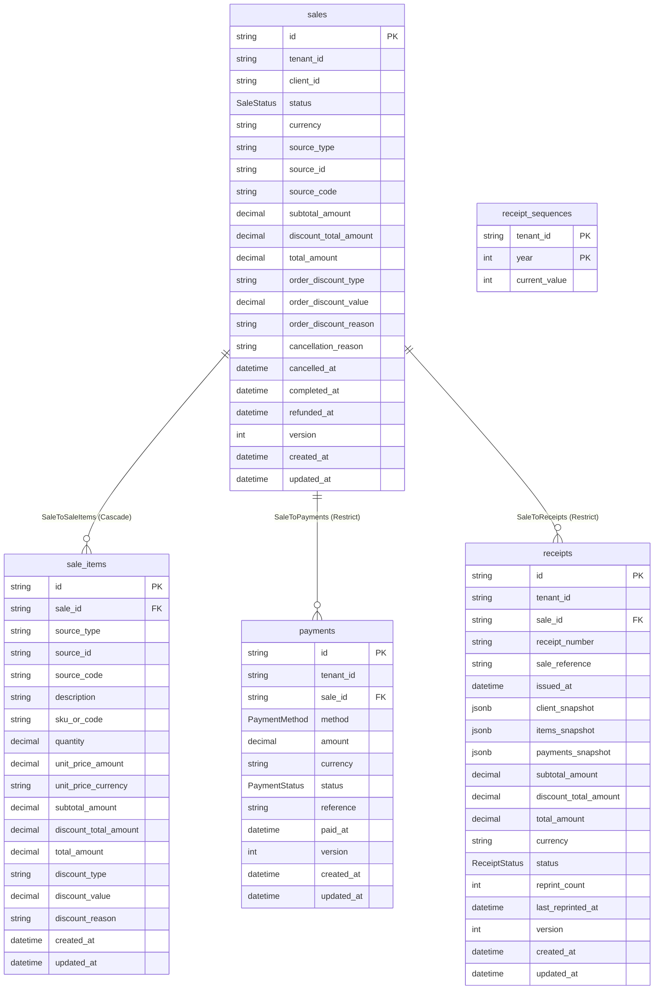
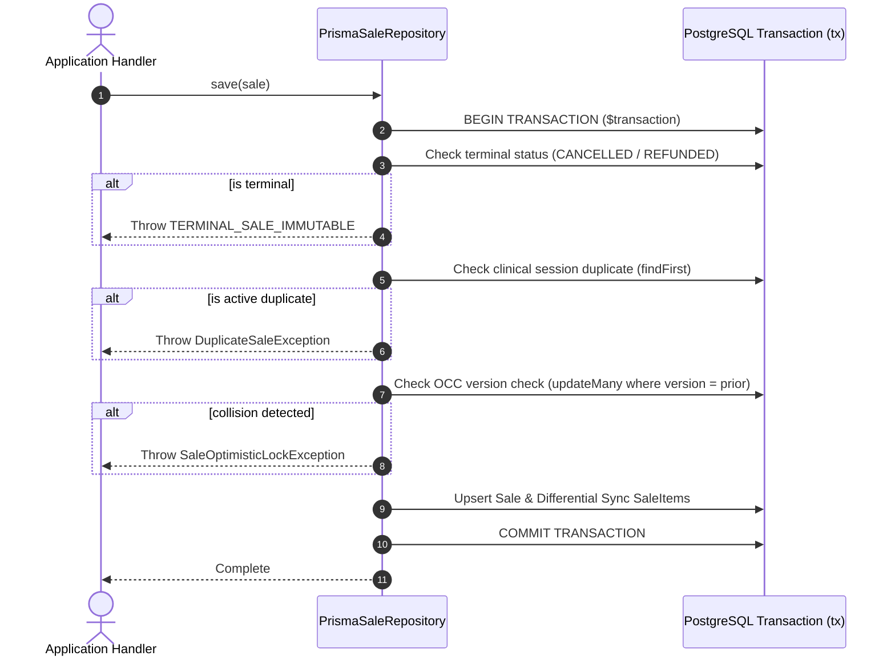

# 0122. Phase 7 Financial Persistence Architecture and Hardening

- **Status**: Accepted
- **Date**: 2026-10-01
- **Deciders**: Principal Database Architect, Principal Domain Architect, Senior Financial Systems Engineer
- **Context**: Kinergy Platform Phase 7 (Sales & Payments — Milestone 7.10: Prisma Persistence Hardening). Following the completion of the core domain, aggregate roots, monetary policy, payment lifecycle, legal receipts, and commercial origin references (Milestones 7.1 through 7.9), we must formally codify the authoritative persistence architecture for the entire Phase 7 financial model in PostgreSQL via Prisma ORM.
- **Consulted ADRs**:
  - [ADR-0021: Transactional Consistency & Unit of Work Pattern](0021-transactional-consistency-unit-of-work.md)
  - [ADR-0108: Deterministic Financial Representation and Currency Modeling](0108-money-representation.md)
  - [ADR-0110: Sale Transaction Ownership and Source Bounded-Context Integrity](0110-sale-ownership.md)
  - [ADR-0112: Sales & Payments Bounded Context Establishment](0112-sales-bounded-context.md)
  - [ADR-0114: Canonical Monetary Policy and Deterministic Sale Totals](0114-canonical-monetary-policy-and-sale-totals.md)
  - [ADR-0115: Payment Domain Canonical Architecture](0115-payment-domain-canonical-architecture.md)
  - [ADR-0116: Payment State Machine and Lifecycle Specification](0116-payment-state-machine-and-lifecycle-specification.md)
  - [ADR-0117: Receipt Domain Boundary, Document Model, and Legal Proof-of-Purchase Invariants](0117-receipt-domain-boundary-and-document-model.md)
  - [ADR-0118: Sale Reference and Receipt Identification Strategy](0118-sale-reference-and-receipt-identification-strategy.md)
  - [ADR-0119: Sale Aggregate Boundary, Invariants, and Commercial Transaction Integrity](0119-sale-aggregate-boundary-and-invariants.md)
  - [ADR-0120: Commercial Transaction Uniqueness, Idempotency, and Exactly-One-Sale Invariant](0120-commercial-transaction-uniqueness-and-sale-idempotency.md)
  - [ADR-0121: Sale Source References and Commercial Origin Model](0121-sale-source-references-and-commercial-origin-model.md)

---

## 1. Context and Problem Statement

Financial persistence demands strict, auditable, and immutable guarantees. Commercial transactions, line item snapshotting, discount distributions, payment settlements, and legal proof-of-purchase receipts must be stored in a relational database without rounding drift, data corruption, orphan records, or accidental deletion.

Furthermore, under **Clean Architecture** and **Domain-Driven Design (DDD)**:

1. The relational database schema must **never redefine or usurp domain ownership**.
2. Aggregate boundaries must be preserved in SQL storage patterns.
3. Database structural invariants must enforce what the relational engine excels at (referential integrity, foreign keys, physical nullability, unique indexes, and exact numeric precision).
4. Complex state transitions, arithmetic rules, progressive immutability, and cross-aggregate orchestration must remain the sole responsibility of the **pure domain core and application layer**.

We must establish the comprehensive persistence architecture for all Phase 7 entities: `Sale`, `SaleItem`, `Discount`, `Payment`, `Receipt`, `ReceiptSequence`, and `SaleSource`.

---

## 2. Decision Drivers

- **Zero Floating-Point Drift (ADR-0108)**: Exact PostgreSQL `DECIMAL(12, 2)` columns matching integer-cent domain `Money`.
- **References Over Ownership (ADR-0110)**: Strict isolation from upstream source domain tables (`clients`, `treatment_sessions`, `memberships`, `inventory_items`, `rooms`). Zero cross-context relational foreign keys.
- **Aggregate Boundary Preservation**: `Sale`, `Payment`, and `Receipt` are autonomous aggregate roots. Prisma schema must not merge their storage or create leaky navigation properties in repositories.
- **Append-Only Financial Integrity**: Financial ledgers and vouchers are write-once. Hard deletion via SQL `DELETE` is prohibited in production repositories.
- **High Concurrency & Determinism**: ACID transactional boundaries with Optimistic Concurrency Control (`version`) and serializable collision checks without distributed locks.
- **No Speculative Abstractions**: Only persist approved entities and value objects required by existing domain milestones.

---

## 3. Database Structural Invariants vs. Domain Behavioral Invariants

A fundamental architectural principle of Kinergy is the strict delineation between what the database enforces and what the domain layer enforces:

```
┌────────────────────────────────────────────────────────────────────────┐
│                   INVARIANT RESPONSIBILITY DIVISION                    │
├───────────────────────────────────┬────────────────────────────────────┤
│   DATABASE STRUCTURAL INVARIANTS  │     DOMAIN BEHAVIORAL INVARIANTS   │
├───────────────────────────────────┼────────────────────────────────────┤
│ • Primary keys & UUID generation  │ • 7-state commercial lifecycle     │
│ • Foreign key referential integrity│ • Payment state machine rules      │
│ • Physical column nullability     │ • Cent-guarded integer arithmetic  │
│ • Column data types & precision   │ • Progressive immutability rules   │
│   (DECIMAL 12,2; VARCHAR 3)       │ • Operational single-billing logic │
│ • Composite unique constraints    │ • Idempotent retry reconciliation  │
│ • Non-blocking query indexes      │ • Receipt settlement preconditions │
│ • ON DELETE CASCADE / RESTRICT    │ • Cross-aggregate orchestration    │
└───────────────────────────────────┴────────────────────────────────────┘
```

The database engine is **not** responsible for enforcing business rules such as whether a sale total equals subtotal minus discounts, or whether a payment status may transition from `PENDING` to `COMPLETED`. Attempting to encode the entire domain model into PostgreSQL triggers or stored procedures is **explicitly rejected**.

---

## 4. Entity Persistence Specifications



### 4.1 Sale Model (`sales`)

- **Purpose**: Persists the commercial agreement, totals, commercial lifecycle, and origin.
- **Aggregate Ownership**: Aggregate Root.
- **Primary Key**: `id String @id @default(uuid())` (PostgreSQL `TEXT`).
- **Foreign Keys**:
  - Outgoing: None (cross-context `clientId` is an unconstrained scalar pointer).
  - Incoming: Referenced by `sale_items.sale_id` (`Cascade`), `payments.sale_id` (`Restrict`), and `receipts.sale_id` (`Restrict`).
- **Nullable Fields**: `clientId`, `sourceCode`, `orderDiscountType`, `orderDiscountValue`, `orderDiscountReason`, `cancellationReason`, `cancelledAt`, `completedAt`, `refundedAt`. `tenantId` is currently `String?` (hardened in Milestone 7.10 to enforce multi-tenancy).
- **Immutable Fields**: `id`, `currency`, `sourceType`, `sourceId`, `createdAt`. Once out of `DRAFT`, `subtotalAmount`, `discountTotalAmount`, `totalAmount`, and order discount fields become immutable.
- **Money Representation**: `subtotalAmount`, `discountTotalAmount`, `totalAmount` stored as `Decimal @db.Decimal(12, 2)`.
- **Enum Representation**: `status: SaleStatus` (`DRAFT`, `PENDING_PAYMENT`, `PARTIALLY_PAID`, `PAID`, `COMPLETED`, `CANCELLED`, `REFUNDED`).
- **Timestamps**: `createdAt` (`DateTime @default(now())`), `updatedAt` (`DateTime @updatedAt`), `cancelledAt`, `completedAt`, `refundedAt`.
- **Indexes**:
  - `@@index([tenantId])`
  - `@@index([clientId])`
  - `@@index([status])`
  - `@@index([createdAt(sort: Desc)])`
  - `@@index([tenantId, sourceType, sourceId])`
  - `@@index([sourceType, sourceId])`
  - `@@index([tenantId, status, createdAt(sort: Desc)])` (compound cashier queue optimization).
- **Unique Constraints**: None on source reference (ADR-0121). Primary key uniqueness on `id`.
- **Delete Behavior**: Hard deletion via SQL `DELETE` is prohibited in production repositories. Cancellations transition status to `CANCELLED`.
- **Update Behavior**: In `DRAFT`, full updates and item synchronization are permitted. At version $> 1$, atomic Optimistic Concurrency Control checks `version = priorVersion`. Updates to `CANCELLED` or `REFUNDED` records are permanently rejected (`TERMINAL_SALE_IMMUTABLE`).

### 4.2 SaleItem Model (`sale_items`)

- **Purpose**: Persists individual commercial line items, quantities, snapshotted unit prices, and line discounts.
- **Aggregate Ownership**: Subordinate internal Entity owned exclusively by `Sale`.
- **Primary Key**: `id String @id @default(uuid())` (PostgreSQL `TEXT`).
- **Foreign Keys**: `saleId` referencing `sales(id)` with `onDelete: Cascade`.
- **Nullable Fields**: `sourceCode`, `skuOrCode`, `discountType`, `discountValue`, `discountReason`.
- **Immutable Fields**: `id`, `saleId`, `sourceType`, `sourceId`, `createdAt`. Once parent sale leaves `DRAFT`, all pricing and quantity fields are frozen snapshots.
- **Money Representation**: `unitPriceAmount`, `subtotalAmount`, `discountTotalAmount`, `totalAmount` stored as `Decimal @db.Decimal(12, 2)`.
- **Quantity Representation**: `quantity` stored as `Decimal @db.Decimal(10, 3)` (supports fractional weights).
- **Enum Representation**: None directly in table; `sourceType` and `discountType` stored as strings.
- **Timestamps**: `createdAt` (`DateTime @default(now())`), `updatedAt` (`DateTime @updatedAt`).
- **Indexes**:
  - `@@index([saleId])`
  - `@@index([skuOrCode])`
  - `@@index([sourceType, sourceId])`
- **Unique Constraints**: None.
- **Delete Behavior**: Cascades automatically when parent `Sale` is deleted. During draft modifications, items removed from the aggregate are deleted via transactional differential sync.
- **Update Behavior**: Upserted atomically during parent `Sale.save()`.

### 4.3 Discount Representation (Embedded Value Object)

- **Purpose**: Captures monetary reductions applied to the overall agreement or individual lines.
- **Aggregate Ownership**: Value Object owned by `Sale` (order discount) and `SaleItem` (line discount).
- **Persistence Decision**: **Flattened Columns (No Separate Table)**.
  - A separate `discounts` table was evaluated and **rejected**: `Discount` is a pure Value Object with no lifecycle or identity independent of the line or order.
  - On `sales`: `order_discount_type` (`TEXT`), `order_discount_value` (`DECIMAL(10, 2)`), `order_discount_reason` (`TEXT`).
  - On `sale_items`: `discount_type` (`TEXT`), `discount_value` (`DECIMAL(10, 2)`), `discount_reason` (`TEXT`).

### 4.4 Payment Model (`payments`)

- **Purpose**: Persists autonomous monetary tenders, payment methods, gateway references, and settlement timestamps.
- **Aggregate Ownership**: Autonomous Aggregate Root (ADR-0115, ADR-0116).
- **Primary Key**: `id String @id @default(uuid())` (PostgreSQL `TEXT`).
- **Foreign Keys**: `saleId` referencing `sales(id)` with `onDelete: Restrict`. Prevents deleting a `Sale` that has financial payments.
- **Nullable Fields**: `reference`, `paidAt`. `tenantId` is hardened to `NOT NULL`.
- **Immutable Fields**: `id`, `saleId`, `currency`, `createdAt`. Once in `SETTLED` / `COMPLETED`, `amount`, `method`, `reference`, and `paidAt` are permanently write-once.
- **Money Representation**: `amount` stored as `Decimal @db.Decimal(12, 2)`.
- **Enum Representation**:
  - `method: PaymentMethod` (`CASH`, `QR`).
  - `status: PaymentStatus` (`PENDING`, `SETTLED`, `FAILED`, `CANCELLED`). _Note: Domain `COMPLETED` is mapped to persistence `SETTLED` via `PrismaPaymentMapper`_.
- **Timestamps**: `createdAt` (`DateTime @default(now())`), `updatedAt` (`DateTime @updatedAt`), `paidAt` (`DateTime?`).
- **Indexes**:
  - `@@index([tenantId])`
  - `@@index([tenantId, saleId])`
  - `@@index([tenantId, status])`
  - `@@index([saleId])`
  - `@@index([status])`
  - `@@index([createdAt(sort: Desc)])`
  - `@@index([tenantId, createdAt(sort: Desc)])` (compound cashier end-of-day register closing index).
- **Unique Constraints**: None (supports multiple split-tender payments per sale).
- **Delete Behavior**: Hard deletion is prohibited (`onDelete: Restrict`).
- **Update Behavior**: Controlled by `PaymentLifecycleStateMachine`. Mutated via Optimistic Concurrency Control (`version = priorVersion`). Settled payments are immutable (append-only ledger).

### 4.5 Receipt Model (`receipts`)

- **Purpose**: Persists immutable legal proof-of-purchase vouchers documenting already-settled sales.
- **Aggregate Ownership**: Autonomous Aggregate Root (ADR-0110, ADR-0117).
- **Primary Key**: `id String @id @default(uuid())` (PostgreSQL `TEXT`).
- **Foreign Keys**: `saleId` referencing `sales(id)` with `onDelete: Restrict`.
- **Nullable Fields**: `clientSnapshot`, `lastReprintedAt`.
- **Immutable Fields**: The entire commercial snapshot (`subtotalAmount`, `discountTotalAmount`, `totalAmount`, `currency`, `itemsSnapshot`, `paymentsSnapshot`, `clientSnapshot`, `saleReference`, `receiptNumber`, `issuedAt`, `tenantId`, `saleId`) is **write-once and read-only forever**.
- **Money Representation**: `subtotalAmount`, `discountTotalAmount`, `totalAmount` stored as `Decimal @db.Decimal(12, 2)`.
- **Enum Representation**: `status: ReceiptStatus` (`ISSUED`, `REPRINTED`).
- **Timestamps**: `createdAt` (`DateTime @default(now())`), `updatedAt` (`DateTime @updatedAt`), `issuedAt` (`DateTime @default(now())`), `lastReprintedAt` (`DateTime?`).
- **Indexes**:
  - `@@index([tenantId])`
  - `@@index([saleId])`
  - `@@index([status])`
  - `@@index([issuedAt(sort: Desc)])`
- **Unique Constraints**:
  - `@@unique([tenantId, saleId], name: "unique_tenant_sale_receipt")`: Guarantees exactly one receipt per sale per tenant.
  - `@@unique([tenantId, receiptNumber], name: "unique_tenant_receipt_number")`: Guarantees monotonic, gap-free alphanumeric receipt numbering per tenant.
- **Delete Behavior**: Physical deletion prohibited (`onDelete: Restrict`).
- **Update Behavior**: Only operational reprint metadata (`reprintCount`, `lastReprintedAt`, `status`) may be updated. Financial snapshots are strictly immutable.

### 4.6 ReceiptSequence Model (`receipt_sequences`)

- **Purpose**: Persists atomic, gap-free monotonic sequence counters per tenant and year (`REC-YYYY-XXXXXX`).
- **Aggregate Ownership**: Supporting persistence utility entity for receipt generation.
- **Primary Key**: Composite primary key `@@id([tenantId, year])`.
- **Foreign Keys**: None.
- **Nullable Fields**: None.
- **Timestamps**: `updatedAt` (`DateTime @updatedAt`).
- **Update Behavior**: Incremented atomically inside a database transaction (`current_value = current_value + 1`).

### 4.7 SaleSource Representation (Value Object)

- **Purpose**: Persists loose correlation pointers identifying the commercial origin of the checkout.
- **Aggregate Ownership**: Value Object owned by `Sale` and snapshotted on `SaleItem`. Zero separate tables.
- **Representation**: Flattened scalar columns:
  - `source_type`: `VARCHAR(64)` / `TEXT`, `NOT NULL`.
  - `source_id`: `VARCHAR(255)` / `TEXT`, `NOT NULL`.
  - `source_code`: `VARCHAR(255)` / `TEXT`, `NULL`.
- **Indexes**: `@@index([tenantId, sourceType, sourceId])` on `sales`, `@@index([sourceType, sourceId])` on `sales` and `sale_items`.
- **Uniqueness Semantics**: Blanket database unique constraint is strictly **REJECTED** (ADR-0121 §4.15). Multi-sale correlation is permitted for retail items, membership plans, and room rentals. Single-billing entity deduplication (`KINESIOLOGY_SESSION`) is enforced deterministically at the application/repository transaction layer.

---

## 5. Evaluation of Supporting PaymentHistory Entity

We evaluated whether a dedicated `payment_history` or `payment_transactions` table is required:

- **Finding**: In ADR-0115 and ADR-0116, `Payment` is already an autonomous aggregate root whose state transitions emit discrete Domain Events:
  - `PaymentSettledEvent`
  - `PaymentFailedEvent`
  - `PaymentCancelledEvent`
- These events are published to the enterprise audit subsystem (`IAuditService` / `audit_logs`).
- Introducing a redundant `payment_history` table in the Sales persistence schema would represent a **speculative abstraction** violating our YAGNI and anti-speculation mandates.
- **Verdict**: **REJECTED**. The combination of `Payment.version` (OCC), `paidAt` timestamps, and platform audit events fully satisfies financial traceability.

---

## 6. Transaction Boundaries & Repository Isolation



1. **Transaction Encapsulation**: Transactions are strictly encapsulated within repository adapters using `prisma.$transaction(async (tx) => { ... })`.
2. **Aggregate Boundary Enforcement**:
   - `PrismaSaleRepository` manipulates only `Sale` and `SaleItem`. It **never** queries, mutates, or includes `Payment` or `Receipt`.
   - `PrismaPaymentRepository` manipulates only `Payment`.
   - `PrismaReceiptRepository` manipulates only `Receipt`.
3. **Optimistic Concurrency Control (OCC)**: Every aggregate table includes `version Int @default(1)`. Mutations increment the version and verify `where: { id, version: priorVersion }`. Concurrent conflicts throw `SaleOptimisticLockException` or `PaymentOptimisticLockException`.

---

## 7. Consequences

### Positive

- **Guaranteed Financial Integrity**: Exact `DECIMAL(12, 2)` monetary columns eliminate binary floating-point rounding errors.
- **Physical Delete Protection**: Foreign key `RESTRICT` rules prevent deleting sales with financial tenders or receipts.
- **Bounded Context Decoupling**: Zero foreign keys to upstream operational tables; sales history remains intact if upstream catalog items are archived.
- **Optimized Performance**: Targeted composite indexes optimize cashier queues, origin lookups, and end-of-day register closing queries.

### Negative / Trade-Offs

- **Denormalized Snapshots**: Line items and receipts duplicate textual descriptions and customer details rather than relying on normalized joins. This is a deliberate, necessary trade-off for legal proof-of-purchase immutability.
- **Manual Back-Relation Care**: Prisma requires declaring `payments` and `receipts` on `model Sale` due to incoming `@relation` foreign keys. Repositories must strictly omit these fields in `include` clauses to prevent aggregate boundary leaks.

---

## 8. Verification and Quality Criteria

1. Schema strictly defines `sales`, `sale_items`, `payments`, `receipts`, and `receipt_sequences`.
2. All monetary columns use `@db.Decimal(12, 2)` and currencies use `@db.VarChar(3)`.
3. `sale_items` cascades on `Sale` deletion; `payments` and `receipts` restrict deletion.
4. Composite indexes exist for multi-tenant queries, status filters, and origin lookups.
5. All workspace quality gates (`format:check`, `lint`, `typecheck`, `test`, `build`, `validate`) pass with zero regressions.
