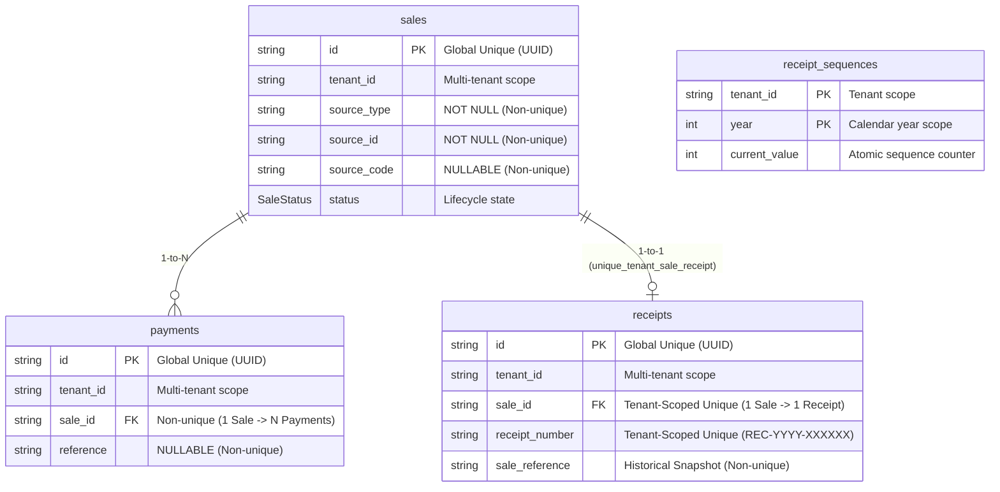

# 0124. Phase 7 Financial Models Uniqueness Audit and Constraint Architecture

- **Status**: Accepted
- **Date**: 2026-10-02
- **Deciders**: Senior Database Architect, Principal Domain Architect, Senior Financial Integrity Engineer
- **Context**: Kinergy Platform Phase 7 (Sales & Payments — Milestone 7.10: Uniqueness Audit & Data Integrity). Following the persistence hardening (ADR-0122) and index optimization (ADR-0123), we must perform an exhaustive, rigorous uniqueness audit of all Phase 7 technical identifiers, business references, and composite keys across `sales`, `payments`, `receipts`, `sale_items`, `receipt_sequences`, and candidate entities (`Discount`, `PaymentHistory`).
- **Consulted ADRs**:
  - [ADR-0110: Sale Transaction Ownership and Source Bounded-Context Integrity](0110-sale-ownership.md)
  - [ADR-0112: Sales & Payments Bounded Context Establishment](0112-sales-bounded-context.md)
  - [ADR-0115: Payment Domain Canonical Architecture](0115-payment-domain-canonical-architecture.md)
  - [ADR-0116: Payment State Machine and Lifecycle Specification](0116-payment-state-machine-and-lifecycle-specification.md)
  - [ADR-0117: Receipt Domain Boundary, Document Model, and Legal Proof-of-Purchase Invariants](0117-receipt-domain-boundary-and-document-model.md)
  - [ADR-0118: Sale Reference and Receipt Identification Strategy](0118-sale-reference-and-receipt-identification-strategy.md)
  - [ADR-0120: Commercial Transaction Uniqueness, Idempotency, and Exactly-One-Sale Invariant](0120-commercial-transaction-uniqueness-and-sale-idempotency.md)
  - [ADR-0121: Sale Source References and Commercial Origin Model](0121-sale-source-references-and-commercial-origin-model.md)
  - [ADR-0122: Phase 7 Financial Persistence Architecture and Hardening](0122-phase-7-financial-persistence-architecture.md)
  - [ADR-0123: Phase 7 Financial Model Database Index Strategy and Query Optimization](0123-phase-7-financial-database-index-strategy.md)

---

## 1. Context and Problem Statement

In relational database engineering, uniqueness constraints are the most powerful structural invariant tool. However, **unjustified or naive uniqueness is fatal to business operations**.

- If an architect assumes "every source reference must be unique", a gym is blocked from selling more than one bottle of water or enrolling more than one client in a membership plan.
- If an architect assumes "every payment reference must be unique", cash walk-in transactions (which share `NULL` or generic register tags) crash with unique violation errors.
- If an architect overlooks PostgreSQL's standard SQL `NULL` treatment, composite unique constraints behave unexpectedly when one or both fields are null.

We must systematically audit:

1. Technical primary keys (`Sale.id`, `Payment.id`, `Receipt.id`, `SaleItem.id`, `Discount.id`, `PaymentHistory.id`).
2. Business identifiers (`Sale.sourceCode`, `Receipt.receiptNumber`, `Receipt.saleReference`, `SaleSource(type, id)`, `Payment.reference`).
3. PostgreSQL NULL semantics and concurrency serialization under race conditions.

---

## 2. Technical Primary Key Uniqueness Audit

| Entity / Field          | Persistence Model   | Primary Key Constraint | Invariant Protected                                                                                                                                          | Scope      | NULL Semantics               | Concurrency Protection                                                                                                                             |
| :---------------------- | :------------------ | :--------------------- | :----------------------------------------------------------------------------------------------------------------------------------------------------------- | :--------- | :--------------------------- | :------------------------------------------------------------------------------------------------------------------------------------------------- |
| **`Sale.id`**           | `sales`             | `sales_pkey (id)`      | Aggregate Root Identity; guarantees every checkout transaction has an immutable, collision-free UUID.                                                        | **Global** | `NOT NULL`. Prohibits nulls. | **Guaranteed**: PostgreSQL enforces PK via unique B-tree index. Collisions fail with SQLSTATE `23505` (P2002), mapped to `DuplicateSaleException`. |
| **`Payment.id`**        | `payments`          | `payments_pkey (id)`   | Autonomous Aggregate Root Identity; guarantees discrete monetary tender identity.                                                                            | **Global** | `NOT NULL`. Prohibits nulls. | **Guaranteed**: B-tree index serialization blocks parallel conflicting UUID inserts.                                                               |
| **`Receipt.id`**        | `receipts`          | `receipts_pkey (id)`   | Legal Voucher Root Identity; guarantees proof-of-purchase voucher technical identity.                                                                        | **Global** | `NOT NULL`. Prohibits nulls. | **Guaranteed**: B-tree index serialization prevents duplicate UUID creation.                                                                       |
| **`SaleItem.id`**       | `sale_items`        | `sale_items_pkey (id)` | Subordinate Entity Identity; guarantees discrete line item identity within parent `Sale`.                                                                    | **Global** | `NOT NULL`. Prohibits nulls. | **Guaranteed**: B-tree index serialization.                                                                                                        |
| **`Discount.id`**       | _N/A (Embedded VO)_ | _None_                 | `Discount` is a pure Domain Value Object without identity or independent lifecycle (ADR-0113, ADR-0122 §4.3). Flattened columns on `sales` and `sale_items`. | _N/A_      | _N/A_                        | _N/A_ (No separate relational table).                                                                                                              |
| **`PaymentHistory.id`** | _N/A (Audit Logs)_  | _None_                 | Evaluated and rejected as speculative abstraction (ADR-0122 §5). Payment transitions emit domain events to enterprise `audit_logs`.                          | _N/A_      | _N/A_                        | _N/A_ (No separate relational table).                                                                                                              |

---

## 3. Business Identifier Uniqueness Audit

| Business Field               | Physical Column(s)         | Table      | Current Constraint                    | Invariant Protected                                                                                                     | Scope             | NULL Semantics                                    | Verdict & Rationale                                                                                                                                                                                                                     |
| :--------------------------- | :------------------------- | :--------- | :------------------------------------ | :---------------------------------------------------------------------------------------------------------------------- | :---------------- | :------------------------------------------------ | :-------------------------------------------------------------------------------------------------------------------------------------------------------------------------------------------------------------------------------------- |
| **Receipt Number**           | `receipt_number`           | `receipts` | `@@unique([tenantId, receiptNumber])` | **Monotonic Fiscal Identity**: Monotonic, gap-free, non-repeating alphanumeric sequence per tenant (`REC-YYYY-XXXXXX`). | **Tenant-Scoped** | `NOT NULL`. Both tenant and number are mandatory. | **ACCEPTED (UNIQUE)**: Legal requirement. Concurrent collision blocked at database level; atomic increments orchestrated via `ReceiptSequence`.                                                                                         |
| **Receipt-to-Sale**          | `sale_id`                  | `receipts` | `@@unique([tenantId, saleId])`        | **Exactly-One-Receipt-Per-Sale**: A settled sale may produce at most one legal proof-of-purchase voucher.               | **Tenant-Scoped** | `NOT NULL`. Both tenant and saleId are mandatory. | **ACCEPTED (UNIQUE)**: Guarantees 1-to-1 relationship. Prevents accidental double voucher issuance for a single commercial checkout.                                                                                                    |
| **Sale Reference (Receipt)** | `sale_reference`           | `receipts` | `None` (Indexed)                      | Commercial origin snapshot string (`ORD-CLINICAL-2026-0042` or fallback `sale.id`).                                     | _N/A_             | `NOT NULL`.                                       | **REJECTED (NON-UNIQUE)**: Historical presentation snapshot. Uniqueness is already guaranteed by `@@unique([tenantId, saleId])`. Enforcing uniqueness on presentation text would break fallback ID checkouts.                           |
| **Sale Order Reference**     | `source_code`              | `sales`    | `None`                                | External order reference (e.g. `ORD-2026-0928-001` or `POS_REGISTER`).                                                  | _N/A_             | `NULLABLE`.                                       | **REJECTED (NON-UNIQUE)**: Walk-in POS sales share generic tags (`POS_REGISTER`). A physical unique constraint would crash the second walk-in customer. Deduplication for non-generic codes is handled at application layer (ADR-0120). |
| **SaleSource**               | `(source_type, source_id)` | `sales`    | `None` (Indexed)                      | Origin domain reference (`FOOD`, `DRINK`, `GYM_MEMBERSHIP`, `KINESIOLOGY_SESSION`, `ROOM_RENTAL`).                      | _N/A_             | `NOT NULL`.                                       | **REJECTED (BLANKET UNIQUE)**: Would destroy retail sales, membership plans, room turnover, and post-cancellation re-billing. See §4.                                                                                                   |
| **Payment Reference**        | `reference`                | `payments` | `None`                                | External gateway transaction reference (e.g. `ch_123` or `QR-TRANS-99`).                                                | _N/A_             | `NULLABLE`.                                       | **REJECTED (NON-UNIQUE)**: Cash tenders have `NULL` or generic register tags (`CASH_DRAWER`). Gateway retries could collide during network timeouts.                                                                                    |

---

## 4. Deep-Dive: SaleSource Composite Uniqueness & PostgreSQL NULL Semantics

### 4.1 Why Blanket Database Uniqueness on `(sourceType, sourceId)` is Strictly Prohibited

Placing a blanket `UNIQUE(source_type, source_id)` or `UNIQUE(tenant_id, source_type, source_id)` constraint on `sales` would cause catastrophic failures across 4 core business domains:

1. **Retail Inventory Consumables (`FOOD`, `DRINK`)**:
   - When a gym sells 50 bottles of water (`sourceId = 'sku-water-500ml'`), all 50 sales reference the same catalog item. A unique constraint would allow exactly **one** bottle of water to be sold in the gym's entire history.
2. **Gym Memberships (`GYM_MEMBERSHIP`)**:
   - Hundreds of athletes purchase the "Gold Annual Plan" (`sourceId = 'plan-gold-annual'`). A unique constraint would restrict the plan to a single member.
3. **Facility Rentals (`ROOM_RENTAL`)**:
   - A physical treatment studio (`sourceId = 'room-studio-a'`) is booked across hundreds of hourly slots throughout the year. A unique constraint would prohibit renting the studio more than once.
4. **Re-Billing Following Cancellation**:
   - If a checkout agreement is cancelled due to cashier error (`status = CANCELLED`), the underlying service must be eligible for re-checkout. A physical database unique constraint would permanently lock the session, destroying revenue.

### 4.2 PostgreSQL NULL Semantics in Composite Uniqueness

In relational database theory and PostgreSQL implementation:

1. **SQL-92 Standard Behavior (`NULLS DISTINCT`)**:
   - By default in PostgreSQL (prior to v15 `NULLS NOT DISTINCT`), `NULL` values are treated as distinct from one another.
   - If a composite unique constraint `UNIQUE(a, b)` exists:
     - `('A', NULL)` and `('A', NULL)` **do NOT conflict**.
     - `(NULL, NULL)` and `(NULL, NULL)` **do NOT conflict**.
   - If `sourceType` or `sourceId` were nullable, a standard unique constraint would allow infinite duplicate null entries.
2. **In Kinergy's Model**:
   - Both `sourceType` and `sourceId` on `Sale` are declared `NOT NULL`:
     ```prisma
     sourceType String @map("source_type")
     sourceId   String @map("source_id")
     ```
   - Therefore, PostgreSQL NULL semantics do not cause ambiguity: every row contains non-null strings.
3. **If Source Uniqueness Only Applies When Both Values Exist**:
   - In PostgreSQL, if columns were nullable, standard partial unique indexing would enforce uniqueness only on fully populated rows:
     ```sql
     CREATE UNIQUE INDEX unique_sale_source_populated
     ON sales (tenant_id, source_type, source_id)
     WHERE source_type IS NOT NULL AND source_id IS NOT NULL;
     ```
   - However, as proven in §4.1, blanket uniqueness even for fully populated rows is **invalid for retail, plans, and rooms**.

### 4.3 Operational Single-Billing Protection (`SALE-010`)

The only domain requirement for single-billing is clinical kinesiology sessions (`KINESIOLOGY_SESSION` / `TREATMENT_SESSION`):

- A completed therapy session must be billed at most once while the sale is active (`status != 'CANCELLED'`).
- If cancelled, re-billing is permitted.

#### Database-Level Partial Unique Index (Evaluated Model):

```sql
CREATE UNIQUE INDEX unique_active_clinical_sale
ON sales (tenant_id, source_id)
WHERE source_type IN ('KINESIOLOGY_SESSION', 'TREATMENT_SESSION')
  AND status != 'CANCELLED';
```

- **Invariant Protected**: Invariant `SALE-010` (Clinical Single-Billing).
- **Scope**: Scoped to tenant, clinical source types, and non-cancelled statuses.
- **Retail Impact**: Zero interference with `FOOD`, `DRINK`, `GYM_MEMBERSHIP`, or `ROOM_RENTAL`.
- **Cancellation Impact**: Cancelled sales are excluded, cleanly permitting re-billing.

#### Architecture Harmonization:

Currently, Kinergy enforces this rule via atomic transaction pre-checks in [`PrismaSaleRepository.save()`](file:///c:/Projects/kinergy-platform/packages/core/src/sales/infrastructure/persistence/prisma/repositories/prisma-sale.repository.ts) (lines 111–139) with domain-specific [`DuplicateSaleException`](file:///c:/Projects/kinergy-platform/packages/core/src/sales/domain/exceptions/duplicate-sale.exception.ts) mapping. The database schema maintains composite non-unique indexes `@@index([tenantId, sourceType, sourceId])` and `@@index([sourceType, sourceId])`, providing sub-millisecond pre-check queries without brittle cross-table partial DDL.

---

## 5. Summary Matrix of Approved Phase 7 Uniqueness Constraints



1. **`sales.id`**: `PRIMARY KEY` (Global UUID)
2. **`payments.id`**: `PRIMARY KEY` (Global UUID)
3. **`receipts.id`**: `PRIMARY KEY` (Global UUID)
4. **`sale_items.id`**: `PRIMARY KEY` (Global UUID)
5. **`receipt_sequences.(tenant_id, year)`**: `PRIMARY KEY` (Tenant + Year)
6. **`receipts.(tenant_id, receipt_number)`**: `UNIQUE` (Tenant Monotonic Numbering)
7. **`receipts.(tenant_id, sale_id)`**: `UNIQUE` (Tenant 1-to-1 Sale Voucher)
8. **`sales.sourceCode`**: **NON-UNIQUE** (Allows shared POS register tags)
9. **`sales.(sourceType, sourceId)`**: **NON-UNIQUE** (Allows multi-sale retail/plans/rentals)
10. **`payments.reference`**: **NON-UNIQUE** (Allows cash walk-ins without references)

---

## 6. Consequences

### Positive

- **Zero Accidental Business Lockouts**: Point-of-sale retail, gym membership signups, and room bookings operate without constraint collision.
- **Absolute Legal Receipt Integrity**: Gap-free monotonic receipt numbering and 1-to-1 sale vouchers are physically guaranteed at the relational level.
- **Accurate Domain Modeling**: `Discount` and `PaymentHistory` remain pure Value Objects and Event streams without bloated database tables.
- **Clear Concurrency Protection**: Race conditions are handled either by database unique indexes (receipts, primary keys) or atomic serializable transactions (clinical deduplication).
