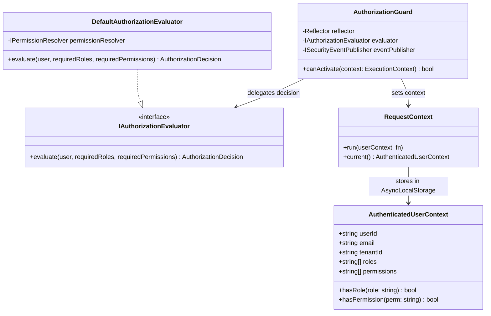

# ADR-0135: Sales, Payments & Receipts Authorization Architecture, IAM Integration & Security Boundaries

- **Status**: **ACCEPTED**
- **Date**: 2026-10-09
- **Deciders**: Principal Security Architect, Principal Financial Domain Architect, Lead Platform Engineer
- **Context**: Kinergy Platform Phase 7 (Sales, Payments & Receipts — Milestone 7.13: Authorization & Security). Following the delivery of the Sales Domain (ADR-0112, ADR-0119), Payment Domain (ADR-0115, ADR-0116), Receipt Domain (ADR-0117, ADR-0118), Relational Persistence Architecture (ADR-0122, ADR-0125), and Use Case Application Layers (ADR-0132, ADR-0133, ADR-0134), this ADR defines the authoritative security and authorization architecture for commercial point-of-sale, monetary settlement, and fiscal receipt operations.
- **Consulted ADRs**:
  - [ADR-0010: Backend Clean Architecture Layering](0010-backend-clean-architecture-layering.md)
  - [ADR-0021: Transactional Consistency & Unit of Work Pattern](0021-transactional-consistency-unit-of-work.md)
  - [ADR-0023: Extensible Security Event Infrastructure](0023-extensible-security-event-infrastructure.md)
  - [ADR-0024: Authentication Guard Architecture](0024-authentication-guard-architecture.md)
  - [ADR-0025: Role and Permission Authorization Framework](0025-role-and-permission-authorization-framework.md)
  - [ADR-0026: Reusable Security Decorators Architecture](0026-reusable-security-decorators-architecture.md)
  - [ADR-0027: Authenticated Request Context Architecture](0027-authenticated-request-context-architecture.md)
  - [ADR-0028: Extracted Authorization Decision Engine](0028-extracted-authorization-decision-engine.md)
  - [ADR-0038: Authentication Hardening, Information Disclosure Prevention & Secret Validation](0038-authentication-hardening-and-generic-error-handling.md)
  - [ADR-0074: Trainer Operational Authorization Boundary and Object-Level Scoping Policy](0074-trainer-operational-authorization-boundary-and-object-level-scoping-policy.md)
  - [ADR-0108: Deterministic Financial Representation and Currency Modeling](0108-money-representation.md)
  - [ADR-0109: Payment Lifecycle, Multi-Tender Settlement, and Financial Immutability](0109-payment-lifecycle.md)
  - [ADR-0111: Sales & Payments Authorization, Organization Isolation, and Audit Boundaries](0111-sales-payments-authorization-and-audit.md)
  - [ADR-0112: Sales & Payments Bounded Context Establishment](0112-sales-bounded-context.md)
  - [ADR-0114: Canonical Monetary Policy, Deterministic Arithmetic, and Sale Totals Invariant Enforcement](0114-canonical-monetary-policy-and-sale-totals.md)
  - [ADR-0115: Payment Domain Canonical Architecture, Aggregate Boundaries, and Tender Decoupling](0115-payment-domain-canonical-architecture.md)
  - [ADR-0116: Payment State Machine, Lifecycle Specification, and Financial Transition Determinism](0116-payment-state-machine-and-lifecycle-specification.md)
  - [ADR-0117: Receipt Domain Boundary, Document Model, and Legal Proof-of-Purchase Invariants](0117-receipt-domain-boundary-and-document-model.md)
  - [ADR-0118: Sale Reference and Receipt Identification Strategy](0118-sale-reference-and-receipt-identification-strategy.md)
  - [ADR-0119: Sale Aggregate Boundary, Invariants, and Commercial Integrity](0119-sale-aggregate-boundary-and-invariants.md)
  - [ADR-0120: Commercial Transaction Uniqueness, Idempotency, and Exactly-One-Sale Invariant](0120-commercial-transaction-uniqueness-and-sale-idempotency.md)
  - [ADR-0121: Sale Source References and Commercial Origin Model](0121-sale-source-references-and-commercial-origin-model.md)
  - [ADR-0122: Phase 7 Financial Persistence Architecture and Hardening](0122-phase-7-financial-persistence-architecture.md)
  - [ADR-0125: Phase 7 Transaction Architecture and Atomic Persistence Boundaries](0125-phase-7-transaction-architecture-and-atomic-boundaries.md)
  - [ADR-0132: Sale Application Layer Architecture, Use Case Inventory, and Orchestration Contracts](0132-sale-application-layer-architecture.md)
  - [ADR-0133: Payment Application Layer Architecture, Cross-Aggregate Settlement Orchestration, and Use Case Inventory](0133-payment-application-layer-architecture.md)
  - [ADR-0134: Financial Settlement Validation, Multi-Tender Boundaries & Overpayment Invariants](0134-financial-settlement-validation-and-overpayment-invariants.md)

---

## 1. Executive Summary & Context

Milestones 7.1 through 7.12 established pure domain aggregates (`Sale`, `Payment`, `Receipt`), relational persistence schemas, deterministic financial arithmetic (`Money`), and comprehensive application use cases.

Milestone 7.13 addresses **Authorization & Security**: how external callers prove identity, verify capabilities, and access commercial and fiscal operations without violating the architectural boundaries of Clean Architecture, Hexagonal Architecture, and Domain-Driven Design (DDD).

### Core Problem Statement

1. **Risk of Domain Coupling**: Integrating authorization into financial workflows often leads to importing HTTP tokens, NestJS guards, role strings, or permission evaluators into domain logic, destroying domain purity.
2. **Authority Fragmentation**: Creating separate or ad-hoc authorization mechanisms for Sales and Payments would fracture the Phase 1 Identity and Access Management (IAM) authority, causing duplicate logic and permission drift.
3. **Confusion of Invariant Types**: Conflating authorization (e.g. "Is user allowed to record a payment?") with domain business validation (e.g. "Does payment amount exceed remaining sale balance?") creates brittle security and corrupts financial state machines.
4. **Information Disclosure & Cross-Tenant Probing**: Improperly handling unauthorized or forbidden access exposes sensitive internal state, commercial pricing, or organizational presence to malicious actors.

This ADR establishes the definitive integration contract between Phase 7 (Sales, Payments, Receipts) and Phase 1 IAM.

---

## 2. Definitive Answers to the 12 Architectural Mandates

### 1. Single Authority Reuse

Phase 1 IAM (`apps/api/src/platform/identity/`) is the **sole and exclusive authority** for identity authentication, role hierarchies, permission resolution, and evaluation. Phase 7 introduces **zero** new authorization engines, zero custom user tables, and zero parallel permission evaluators.

### 2. Permission Naming & Ownership

Permissions are standardized using **hierarchical dot-notation** (`sales.read`, `sales.create`, `sales.manage`, `sales.cancel`, `payments.read`, `payments.create`, `payments.manage`, `receipts.read`, `receipts.manage`), matching the established repository standard in Phase 1 (`identity.seed.ts`, [ADR-0025](0025-role-and-permission-authorization-framework.md)) and [ADR-0111](0111-sales-payments-authorization-and-audit.md). Colon-notation proposals (`sales:read`, etc.) are resolved via normalized resolver aliasing to preserve consistency. Permissions are owned by the centralized Identity Bounded Context catalog.

### 3. Layered Architectural Boundaries

A strict four-tier separation of concerns governs every operation:

- **Authentication Boundary**: Verifies cryptographic identity, issuer, expiration, and user account status.
- **Authoritative Enforcement Boundary**: Evaluates required roles and permissions before controller method execution.
- **Application Orchestration Boundary**: Enforces tenant boundary isolation, loads aggregates, coordinates cross-aggregate workflows, and emits audit events.
- **Domain Invariant Boundary**: Enforces business rules, state machines, and mathematical constraints. **Domain invariants are completely agnostic to caller identity and authorization.**

### 4. Authoritative Entry Point Enforcement Boundary

The authoritative security gate for all external access is the **Presentation Transport Layer** (`AuthenticationGuard` and `AuthorizationGuard` applied to HTTP controllers, WebSockets, or webhook ingress). Internal or asynchronous entry points (background jobs, event consumers, CLI) execute under an explicit, pre-authorized execution context (`SystemUserContext` or tenant-scoped worker identity).

### 5. Application of Authorization to Use Cases

Every Phase 7 command and query is mapped to a discrete permission code, classified by risk tier (Read-Only, Transactional, Financially Sensitive, Destructive), and enforced at the transport ingress with defense-in-depth tenant validation at the application boundary.

### 6. Cross-Resource & Related-Resource Access

Access to related resources (e.g., a Payment referencing a `Sale`, a Sale referencing a `Client` or `SourceReference`) is governed by:

- The caller's operation permission for the primary resource (`payments.create`, `payments.manage`).
- Strict tenant identity matching across referenced resources (`payment.tenantId === sale.tenantId === context.tenantId`).
- Domain decoupling: Handlers load related aggregates via repository ports; the caller does not require distinct, lower-level read permissions for subordinate dependencies loaded internally during a valid coordinated transaction.

### 7. Representation of Denied Operations & Information Disclosure Prevention

In alignment with [ADR-0038](0038-authentication-hardening-and-generic-error-handling.md):

- Unauthenticated requests yield `401 Unauthorized` with generic payload `{"message": "Authentication required"}`.
- Unauthorized requests yield `403 Forbidden` with generic payload `{"message": "Forbidden resource"}` (never leaking missing roles, permission names, or policy internals).
- Cross-tenant access or probing non-existent resources in other tenants yields `404 Not Found` (never `403`), preventing resource existence enumeration.
- High-fidelity violation telemetry is dispatched asynchronously to the security audit pipeline (`ISecurityEventPublisher`).

### 8. Role-to-Permission Governance

Role-to-permission mappings are:

- Authoritatively declared in `prisma/seeds/identity.seed.ts`.
- Validated via automated security integration suites (`sales.authorization.spec.ts`, `payments.authorization.spec.ts`, `receipts-api.spec.ts`).
- Changed exclusively via version-controlled seed migrations or administrative IAM commands; never through hardcoded controller conditionals or domain logic.

### 9. Interaction with Multi-Tenant & Resource Scoping Rules

Authorization evaluation occurs first (verifying capability). Once permitted, the request is scoped by `tenantId` extracted from the verified `AuthenticatedUserContext`. Cross-tenant queries are physically filtered at the persistence boundary (`where: { tenantId }`), and cross-tenant mutations are rejected with cross-tenant domain/application exceptions.

### 10. Prevention of Duplicated & Conflicting Checks

- **Presentation**: Declarative `@Roles()` and `@Permissions()` evaluated once by `AuthorizationGuard` via `DefaultAuthorizationEvaluator`.
- **Application**: Validates only execution context integrity (`tenantId` alignment, current user propagation) and orchestration pre-conditions; never re-parses declarative HTTP permission strings.
- **Domain**: Pure business rules. Zero authorization checks.

### 11. Preservation of Receipt Historical Integrity

Receipts are immutable fiscal vouchers ([ADR-0117](0117-receipt-domain-boundary-and-document-model.md)). Authorization to read or reprint a receipt grants access only to the frozen historical document state. Permission revocation or user status changes never alter historical receipts. Reprints require `receipts.manage`, increment monotonic counter metadata, and log security audit events without mutating legal transaction content.

### 12. Backward Compatibility

Legacy permission tokens (`billing.read`, `billing.write`) are maintained as active aliases in `DefaultPermissionResolver` mapping transparently to the granular Phase 7 catalog (`billing.read` $\implies$ `sales.read`, `payments.read`, `receipts.read`; `billing.write` $\implies$ `sales.create`, `payments.create`).

---

## 3. Strict Layering & Separation of Concerns

The architecture strictly segregates responsibilities across four distinct architectural tiers:

```
┌────────────────────────────────────────────────────────────────────────────────────────┐
│ 1. PRESENTATION LAYER (HTTP Transport / Ingress Boundary)                              │
│                                                                                        │
│   • AuthenticationGuard: Validates JWT signature, expiry, account status.              │
│   • RequestContext: Binds AuthenticatedUserContext into AsyncLocalStorage.             │
│   • AuthorizationGuard: Evaluates @Roles() and @Permissions() declarative metadata     │
│     using DefaultAuthorizationEvaluator (Phase 1 IAM).                                 │
│   • Response / Exception Filter: Translates rejections to generic 401/403/404 payloads.│
└───────────────────────────────────────────┬────────────────────────────────────────────┘
                                            │ Passes Sanitized DTO + CurrentUserContext
                                            ▼
┌────────────────────────────────────────────────────────────────────────────────────────┐
│ 2. APPLICATION ORCHESTRATION LAYER (Use Cases & Handlers)                              │
│                                                                                        │
│   • Orchestrates transaction boundaries via IUnitOfWork.                               │
│   • Enforces tenant isolation: asserts command.tenantId === context.tenantId.          │
│   • Loads aggregates via repository ports (ISaleRepository, IPaymentRepository).      │
│   • Coordinates cross-aggregate workflows (e.g. CompletePayment -> Sale.markPaid).     │
│   • Emits domain audit events (AuditEventPublisher) and security alerts.               │
│   • Receives pure Domain exceptions and translates them to ApplicationResult.          │
│   • NEVER imports JWT, HTTP, NestJS guards, decorators, or framework tokens.           │
└───────────────────────────────────────────┬────────────────────────────────────────────┘
                                            │ Calls pure aggregate methods
                                            ▼
┌────────────────────────────────────────────────────────────────────────────────────────┐
│ 3. PURE DOMAIN LAYER (Aggregates, Value Objects, Domain Events)                        │
│                                                                                        │
│   • Aggregates: Sale, Payment, Receipt.                                                │
│   • Value Objects: Money, LineItemDiscount, OrderNumber, ReceiptNumber.                │
│   • Authoritatively enforces lifecycle state machines (PENDING -> COMPLETED).          │
│   • Enforces financial invariants: non-negative money, rounding, overpayment reject.   │
│   • Completely agnostic to caller identity, roles, permissions, or security context.   │
│   • ZERO framework, HTTP, database, or authorization dependencies.                     │
└────────────────────────────────────────────────────────────────────────────────────────┘
```

### Invariant Independence Rule

> **Crucial Invariant**: Domain invariants must reject invalid operations even when the caller is fully authorized.
>
> Example: An `Owner` possessing full `sales.manage` and `payments.manage` permissions attempting to record a \$60.00 payment against a Sale with a remaining balance of \$50.00 is **authoritatively rejected** by `PaymentOverpaymentException` / application financial validation. Authorization grants the right to _attempt_ an operation; only domain logic determines whether the operation is _valid_.

---

## 4. Phase 1 IAM Integration Contract

Phase 7 leverages the unified Phase 1 IAM architecture:



### Single Source of Truth

1. **User Identity & Claims**: Provided by `AuthenticatedUserContext`, extracted from signed JWTs via `AuthenticationGuard`.
2. **Permission Resolution**: Evaluated exclusively by `DefaultAuthorizationEvaluator` via `IAuthorizationEvaluator` port ([ADR-0028](0028-extracted-authorization-decision-engine.md)).
3. **Context Propagation**: Stored in `AsyncLocalStorage` via `RequestContext.run()` ([ADR-0027](0027-authenticated-request-context-architecture.md)) during HTTP processing, ensuring downstream services and audit loggers access verified caller context without parameter drilling.

---

## 5. Permission Catalog & Naming Conventions

### 5.1 Reconciliation: Colon-Notation vs. Canonical Dot-Notation

The reconnaissance report and user mandate noted proposals for colon-separated permissions (`sales:read`, `sales:manage`, `payments:read`, etc.).

**Authoritative Decision**:
The Kinergy codebase universally standardizes on **hierarchical dot-notation** (`<bounded_context>.<action>`), as codified in [ADR-0025](0025-role-and-permission-authorization-framework.md), [ADR-0111](0111-sales-payments-authorization-and-audit.md), and `prisma/seeds/identity.seed.ts` (e.g. `users.read`, `inventory.manage`, `billing.read`).

To guarantee absolute consistency while satisfying integration requirements:

1. Canonical database representations, seed definitions, and `@Permissions()` decorators use **dot-notation**:
   - `sales.read`
   - `sales.create`
   - `sales.manage`
   - `sales.cancel`
   - `payments.read`
   - `payments.create`
   - `payments.manage`
   - `receipts.read`
   - `receipts.manage`
2. **Permission Normalization**: The `DefaultPermissionResolver` normalizes incoming string representations by replacing `:` with `.` (e.g., `sales:read` $\to$ `sales.read`). This accommodates external systems or legacy tokens using colon separators without fracturing the internal security catalog.

### 5.2 Canonical Permission Catalog & Operational Scope

| Permission Code       | Risk Classification       | Operational Scope & Capabilities                                                                                              | Minimum Permitted Role                                                                 |
| :-------------------- | :------------------------ | :---------------------------------------------------------------------------------------------------------------------------- | :------------------------------------------------------------------------------------- |
| **`sales.read`**      | **Read-Only**             | Query sales orders, cart items, customer order summaries, order status, and sale payment histories.                           | `Owner`, `Manager`, `Receptionist`, `Trainer`, `Kitchen Staff`                         |
| **`sales.create`**    | **Transactional**         | Initiate draft checkout sessions, add/remove items to draft carts, calculate totals, finalize draft orders.                   | `Owner`, `Manager`, `Receptionist`, `Kitchen Staff`                                    |
| **`sales.manage`**    | **Financially Sensitive** | Apply discretionary manager discounts ($> 15\%$), override item pricing, update commercial metadata, reopen exception orders. | `Owner`, `Manager`                                                                     |
| **`sales.cancel`**    | **Destructive**           | Void draft carts or cancel finalized orders prior to fulfillment; requires business reason tracking.                          | `Owner`, `Manager` (all); `Receptionist` (drafts only)                                 |
| **`payments.read`**   | **Read-Only**             | View payment transaction ledgers, tender methods, settlement timestamps, external references, and statuses.                   | `Owner`, `Manager`, `Receptionist`                                                     |
| **`payments.create`** | **Transactional**         | Record cash receipts, initiate electronic terminal pre-authorizations, execute standard payment completions.                  | `Owner`, `Manager`, `Receptionist`, `Kitchen Staff` (POS cash/card)                    |
| **`payments.manage`** | **Financially Sensitive** | Force-fail stalled transactions, process manual cancellations, execute compensating refunds, adjust disputed settlements.     | `Owner`, `Manager`                                                                     |
| **`receipts.read`**   | **Read-Only**             | Query, view, and render legal proof-of-purchase vouchers and sales receipts.                                                  | `Owner`, `Manager`, `Receptionist`, `Trainer`, `Kitchen Staff`, `Client` (own receipt) |
| **`receipts.manage`** | **Financially Sensitive** | Trigger official receipt reprints, issue duplicate fiscal vouchers, generate legal tax credit notes.                          | `Owner`, `Manager`, `Receptionist`                                                     |

### 5.3 Backward Compatibility Mapping

To maintain 100% backward compatibility with pre-existing Phase 1 test suites, seed tokens, and third-party integrations:

```typescript
// Resolution rules inside DefaultPermissionResolver:
if (
  requestedPermission === 'sales.read' ||
  requestedPermission === 'payments.read' ||
  requestedPermission === 'receipts.read'
) {
  if (userHasPermission('billing.read')) return true;
}
if (requestedPermission === 'sales.create' || requestedPermission === 'payments.create') {
  if (userHasPermission('billing.write')) return true;
}
```

- Any caller bearing legacy `billing.read` is granted `sales.read`, `payments.read`, and `receipts.read`.
- Any caller bearing legacy `billing.write` is granted `sales.create` and `payments.create`.
- High-risk operations (`sales.manage`, `sales.cancel`, `payments.manage`, `receipts.manage`) **strictly require** the dedicated fine-grained permission; generic `billing.write` does **not** grant destructive or override access.

---

## 6. Complete Use Case Authorization Matrix

The matrix below defines the definitive authorization contract across every use case in Phase 7:

| Domain Module | Application Use Case      | Entry Method / Route           | HTTP Verb | Required Permission | Allowed Roles                                       | Operation Tier        | Secondary Invariants & Scoping                                        |
| :------------ | :------------------------ | :----------------------------- | :-------: | :------------------ | :-------------------------------------------------- | :-------------------- | :-------------------------------------------------------------------- |
| **Sales**     | `CreateDraftSale`         | `/api/sales`                   |  `POST`   | `sales.create`      | `Owner`, `Receptionist`, `Kitchen Staff`            | Transactional         | Must match `user.tenantId`.                                           |
| **Sales**     | `AddItemToDraftSale`      | `/api/sales/:id/items`         |  `POST`   | `sales.create`      | `Owner`, `Receptionist`, `Kitchen Staff`            | Transactional         | Sale must be `DRAFT`. Item belongs to tenant.                         |
| **Sales**     | `RemoveItemFromDraftSale` | `/api/sales/:id/items/:itemId` | `DELETE`  | `sales.create`      | `Owner`, `Receptionist`, `Kitchen Staff`            | Transactional         | Sale must be `DRAFT`.                                                 |
| **Sales**     | `FinalizeSale`            | `/api/sales/:id/finalize`      |  `POST`   | `sales.create`      | `Owner`, `Receptionist`, `Kitchen Staff`            | Transactional         | Validates item count $\ge 1$; locks terms.                            |
| **Sales**     | `CancelSale`              | `/api/sales/:id/cancel`        |  `POST`   | `sales.cancel`      | `Owner`, `Receptionist`                             | Destructive           | Drafts cancelable by Receptionist; finalized requires `sales.cancel`. |
| **Sales**     | `GetSale`                 | `/api/sales/:id`               |   `GET`   | `sales.read`        | `Owner`, `Receptionist`, `Trainer`, `Kitchen Staff` | Read-Only             | Must match `tenantId`. Scoped to own client if Client role.           |
| **Sales**     | `ListSales`               | `/api/sales`                   |   `GET`   | `sales.read`        | `Owner`, `Receptionist`, `Trainer`                  | Read-Only             | Deterministic sort; paginated; filtered by `tenantId`.                |
| **Sales**     | `GetSalePaymentHistory`   | `/api/sales/:id/payments`      |   `GET`   | `sales.read`        | `Owner`, `Receptionist`                             | Read-Only             | Loads payment list for specific sale within tenant.                   |
| **Payments**  | `CreatePayment`           | `/api/payments`                |  `POST`   | `payments.create`   | `Owner`, `Receptionist`, `Kitchen Staff`            | Transactional         | Sale exists and is payable; positive amount.                          |
| **Payments**  | `CompletePayment`         | `/api/payments/:id/complete`   |  `POST`   | `payments.create`   | `Owner`, `Receptionist`, `Kitchen Staff`            | Transactional         | Atomic payment settlement + Sale state transition.                    |
| **Payments**  | `FailPayment`             | `/api/payments/:id/fail`       |  `POST`   | `payments.manage`   | `Owner`, `Receptionist`                             | Financially Sensitive | Transitions `PENDING` payment to `FAILED`.                            |
| **Payments**  | `CancelPayment`           | `/api/payments/:id/cancel`     |  `POST`   | `payments.manage`   | `Owner`, `Receptionist`                             | Financially Sensitive | Cancels un-settled tender before gateway capture.                     |
| **Payments**  | `GetPayment`              | `/api/payments/:id`            |   `GET`   | `payments.read`     | `Owner`, `Receptionist`                             | Read-Only             | Filtered by `tenantId`. Masked cardholder data.                       |
| **Payments**  | `ListPayments`            | `/api/payments`                |   `GET`   | `payments.read`     | `Owner`, `Receptionist`                             | Read-Only             | Filtered by `tenantId`, `saleId`, `status`.                           |
| **Receipts**  | `IssueReceipt`            | Internal / Event Trigger       |    N/A    | `receipts.manage`   | System / Internal                                   | Financially Sensitive | Atomic upon full sale settlement (`PAID`).                            |
| **Receipts**  | `GetReceipt`              | `/api/receipts/:id`            |   `GET`   | `receipts.read`     | `Owner`, `Receptionist`, `Trainer`, `Kitchen Staff` | Read-Only             | Returns immutable proof-of-purchase voucher.                          |
| **Receipts**  | `GetReceiptBySaleId`      | `/api/receipts/sale/:saleId`   |   `GET`   | `receipts.read`     | `Owner`, `Receptionist`, `Trainer`, `Kitchen Staff` | Read-Only             | Scoped by `tenantId`.                                                 |
| **Receipts**  | `ReprintReceipt`          | `/api/receipts/:id/reprint`    |  `POST`   | `receipts.manage`   | `Owner`, `Receptionist`                             | Financially Sensitive | Increments reprint count; emits audit event.                          |

---

## 7. Authoritative Enforcement Boundary

### External Entry Points (HTTP / Webhooks / WebSockets)

The authoritative gate is enforced at the **NestJS Transport Controller Boundary** via `@UseGuards(AuthenticationGuard, AuthorizationGuard)`.

```
Incoming Request -> AuthenticationGuard -> RequestContext Middleware -> AuthorizationGuard -> Controller Handler
```

1. **`AuthenticationGuard`**: Rejects unauthenticated traffic (401).
2. **`RequestContext`**: Binds `AuthenticatedUserContext` to `AsyncLocalStorage`.
3. **`AuthorizationGuard`**: Reads `@Roles()` and `@Permissions()` metadata from the handler/controller using `Reflector`. Delegates evaluation to `DefaultAuthorizationEvaluator`. If denied, throws `ForbiddenException` (403) and logs a security event.
4. **Execution Flow**: If guards pass, the controller handler executes, extracts parameters, constructs sanitized Command/Query DTOs, and invokes the Application Layer use case.

### Internal Entry Points (Background Jobs, Event Handlers, CLI)

Internal system tasks (e.g. automated reconciliation jobs, event projections, asynchronous receipt issuance) bypass HTTP transport guards.

To maintain security invariants without fabricating HTTP contexts:

- Internal handlers execute within a synthesized **`SystemUserContext`**:
  ```typescript
  export const SYSTEM_USER_CONTEXT: AuthenticatedUserContext = {
    userId: 'system-internal-worker',
    email: 'system@kinergy.local',
    tenantId: 'system', // Overridden per job to specific tenantId
    roles: ['SystemAdmin'],
    permissions: ['*'],
  };
  ```
- Background orchestration wraps execution in `RequestContext.run(tenantScopedSystemContext, () => handler.execute(command))`.
- Handlers enforce strict tenant boundary assertion against the command DTO.

---

## 8. Cross-Resource Access & Foreign References

Financial transactions frequently reference resources across domain boundaries:

1. `Payment` references a `Sale` via scalar `saleId`.
2. `Sale` optionally references a `Client` via scalar `clientId`.
3. `SaleItem` references external catalog items via `sourceType` and `sourceId` ([ADR-0121](0121-sale-source-references-and-commercial-origin-model.md)).

### Cross-Resource Authorization Rules

```
┌────────────────────────────────────────────────────────────────────────┐
│                      CROSS-RESOURCE SECURITY MODEL                     │
│                                                                        │
│   Payment Operation (e.g., CompletePayment)                            │
│   ├─► Caller verified for payments.create                              │
│   ├─► Tenant boundary check: payment.tenantId === context.tenantId     │
│   ├─► Loads Sale via ISaleRepository (inside application handler)      │
│   ├─► Cross-Tenant Invariant: sale.tenantId === payment.tenantId       │
│   └─► DOES NOT require separate caller permission on sales.manage      │
└────────────────────────────────────────────────────────────────────────┘
```

1. **Subordinate Dependency Loading**: When a caller initiates a permitted payment action (`payments.create`), the application handler loads the referenced `Sale` aggregate to verify settlement validity and coordinate status transitions. The caller **does not need distinct `sales.manage` permissions** to settle an authorized payment. The application handler owns transactional coordination.
2. **Strict Tenant Consistency**:
   - `payment.tenantId === context.tenantId`
   - `sale.tenantId === payment.tenantId`
   - If a payment attempts to reference a sale belonging to a different tenant, the operation is rejected immediately with `TenantMismatchException` and an audit security event is triggered.
3. **Source Reference Ownership ([ADR-0121](0121-sale-source-references-and-commercial-origin-model.md))**:
   - When adding an item to a draft sale (`sourceType: 'INVENTORY_ITEM'`, `sourceId: 'inv-123'`), the application layer verifies catalog ownership via outbound query ports (`IInventorySourceQueryPort`).
   - If `sourceItem.tenantId !== sale.tenantId`, the operation is rejected as invalid input, preventing cross-tenant commercial contamination.

---

## 9. Information Disclosure Prevention & Denied Operation Handling

Following [ADR-0038](0038-authentication-hardening-and-generic-error-handling.md), error responses must never expose internal permission hierarchies, stack traces, role catalogs, or tenant tenancy details.

### Status Code & Response Payload Standards

| Failure Scenario                                                |    HTTP Status     | Response Payload                                                                                                    | Telemetry & Logging                                                                                                |
| :-------------------------------------------------------------- | :----------------: | :------------------------------------------------------------------------------------------------------------------ | :----------------------------------------------------------------------------------------------------------------- |
| **Missing / Expired / Invalid JWT**                             | `401 Unauthorized` | `{"statusCode": 401, "message": "Authentication required", "error": "Unauthorized"}`                                | Application log (warn).                                                                                            |
| **Insufficient Role or Permission**                             |  `403 Forbidden`   | `{"statusCode": 403, "message": "Forbidden resource", "error": "Forbidden"}`                                        | Dispatches `SecurityEventType.AUTHORIZATION_FAILURE` with actor ID, requested route, missing permission.           |
| **Target Resource in Different Tenant**                         |  `404 Not Found`   | `{"statusCode": 404, "message": "Resource not found", "error": "Not Found"}`                                        | Dispatches `SecurityEventType.CROSS_TENANT_ACCESS_ATTEMPT`. Returns 404 to prevent resource existence enumeration. |
| **Target Resource Does Not Exist**                              |  `404 Not Found`   | `{"statusCode": 404, "message": "Resource not found", "error": "Not Found"}`                                        | Application log (debug).                                                                                           |
| **Domain Validation Failure** (e.g. Overpayment)                | `400 Bad Request`  | `{"statusCode": 400, "message": "Payment amount exceeds remaining sale balance", "error": "DomainValidationError"}` | Business audit log (reject).                                                                                       |
| **Invalid State Transition** (e.g. Mark Paid on Cancelled Sale) |   `409 Conflict`   | `{"statusCode": 409, "message": "Cannot pay a cancelled sale", "error": "InvalidStateTransition"}`                  | Business audit log (conflict).                                                                                     |

### Information Disclosure Invariants

1. **Never Disclose Required Permissions**: Error messages must **never** state _"Requires sales.manage permission"_ or _"User lacks Receptionist role"_. Attackers must not be informed of what privilege is needed to breach an endpoint.
2. **Uniform 404 for Cross-Tenant Access**: If tenant A probes `/api/sales/sale-belonging-to-tenant-b`, the platform returns `404 Not Found`. Returning `403 Forbidden` would confirm to tenant A that `sale-belonging-to-tenant-b` exists in the system.

---

## 10. Prevention of Duplicated & Conflicting Checks

To eliminate conflicting or redundant authorization logic:

```
┌───────────────────────────────────────────────┐
│              DECLARATIVE AT PRESENTATION      │
│  @Roles('Owner', 'Receptionist')              │
│  @Permissions('sales.create')                 │
│  -> AuthorizationGuard executes ONCE.         │
└───────────────────────┬───────────────────────┘
                        │ Passes valid DTO + UserContext
                        ▼
┌───────────────────────────────────────────────┐
│              DEFENSE-IN-DEPTH AT APPLICATION   │
│  assertTenantIsolation(command, context)      │
│  -> Verifies tenant boundary alignment ONLY.  │
│  -> DOES NOT re-check string permissions.     │
└───────────────────────┬───────────────────────┘
                        │ Invokes aggregate behavior
                        ▼
┌───────────────────────────────────────────────┐
│              PURE INVARIANTS AT DOMAIN        │
│  payment.complete(clock)                      │
│  -> Enforces state machines and math ONLY.    │
│  -> ZERO awareness of roles or permissions.   │
└───────────────────────────────────────────────┘
```

1. **Single Evaluation Point**: Declarative `@Roles()` and `@Permissions()` are evaluated exactly once at the transport boundary by `AuthorizationGuard`.
2. **No Imperative Guarding in Controllers**: Controller methods must **never** contain imperative checks such as `if (!user.roles.includes('Owner')) throw new ForbiddenException()`.
3. **Application Layer Tenant Defense**: Application handlers verify tenant boundary consistency (`command.tenantId === context.tenantId`) without duplicating role/permission string matching.
4. **Domain Purity**: Domain aggregates never examine caller attributes or execution context.

---

## 11. Preservation of Receipt Historical Integrity

Under [ADR-0117](0117-receipt-domain-boundary-and-document-model.md) and [ADR-0118](0118-sale-reference-and-receipt-identification-strategy.md), a `Receipt` is a legal tax document and formal proof-of-purchase.

### Immutability & Authorization Invariants

1. **Append-Only Document Model**: Once created, a `Receipt` entity cannot be modified or deleted. No `receipts.update` or `receipts.delete` permission exists or will ever be created.
2. **Historical State Isolation**: Accessing a receipt (`receipts.read`) renders the frozen historical state of the commercial transaction at the moment of issuance (monetary totals, taxes, client legal name, line items). If a client changes their name, or a user who created the sale is later terminated or has permissions revoked, **the historical receipt remains completely unchanged**.
3. **Reprint Authorization Governance**:
   - Re-issuing or downloading a receipt voucher requires `receipts.read`.
   - Creating an official duplicate receipt voucher requires `receipts.manage`.
   - Calling `ReprintReceipt` increments `reprintCount`, updates `lastReprintedAt`, and records a `ReceiptReprinted` security audit event, but **leaves the original financial figures and receipt number strictly untouched**.

---

## 12. Governance, Testing & Evolution of Role-Permission Assignments

### Role-to-Permission Baseline (`prisma/seeds/identity.seed.ts`)

```typescript
export const ROLE_PERMISSION_MATRIX = {
  Owner: [
    'sales.read',
    'sales.create',
    'sales.manage',
    'sales.cancel',
    'payments.read',
    'payments.create',
    'payments.manage',
    'receipts.read',
    'receipts.manage',
    'billing.read',
    'billing.write',
  ],
  Manager: [
    'sales.read',
    'sales.create',
    'sales.manage',
    'sales.cancel',
    'payments.read',
    'payments.create',
    'payments.manage',
    'receipts.read',
    'receipts.manage',
    'billing.read',
    'billing.write',
  ],
  Receptionist: [
    'sales.read',
    'sales.create',
    'sales.cancel', // Draft cancellations only
    'payments.read',
    'payments.create',
    'receipts.read',
    'receipts.manage', // Standard reprints
    'billing.read',
    'billing.write',
  ],
  KitchenStaff: [
    'sales.read',
    'sales.create',
    'payments.create', // POS counter checkout
    'receipts.read',
  ],
  Trainer: [
    'sales.read', // View package/session sales for their assigned clients
    'receipts.read',
  ],
  Client: [
    'receipts.read', // Scoped exclusively to own client ID
  ],
};
```

### Automated Testing Contract

All role-to-permission mappings must be validated against automated integration test suites:

1. `apps/api/src/sales/__tests__/sales.authorization.spec.ts`: Validates all sales endpoints across all system roles.
2. `apps/api/src/sales/__tests__/payments.authorization.spec.ts`: Validates payment endpoints across all system roles.
3. `apps/api/src/sales/__tests__/receipts-api.spec.ts`: Validates receipt endpoints across all system roles.

Every test suite must assert:

- `200/201` for authorized roles with required permissions.
- `403 Forbidden` for authenticated roles lacking required permissions.
- `401 Unauthorized` for missing/invalid bearer tokens.
- `404 Not Found` for cross-tenant access attempts.

---

## 13. Explicit Rationale for Unresolved Business Decisions

The reconnaissance audit identified four business policy decisions that cannot be resolved from existing documentation alone. In accordance with architectural principles, these are **explicitly documented as open business decisions** rather than inventing arbitrary behavior:

### Decision 1: Discretionary Discount Threshold & Privilege Escalation

- **Context**: [ADR-0111](0111-sales-payments-authorization-and-audit.md) mentions that discretionary discounts $> 15\%$ require `sales.manage` (Manager/Owner override), whereas standard cashier checkout uses `sales.create`.
- **Current State**: `identity.seed.ts` grants `Receptionist` `sales.create`. However, neither the `Sale` aggregate nor `AddItemToDraftSaleHandler` currently implements a dynamic discount threshold check that escalates permission requirements based on the percentage or dollar amount.
- **Unresolved Policy**:
  - _Option A_: Fixed percentage threshold (e.g. $\le 15\%$ allowed with `sales.create`; $> 15\%$ requires dual-authorization or `sales.manage`).
  - _Option B_: Flat dollar cap per order (e.g. $\le \$20.00$ discretionary discount allowed without manager override).
  - _Option C_: All discretionary discounts require `sales.manage`; cashiers may only apply pre-configured promotional codes.
- **Architectural Recommendation**: Treat as an open commercial policy. Until codified by product management, `sales.create` permits standard promotional discounts, while `sales.manage` is reserved for administrative price overrides and finalized sale adjustments.

### Decision 2: Kitchen Staff POS Receipt Reprint Authority

- **Context**: In `ReceiptsController`, `@Roles('Owner', 'Receptionist', 'Kitchen Staff')` is configured on receipt routes. However, `identity.seed.ts` does not grant Kitchen Staff `receipts.manage`.
- **Unresolved Policy**: Can kitchen/cafe staff reprint a receipt voucher after a customer spills coffee on it, or must a manager/receptionist execute reprints?
- **Architectural Recommendation**: Grant Kitchen Staff `receipts.read` (permitting on-screen viewing and initial print generation) but restrict `receipts.manage` (formal reprinting with reprint counter incrementation) to Receptionist and Owner.

### Decision 3: Trainer Sales Query Scoping Policy

- **Context**: Trainers possess `sales.read` to verify whether their physiotherapy or kinesiology clients have active prepaid sessions ([ADR-0074](0074-trainer-operational-authorization-boundary-and-object-level-scoping-policy.md)).
- **Unresolved Policy**: Should `sales.read` for Trainers be physically restricted to sales containing kinesiology session items for their assigned patients, or can Trainers view general gym retail sales within the tenant?
- **Architectural Recommendation**: Enforce object-level scoping in `ListSalesHandler`: when caller role is exclusively `Trainer`, filter results by `assignedTrainerId` or kinesiology source reference items.

### Decision 4: Client Self-Service Portal Permission Strategy

- **Context**: Clients will eventually access self-service payment receipts and purchase histories via mobile web.
- **Unresolved Policy**: Should clients receive a distinct permission code (`sales.my_orders.read`, `receipts.my_receipts.read`) or reuse `receipts.read` with an application-layer `where: { clientId: user.clientId }` filter?
- **Architectural Recommendation**: Reuse canonical permissions (`receipts.read`) combined with context-aware ownership scoping in the application layer, avoiding permission catalog explosion.

---

## 14. Implementation Consequences & Architectural Trade-offs

### Positive Consequences

1. **Absolute Domain Purity**: The Domain layer (`packages/core/src/sales/domain/`) remains 100% free of JWT, HTTP, NestJS, Prisma, and security framework imports.
2. **Unified Single Authority**: Reuses Phase 1 IAM completely (`AuthenticationGuard`, `AuthorizationGuard`, `DefaultAuthorizationEvaluator`). No divergent permission engines.
3. **Rigorous Defense-in-Depth**: Transport-layer guard enforcement prevents unauthorized execution before controller entry; application-layer tenant assertions eliminate cross-tenant data leakage.
4. **Information Disclosure Prevention**: Complies with OWASP and [ADR-0038](0038-authentication-hardening-and-generic-error-handling.md) by masking internal permission names and returning uniform 404s for cross-tenant probes.
5. **Historical Document Integrity**: Preserves immutable fiscal records for accounting compliance ([ADR-0117](0117-receipt-domain-boundary-and-document-model.md)).

### Trade-offs & Implementation Overhead

1. **Seed Synchronization**: Updating permissions requires running seed reconciliations (`pnpm seed:identity`) across local, test, and staging environments.
2. **Controller Refactoring Requirement**: Controllers (`SalesController`, `PaymentsController`, `ReceiptsController`) must systematically implement `@UseGuards(AuthenticationGuard, AuthorizationGuard)`, `@CurrentUser()`, and wrap asynchronous execution in `RequestContext.run()`.
3. **Test Fixture Maintenance**: Security integration tests must instantiate full NestJS testing modules with mocked or real `IAuthorizationEvaluator` dependencies.

---

## 15. Traceability Matrix

| Requirement / Decision Aspect         | Governed by Phase 1 Decision                                                                                                  | Governed by Phase 7 Decision                                                                                                           | Authoritative Rule in ADR-0135                                 |
| :------------------------------------ | :---------------------------------------------------------------------------------------------------------------------------- | :------------------------------------------------------------------------------------------------------------------------------------- | :------------------------------------------------------------- |
| **Identity & Authentication**         | [ADR-0018](0018-jwt-token-infrastructure.md), [ADR-0024](0024-authentication-guard-architecture.md)                           | [ADR-0111](0111-sales-payments-authorization-and-audit.md)                                                                             | Single authority: JWT evaluated by `AuthenticationGuard`.      |
| **Role & Permission Model**           | [ADR-0025](0025-role-and-permission-authorization-framework.md), [ADR-0028](0028-extracted-authorization-decision-engine.md)  | [ADR-0111](0111-sales-payments-authorization-and-audit.md)                                                                             | Dot-notation standard (`sales.read`, `payments.manage`).       |
| **Security Context Propagation**      | [ADR-0027](0027-authenticated-request-context-architecture.md)                                                                | [ADR-0132](0132-sale-application-layer-architecture.md)                                                                                | `RequestContext.run()` with `AsyncLocalStorage`.               |
| **Security Audit Logging**            | [ADR-0023](0023-extensible-security-event-infrastructure.md), [ADR-0039](0039-reusable-audit-logging-event-infrastructure.md) | [ADR-0111](0111-sales-payments-authorization-and-audit.md)                                                                             | 3-tier logging; `ISecurityEventPublisher` on 403/probes.       |
| **Information Disclosure Protection** | [ADR-0038](0038-authentication-hardening-and-generic-error-handling.md)                                                       | [ADR-0111](0111-sales-payments-authorization-and-audit.md)                                                                             | Generic 401/403 payloads; 404 for cross-tenant probes.         |
| **Domain Purity**                     | [ADR-0010](0010-backend-clean-architecture-layering.md), [ADR-0012](0012-shared-domain-kernel-abstractions.md)                | [ADR-0119](0119-sale-aggregate-boundary-and-invariants.md), [ADR-0130](0130-phase-7-persistence-boundary-audit-and-domain-purity.md)   | Pure TypeScript aggregates; zero auth/HTTP dependencies.       |
| **Atomic Multi-Tender Settlement**    | [ADR-0021](0021-transactional-consistency-unit-of-work.md)                                                                    | [ADR-0125](0125-phase-7-transaction-architecture-and-atomic-boundaries.md), [ADR-0133](0133-payment-application-layer-architecture.md) | Application orchestrates `Payment.complete` & `Sale.markPaid`. |
| **Financial Overpayment Invariants**  | [ADR-0108](0108-money-representation.md), [ADR-0114](0114-canonical-monetary-policy-and-sale-totals.md)                       | [ADR-0134](0134-financial-settlement-validation-and-overpayment-invariants.md)                                                         | Domain rejects overpayment regardless of caller permissions.   |
| **Fiscal Receipt Immutability**       | N/A                                                                                                                           | [ADR-0117](0117-receipt-domain-boundary-and-document-model.md), [ADR-0118](0118-sale-reference-and-receipt-identification-strategy.md) | Append-only document model; historical snapshot preserved.     |
