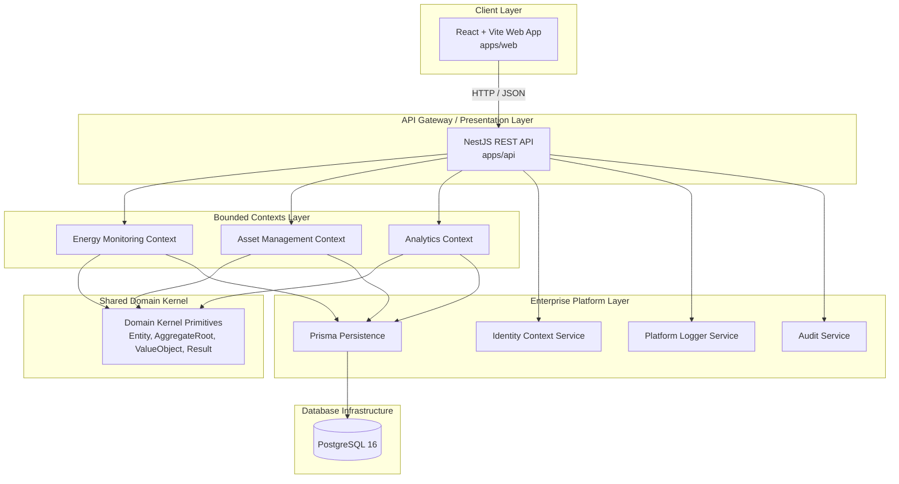

# Kinergy Platform - Architecture Documentation

Welcome to the technical architecture documentation for the **Kinergy Platform**. This monorepo is engineered following **Clean Architecture**, **Domain-Driven Design (DDD)**, and **SOLID principles** inside an **Nx integrated monorepo**.

---

## High-Level System Architecture

---

## Architecture Navigation

1. **[System Architecture Guide](./system-architecture.md)**
   - Clean Architecture layer boundaries (Domain, Application, Infrastructure, Presentation).
   - Monorepo directory structure mapping.
   - Request flow execution sequence diagrams.
2. **[Domain-Driven Design Strategy](./domain-driven-design.md)**
   - Tactical DDD patterns (`Entity`, `AggregateRoot`, `ValueObject`, `IDomainEvent`, `Result`).
   - Shared Domain Kernel specification.
   - Aggregate boundary isolation rules.
3. **[Bounded Contexts & Platform Layer](./bounded-contexts.md)**
   - Bounded context decoupling and context mapping.
   - Enterprise Platform Infrastructure (`Identity`, `Logging`, `Audit`, `Persistence`).
   - Cross-cutting concern dependency injection.
4. **[Architectural Patterns & Decisions](./patterns-and-decisions.md)**
   - Dependency Inversion Principle (DIP) & Port-Adapter architecture.
   - Generic Repository Pattern (`IRepository<T>`).
   - CQRS (Command Query Responsibility Segregation) decision alignment.
   - Architectural Decision Record (ADR) methodology.
5. **[Identity Bounded Context Architecture](./identity-domain-model.md)**
   - Single authoritative specification for Identity Aggregate, account lifecycle, RBAC/ABAC, Clean Architecture layering, and downstream context integration.
