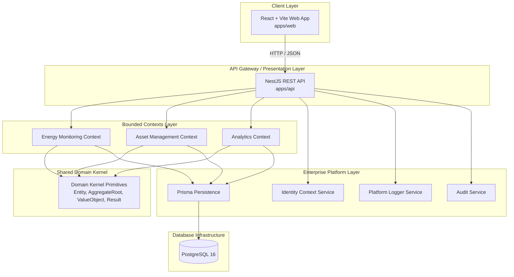

# Kinergy Platform - Architecture Documentation

Welcome to the technical architecture documentation for the **Kinergy Platform**. This monorepo is engineered following **Clean Architecture**, **Domain-Driven Design (DDD)**, and **SOLID principles** inside an **Nx integrated monorepo**.

---

## High-Level System Architecture

```mermaid
graph TD
    subgraph Client Layer
        WEB[React + Vite Web App<br/>apps/web]
    end

    subgraph API Gateway / Presentation Layer
        API[NestJS REST API<br/>apps/api]
    end

    subgraph Bounded Contexts Layer
        BC1[Energy Monitoring Context]
        BC2[Asset Management Context]
        BC3[Analytics Context]
    end

    subgraph Shared Domain Kernel
        KERNEL[Domain Kernel Primitives<br/>Entity, AggregateRoot, ValueObject, Result]
    end

    subgraph Enterprise Platform Layer
        PERSIST[Prisma Persistence]
        IDENT[Identity Context Service]
        LOG[Platform Logger Service]
        AUDIT[Audit Service]
    end

    subgraph Database Infrastructure
        DB[(PostgreSQL 16)]
    end

    WEB -->|HTTP / JSON| API
    API --> BC1
    API --> BC2
    API --> BC3
    BC1 --> KERNEL
    BC2 --> KERNEL
    BC3 --> KERNEL
    BC1 --> PERSIST
    BC2 --> PERSIST
    BC3 --> PERSIST
    PERSIST --> DB
    API --> IDENT
    API --> LOG
    API --> AUDIT
```

---

## Architecture Navigation

1. **[System Architecture Guide](./system-architecture.md)**
   - Clean Architecture layer boundaries (Domain, Application, Infrastructure, Presentation).
   - Monorepo directory structure mapping.
   - Request flow execution sequence diagrams.
2. **[Domain-Driven Design Strategy](./domain-driven-design.md)**
   - Tactical DDD patterns (`Entity`, `AggregateRoot`, `ValueObject`, `IDomainEvent`, `Result`).
   - Shared Domain Kernel specification.
   - Aggregate boundary isolation rules.
3. **[Bounded Contexts & Platform Layer](./bounded-contexts.md)**
   - Bounded context decoupling and context mapping.
   - Enterprise Platform Infrastructure (`Identity`, `Logging`, `Audit`, `Persistence`).
   - Cross-cutting concern dependency injection.
4. **[Architectural Patterns & Decisions](./patterns-and-decisions.md)**
   - Dependency Inversion Principle (DIP) & Port-Adapter architecture.
   - Generic Repository Pattern (`IRepository<T>`).
   - CQRS (Command Query Responsibility Segregation) decision alignment.
   - Architectural Decision Record (ADR) methodology.
5. **[Identity Bounded Context Architecture](./identity-domain-model.md)**
   - Single authoritative specification for Identity Aggregate, account lifecycle, RBAC/ABAC, Clean Architecture layering, and downstream context integration.
6. **[Gym Management Reconnaissance & Baseline (Phase 5.1-A)](./gym-management-reconnaissance.md)**
   - Authoritative reconnaissance baseline, bounded context constraints, and client ownership rules for Gym Management.
7. **[Gym Management Bounded Context Specification (Phase 5.1-B)](./contexts/gym.md)**
   - Authoritative domain ownership, Context Map, and integration boundary specifications for Gym Management.
8. **[Gym Management Canonical Domain Vocabulary (Phase 5.1-C)](../business/gym-vocabulary.md)**
   - Authoritative ubiquitous language, semantic models, and term definitions for Gym Management.
9. **[Gym Management Aggregate Boundaries & Consistency Architecture (Phase 5.1-D)](./gym-aggregate-boundaries.md)**
   - Authoritative aggregate boundaries (`Membership`, `MembershipPlan`, `AttendanceRecord`), invariants, and concurrency rules.
10. **[Gym Management Lifecycle Models & Domain Invariants (Phase 5.1-E)](./gym-lifecycle-and-invariants.md)**
    - Authoritative state machine transitions, freeze/renewal mathematical rules, access eligibility engine, and canonical time model.
11. **[Resources Management Architecture Hub (Phase 6)](./resources/README.md)**
    - Central architecture documentation hub, baseline discovery, and governance for Phase 6: Consumable Inventory & Fixed Assets.
12. **[SaleSource Database Migration Architecture & Decision Record](./sale-source-database-migration-decision.md)**
    - Authoritative database migration strategy, pre-migration schema inspection, rollback procedures, and index optimization for commercial origins (`SaleSource`).
13. **[SaleSource Extensibility Review & Design Guardrails](./sale-source-extensibility-review.md)**
    - Evaluation of future source extensibility, design guardrails, and non-polymorphic evolution.
14. **[SaleSource Commercial Origin Architecture Specification (Milestone 7.9)](./sale-source-specification.md)**
    - Authoritative technical specification for `SaleSource`: purpose, structure, supported types, aggregate ownership, bounded context boundaries, persistence, API, and traceability matrix.
15. **[Phase 7 Financial Persistence Architecture & Relational Engineering Specification (Milestone 7.10)](./sales-persistence-specification.md)**
    - Authoritative technical specification for Phase 7 persistence: Sale, SaleItem, Discount, Payment, Receipt, SaleSource, database constraints, index strategy, transaction boundaries, bounded context isolation, and end-to-end traceability matrix.
16. **[Sale Application Layer Specification & Traceability Matrix (Milestone 7.11)](./sale-application-use-cases-and-traceability.md)**
    - Authoritative technical specification for Phase 7.11 application use cases (`CreateSale`, `AddSaleItem`, `RemoveSaleItem`, `ApplyDiscount`, `CalculateSale`, `GetSale`, `ListSales`, `CancelSale`), architectural axioms (Application orchestrates, Domain decides, Repository persists, Database enforces structural integrity), multi-transport controller readiness, and end-to-end traceability matrix.
17. **[Payment Application Layer Specification & Traceability Matrix (Milestone 7.12)](./payment-application-use-cases-and-traceability.md)**
    - Authoritative technical specification for Phase 7.12 payment use cases (`CreatePayment`, `CompletePayment`, `FailPayment`, `CancelPayment`, `GetPayment`, `ListPayments`, `GetSalePaymentHistory`), atomic cross-aggregate settlement invariant, RBAC authorization matrix, and end-to-end traceability matrix.
