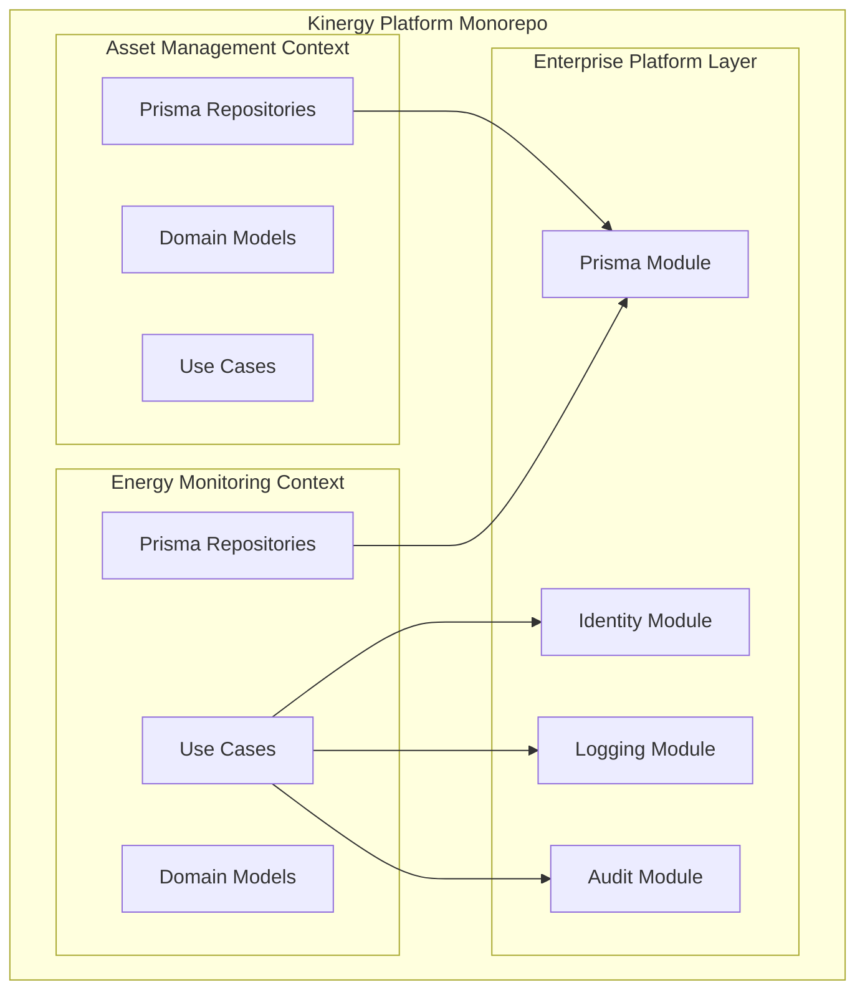
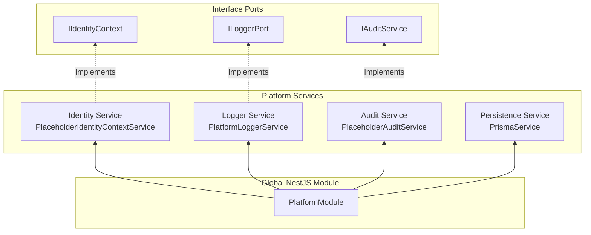

# Bounded Contexts & Platform Infrastructure Layer

## Bounded Context Isolation

In Domain-Driven Design, a **Bounded Context** is an explicit boundary within which a domain model applies. Every bounded context in the Kinergy Platform maintains its own models, application use cases, and persistence mappings to prevent context bleed.

---

## Enterprise Platform Layer Architecture

The **Platform Layer** (`apps/api/src/platform/`) provides enterprise cross-cutting infrastructure services to bounded contexts through NestJS dependency injection.

### Platform Service Specifications

1. **Identity Platform Service (`apps/api/src/platform/identity/`)**:
   - Interface: `IIdentityContext` (`IDENTITY_CONTEXT` symbol).
   - Implementation: `PlaceholderIdentityContextService` returning system default user context.
   - Decoupled interface allows zero-friction replacement with Auth0/Keycloak/OIDC providers in future phases.
2. **Logging Platform Service (`apps/api/src/platform/logging/`)**:
   - Interface: `ILoggerPort` (`LOGGER_PORT` symbol).
   - Implementation: `PlatformLoggerService` wrapping NestJS `Logger`.
3. **Audit Platform Service (`apps/api/src/platform/audit/`)**:
   - Interface: `IAuditService` (`AUDIT_SERVICE` symbol).
   - Implementation: `PlaceholderAuditService` recording structured audit log events (`IAuditLogEvent`) via `ILoggerPort`.
4. **Persistence Platform Service (`apps/api/src/platform/persistence/prisma/`)**:
   - Service: `PrismaService` extending `PrismaClient` with `OnModuleInit` (`$connect()`) and `OnModuleDestroy` (`$disconnect()`).
   - Module: Global `PrismaModule`.
