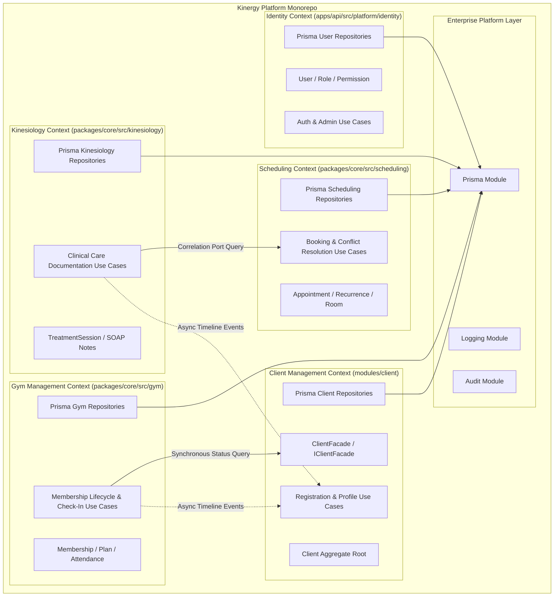
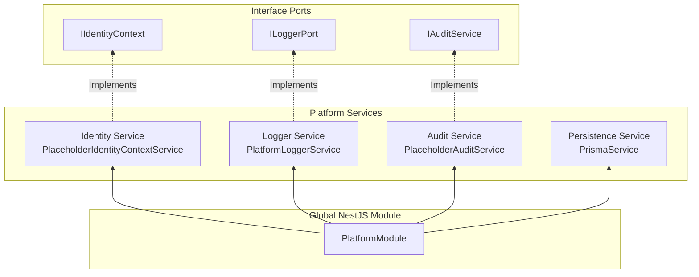

# Bounded Contexts & Platform Architecture

## 1. Bounded Context Isolation

In Domain-Driven Design, a **Bounded Context** is an explicit boundary within which a domain model applies. Every bounded context in the Kinergy Platform maintains its own models, application use cases, and persistence mappings to prevent context bleed.

---

## 2. Bounded Context Catalog & Specifications

| Bounded Context       | Package / Directory               | Core Aggregates                                    | Specification Document                                                     |
| :-------------------- | :-------------------------------- | :------------------------------------------------- | :------------------------------------------------------------------------- |
| **Identity (IAM)**    | `apps/api/src/platform/identity/` | `User`, `Role`, `Permission`, `RefreshToken`       | [Identity Domain Model](./identity-domain-model.md)                        |
| **Client Management** | `modules/client/`                 | `Client`, `ClientTimelineEntry`                    | [Client Subsystem Architecture](../../modules/client/docs/ARCHITECTURE.md) |
| **Scheduling**        | `packages/core/src/scheduling/`   | `Appointment`, `RecurrenceSeries`, `Room`          | [Scheduling Architecture](../scheduling/architecture.md)                   |
| **Kinesiology**       | `packages/core/src/kinesiology/`  | `TreatmentSession`, `SessionNotes` (SOAP)          | [Kinesiology Specification](./contexts/kinesiology.md)                     |
| **Gym Management**    | `packages/core/src/gym/`          | `Membership`, `MembershipPlan`, `AttendanceRecord` | [Gym Specification](./contexts/gym.md)                                     |

---

## 3. Enterprise Platform Layer Architecture

The **Platform Layer** (`apps/api/src/platform/`) provides enterprise cross-cutting infrastructure services to bounded contexts through NestJS dependency injection.

### Platform Service Specifications

1. **Identity Platform Service (`apps/api/src/platform/identity/`)**:
   - Interface: `IIdentityContext` (`IDENTITY_CONTEXT` symbol).
   - Implementation: `PlaceholderIdentityContextService` returning authenticated user context (`ReqUser`).
2. **Logging Platform Service (`apps/api/src/platform/logging/`)**:
   - Interface: `ILoggerPort` (`LOGGER_PORT` symbol).
   - Implementation: `PlatformLoggerService` wrapping NestJS `Logger`.
3. **Audit Platform Service (`apps/api/src/platform/audit/`)**:
   - Interface: `IAuditService` (`AUDIT_SERVICE` symbol).
   - Implementation: `PlaceholderAuditService` recording structured audit log events (`IAuditLogEvent`) via `ILoggerPort`.
4. **Persistence Platform Service (`apps/api/src/platform/persistence/prisma/`)**:
   - Service: `PrismaService` extending `PrismaClient` with `OnModuleInit` (`$connect()`) and `OnModuleDestroy` (`$disconnect()`).
   - Module: Global `PrismaModule`.
