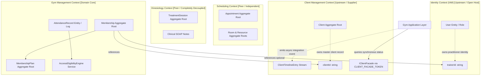
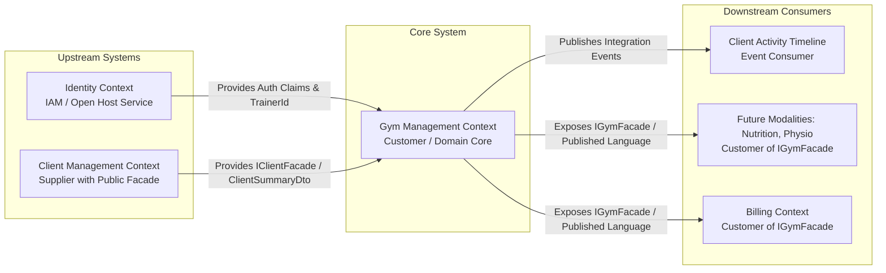

# Gym Management Bounded Context — Domain Ownership, Vocabulary & Context Map

## 1. Executive Summary & Context Purpose

The **Gym Management Bounded Context** is the authoritative fitness facility operational domain within the Kinergy modular monolith platform. It is responsible for governing gym memberships, plan definitions, validity periods, recurring renewals, lifecycle state transitions (active, frozen, expired, cancelled), access eligibility rules, and attendance check-in tracking.

### Core Business Purpose

In accordance with Domain-Driven Design (DDD) and Clean Architecture principles:

1. **Governing Memberships**: Modeling fitness memberships as consistency-isolated Aggregate Roots (`Membership`) with optimistic concurrency control (`version: number`).
2. **Cataloging Membership Plans**: Defining immutable terms, durations, visit limits, and pricing tiers (`MembershipPlan`).
3. **Membership Lifecycle Management**: Enforcing deterministic state transitions (`PENDING`, `ACTIVE`, `FROZEN`, `EXPIRED`, `CANCELLED`, `TERMINATED`) via a domain state machine.
4. **Facility Access & Turnstile Eligibility**: Providing instantaneous, high-throughput verification of facility entry privileges based on membership status and client standing.
5. **Attendance Tracking**: Logging immutable timestamped check-in records (`AttendanceRecord`) across turnstiles, front-desk kiosks, and manual entry points.
6. **Trainer Service Allocation**: Linking members with assigned trainers via opaque scalar identifiers (`trainerId: string`) without duplicating staff or user entities.
7. **Cross-Context Event Dispatching**: Publishing integration events (`MembershipPurchasedIntegrationEvent`, `AttendanceRecordedIntegrationEvent`) to asynchronously populate the Client Activity Timeline.

---

## 2. The Mandatory Architectural Question & Core Invariant

> **Mandatory Architectural Invariant**:
> **Gym Management is the sole authoritative owner of gym membership lifecycle states, membership plan terms & validity policies, recurring membership renewal & expiration logic, facility entry eligibility evaluation, attendance tracking & turnstile check-in logs, and operational trainer-member service allocation within the fitness facility.**

No other bounded context (Client Management, Identity, Scheduling, Kinesiology, Billing) may define, mutate, or govern gym membership lifecycle, attendance verification, or plan eligibility rules.

---

## 3. Context Responsibilities & Non-Responsibilities

### 3.1 Responsibilities (Inside Gym Management)

| Category                  | Specific Responsibilities                                                                                                                                                                     |
| :------------------------ | :-------------------------------------------------------------------------------------------------------------------------------------------------------------------------------------------- |
| **Membership Lifecycle**  | State transitions (`PENDING`, `ACTIVE`, `FROZEN`, `EXPIRED`, `CANCELLED`, `TERMINATED`), validity period calculations (`startDate`, `endDate`), renewal automation, freeze window management. |
| **Plan Catalog**          | Plan name, code, duration days, billing cycle frequency, visit limits, allowed access time windows, pricing tier type.                                                                        |
| **Access Verification**   | Evaluating member eligibility at turnstiles/kiosks, grace period allowances, denial reasons (`EXPIRED`, `FROZEN`, `INACTIVE_CLIENT`, `LIMIT_EXCEEDED`).                                       |
| **Attendance Logging**    | Append-only check-in timestamps, facility zone, entry method (`BARCODE`, `RFID`, `MANUAL`, `BIOMETRIC`), operator ID.                                                                         |
| **Trainer Assignment**    | Assigning member to trainer (`trainerId: string`) for operational fitness guidance or personal training packages.                                                                             |
| **Integration Contracts** | Emitting domain & integration events, exposing `IGymFacade` for downstream cross-context queries.                                                                                             |

### 3.2 Non-Responsibilities (Strictly Excluded & Prohibited)

| Prohibited Concern         | Reason for Exclusion                                                             | Owning Bounded Context                                 |
| :------------------------- | :------------------------------------------------------------------------------- | :----------------------------------------------------- |
| **Client Master Identity** | Personal demographics, phone, email, E.164 normalization, search index.          | **Client Management** (`modules/client/`)              |
| **User Authentication**    | Password hashing (Argon2id), JWT access/refresh tokens, user security status.    | **Identity / IAM** (`apps/api/src/platform/identity/`) |
| **Calendar Booking**       | Calendar slot reservation, room double-booking prevention, recurrence series.    | **Scheduling** (`packages/core/src/scheduling/`)       |
| **Clinical Treatment**     | Medico-legal SOAP progress notes, clinical diagnoses, neuromuscular evaluations. | **Kinesiology** (`packages/core/src/kinesiology/`)     |
| **Payment Transactions**   | Credit card processing, gateway webhooks, bank invoices, tax calculation.        | **Billing / Payments** (Future Context)                |

---

## 4. Upstream & Downstream Context Map

### Context Relationships & Strategic Patterns

1. **Client Management $\rightarrow$ Gym Management (Customer-Supplier / In-Process Facade)**:
   - Gym Management is the **Customer**; Client Management is the **Supplier**.
   - Synchronous interactions pass strictly through `IClientFacade` via `CLIENT_FACADE_TOKEN`.
   - Zero direct imports of `Client` aggregate or Prisma client repositories.
2. **Identity $\rightarrow$ Gym Management (Open Host Service / Conformist Actor Claims)**:
   - Gym controllers and use cases consume authenticated user context via `IIdentityContext` (`ReqUser`).
   - Staff trainers are referenced strictly as opaque scalar `trainerId: string` (matching `User.id`).
3. **Gym Management $\rightarrow$ Client Timeline (Event Publisher - Event Subscriber)**:
   - Gym emits immutable integration events (`schemaVersion = 1 as const`).
   - Client Timeline consumes events asynchronously without creating domain-level coupling.
4. **Gym Management $\rightarrow$ Scheduling (Decoupled Peer Contexts)**:
   - Personal training appointments in Scheduling reference `clientId` and `therapistId`/`trainerId`.
   - Scheduling does not manage gym turnstile check-ins; Gym does not manage room calendar math.
5. **Gym Management $\rightarrow$ Kinesiology (Completely Isolated Peers)**:
   - Zero direct runtime dependencies. Confidential clinical SOAP notes remain strictly segregated.

---

## 5. Integration Boundaries Specification

| Relationship                                | Direction                          | Data / Contract                                                            | Owning Context                       | Forbidden Coupling                                                                     |
| :------------------------------------------ | :--------------------------------- | :------------------------------------------------------------------------- | :----------------------------------- | :------------------------------------------------------------------------------------- |
| **Gym $\rightarrow$ Client**                | Downstream $\leftarrow$ Upstream   | `IClientFacade` (`isClientActive`, `getClientSummary`), `ClientSummaryDto` | Client Management                    | ❌ Importing `Client` aggregate, `PrismaClientRepository`, or querying `clients` table |
| **Gym $\rightarrow$ Identity**              | Downstream $\leftarrow$ Upstream   | `ReqUser` (`userId`, `roleId`), scalar `trainerId: string`                 | Identity (IAM)                       | ❌ Importing `User` aggregate, password hasher, or querying `users` table              |
| **Gym $\rightarrow$ Scheduling**            | Peer $\leftrightarrow$ Peer        | Scalar `appointmentId?: string`, async integration events                  | Scheduling                           | ❌ Importing `Appointment` aggregate, room recurrence engines, or booking slots        |
| **Gym $\rightarrow$ Kinesiology**           | Zero Direct Coupling               | None (Strictly segregated)                                                 | Kinesiology                          | ❌ Importing `TreatmentSession`, SOAP clinical notes, or clinical history              |
| **Gym $\rightarrow$ Timeline**              | Publisher $\rightarrow$ Subscriber | Integration Events (`schemaVersion: 1`, `readonly`)                        | Gym owns Event; Client owns Timeline | ❌ Synchronous $2\text{PC}$ database transactions or shared SQL triggers               |
| **Gym $\rightarrow$ Downstream Modalities** | Supplier $\rightarrow$ Customer    | `IGymFacade`, `MembershipSummaryDto`, `MemberAccessStatus`                 | Gym Management                       | ❌ Downstream modalities embedding gym membership logic                                |

---

## 6. Authoritative Ownership Matrix

| Domain Concept             | Owning Bounded Context | Ownership Classification        | Allowed Consumers                                                        | Strictly Forbidden Owners                    |
| :------------------------- | :--------------------- | :------------------------------ | :----------------------------------------------------------------------- | :------------------------------------------- |
| **`Client`**               | **Client Management**  | Master Aggregate Root           | Scheduling, Kinesiology, Gym, Billing (via `clientId` / `IClientFacade`) | ❌ Gym, Scheduling, Kinesiology, Identity    |
| **`User`**                 | **Identity (IAM)**     | Master Aggregate Root           | All contexts (via request actor ID / `trainerId` / `therapistId`)        | ❌ Gym, Client, Scheduling, Kinesiology      |
| **`Membership`**           | **Gym Management**     | Master Aggregate Root           | Client Timeline, Gym API, Billing, Future Modalities                     | ❌ Client, Identity, Scheduling, Kinesiology |
| **`MembershipPlan`**       | **Gym Management**     | Master Aggregate Root           | Gym API, Front Desk, Billing                                             | ❌ Client, Scheduling, Kinesiology           |
| **`MembershipStatus`**     | **Gym Management**     | Value Object / State Machine    | Gym Application, Client Summary, Front Desk UI                           | ❌ Client, Scheduling, Identity              |
| **`MembershipPeriod`**     | **Gym Management**     | Immutable Value Object          | Gym Application, Billing                                                 | ❌ Client, Scheduling                        |
| **`Renewal`**              | **Gym Management**     | Domain Policy / Use Case        | Gym Application, Billing Integration                                     | ❌ Client, Scheduling, Identity              |
| **`AttendanceRecord`**     | **Gym Management**     | Entity / Append-Only Log        | Front Desk UI, Client Timeline, Analytics                                | ❌ Client, Scheduling, Identity              |
| **`Trainer` (Assignment)** | **Gym Management**     | Scalar `trainerId: string` Link | Gym Desk, Scheduling, Mobile App                                         | ❌ Gym duplicating User credentials/profile  |
| **`Appointment`**          | **Scheduling**         | Master Aggregate Root           | Kinesiology, Gym, Reception UI                                           | ❌ Gym, Kinesiology, Client                  |
| **`TreatmentSession`**     | **Kinesiology**        | Master Aggregate Root           | Clinical Workspace, Client Timeline                                      | ❌ Gym, Scheduling, Client                   |
| **`Room`**                 | **Scheduling**         | Master Aggregate Root           | Scheduling Calendar, Maintenance                                         | ❌ Gym, Kinesiology, Client                  |

---

## 7. Architectural Invariants for Automated Enforcement

1. **Invariant 1 (Membership Sovereignty)**: Gym Management is the sole authoritative owner of membership lifecycle, plan rules, validity periods, renewals, freezes, and expirations.
2. **Invariant 2 (Attendance Sovereignty)**: Gym Management is the sole authoritative owner of attendance verification, check-in validation, and turnstile entry history.
3. **Invariant 3 (Client Identity Decoupling)**: Master client records and personal profiles are strictly owned by Client Management. Gym entities store only scalar `clientId: string`.
4. **Invariant 4 (Identity & Credential Isolation)**: User accounts, passwords, and tokens are strictly owned by Identity. Gym references staff/trainers strictly via scalar `trainerId: string`.
5. **Invariant 5 (Clinical Boundary Protection)**: Medico-legal SOAP clinical notes and kinesiology treatment sessions are strictly inaccessible and uncoupled from Gym Management.
6. **Invariant 6 (Zero Foreign Domain Imports)**: Gym domain production code (`packages/core/src/gym/domain/`) MUST NOT import from `@nestjs/*`, `@prisma/*`, `express`, or foreign bounded context internals (`scheduling/domain`, `kinesiology/domain`, `modules/client/domain`).
7. **Invariant 7 (Zero Distributed Transactions)**: State transitions in Gym Management execute locally with optimistic concurrency (`version: number`); no $2\text{PC}$ or cross-context SQL foreign keys.
8. **Invariant 8 (Asynchronous Timeline Projection)**: Cross-context activity feed updates use immutable integration event contracts (`schemaVersion = 1 as const`, all properties `readonly`).

---

## 8. Architectural Decision Records (ADRs)

- **[ADR-0054: Gym Management Bounded Context Ownership, Context Map & Architectural Invariants](file:///c:/Projects/kinergy-platform/docs/adr/0054-gym-management-bounded-context-ownership-and-context-map.md)**
- **[ADR-0002: Client Domain Foundation & Identity Decoupling](file:///c:/Projects/kinergy-platform/docs/adr/0002-client-domain-foundation.md)**
- **[ADR-0010: Backend Clean Architecture & Layering](file:///c:/Projects/kinergy-platform/docs/adr/0010-backend-clean-architecture-layering.md)**
- **[ADR-0012: Shared Domain Kernel Abstractions](file:///c:/Projects/kinergy-platform/docs/adr/0012-shared-domain-kernel-abstractions.md)**
- **[ADR-0045: Kinesiology Bounded Context Ownership & Cross-Context Identifiers](file:///c:/Projects/kinergy-platform/docs/adr/0045-kinesiology-bounded-context-and-cross-context-identifiers.md)**
- **[ADR-0048: Anti-Corruption Layer Port Architecture](file:///c:/Projects/kinergy-platform/docs/adr/0048-scheduling-to-kinesiology-anti-corruption-layer-port-architecture.md)**
- **[ADR-0049: Cross-Context Lifecycle Independence & Non-Corruption Invariants](file:///c:/Projects/kinergy-platform/docs/adr/0049-cross-context-lifecycle-independence-and-non-corruption-invariants.md)**
- **[ADR-0052: Client Longitudinal Activity Timeline & Cross-Context Event Projection](file:///c:/Projects/kinergy-platform/docs/adr/0052-client-longitudinal-activity-timeline-and-cross-context-event-projection-architecture.md)**
