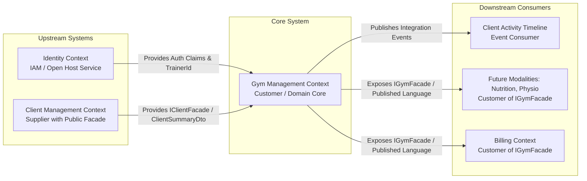
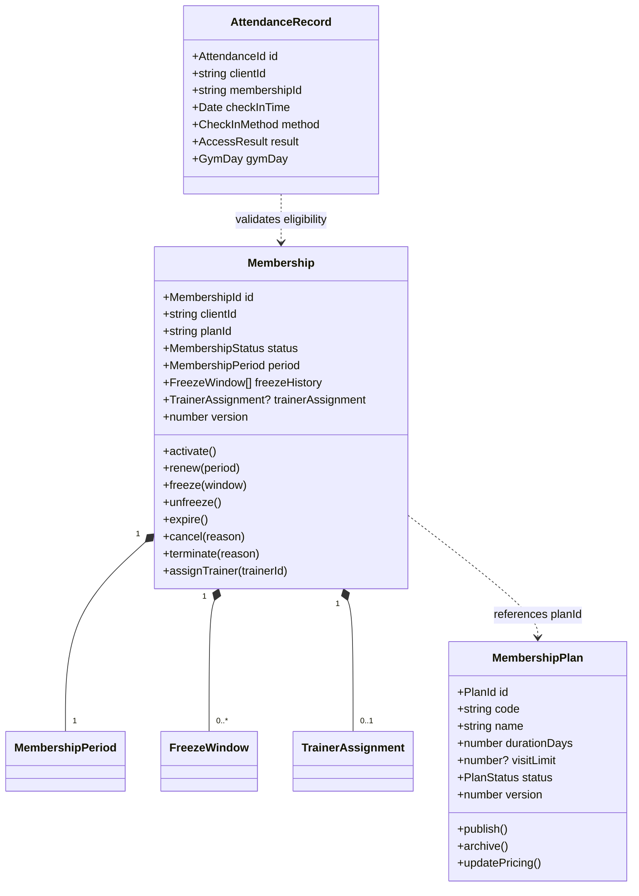
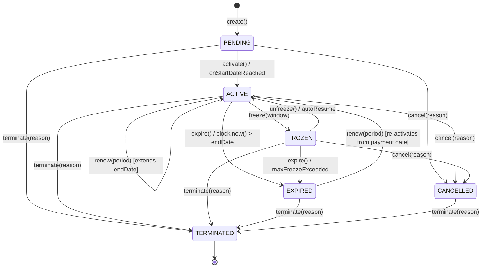

# Gym Management Bounded Context — Domain Ownership, Vocabulary, Aggregates & Lifecycle Specification

- **Status**: Authoritative Bounded Context Architecture Baseline
- **Location**: `packages/core/src/gym/`
- **Owner**: Gym Management Engineering Team
- **ADR Suite**: [ADR-0054](../../adr/0054-gym-management-bounded-context-ownership-and-context-map.md), [ADR-0055](../../adr/0055-gym-management-canonical-domain-vocabulary-and-semantic-contracts.md), [ADR-0056](../../adr/0056-gym-management-aggregate-discovery-and-boundary-decisions.md), [ADR-0057](../../adr/0057-gym-management-domain-invariants-and-lifecycle-model.md)

---

## 1. Context Purpose & Business Capability

The **Gym Management Bounded Context** is the authoritative fitness facility operational domain within the Kinergy platform. It is responsible for governing gym memberships, commercial plan catalogs, validity period calculations, recurring renewals, lifecycle state transitions (active, frozen, expired, cancelled, terminated), access eligibility verification, and high-throughput attendance check-in tracking.

### Core Business Capabilities

1. **Membership Agreement Governance**: Encapsulates customer facility entitlement agreements inside consistency-enforcing Aggregate Roots (`Membership`) with optimistic concurrency versioning (`version: number`).
2. **Commercial Plan Catalog Management**: Defines commercial templates, duration days, billing cycle frequencies, visit limits, and pricing tiers (`MembershipPlan`).
3. **Deterministic Lifecycle State Transitions**: Enforces strict state transitions (`PENDING`, `ACTIVE`, `FROZEN`, `EXPIRED`, `CANCELLED`, `TERMINATED`) via a domain state machine.
4. **Turnstile & Kiosk Access Eligibility**: Delivers sub-millisecond, fail-safe verification of facility entry privileges based on membership standing, temporal date math, freeze state, client profile standing, and anti-passback cooldowns.
5. **High-Throughput Attendance Logging**: Persists immutable, append-only check-in audit records (`AttendanceRecord`) across turnstiles, front-desk kiosks, and manual reception checkpoints.
6. **Operational Trainer Assignment**: Links members to fitness staff via opaque scalar identifiers (`trainerId: string`) without duplicating user accounts.
7. **Asynchronous Cross-Context Dispatching**: Dispatches immutable integration events (`MembershipPurchasedIntegrationEvent`, `AttendanceRecordedIntegrationEvent`) to populate the Client Activity Timeline asynchronously.

---

## 2. The Mandatory Architectural Invariant & Ownership Matrix

> **Mandatory Architectural Invariant**:  
> **Gym Management is the sole authoritative owner of gym membership lifecycle states, membership plan terms & validity policies, recurring membership renewal & expiration logic, facility entry eligibility evaluation, attendance tracking & turnstile check-in logs, and operational trainer-member service allocation within the fitness facility.**

No other bounded context (Client Management, Identity, Scheduling, Kinesiology, Billing) may define, mutate, or govern gym membership lifecycle, attendance verification, or plan eligibility rules.

### 2.1 Authoritative Ownership Matrix

| Domain Concept          | Owning Bounded Context | DDD Classification         | Allowed Consumers                                                        | Strictly Forbidden Owners                    |
| :---------------------- | :--------------------- | :------------------------- | :----------------------------------------------------------------------- | :------------------------------------------- |
| **`Client`**            | **Client Management**  | Master Aggregate Root      | Scheduling, Kinesiology, Gym, Billing (via `clientId` / `IClientFacade`) | ❌ Gym, Scheduling, Kinesiology, Identity    |
| **`User`**              | **Identity (IAM)**     | Master Aggregate Root      | All contexts (via request actor ID / `trainerId` / `therapistId`)        | ❌ Gym, Client, Scheduling, Kinesiology      |
| **`Membership`**        | **Gym Management**     | Master Aggregate Root      | Client Timeline, Gym API, Billing, Future Modalities                     | ❌ Client, Identity, Scheduling, Kinesiology |
| **`MembershipPlan`**    | **Gym Management**     | Master Aggregate Root      | Gym API, Front Desk, Billing                                             | ❌ Client, Scheduling, Kinesiology           |
| **`MembershipStatus`**  | **Gym Management**     | Value Object / Enum        | Gym Application, Client Summary, Front Desk UI                           | ❌ Client, Scheduling, Identity              |
| **`MembershipPeriod`**  | **Gym Management**     | Immutable Value Object     | Gym Application, Billing                                                 | ❌ Client, Scheduling                        |
| **`AttendanceRecord`**  | **Gym Management**     | Entity / Append-Only Log   | Front Desk UI, Client Timeline, Analytics                                | ❌ Client, Scheduling, Identity              |
| **`TrainerAssignment`** | **Gym Management**     | Value Object (`trainerId`) | Gym Front Desk, Member Profile View                                      | ❌ Gym duplicating User credentials/profile  |
| **`Appointment`**       | **Scheduling**         | Master Aggregate Root      | Kinesiology, Gym, Reception UI                                           | ❌ Gym, Kinesiology, Client                  |
| **`TreatmentSession`**  | **Kinesiology**        | Master Aggregate Root      | Clinical Workspace, Client Timeline                                      | ❌ Gym, Scheduling, Client                   |
| **`Room`**              | **Scheduling**         | Master Aggregate Root      | Scheduling Calendar, Maintenance                                         | ❌ Gym, Kinesiology, Client                  |

---

## 3. Upstream & Downstream Context Map

### Context Relationships & Strategic Patterns

1. **Client Management $\rightarrow$ Gym Management (Customer-Supplier / In-Process Facade)**:
   - Gym Management is the **Customer**; Client Management is the **Supplier**.
   - Synchronous interactions pass strictly through `IClientFacade` via `CLIENT_FACADE_TOKEN`.
   - Zero direct imports of `Client` aggregate or Prisma client repositories.
2. **Identity $\rightarrow$ Gym Management (Open Host Service / Conformist Actor Claims)**:
   - Gym controllers and use cases consume authenticated user context via `IIdentityContext` (`ReqUser`).
   - Staff trainers are referenced strictly as opaque scalar `trainerId: string` (matching `User.id`).
3. **Gym Management $\rightarrow$ Client Timeline (Event Publisher - Event Subscriber)**:
   - Gym emits immutable integration events (`schemaVersion = 1 as const`).
   - Client Timeline consumes events asynchronously without creating domain-level coupling.
4. **Gym Management $\rightarrow$ Scheduling (Decoupled Peer Contexts)**:
   - Scheduling does not manage gym turnstile check-ins; Gym does not manage room calendar math. Correlated only via optional scalar `appointmentId?: string`.
5. **Gym Management $\rightarrow$ Kinesiology (Completely Isolated Peers)**:
   - Zero direct runtime dependencies. Confidential clinical SOAP notes remain strictly segregated.

---

## 4. Canonical Domain Vocabulary

| Canonical Term          | Conceptual Definition                                                                             | Owner Context      | DDD Type                | Allowed Values / States                                                                        | Prohibited Synonyms / Rejected Aliases                                          |
| :---------------------- | :------------------------------------------------------------------------------------------------ | :----------------- | :---------------------- | :--------------------------------------------------------------------------------------------- | :------------------------------------------------------------------------------ |
| **`Membership`**        | Long-lived agreement granting a client facility access privileges.                                | **Gym Management** | Aggregate Root          | `PENDING`, `ACTIVE`, `FROZEN`, `EXPIRED`, `CANCELLED`, `TERMINATED`                            | ❌ `Subscription`, `Pass`, `GymContract`, `GymCard`, `UserMembership`, `Member` |
| **`MembershipPlan`**    | Commercial product catalog definition detailing validity duration, visit limits, and access tier. | **Gym Management** | Aggregate Root / Entity | `DRAFT`, `ACTIVE`, `ARCHIVED`                                                                  | ❌ `Package`, `Tariff`, `PricingPlan`, `Tier`, `GymPackage`, `ServicePlan`      |
| **`MembershipStatus`**  | Explicit lifecycle state enum of a `Membership`.                                                  | **Gym Management** | Value Object / Enum     | `PENDING`, `ACTIVE`, `FROZEN`, `EXPIRED`, `CANCELLED`, `TERMINATED`                            | ❌ `SubscriptionState`, `MemberState`, `CardStatus`, `ContractStatus`           |
| **`MembershipPeriod`**  | Immutable validity time interval (`startDate`, `endDate`) of a membership.                        | **Gym Management** | Value Object            | Immutable interval                                                                             | ❌ `ValidityWindow`, `DateRange`, `DurationPeriod`, `ContractTerm`              |
| **`Renewal`**           | Domain operation extending a membership's validity interval upon re-subscription.                 | **Gym Management** | Domain Action / Policy  | N/A (Event / Command)                                                                          | ❌ `Re-subscription`, `Extension`, `Re-bill`, `Top-Up`                          |
| **`FreezeWindow`**      | Approved temporary suspension interval halting access and extending expiration.                   | **Gym Management** | Value Object            | `PENDING`, `ACTIVE`, `COMPLETED`                                                               | ❌ `PausePeriod`, `SuspensionWindow`, `Hold`, `VacationTime`                    |
| **`AttendanceRecord`**  | Immutable append-only audit record of a physical check-in attempt at a facility.                  | **Gym Management** | Entity / Log            | Immutable                                                                                      | ❌ `VisitRecord`, `TurnstileLog`, `EntryLog`, `Swipe`, `AccessLog`              |
| **`CheckIn`**           | The physical entry verification action at a facility turnstile or kiosk.                          | **Gym Management** | Domain Command / Action | N/A (Command)                                                                                  | ❌ `Swipe`, `Tap`, `Scan`, `ClockIn`, `Entry`, `GatePass`                       |
| **`AccessEligibility`** | Evaluated access decision outcome.                                                                | **Gym Management** | Value Object / Result   | `GRANTED`, `DENIED_EXPIRED`, `DENIED_FROZEN`, `DENIED_INACTIVE_CLIENT`, `DENIED_LIMIT_REACHED` | ❌ `PassStatus`, `EntryPermission`, `AllowAccess`, `GateResponse`               |
| **`GymDay`**            | Timezone-aware local business date (`YYYY-MM-DD`) for quota and operating calculations.           | **Gym Management** | Value Object            | Immutable                                                                                      | ❌ `BusinessDate`, `CalendarDay`, `FacilityDate`, `ShiftDate`                   |
| **`TrainerAssignment`** | Operational link associating a client/membership with an assigned fitness trainer.                | **Gym Management** | Value Object            | `ACTIVE`, `INACTIVE`                                                                           | ❌ `TrainerUser`, `Coach`, `Instructor`, `PersonalTrainer`                      |

---

## 5. Aggregate Boundaries & Class Structure

---

## 6. Deterministic Lifecycle State Machine

### Deterministic State Transition Matrix

| Current State    | Command / Trigger   | Preconditions & Guard Rules                                                                     | Allowed? | Target State | Side Effect / Domain Event        |
| :--------------- | :------------------ | :---------------------------------------------------------------------------------------------- | :------: | :----------- | :-------------------------------- |
| `PENDING`        | `activate(clock)`   | `clock.now() >= period.startDate` and client active                                             |    ✅    | `ACTIVE`     | `MembershipActivatedEvent`        |
| `PENDING`        | `cancel(reason)`    | Explicit administrative / member request                                                        |    ✅    | `CANCELLED`  | `MembershipCancelledEvent`        |
| `PENDING`        | `terminate(reason)` | Fraud / policy breach / client archived                                                         |    ✅    | `TERMINATED` | `MembershipTerminatedEvent`       |
| `PENDING`        | `freeze(window)`    | Cannot freeze un-activated membership                                                           |    ❌    | —            | `InvalidStateTransitionException` |
| `PENDING`        | `expire()`          | Cannot expire un-activated membership                                                           |    ❌    | —            | `InvalidStateTransitionException` |
| **`ACTIVE`**     | `freeze(window)`    | No active freeze window; freeze duration $\le$ max allowed                                      |    ✅    | `FROZEN`     | `MembershipFrozenEvent`           |
| **`ACTIVE`**     | `renew(period)`     | Valid payment receipt; extends `period.endDate`                                                 |    ✅    | `ACTIVE`     | `MembershipRenewedEvent`          |
| **`ACTIVE`**     | `expire(clock)`     | `clock.now() > period.endDate`                                                                  |    ✅    | `EXPIRED`    | `MembershipExpiredEvent`          |
| **`ACTIVE`**     | `cancel(reason)`    | Voluntary cancellation or contract exit                                                         |    ✅    | `CANCELLED`  | `MembershipCancelledEvent`        |
| **`ACTIVE`**     | `terminate(reason)` | Irrevocable breach / client archived                                                            |    ✅    | `TERMINATED` | `MembershipTerminatedEvent`       |
| **`FROZEN`**     | `unfreeze(clock)`   | Active freeze exists; recalculates `endDate = endDate + freezeDuration`                         |    ✅    | `ACTIVE`     | `MembershipResumedEvent`          |
| **`FROZEN`**     | `cancel(reason)`    | Member cancels while on freeze                                                                  |    ✅    | `CANCELLED`  | `MembershipCancelledEvent`        |
| **`FROZEN`**     | `terminate(reason)` | Irrevocable breach / fraud                                                                      |    ✅    | `TERMINATED` | `MembershipTerminatedEvent`       |
| **`FROZEN`**     | `freeze(window)`    | Already frozen                                                                                  |    ❌    | —            | `InvalidStateTransitionException` |
| **`EXPIRED`**    | `renew(period)`     | Renewed during grace period; sets `startDate = paymentDate`, `endDate = paymentDate + duration` |    ✅    | `ACTIVE`     | `MembershipRenewedEvent`          |
| **`EXPIRED`**    | `terminate(reason)` | Purge / archival / fraud                                                                        |    ✅    | `TERMINATED` | `MembershipTerminatedEvent`       |
| **`EXPIRED`**    | `freeze(window)`    | Cannot freeze lapsed contract                                                                   |    ❌    | —            | `InvalidStateTransitionException` |
| **`CANCELLED`**  | `terminate(reason)` | Final purge                                                                                     |    ✅    | `TERMINATED` | `MembershipTerminatedEvent`       |
| **`CANCELLED`**  | Any other cmd       | Terminal state cannot transition                                                                |    ❌    | —            | `InvalidStateTransitionException` |
| **`TERMINATED`** | Any command         | Irrevocable terminal state                                                                      |    ❌    | —            | `InvalidStateTransitionException` |

---

## 7. Attendance Access Eligibility & Time Model

### 7.1 Access Eligibility Rules

1. **Client Standing**: Rejects entry if client master profile is inactive/archived (`DENIED_INACTIVE_CLIENT`).
2. **Temporal Window Guard**: Rejects entry in real-time if `clock.now() > period.endDate` (`DENIED_EXPIRED`).
3. **Freeze Guard**: Rejects entry if membership is `FROZEN` (`DENIED_FROZEN`).
4. **Anti-Passback Policy**: Enforces a 300-second (5-minute) minimum cooldown threshold between badge taps for the same member at the same turnstile (`DENIED_ANTI_PASSBACK_COOLDOWN`).
5. **Quota Guard**: Rejects entry if `visitLimit` is reached on limited-visit passes (`DENIED_LIMIT_REACHED`).

### 7.2 Canonical Time & Timezone Model

1. **UTC Storage**: All timestamps are stored and transmitted in standard **UTC (ISO 8601)** (`YYYY-MM-DDTHH:mm:ss.sssZ`).
2. **Local Business Day (`GymDay`)**: Daily quotas and attendance logs calculate against the facility's local timezone (e.g. `America/Guayaquil`) to eliminate UTC midnight rollover errors.
3. **Deterministic Clock Abstraction**: Domain code accepts an injected `Clock` interface (`now(): Date`, `timezone(): string`). Production uses `SystemClock`; unit tests use `TestClock`.

---

## 8. Architectural Invariants for Automated Enforcement

1. **Invariant 1 (Membership Sovereignty)**: Gym Management is the sole authoritative owner of membership lifecycle, plan rules, validity periods, renewals, freezes, and expirations.
2. **Invariant 2 (Attendance Sovereignty)**: Gym Management is the sole authoritative owner of attendance verification, check-in validation, and turnstile entry history.
3. **Invariant 3 (Client Identity Decoupling)**: Master client records and personal profiles are strictly owned by Client Management. Gym entities store only scalar `clientId: string`.
4. **Invariant 4 (Identity & Credential Isolation)**: User accounts, passwords, and tokens are strictly owned by Identity. Gym references staff/trainers strictly via scalar `trainerId: string`.
5. **Invariant 5 (Clinical Boundary Protection)**: Medico-legal SOAP clinical notes and kinesiology treatment sessions are strictly inaccessible and uncoupled from Gym Management.
6. **Invariant 6 (Zero Foreign Domain Imports)**: Gym domain production code (`packages/core/src/gym/domain/`) MUST NOT import from `@nestjs/*`, `@prisma/*`, `express`, or foreign bounded context internals (`scheduling/domain`, `kinesiology/domain`, `modules/client/domain`).
7. **Invariant 7 (Zero Distributed Transactions)**: State transitions in Gym Management execute locally with optimistic concurrency (`version: number`); no $2\text{PC}$ or cross-context SQL foreign keys.
8. **Invariant 8 (Asynchronous Timeline Projection)**: Cross-context activity feed updates use immutable integration event contracts (`schemaVersion = 1 as const`, all properties `readonly`).

---

## 9. Architectural Decision Records (ADRs)

- **[ADR-0054: Gym Management Bounded Context Ownership & Context Map](../../adr/0054-gym-management-bounded-context-ownership-and-context-map.md)**
- **[ADR-0055: Gym Management Canonical Domain Vocabulary & Semantic Contracts](../../adr/0055-gym-management-canonical-domain-vocabulary-and-semantic-contracts.md)**
- **[ADR-0056: Gym Management Aggregate Discovery & Boundary Decisions](../../adr/0056-gym-management-aggregate-discovery-and-boundary-decisions.md)**
- **[ADR-0057: Gym Management Domain Invariants & Lifecycle Model](../../adr/0057-gym-management-domain-invariants-and-lifecycle-model.md)**
- **[ADR-0002: Client Domain Foundation & Identity Decoupling](../../adr/0002-client-domain-foundation.md)**
- **[ADR-0010: Backend Clean Architecture & Layering](../../adr/0010-backend-clean-architecture-layering.md)**
- **[ADR-0012: Shared Domain Kernel Abstractions](../../adr/0012-shared-domain-kernel-abstractions.md)**
- **[ADR-0045: Kinesiology Bounded Context Ownership & Cross-Context Identifiers](../../adr/0045-kinesiology-bounded-context-and-cross-context-identifiers.md)**
- **[ADR-0052: Client Longitudinal Activity Timeline & Cross-Context Event Projection](../../adr/0052-client-longitudinal-activity-timeline-and-cross-context-event-projection-architecture.md)**
