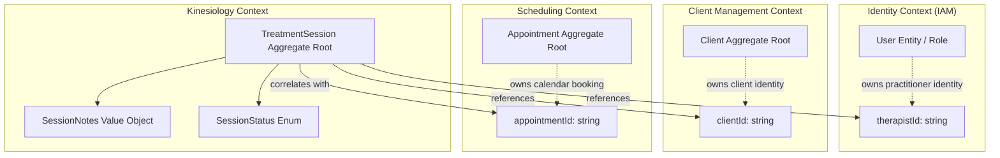
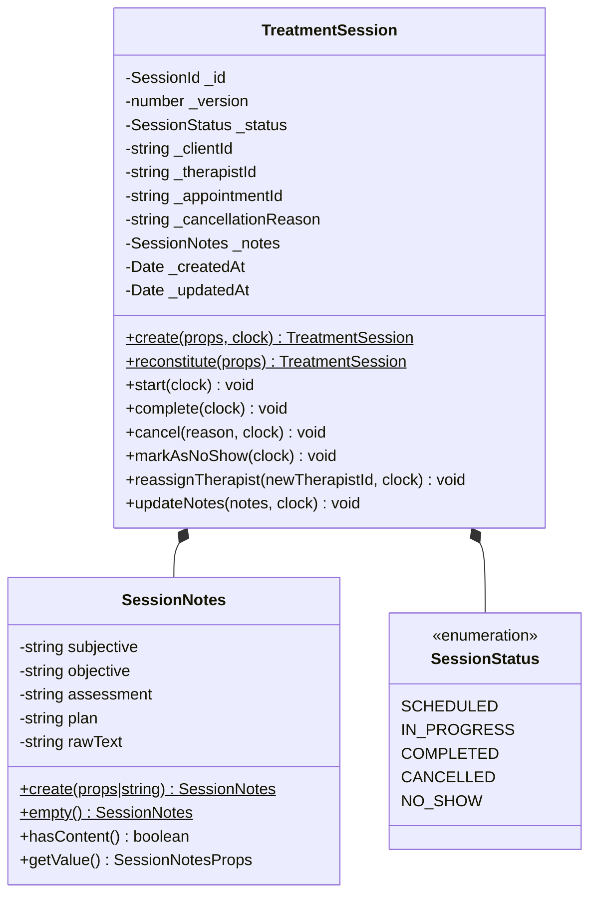

# Kinesiology Bounded Context — Domain Ownership, Vocabulary & Architectural Boundaries

## 1. Executive Summary & Context Purpose

The **Kinesiology Bounded Context** is the authoritative clinical domain within the Kinergy modular monolith platform responsible for managing therapeutic clinical encounters, structured therapy progress documentation, and clinical lifecycle progression.

### Core Business Purpose

At the completed foundation and integration stage (Milestones 4.1–4.7), Kinesiology's domain responsibilities comprise:

1. **Governing Treatment Sessions**: Modeling the clinical encounter lifecycle through the `TreatmentSession` aggregate root.
2. **Clinical Lifecycle Progression**: Enforcing deterministic state transitions from scheduling through in-progress care to completion or cancellation.
3. **Clinical Documentation**: Encapsulating structured SOAP progress notes (`SessionNotes`) or clinical free text recorded by the therapist.
4. **Treatment History (Read Model)**: Providing a longitudinal record of a client's completed clinical encounters.
5. **Cross-Context Event Projection**: Emitting `TreatmentSessionCompletedEvent` to feed the client management longitudinal activity timeline.
6. **Full-Stack Presentation Workspace**: Providing reactive, accessible clinical workflows in React (`apps/web/src/modules/kinesiology/`) backed by NestJS REST endpoints (`apps/api/src/kinesiology/`).

---

## 2. Core Architectural Principle & Context Map

> **Fundamental Context Rule**:
> Each bounded context owns its own domain concepts and invariants. Other contexts may reference those concepts via opaque scalar identifiers, but they do not own, mutate, or duplicate foreign aggregates.



---

## 3. Context Responsibilities, Ownership Matrix & Validation Boundaries

### Authoritative Data Ownership Matrix

| Data Concept                    | Authoritative Owning Context | Implementation Location           | Cross-Context Reference Mechanism                                                 |
| :------------------------------ | :--------------------------- | :-------------------------------- | :-------------------------------------------------------------------------------- |
| **`Client`**                    | **Client Management**        | `packages/client-domain/`         | Referenced in Kinesiology via opaque `clientId: string` (UUID)                    |
| **`Appointment`**               | **Scheduling**               | `packages/core/src/scheduling/`   | Referenced in Kinesiology via optional correlation `appointmentId: string` (UUID) |
| **`User` (Therapist Identity)** | **Identity (IAM)**           | `apps/api/src/platform/identity/` | Referenced in Kinesiology via author `therapistId: string` (UUID)                 |
| **`TreatmentSession`**          | **Kinesiology**              | `packages/core/src/kinesiology/`  | Local Aggregate Root governing the care encounter                                 |
| **`SessionStatus`**             | **Kinesiology**              | `packages/core/src/kinesiology/`  | Local Enum / Finite State Machine                                                 |
| **`SessionNotes`**              | **Kinesiology**              | `packages/core/src/kinesiology/`  | Local Immutable Value Object (SOAP structure)                                     |

### Validation Boundary Matrix (Who Validates What)

| Bounded Context       | Invariants & Rules Validated                                                                                                                     | Strictly Excluded Validation (Belongs to Other Contexts)                                                                           |
| :-------------------- | :----------------------------------------------------------------------------------------------------------------------------------------------- | :--------------------------------------------------------------------------------------------------------------------------------- |
| **Kinesiology**       | `TreatmentSession` lifecycle transitions, state terminality, `SessionNotes` structure, failure atomicity, and optimistic concurrency versioning. | Does NOT check whether a client is active in billing, whether a room is double-booked, or whether therapist credentials are valid. |
| **Scheduling**        | Calendar time slots, room availability, therapist shift overlaps, turnaround buffers, and appointment status transitions.                        | Does NOT validate clinical progress notes or therapeutic findings.                                                                 |
| **Client Management** | Client profile completeness, contact details, identity verification, and master timeline stream.                                                 | Does NOT manage calendar bookings or clinical therapy notes.                                                                       |
| **Identity (IAM)**    | User credentials, argon2id password hashing, JWT token generation/refresh, and RBAC permissions.                                                 | Does NOT manage client intake or clinical therapy sessions.                                                                        |

---

## 4. Ubiquitous Language & Canonical Vocabulary

To prevent terminology drift, the following definitions form the authoritative Ubiquitous Language for Kinesiology:

| Canonical Term         | Conceptual Definition & Scope                                                                                                   | Owner Context         | Prohibited Synonyms / Rejected Aliases                                                     |
| :--------------------- | :------------------------------------------------------------------------------------------------------------------------------ | :-------------------- | :----------------------------------------------------------------------------------------- |
| **`TreatmentSession`** | The root entity and clinical encounter record. Encapsulates status, SOAP notes, timestamps, and clinical findings.              | **Kinesiology**       | ❌ `Treatment`, `TreatmentRecord`, `PatientTreatment`, `TherapySession`, `ClinicalSession` |
| **`SessionStatus`**    | The clinical lifecycle state machine of a `TreatmentSession` (`SCHEDULED`, `IN_PROGRESS`, `COMPLETED`, `CANCELLED`, `NO_SHOW`). | **Kinesiology**       | ❌ `TreatmentStatus`, `TreatmentState`, `ClinicalStatus`, `AppointmentTreatmentStatus`     |
| **`SessionNotes`**     | Structured clinical notes (SOAP: subjective, objective, assessment, plan) or free-text observations.                            | **Kinesiology**       | ❌ `ClinicalNotes`, `TreatmentNotes`, `TherapyNotes`, `MedicalNotes`                       |
| **`Client`**           | The individual receiving therapeutic care. Master aggregate owned by Client Management.                                         | **Client Management** | ❌ `Patient`, `PatientAggregate`, `PatientProfile`, `KinesiologyClient`, `Customer`        |
| **`Therapist`**        | The clinical practitioner authoring the session. User entity with therapist role in Identity.                                   | **Identity / IAM**    | ❌ `Provider`, `Practitioner`, `Clinician`, `TherapistUser`                                |
| **`Appointment`**      | The logistical calendar reservation of a room, therapist shift, and time slot.                                                  | **Scheduling**        | ❌ `TreatmentAppointment`, `TherapyAppointment`, `KinesiologyAppointment`                  |
| **`SessionId`**        | Domain Value Object identifying a unique `TreatmentSession`.                                                                    | **Kinesiology**       | ❌ `TreatmentSessionId`, `KinesiologySessionId`                                            |
| **`ClientId`**         | Scalar string UUID identifying a registered `Client`.                                                                           | **Client Management** | ❌ `PatientId`, `SubjectId`, `CustomerRef`                                                 |
| **`TherapistId`**      | Scalar string UUID identifying a practitioner `User`.                                                                           | **Identity (IAM)**    | ❌ `ProviderId`, `PractitionerId`, `TherapistUserId`                                       |
| **`AppointmentId`**    | Scalar string UUID correlating a session to an `Appointment`.                                                                   | **Scheduling**        | ❌ `BookingId`, `AppointmentReferenceId`, `SlotId`                                         |

---

## 5. Aggregate Root Boundary & Field Breakdown

The **`TreatmentSession`** aggregate root is the single unit of consistency and concurrency for all clinical kinesiology care encounters.



---

## 6. Anti-Corruption Layer & Cross-Context Integration

```text
┌──────────────────────────────────────────────────────────────────────────┐
│                   UPSTREAM BOUNDED CONTEXT: SCHEDULING                   │
│                                                                          │
│  Role: Upstream / Supplier                                               │
│  Owns: Appointment Aggregate, Room Allocation, Resource Schedules       │
└────────────────────────────────────┬─────────────────────────────────────┘
                                     │
                  Anti-Corruption Layer Port Interface
                  (ISchedulingAppointmentLookupPort)
                                     │
                                     ▼
┌──────────────────────────────────────────────────────────────────────────┐
│                  DOWNSTREAM BOUNDED CONTEXT: KINESIOLOGY                 │
│                                                                          │
│  Role: Downstream / Consumer (Customer)                                  │
│  Owns: TreatmentSession Aggregate, Clinical Notes, Encounter History     │
└──────────────────────────────────────────────────────────────────────────┘
```

- **Application Orchestration**: `CreateTreatmentSessionFromAppointmentHandler` queries `ISchedulingAppointmentLookupPort` to verify appointment existence and eligibility (`SCHEDULED`, `CONFIRMED`, `CHECKED_IN`, `IN_PROGRESS` with clinical types `ASSESSMENT`, `TREATMENT`, `FOLLOW_UP`, `EVALUATION`).
- **Idempotency & Concurrency**: Enforces 1-to-1 cardinality via application pre-check and RDBMS `UNIQUE INDEX ON treatment_sessions(appointment_id)`.
- **Lifecycle Non-Corruption**: Upstream rescheduling or cancellations in Scheduling do not silently corrupt active or completed `TreatmentSession` records.

---

## 7. HTTP REST API & Frontend Presentation Architecture (Milestone 4.7)

### REST API Endpoints (`apps/api/src/kinesiology/`)

- `POST /api/v1/kinesiology/sessions`: Creates a new session from an eligible appointment.
- `GET /api/v1/kinesiology/sessions/:id`: Retrieves full session representation.
- `POST /api/v1/kinesiology/sessions/:id/start`: Transitions session to `IN_PROGRESS`.
- `POST /api/v1/kinesiology/sessions/:id/assign-therapist`: Reassigns practitioner with eligibility check.
- `PUT /api/v1/kinesiology/sessions/:id/notes`: Drafts or updates clinical progress notes.
- `POST /api/v1/kinesiology/sessions/:id/complete`: Signs off and finalizes the care encounter.
- `POST /api/v1/kinesiology/sessions/:id/cancel`: Cancels scheduled session with mandatory reason.
- `GET /api/v1/kinesiology/clients/:clientId/treatment-history`: Queries paginated clinical history.

### Frontend Module (`apps/web/src/modules/kinesiology/`)

- **Workspace Route**: `/kinesiology/sessions/:sessionId` (SOAP forms, character counters, lifecycle actions).
- **Client Tabs**: Integrated under `/clients/:clientId/treatments` and `/clients/:clientId/timeline`.
- **Server State**: Managed via TanStack Query (`useTreatmentSession`, `useTreatmentMutations`, `useClientTreatmentHistory`).
- **Authorization Gating**: Actions evaluated via `useAuth().hasPermission()` (`kinesiology.sessions.read`, `treat`, `assign`).

---

## 8. Architectural Decision Records (ADRs)

- **[ADR-0045: Kinesiology Bounded Context Ownership & Cross-Context Identifiers](file:///c:/Projects/kinergy-platform/docs/adr/0045-kinesiology-bounded-context-and-cross-context-identifiers.md)**
- **[ADR-0046: TreatmentSession Lifecycle State Machine & Transition Specification](file:///c:/Projects/kinergy-platform/docs/adr/0046-treatment-session-lifecycle-state-machine-and-transition-specification.md)**
- **[ADR-0047: Appointment Correlation, Uniqueness & Event Emission Architecture](file:///c:/Projects/kinergy-platform/docs/adr/0047-appointment-to-treatment-session-correlation-and-event-emission-architecture.md)**
- **[ADR-0048: Scheduling-to-Kinesiology Anti-Corruption Layer Port Architecture](file:///c:/Projects/kinergy-platform/docs/adr/0048-scheduling-to-kinesiology-anti-corruption-layer-port-architecture.md)**
- **[ADR-0049: Cross-Context Lifecycle Independence & Non-Corruption Invariants](file:///c:/Projects/kinergy-platform/docs/adr/0049-cross-context-lifecycle-independence-and-non-corruption-invariants.md)**
- **[ADR-0050: Clinical Therapist Assignment, Handover & Authorization Architecture in Kinesiology](file:///c:/Projects/kinergy-platform/docs/adr/0050-clinical-therapist-assignment-handover-and-authorization-architecture.md)**
- **[ADR-0051: Clinical Progress Notes (SOAP) Schema, Medico-Legal Immutability & Treatment History Query Architecture](file:///c:/Projects/kinergy-platform/docs/adr/0051-clinical-progress-notes-soap-schema-medico-legal-immutability-and-treatment-history-query-architecture.md)**
- **[ADR-0052: Client Longitudinal Activity Timeline & Cross-Context Event Projection Architecture](file:///c:/Projects/kinergy-platform/docs/adr/0052-client-longitudinal-activity-timeline-and-cross-context-event-projection-architecture.md)**
- **[ADR-0053: Clinical Treatment Session Presentation Workflow, SOAP Workspace & API Architecture](file:///c:/Projects/kinergy-platform/docs/adr/0053-clinical-treatment-session-presentation-workflow-soap-workspace-and-api-architecture.md)**
