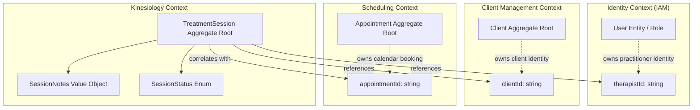

# Kinesiology Bounded Context — Domain Ownership, Vocabulary & Architectural Boundaries

## 1. Executive Summary & Context Purpose

The **Kinesiology Bounded Context** is the authoritative clinical domain within the Kinergy modular monolith platform responsible for managing therapeutic clinical encounters, structured therapy progress documentation, and clinical lifecycle progression.

### Core Business Purpose

At the current foundation stage (Milestone 4.1), Kinesiology's domain responsibilities comprise:

1. **Governing Treatment Sessions**: Modeling the clinical encounter lifecycle through the `TreatmentSession` aggregate root.
2. **Clinical Lifecycle Progression**: Enforcing deterministic state transitions from scheduling through in-progress care to completion or cancellation.
3. **Clinical Documentation**: Encapsulating structured SOAP progress notes (`SessionNotes`) or clinical free text recorded by the therapist.
4. **Treatment History (Read Model)**: Providing a longitudinal record of a client's completed clinical encounters.

---

## 2. Core Architectural Principle & Context Map

> **Fundamental Context Rule**:
> Each bounded context owns its own domain concepts and invariants. Other contexts may reference those concepts via opaque scalar identifiers, but they do not own, mutate, or duplicate foreign aggregates.



---

## 3. Context Responsibilities, Ownership Matrix & Validation Boundaries

### Authoritative Data Ownership Matrix

| Data Concept                    | Authoritative Owning Context | Implementation Location           | Cross-Context Reference Mechanism                                                 |
| :------------------------------ | :--------------------------- | :-------------------------------- | :-------------------------------------------------------------------------------- |
| **`Client`**                    | **Client Management**        | `packages/client-domain/`         | Referenced in Kinesiology via opaque `clientId: string` (UUID)                    |
| **`Appointment`**               | **Scheduling**               | `packages/core/src/scheduling/`   | Referenced in Kinesiology via optional correlation `appointmentId: string` (UUID) |
| **`User` (Therapist Identity)** | **Identity (IAM)**           | `apps/api/src/platform/identity/` | Referenced in Kinesiology via author `therapistId: string` (UUID)                 |
| **`TreatmentSession`**          | **Kinesiology**              | `packages/core/src/kinesiology/`  | Local Aggregate Root governing the care encounter                                 |
| **`SessionStatus`**             | **Kinesiology**              | `packages/core/src/kinesiology/`  | Local Enum / Finite State Machine                                                 |
| **`SessionNotes`**              | **Kinesiology**              | `packages/core/src/kinesiology/`  | Local Immutable Value Object (SOAP structure)                                     |

### Validation Boundary Matrix (Who Validates What)

| Bounded Context       | Invariants & Rules Validated                                                                                                                     | Strictly Excluded Validation (Belongs to Other Contexts)                                                                           |
| :-------------------- | :----------------------------------------------------------------------------------------------------------------------------------------------- | :--------------------------------------------------------------------------------------------------------------------------------- |
| **Kinesiology**       | `TreatmentSession` lifecycle transitions, state terminality, `SessionNotes` structure, failure atomicity, and optimistic concurrency versioning. | Does NOT check whether a client is active in billing, whether a room is double-booked, or whether therapist credentials are valid. |
| **Scheduling**        | Calendar time slots, room availability, therapist shift overlaps, turnaround buffers, and appointment status transitions.                        | Does NOT validate clinical progress notes or therapeutic findings.                                                                 |
| **Client Management** | Client profile completeness, contact details, identity verification, and master timeline stream.                                                 | Does NOT manage calendar bookings or clinical therapy notes.                                                                       |
| **Identity (IAM)**    | User credentials, argon2id password hashing, JWT token generation/refresh, and RBAC permissions.                                                 | Does NOT manage client intake or clinical therapy sessions.                                                                        |

---

## 4. Ubiquitous Language & Canonical Vocabulary

To prevent terminology drift, the following definitions form the authoritative Ubiquitous Language for Kinesiology:

| Canonical Term         | Conceptual Definition & Scope                                                                                                   | Owner Context         | Prohibited Synonyms / Rejected Aliases                                                     |
| :--------------------- | :------------------------------------------------------------------------------------------------------------------------------ | :-------------------- | :----------------------------------------------------------------------------------------- |
| **`TreatmentSession`** | The root entity and clinical encounter record. Encapsulates status, SOAP notes, timestamps, and clinical findings.              | **Kinesiology**       | ❌ `Treatment`, `TreatmentRecord`, `PatientTreatment`, `TherapySession`, `ClinicalSession` |
| **`SessionStatus`**    | The clinical lifecycle state machine of a `TreatmentSession` (`SCHEDULED`, `IN_PROGRESS`, `COMPLETED`, `CANCELLED`, `NO_SHOW`). | **Kinesiology**       | ❌ `TreatmentStatus`, `TreatmentState`, `ClinicalStatus`, `AppointmentTreatmentStatus`     |
| **`SessionNotes`**     | Structured clinical notes (SOAP: subjective, objective, assessment, plan) or free-text observations.                            | **Kinesiology**       | ❌ `ClinicalNotes`, `TreatmentNotes`, `TherapyNotes`, `MedicalNotes`                       |
| **`Client`**           | The individual receiving therapeutic care. Master aggregate owned by Client Management.                                         | **Client Management** | ❌ `Patient`, `PatientAggregate`, `PatientProfile`, `KinesiologyClient`, `Customer`        |
| **`Therapist`**        | The clinical practitioner authoring the session. User entity with therapist role in Identity.                                   | **Identity / IAM**    | ❌ `Provider`, `Practitioner`, `Clinician`, `TherapistUser`                                |
| **`Appointment`**      | The logistical calendar reservation of a room, therapist shift, and time slot.                                                  | **Scheduling**        | ❌ `TreatmentAppointment`, `TherapyAppointment`, `KinesiologyAppointment`                  |
| **`SessionId`**        | Domain Value Object identifying a unique `TreatmentSession`.                                                                    | **Kinesiology**       | ❌ `TreatmentSessionId`, `KinesiologySessionId`                                            |
| **`ClientId`**         | Scalar string UUID identifying a registered `Client`.                                                                           | **Client Management** | ❌ `PatientId`, `SubjectId`, `CustomerRef`                                                 |
| **`TherapistId`**      | Scalar string UUID identifying a practitioner `User`.                                                                           | **Identity (IAM)**    | ❌ `ProviderId`, `PractitionerId`, `TherapistUserId`                                       |
| **`AppointmentId`**    | Scalar string UUID correlating a session to an `Appointment`.                                                                   | **Scheduling**        | ❌ `BookingId`, `AppointmentReferenceId`, `SlotId`                                         |

---

## 5. Aggregate Root Boundary & Field Breakdown

The **`TreatmentSession`** aggregate root is the single unit of consistency and concurrency for all clinical kinesiology care encounters.

```text
TreatmentSession (Aggregate Root)
 ├── id: SessionId                  ◄── Unique Local Aggregate ID (Value Object)
 ├── version: number                ◄── Optimistic Concurrency Control Version (>= 1)
 ├── status: SessionStatus          ◄── Current Lifecycle Status
 ├── clientId: string               ◄── Scalar UUID Reference to Client Management
 ├── therapistId: string            ◄── Scalar UUID Reference to Identity User
 ├── appointmentId: string          ◄── Scalar UUID Reference to Scheduling Appointment
 ├── cancellationReason?: string    ◄── Reason Captured When Cancelled (Trimmed String)
 ├── notes: SessionNotes            ◄── Structured Clinical SOAP Notes (Immutable Value Object)
 ├── createdAt: Date                ◄── Immutable Creation Timestamp (Defensive Cloned Date)
 └── updatedAt: Date                ◄── Last Mutation Timestamp (Defensive Cloned Date)
```

### Comprehensive Field-by-Field Specification

| Field                    | Type            | Ownership         |           Mutability            | Domain Purpose & Significance                                                                                                                 |
| :----------------------- | :-------------- | :---------------- | :-----------------------------: | :-------------------------------------------------------------------------------------------------------------------------------------------- |
| **`id`**                 | `SessionId`     | Kinesiology       |            Immutable            | Unique identity of the clinical encounter aggregate root. Auto-generated (`sess_<timestamp>_<random>`) or explicitly assigned upon creation.  |
| **`version`**            | `number`        | Kinesiology       |      Managed by Aggregate       | Monotonically increasing integer ($\ge 1$) for optimistic concurrency control. Prevents lost updates during concurrent edits.                 |
| **`status`**             | `SessionStatus` | Kinesiology       |     Mutable via Domain API      | Lifecycle state of the clinical encounter (`SCHEDULED`, `IN_PROGRESS`, `COMPLETED`, `CANCELLED`, `NO_SHOW`). Governed by state machine rules. |
| **`clientId`**           | `string`        | Client Management |            Immutable            | External correlation ID linking the clinical session to the recipient client record in Client Management.                                     |
| **`therapistId`**        | `string`        | Identity (IAM)    | Mutable via Domain Reassignment | External correlation ID linking the clinical session to the practitioner's user account in Identity.                                          |
| **`appointmentId`**      | `string`        | Scheduling        |            Immutable            | External correlation ID linking the clinical session to the calendar booking in Scheduling.                                                   |
| **`cancellationReason`** | `string?`       | Kinesiology       |     Mutable upon `cancel()`     | Clinical or administrative explanation captured when the session is transitioned to `CANCELLED`. Trimmed and sanitized.                       |
| **`notes`**              | `SessionNotes`  | Kinesiology       |   Mutable via `updateNotes()`   | Value Object holding structured clinical SOAP documentation (`subjective`, `objective`, `assessment`, `plan`) or `rawText`.                   |
| **`createdAt`**          | `Date`          | Kinesiology       |            Immutable            | Timestamp when the clinical encounter was initialized. Returns a defensive clone.                                                             |
| **`updatedAt`**          | `Date`          | Kinesiology       |      Managed by Aggregate       | Timestamp of the most recent domain mutation or state transition. Returns a defensive clone.                                                  |

---

## 6. Lifecycle State Machine & Transition Specification

The clinical session lifecycle is strictly governed by an explicit finite state machine inside `TreatmentSession` (specified in [ADR-0046](file:///c:/Projects/kinergy-platform/docs/adr/0046-treatment-session-lifecycle-state-machine-and-transition-specification.md)):

```text
       ┌──────────────┐
       │  SCHEDULED   │ (Initial State upon creation)
       └──────┬───────┘
         │    │    │
  start()│    │    │ cancel(reason) / markAsNoShow()
         ▼    ▼    ▼
 ┌─────────────┐ ┌─────────────┐ ┌─────────────┐
 │ IN_PROGRESS │ │  CANCELLED  │ │   NO_SHOW   │ (Terminal States)
 └──────┬──────┘ └─────────────┘ └─────────────┘
        │ complete()
        ▼
 ┌─────────────┐
 │  COMPLETED  │ (Terminal State)
 └─────────────┘
```

### Authoritative State Transition Table

| Operation                        | Precondition (Required State)              | Resulting State                  | Invalid-State Behavior                                                                                                                                                            |
| :------------------------------- | :----------------------------------------- | :------------------------------- | :-------------------------------------------------------------------------------------------------------------------------------------------------------------------------------- |
| **`start(clock?)`**              | `SCHEDULED`                                | `IN_PROGRESS`                    | Throws `InvalidSessionTransitionException` if invoked from `IN_PROGRESS`, `COMPLETED`, `CANCELLED`, or `NO_SHOW`. State remains unmodified.                                       |
| **`complete(clock?)`**           | `IN_PROGRESS`                              | `COMPLETED`                      | Throws `InvalidSessionTransitionException` if invoked from `SCHEDULED` (direct completion prohibited), `COMPLETED`, `CANCELLED`, or `NO_SHOW`. State remains unmodified.          |
| **`cancel(reason?, clock?)`**    | `SCHEDULED`                                | `CANCELLED`                      | Throws `InvalidSessionTransitionException` if invoked from `IN_PROGRESS` (mid-session cancellation prohibited), `COMPLETED`, `CANCELLED`, or `NO_SHOW`. State remains unmodified. |
| **`markAsNoShow(clock?)`**       | `SCHEDULED`                                | `NO_SHOW`                        | Throws `InvalidSessionTransitionException` if invoked from `IN_PROGRESS` (mid-session no-show prohibited), `COMPLETED`, `CANCELLED`, or `NO_SHOW`. State remains unmodified.      |
| **`updateNotes(notes, clock?)`** | `SCHEDULED`, `IN_PROGRESS`, or `COMPLETED` | State unchanged, `notes` updated | Throws `Error` if `notes` is null/undefined or if invoked on a session in `CANCELLED` or `NO_SHOW` terminal status.                                                               |

_Rule_: All transitions not explicitly listed in the table above are invalid by default.

### Important Business Semantics

1. **`SCHEDULED`**: The treatment session exists and is expected to occur.
2. **`IN_PROGRESS`**: The therapist has formally started the clinical encounter.
3. **`COMPLETED`**: The treatment session has reached its normal conclusion (**Terminal**).
4. **`CANCELLED`**: The session will not occur because it was cancelled prior to starting (**Terminal**).
5. **`NO_SHOW`**: The session did not occur because the client did not attend (**Terminal**).

---

## 7. Aggregate Invariants & Domain Rules

1. **Identity Validity**: `SessionId`, `ClientId`, `TherapistId`, and `AppointmentId` must be non-empty, trimmed strings.
2. **Creation State**: Every new `TreatmentSession` begins strictly in `SCHEDULED` status with `version = 1`. `CreateTreatmentSessionProps` exposes zero status override parameter.
3. **Lifecycle Authorization**: The `TreatmentSession` aggregate root is the sole authority over transitions. External layers (controllers, DTOs, application services) must not decide transition validity.
4. **No Direct `SCHEDULED -> COMPLETED` Transition**: A clinical encounter must be started (`IN_PROGRESS`) before it can be completed.
5. **Terminal State Immutability**: Once a session reaches `COMPLETED`, `CANCELLED`, or `NO_SHOW`, all subsequent transitions are permanently rejected.
6. **Failure Atomicity (Validate First, Mutate Second)**: Any operation that fails an invariant leaves the aggregate state, notes, and timestamps completely unchanged (`before.status === after.status`, `before.updatedAt === after.updatedAt`).
7. **Encapsulation Protection**: State cannot be mutated externally. Zero generic status setters (`setStatus`, `changeStatus`). Getters for mutable objects (`createdAt`, `updatedAt`, `uncommittedEvents`) return defensive clones.
8. **Value Object Immutability**: `SessionId` and `SessionNotes` are deeply frozen via `Object.freeze(this)`.

---

## 8. Domain Purity & Infrastructure Decoupling

The Kinesiology domain layer (`packages/core/src/kinesiology/domain/`) strictly enforces **Clean Architecture and DDD purity**:

- **Zero Infrastructure Dependencies**: 0 imports from Prisma (`@prisma/client`), NestJS (`@Injectable`), Express, Fastify, or database drivers.
- **Zero Presentation Dependencies**: 0 HTTP requests, responses, controllers, or API DTOs in domain entities.
- **Deterministic Time Abstraction**: Time-dependent logic relies on the domain `Clock` interface, allowing deterministic simulation via `TestClock` in unit tests.
- **Domain Exceptions**: Invariant violations throw native domain errors (`KinesiologyDomainException`, `InvalidSessionTransitionException`) with zero HTTP status code coupling.

---

## 9. Consistency Model & Transaction Isolation

```text
┌───────────────────────────┐      ┌───────────────────────────┐
│     Client Management     │      │        Scheduling         │
│  Owns Client Consistency  │      │Owns Appointment Consist.  │
└───────────────────────────┘      └───────────────────────────┘
              ▲                                  ▲
              │ (Zero Distributed Tx)            │ (Zero Distributed Tx)
┌─────────────┴─────────────┐      ┌─────────────┴─────────────┐
│         Identity          │      │        Kinesiology        │
│  Owns Identity Consist.   │      │Owns TreatmentSess. Consist│
└───────────────────────────┘      └───────────────────────────┘
```

1. **Strong Consistency within Aggregate**:
   - `TreatmentSession` invariants (status transitions, progress note integrity, concurrency versioning) are strongly consistent within the aggregate boundary.
   - Persistence operations execute strictly within Kinesiology database tables.
   - **Zero Distributed Transactions**: Creating or updating a `TreatmentSession` must NEVER participate in a distributed two-phase commit ($2\text{PC}$) or cross-context transaction with Client Management, Scheduling, or Identity.
2. **Cross-Context Consistency**:
   - Consistency between Kinesiology and external contexts is achieved through loose scalar identifier referencing and eventual consistency.
   - Cross-context workflows (e.g. updating the Client Timeline stream upon session completion) are driven by asynchronous domain event publishing rather than synchronous cross-context coupling.
3. **Optimistic Concurrency Control**:
   - `TreatmentSession` aggregates enforce `version: number` optimistic concurrency locking. Concurrent note edits return an optimistic locking conflict without touching foreign aggregates.

---

## 10. Cross-Context Integration Strategy & Guidelines

### Current Approved Strategy (Milestone 4.1)

- **Domain Level**: Pure opaque scalar identifier references (`clientId`, `therapistId`, `appointmentId`).
- **Persistence Level**: Zero foreign keys directly referencing tables across bounded context schemas; zero cross-context SQL joins.
- **Application Level**: Integration mechanisms are intentionally decoupled. Synchronous cross-context entity loading is strictly forbidden.

### Future Integration Decision Criteria

When future cross-context workflows are introduced (e.g. Milestone 4.2+), the integration mechanism must be selected according to the following architectural criteria:

| Integration Mechanism                       | When to Choose                                                                                                                                       | Architectural Trade-offs & Constraints                                                                                                                       |
| :------------------------------------------ | :--------------------------------------------------------------------------------------------------------------------------------------------------- | :----------------------------------------------------------------------------------------------------------------------------------------------------------- |
| **In-Process Application Port (Interface)** | When read-only reference validation is strictly required at the application layer before command dispatch (e.g. verifying `clientExists(clientId)`). | Port interface defined in Kinesiology Application layer; implemented by infrastructure adapter. Never leaks foreign domain entities into Kinesiology domain. |
| **Internal Domain Events (`DomainEvent`)**  | When intra-aggregate domain side-effects must be communicated within Kinesiology (e.g. state change recording).                                      | In-memory, synchronous within aggregate lifecycle. Zero cross-context publishing.                                                                            |

### Domain Events Justification & Emission Catalog (Milestone 4.2)

In strict accordance with the principle _"Do not create events simply because an entity changed"_, Kinesiology emits strongly-typed domain events with concrete downstream consumers:

| Domain Event                            | Triggering Method             | Downstream Architectural Consumer & Business Capability                                                                                                                                             |
| :-------------------------------------- | :---------------------------- | :-------------------------------------------------------------------------------------------------------------------------------------------------------------------------------------------------- |
| **`TreatmentSessionCompletedEvent`**    | `complete(clock?)`            | **Primary Clinical Milestone**. Triggers asynchronous projection to the Client Clinical Timeline read model, notifies scheduling of encounter conclusion, and serves as the billing ledger trigger. |
| **`TreatmentSessionStartedEvent`**      | `start(clock?)`               | Records clinical start timestamp, enabling accurate encounter duration tracking.                                                                                                                    |
| **`TreatmentSessionCancelledEvent`**    | `cancel(reason, clock?)`      | Propagates clinical cancellation reasons into client history and analytics.                                                                                                                         |
| **`TreatmentSessionNoShowEvent`**       | `markAsNoShow(clock?)`        | Alerts front desk reception and updates client attendance risk scores.                                                                                                                              |
| **`TreatmentSessionCreatedEvent`**      | `create(props, clock?)`       | Initializes read models and syncs clinical session queues.                                                                                                                                          |
| **`TreatmentSessionNotesUpdatedEvent`** | `updateNotes(notes, clock?)`  | Emits audit event for medico-legal compliance tracking clinical progress note revisions.                                                                                                            |
| **`TherapistAssignedToSessionEvent`**   | `assignTherapist(id, clock?)` | Updates clinician workload schedule when session handover occurs.                                                                                                                                   |

---

## 11. Anti-Corruption Principles & Boundary Rules

To prevent domain model erosion:

1. **Opaque Identifier Boundaries**: When receiving external IDs (`clientId`, `therapistId`, `appointmentId`), Kinesiology treats them as opaque scalar tokens. It does not validate foreign business rules (e.g., whether a client has active insurance or whether a room is double-booked).
2. **Cross-Aggregate Uniqueness Enforcement Boundary**:
   - The in-memory `TreatmentSession` aggregate cannot query existing database records; it only preserves `appointmentId` as an immutable scalar reference.
   - Application services coordinate duplicate checks prior to aggregate creation.
   - Persistence layer enforces concurrency safety via `UNIQUE (appointment_id)` database index.
3. **Translation at Application Ports**: External data entering Kinesiology use cases must be translated through DTO mappers and verified at boundary ports without leaking foreign domain types into Kinesiology aggregates.

---

## 12. Future Expansion Rules for TreatmentSession

To protect the aggregate from becoming an unmaintainable "god object", any future candidate property or entity must satisfy all 4 criteria before being placed inside `TreatmentSession`:

1. **Shared Consistency Boundary**: Must require immediate, atomic consistency with the session's lifecycle status and progress notes within the exact same database transaction.
2. **Invariant Enforcement**: Must participate in aggregate invariant checks enforced directly by `TreatmentSession`.
3. **Low Write Contention**: Must not introduce high concurrent write contention from multiple simultaneous actors (e.g. real-time multi-user collaborative editing should use separate streams/models).
4. **Clinical Domain Relevance**: Must represent clinical data of this specific care encounter (e.g. specific muscle test results recorded during this session), rather than general client profile data or scheduling logistics.

### Deliberately Deferred Scope (Milestone 4.3+)

- **Neuromuscular & Postural Assessments**: Joint Range of Motion (ROM), manual muscle testing (MMT), postural screening.
- **Clinical Treatment Plans & Goals**: Multi-session longitudinal protocols and goal tracking.
- **Therapeutic Exercise Library**: Exercise catalog, prescribed home exercise programs.
- **Billing & Insurance Claims**: CPT/ICD coding and Superbill generation.

---

## 13. Architectural Decision Records (ADRs)

- **[ADR-0045: Kinesiology Bounded Context Ownership & Cross-Context Identifiers](file:///c:/Projects/kinergy-platform/docs/adr/0045-kinesiology-bounded-context-and-cross-context-identifiers.md)**
- **[ADR-0046: TreatmentSession Lifecycle State Machine & Transition Specification](file:///c:/Projects/kinergy-platform/docs/adr/0046-treatment-session-lifecycle-state-machine-and-transition-specification.md)**
- **[ADR-0047: Appointment Correlation, Uniqueness & Event Emission Architecture](file:///c:/Projects/kinergy-platform/docs/adr/0047-appointment-to-treatment-session-correlation-and-event-emission-architecture.md)**
- **[ADR-0048: Scheduling-to-Kinesiology Anti-Corruption Layer Port Architecture](file:///c:/Projects/kinergy-platform/docs/adr/0048-scheduling-to-kinesiology-anti-corruption-layer-port-architecture.md)**
