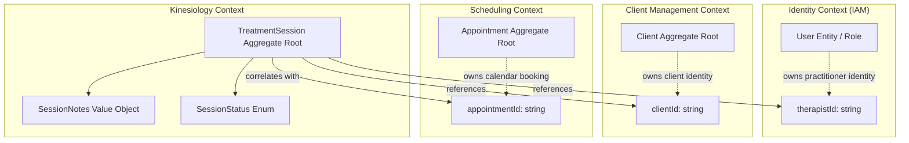

# Kinesiology Bounded Context — Domain Ownership, Vocabulary & Architectural Boundaries

## 1. Executive Summary & Context Purpose

The **Kinesiology Bounded Context** is the authoritative clinical domain within the Kinergy modular monolith platform responsible for managing therapeutic clinical encounters, structured therapy progress documentation, and clinical lifecycle progression.

### Core Business Purpose

At the current foundation stage (Milestone 4.1), Kinesiology's domain responsibilities comprise:

1. **Governing Treatment Sessions**: Modeling the clinical encounter lifecycle through the `TreatmentSession` aggregate root.
2. **Clinical Lifecycle Progression**: Enforcing deterministic state transitions from scheduling through in-progress care to completion or cancellation.
3. **Clinical Documentation**: Encapsulating structured SOAP progress notes (`SessionNotes`) or clinical free text recorded by the therapist.
4. **Treatment History (Read Model)**: Providing a longitudinal record of a client's completed clinical encounters.

---

## 2. Core Architectural Principle

> **Fundamental Context Rule**:
> Each bounded context owns its own domain concepts and invariants. Other contexts may reference those concepts via opaque scalar identifiers, but they do not own, mutate, or duplicate foreign aggregates.



---

## 3. Context Responsibilities & Explicit Non-Responsibilities

### What Kinesiology Owns (In-Scope)

- The **`TreatmentSession`** aggregate root.
- The **`SessionStatus`** state machine and transition rules.
- The **`SessionNotes`** clinical value object (SOAP structure and observations).
- Clinical invariant enforcement, optimistic concurrency versioning, and failure atomicity.
- Future clinical assessments, measurements, and therapeutic protocols (deferred to Milestone 4.2+).

### Explicit Non-Responsibilities (Owned by Other Contexts)

| Bounded Context       | Owned Domain Concepts                                                                                                                      | Kinesiology Boundary & Interaction                                                                                                                                     |
| :-------------------- | :----------------------------------------------------------------------------------------------------------------------------------------- | :--------------------------------------------------------------------------------------------------------------------------------------------------------------------- |
| **Client Management** | `Client` aggregate, master client profiles, contact data, client status, and client timeline stream.                                       | Kinesiology references the client solely via immutable `clientId: string` (UUID). Kinesiology never modifies or duplicates client records.                             |
| **Scheduling**        | `Appointment` aggregate, `Room` aggregate, `TherapistSchedule` aggregate, calendar reservations, slot availability, and booking lifecycle. | Kinesiology correlates sessions to calendar slots via optional `appointmentId: string`. Kinesiology does not manage room conflicts or calendar availability.           |
| **Identity (IAM)**    | `User` entity, credentials, authentication, password policies, and role-based permissions (`RBAC`).                                        | Kinesiology identifies the practitioner via `therapistId: string` matching a `User.id` with therapist role. Kinesiology does not manage credentials or login sessions. |
| **Billing (Future)**  | Invoices, insurance claims (CPT/ICD), payments, and pricing schedules.                                                                     | Kinesiology records therapeutic care; billing is decoupled and owned by the future Billing context.                                                                    |

---

## 4. Ubiquitous Language & Canonical Vocabulary

To prevent terminology drift, the following definitions form the authoritative Ubiquitous Language for Kinesiology:

| Canonical Term         | Conceptual Definition & Scope                                                                                                   | Owner Context         | Prohibited Synonyms / Rejected Aliases                                                     |
| :--------------------- | :------------------------------------------------------------------------------------------------------------------------------ | :-------------------- | :----------------------------------------------------------------------------------------- |
| **`TreatmentSession`** | The root entity and clinical encounter record. Encapsulates status, SOAP notes, timestamps, and clinical findings.              | **Kinesiology**       | ❌ `Treatment`, `TreatmentRecord`, `PatientTreatment`, `TherapySession`, `ClinicalSession` |
| **`SessionStatus`**    | The clinical lifecycle state machine of a `TreatmentSession` (`SCHEDULED`, `IN_PROGRESS`, `COMPLETED`, `CANCELLED`, `NO_SHOW`). | **Kinesiology**       | ❌ `TreatmentStatus`, `TreatmentState`, `ClinicalStatus`, `AppointmentTreatmentStatus`     |
| **`SessionNotes`**     | Structured clinical notes (SOAP: subjective, objective, assessment, plan) or free-text observations.                            | **Kinesiology**       | ❌ `ClinicalNotes`, `TreatmentNotes`, `TherapyNotes`, `MedicalNotes`                       |
| **`Client`**           | The individual receiving therapeutic care. Master aggregate owned by Client Management.                                         | **Client Management** | ❌ `Patient`, `PatientAggregate`, `PatientProfile`, `KinesiologyClient`, `Customer`        |
| **`Therapist`**        | The clinical practitioner authoring the session. User entity with therapist role in Identity.                                   | **Identity / IAM**    | ❌ `Provider`, `Practitioner`, `Clinician`, `TherapistUser`                                |
| **`Appointment`**      | The logistical calendar reservation of a room, therapist shift, and time slot.                                                  | **Scheduling**        | ❌ `TreatmentAppointment`, `TherapyAppointment`, `KinesiologyAppointment`                  |
| **`SessionId`**        | Domain Value Object identifying a unique `TreatmentSession`.                                                                    | **Kinesiology**       | ❌ `TreatmentSessionId`, `KinesiologySessionId`                                            |
| **`ClientId`**         | Scalar string UUID identifying a registered `Client`.                                                                           | **Client Management** | ❌ `PatientId`, `SubjectId`, `CustomerRef`                                                 |
| **`TherapistId`**      | Scalar string UUID identifying a practitioner `User`.                                                                           | **Identity (IAM)**    | ❌ `ProviderId`, `PractitionerId`, `TherapistUserId`                                       |
| **`AppointmentId`**    | Scalar string UUID correlating a session to an `Appointment`.                                                                   | **Scheduling**        | ❌ `BookingId`, `AppointmentReferenceId`, `SlotId`                                         |

---

## 5. Aggregate Root Boundary

The **`TreatmentSession`** aggregate root encapsulates all state mutations, ensuring invariant consistency:

```text
TreatmentSession (Aggregate Root)
 ├── id: SessionId                  ◄── Unique Local Aggregate ID (Value Object)
 ├── version: number                ◄── Optimistic Concurrency Control Version (>= 1)
 ├── status: SessionStatus          ◄── Current Lifecycle Status
 ├── clientId: string               ◄── Scalar UUID Reference to Client Management
 ├── therapistId: string            ◄── Scalar UUID Reference to Identity User
 ├── appointmentId: string          ◄── Scalar UUID Reference to Scheduling Appointment
 ├── cancellationReason?: string    ◄── Reason Captured When Cancelled (Trimmed String)
 ├── notes: SessionNotes            ◄── Structured Clinical SOAP Notes (Immutable Value Object)
 ├── createdAt: Date                ◄── Immutable Creation Timestamp (Defensive Cloned Date)
 └── updatedAt: Date                ◄── Last Mutation Timestamp (Defensive Cloned Date)
```

### Aggregate Encapsulation Guarantees

1. **Zero Foreign Aggregate Nesting**: `TreatmentSession` never imports or embeds `Client`, `Appointment`, or `User` domain entities.
2. **Zero Generic Setters**: Modifying lifecycle status or notes through arbitrary setters (`setStatus()`, `setNotes()`) is strictly prohibited. State transitions must occur through explicit domain-intent methods (`start()`, `complete()`, `cancel()`, `markAsNoShow()`, `updateNotes()`).
3. **Defensive Immutability**: Getters for mutable objects (`createdAt`, `updatedAt`, `uncommittedEvents`) return defensive clones (`new Date(...)`, `[...]`).

---

## 6. Lifecycle State Machine & Transition Matrix

The clinical session lifecycle is strictly governed by an explicit finite state machine inside `TreatmentSession` (specified in [ADR-0046](file:///c:/Projects/kinergy-platform/docs/adr/0046-treatment-session-lifecycle-state-machine-and-transition-specification.md)):

```text
       ┌──────────────┐
       │  SCHEDULED   │ (Initial State upon creation)
       └──────┬───────┘
         │    │    │
  start()│    │    │ cancel(reason) / markAsNoShow()
         ▼    ▼    ▼
 ┌─────────────┐ ┌─────────────┐ ┌─────────────┐
 │ IN_PROGRESS │ │  CANCELLED  │ │   NO_SHOW   │ (Terminal States)
 └──────┬──────┘ └─────────────┘ └─────────────┘
        │ complete()
        ▼
 ┌─────────────┐
 │  COMPLETED  │ (Terminal State)
 └─────────────┘
```

### Authoritative 20-Cell State Transition Matrix

| Current State | Operation                 | Next State    | Allowed? | Invariant Rule / Exception                                                       |
| :------------ | :------------------------ | :------------ | :------: | :------------------------------------------------------------------------------- |
| `SCHEDULED`   | `start(clock?)`           | `IN_PROGRESS` | **YES**  | Therapist formally starts clinical care encounter.                               |
| `SCHEDULED`   | `cancel(reason?, clock?)` | `CANCELLED`   | **YES**  | Session cancelled prior to starting. Reason captured.                            |
| `SCHEDULED`   | `markAsNoShow(clock?)`    | `NO_SHOW`     | **YES**  | Client failed to attend scheduled session.                                       |
| `IN_PROGRESS` | `complete(clock?)`        | `COMPLETED`   | **YES**  | Normal clinical encounter conclusion.                                            |
| `SCHEDULED`   | `complete(...)`           | —             |  **NO**  | Direct completion prohibited; throws `InvalidSessionTransitionException`.        |
| `IN_PROGRESS` | `start(...)`              | —             |  **NO**  | Already in progress; throws `InvalidSessionTransitionException`.                 |
| `IN_PROGRESS` | `cancel(...)`             | —             |  **NO**  | Mid-session cancellation prohibited; throws `InvalidSessionTransitionException`. |
| `IN_PROGRESS` | `markAsNoShow(...)`       | —             |  **NO**  | Mid-session no-show prohibited; throws `InvalidSessionTransitionException`.      |
| `COMPLETED`   | _Any Transition_          | —             |  **NO**  | Strictly Terminal; throws `InvalidSessionTransitionException`.                   |
| `CANCELLED`   | _Any Transition_          | —             |  **NO**  | Strictly Terminal; throws `InvalidSessionTransitionException`.                   |
| `NO_SHOW`     | _Any Transition_          | —             |  **NO**  | Strictly Terminal; throws `InvalidSessionTransitionException`.                   |

### Important Business Semantics

1. **`SCHEDULED`**: The treatment session exists and is expected to occur.
2. **`IN_PROGRESS`**: The therapist has formally started the clinical encounter.
3. **`COMPLETED`**: The treatment session has reached its normal conclusion (**Terminal**).
4. **`CANCELLED`**: The session will not occur because it was cancelled prior to starting (**Terminal**).
5. **`NO_SHOW`**: The session did not occur because the client did not attend (**Terminal**).

---

## 7. Aggregate Invariants & Domain Rules

1. **Identity Validity**: `SessionId`, `ClientId`, `TherapistId`, and `AppointmentId` must be non-empty, trimmed strings.
2. **Creation State**: Every new `TreatmentSession` begins strictly in `SCHEDULED` status with `version = 1`. `CreateTreatmentSessionProps` exposes zero status override parameter.
3. **Lifecycle Authorization**: The `TreatmentSession` aggregate root is the sole authority over transitions. External layers (controllers, DTOs, application services) must not decide transition validity.
4. **No Direct `SCHEDULED -> COMPLETED` Transition**: A clinical encounter must be started (`IN_PROGRESS`) before it can be completed.
5. **Terminal State Immutability**: Once a session reaches `COMPLETED`, `CANCELLED`, or `NO_SHOW`, all subsequent transitions are rejected.
6. **Failure Atomicity (Validate First, Mutate Second)**: Any operation that fails an invariant leaves the aggregate state, notes, and timestamps completely unchanged (`before.status === after.status`, `before.updatedAt === after.updatedAt`).
7. **Notes Mutation Rules**: Clinical progress notes (`SessionNotes`) can be updated during `SCHEDULED`, `IN_PROGRESS`, and `COMPLETED` states, but cannot be modified once a session is `CANCELLED` or `NO_SHOW`.

---

## 8. Domain Purity & Infrastructure Decoupling

The Kinesiology domain layer (`packages/core/src/kinesiology/domain/`) strictly enforces **Clean Architecture and DDD purity**:

- **Zero Infrastructure Dependencies**: 0 imports from Prisma (`@prisma/client`), NestJS (`@Injectable`), Express, Fastify, or database drivers.
- **Zero Presentation Dependencies**: 0 HTTP requests, responses, controllers, or API DTOs in domain entities.
- **Deterministic Time Abstraction**: Time-dependent logic relies on the domain `Clock` interface, allowing deterministic simulation via `TestClock` in unit tests.
- **Domain Exceptions**: Invariant violations throw native domain errors (`KinesiologyDomainException`, `InvalidSessionTransitionException`) with zero HTTP status code coupling.

---

## 9. Consistency Model & Transaction Isolation

```text
┌───────────────────────────┐      ┌───────────────────────────┐
│     Client Management     │      │        Scheduling         │
│  Owns Client Consistency  │      │Owns Appointment Consist.  │
└───────────────────────────┘      └───────────────────────────┘
              ▲                                  ▲
              │ (Zero Distributed Tx)            │ (Zero Distributed Tx)
┌─────────────┴─────────────┐      ┌─────────────┴─────────────┐
│         Identity          │      │        Kinesiology        │
│  Owns Identity Consist.   │      │Owns TreatmentSess. Consist│
└───────────────────────────┘      └───────────────────────────┘
```

1. **Autonomous Consistency**:
   - `TreatmentSession` invariants are strongly consistent within the aggregate boundary.
   - Persistence transactions operate strictly on Kinesiology database tables.
   - **Zero Distributed Transactions**: Creating or updating a `TreatmentSession` must NEVER participate in a distributed two-phase commit ($2\text{PC}$) or cross-context transaction with Client Management, Scheduling, or Identity.
2. **Optimistic Concurrency Control**:
   - `TreatmentSession` aggregates enforce `version: number` optimistic concurrency locking. Concurrent note edits return an optimistic locking conflict without touching foreign aggregates.
3. **Cross-Context Integration**:
   - Future cross-context integration (e.g. updating the Client Timeline stream upon session completion) will utilize asynchronous domain events (`TreatmentSessionCompletedEvent`) rather than synchronous cross-context coupling.

---

## 10. Future Scope Boundaries (Milestone 4.2+)

To preserve architectural focus during Milestone 4.1, the following clinical features are deliberately deferred to future milestones:

1. **Neuromuscular & Postural Assessments**: Joint Range of Motion (ROM), manual muscle testing (MMT), and postural screening models.
2. **Clinical Treatment Plans & Goals**: Multi-session clinical protocols, frequency rules, and therapeutic outcome benchmarks.
3. **Therapeutic Exercise Library**: Prescribed home exercise programs, rehabilitation video links, and repetition tracking.
4. **Third-Party EHR / FHIR Interoperability**: Direct HL7/FHIR export connectors.
5. **Billing & Insurance Claims**: CPT/ICD coding, Superbill generation, and payment processing.
6. **Real-Time Telehealth Video**: WebRTC streaming and telehealth rooms.

---

## 11. Architectural Decision Records (ADRs)

- **[ADR-0045: Kinesiology Bounded Context Ownership & Cross-Context Identifiers](file:///c:/Projects/kinergy-platform/docs/adr/0045-kinesiology-bounded-context-and-cross-context-identifiers.md)**
- **[ADR-0046: TreatmentSession Lifecycle State Machine & Transition Specification](file:///c:/Projects/kinergy-platform/docs/adr/0046-treatment-session-lifecycle-state-machine-and-transition-specification.md)**
