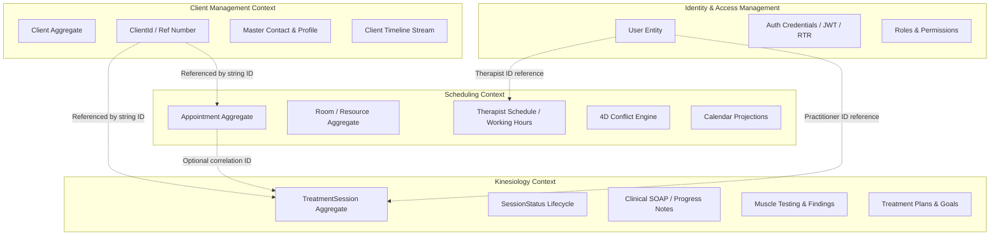

# Kinesiology Bounded Context — Domain Ownership & Architectural Boundaries

## 1. Executive Summary

This document establishes the formal domain ownership boundaries for the **Kinesiology Bounded Context** within the Kinergy modular monolith platform. It defines the explicit separation of responsibilities between **Identity**, **Client Management**, **Scheduling**, and **Kinesiology**, eliminating conceptual ambiguity and preventing cross-context aggregate duplication.

---

## 2. Core Architectural Principle

> **Fundamental Context Rule**:
> Each bounded context owns its own domain concepts and invariants. Other contexts may reference those concepts via opaque identifiers, but they do not own, mutate, or duplicate foreign aggregates.

---

## 3. Bounded Context Responsibility Map



---

## 4. Concept Ownership Matrix

| Domain Concept                | Owner Bounded Context | Nature of Concept & Responsibility                                                                                                                    | Cross-Context Interaction & Rules                                                                                                     |
| :---------------------------- | :-------------------- | :---------------------------------------------------------------------------------------------------------------------------------------------------- | :------------------------------------------------------------------------------------------------------------------------------------ |
| **User Identity**             | **Identity**          | System authentication credentials, password security, session refresh tokens, roles, and granular permission resolution.                              | Kinesiology consumes authenticated user context (`userId`, `permissions`) via security guards. Never duplicates user models.          |
| **Client Master Data**        | **Client Management** | Client master record, unique reference number (`KIN-YYYY-XXXXX`), normalized contact information, and client lifecycle (`ACTIVE`, `ARCHIVED`).        | Kinesiology references clients strictly by opaque `clientId: string` (UUID). Never duplicates client or creates "Patient" aggregates. |
| **Client Timeline**           | **Client Management** | Unified chronological timeline stream recording milestones across all business contexts.                                                              | Kinesiology emits domain events (`TreatmentSessionCompletedEvent`) that project summary entries into `ClientTimelineEntry`.           |
| **Appointment Logistics**     | **Scheduling**        | Calendar time-block reservations, physical room allocation, conflict detection, buffer rules, and operational attendance (`CHECKED_IN`, `COMPLETED`). | Kinesiology holds optional `appointmentId: string?` for appointment correlation. Does not manage room booking or schedule conflicts.  |
| **Therapist Schedule**        | **Scheduling**        | Weekly clinical working hours, shift availability, and operational schedule boundaries.                                                               | Kinesiology references practitioner `therapistId: string`. Does not manage therapist shift hours.                                     |
| **TreatmentSession**          | **Kinesiology**       | Clinical therapy encounter, assessment findings, interventions, muscle tests, and clinical outcomes.                                                  | Owned exclusively by Kinesiology. Scheduling does not hold treatment notes.                                                           |
| **SessionStatus**             | **Kinesiology**       | Clinical lifecycle states (`DRAFT` $\rightarrow$ `IN_PROGRESS` $\rightarrow$ `COMPLETED` $\rightarrow$ `LOCKED` / `AMENDED`).                         | Strictly distinct from logistical `AppointmentStatus`.                                                                                |
| **SessionNotes**              | **Kinesiology**       | Structured clinical SOAP notes (Subjective, Objective, Assessment, Plan), treatment interventions, and clinical observations.                         | Owned exclusively by Kinesiology. Protected by clinical immutability and signature locking invariants.                                |
| **Muscle Testing & Findings** | **Kinesiology**       | Neuromuscular balance evaluations, indicator muscle testing, hypertonic/hypotonic states, and reflex assessments.                                     | Pure Kinesiology domain model.                                                                                                        |
| **Treatment History**         | **Kinesiology**       | Longitudinal clinical history of therapy sessions, recovery progress, and goal evaluation.                                                            | Query read-model projected by Kinesiology application services for practitioner clinical dashboards.                                  |

---

## 5. Deep-Dive Ownership & Boundary Decisions

### 1. Identity Ownership

- **What Identity Owns**:
  - `User` entity, `UserStatus` state machine (`ACTIVE`, `LOCKED`, `DEACTIVATED`).
  - Cryptographic credential management (Argon2id password hashes, JWT access tokens, Refresh Token Rotation).
  - RBAC/ABAC authorization framework (`Role`, `Permission`, `AuthorizationEvaluator`, `@RequirePermissions(...)`).
- **Kinesiology Boundary**:
  - Kinesiology has **zero** user identity or authentication tables.
  - Practitioners and clinical staff are authenticated via the standard platform `AuthenticationGuard`.
  - Operations are authorized via permissions (e.g. `treatment_sessions.read`, `treatment_sessions.write`, `treatment_sessions.sign`).

### 2. Client Management Ownership ("Patient" vs "Client")

- **What Client Management Owns**:
  - `Client` aggregate root ([`modules/client/domain/entities/client.entity.ts`](file:///c:/Projects/kinergy-platform/modules/client/domain/entities/client.entity.ts)).
  - Identifier: `ClientId` value object wrapping UUID v4.
  - Business identifiers: `ClientReferenceNumber` (e.g. `KIN-2026-00001`).
  - Contact & profile fields: First name, last name, email, phone, normalized search strings, address.
- **Decision on "Patient"**:
  - **Decision**: In the Kinergy Platform, **`Client` is the single, authoritative ubiquitous domain concept**.
  - "Patient" is merely a colloquial business/clinical role of a `Client` in clinical context, **not a separate entity or aggregate**.
  - **Prohibited Duplications**:
    - ❌ `Patient`
    - ❌ `PatientProfile`
    - ❌ `PatientAggregate`
    - ❌ `KinesiologyClient`
  - **Allowed Pattern**: `TreatmentSession` holds `clientId: string` to link clinical records to the authoritative `Client` aggregate.

### 3. Scheduling Ownership ("Appointment" vs "TreatmentSession")

- **What Scheduling Owns**:
  - `Appointment` aggregate root ([`packages/core/src/scheduling/domain/appointment/appointment.aggregate.ts`](file:///c:/Projects/kinergy-platform/packages/core/src/scheduling/domain/appointment/appointment.aggregate.ts)).
  - Calendar grids, room allocations, recurring series generation, and 4D conflict detection.
  - Operational lifecycle: `SCHEDULED` $\rightarrow$ `CONFIRMED` $\rightarrow$ `CHECKED_IN` $\rightarrow$ `IN_PROGRESS` $\rightarrow$ `COMPLETED` / `CANCELLED` / `RESCHEDULED`.
- **Decision on Clinical Sessions**:
  - **Decision**: An **`Appointment`** is a logistical calendar event (reserving a time interval, room, and practitioner). A **`TreatmentSession`** is a clinical record of therapeutic care.
  - An appointment may exist without a treatment session (e.g. cancelled/no-show appointments or logistical facility rentals).
  - A treatment session may be linked to an appointment via `appointmentId: string?` (or created ad-hoc for walk-in clinical care).
  - **Prohibited Duplications**:
    - ❌ `TreatmentAppointment`
    - ❌ `TherapyAppointment`
    - ❌ `KinesiologyAppointment`
  - **Allowed Pattern**: `TreatmentSession` aggregate holds an optional `appointmentId: string?` foreign correlation reference.

### 4. Therapist Concept Ownership

- **Analysis**:
  - In Identity: A therapist is a `User` assigned a clinical `Role` with practitioner permissions.
  - In Scheduling: A therapist is represented by a `therapistId: string` and associated with a `TherapistSchedule` aggregate managing weekly working hours.
  - In Kinesiology: A therapist is the author/practitioner conducting and signing clinical records, referenced by `therapistId: string`.
- **Decision**:
  - **Decision**: **No monolithic `Therapist` aggregate is created**.
  - Therapist is a cross-cutting role of a `User`. Each context references the practitioner via `therapistId: string` (matching `User.id`).

---

## 6. Prohibited Anti-Patterns Summary

```text
❌ ANTI-PATTERN: Duplicating Client as PatientAggregate in Kinesiology
❌ ANTI-PATTERN: Embedding TreatmentSession inside Appointment aggregate
❌ ANTI-PATTERN: Embedding Appointment aggregate inside TreatmentSession
❌ ANTI-PATTERN: Direct foreign table joins across bounded context boundaries
❌ ANTI-PATTERN: Creating specialized Therapist aggregates when User + therapistId suffices
```

---

## 7. Cross-Context Event Integration Strategy

To maintain loose coupling and asynchronous synchronization:

1. When a clinical session completes and is signed:
   - `TreatmentSession` records `TreatmentSessionCompletedEvent`.
   - Application event handler catches `TreatmentSessionCompletedEvent`.
   - Handler calls Client Management timeline port to append a `ClientTimelineEntry` (sourceModule: `'KINESIOLOGY'`, eventType: `'TREATMENT_SESSION_COMPLETED'`).
2. Client Management context remains completely agnostic of internal Kinesiology domain logic, receiving only structured timeline metadata.
