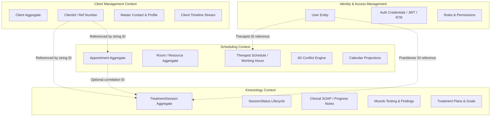

# Kinesiology Bounded Context — Domain Ownership & Architectural Boundaries

## 1. Executive Summary

This document establishes the formal domain ownership boundaries, canonical identifiers, and cross-context relationship rules for the **Kinesiology Bounded Context** within the Kinergy modular monolith platform. It defines the explicit separation of responsibilities between **Identity**, **Client Management**, **Scheduling**, and **Kinesiology**, eliminating conceptual ambiguity, preventing aggregate coupling, and forbidding cross-context distributed transactions.

---

## 2. Core Architectural Principle

> **Fundamental Context Rule**:
> Each bounded context owns its own domain concepts and invariants. Other contexts may reference those concepts via opaque identifiers, but they do not own, mutate, or duplicate foreign aggregates.

---

## 3. Bounded Context Responsibility Map



---

## 4. Concept Ownership Matrix

| Domain Concept                | Owner Bounded Context | Nature of Concept & Responsibility                                                                                                                    | Cross-Context Interaction & Rules                                                                                                     |
| :---------------------------- | :-------------------- | :---------------------------------------------------------------------------------------------------------------------------------------------------- | :------------------------------------------------------------------------------------------------------------------------------------ |
| **User Identity**             | **Identity**          | System authentication credentials, password security, session refresh tokens, roles, and granular permission resolution.                              | Kinesiology consumes authenticated user context (`userId`, `permissions`) via security guards. Never duplicates user models.          |
| **Client Master Data**        | **Client Management** | Client master record, unique reference number (`KIN-YYYY-XXXXX`), normalized contact information, and client lifecycle (`ACTIVE`, `ARCHIVED`).        | Kinesiology references clients strictly by opaque `clientId: string` (UUID). Never duplicates client or creates "Patient" aggregates. |
| **Client Timeline**           | **Client Management** | Unified chronological timeline stream recording milestones across all business contexts.                                                              | Kinesiology emits domain events (`TreatmentSessionCompletedEvent`) that project summary entries into `ClientTimelineEntry`.           |
| **Appointment Logistics**     | **Scheduling**        | Calendar time-block reservations, physical room allocation, conflict detection, buffer rules, and operational attendance (`CHECKED_IN`, `COMPLETED`). | Kinesiology holds optional `appointmentId: string?` for appointment correlation. Does not manage room booking or schedule conflicts.  |
| **Therapist Schedule**        | **Scheduling**        | Weekly clinical working hours, shift availability, and operational schedule boundaries.                                                               | Kinesiology references practitioner `therapistId: string`. Does not manage therapist shift hours.                                     |
| **TreatmentSession**          | **Kinesiology**       | Clinical therapy encounter, assessment findings, interventions, muscle tests, and clinical outcomes.                                                  | Owned exclusively by Kinesiology. Scheduling does not hold treatment notes.                                                           |
| **SessionStatus**             | **Kinesiology**       | Clinical lifecycle states (`DRAFT` $\rightarrow$ `IN_PROGRESS` $\rightarrow$ `COMPLETED` $\rightarrow$ `LOCKED` / `AMENDED`).                         | Strictly distinct from logistical `AppointmentStatus`.                                                                                |
| **SessionNotes**              | **Kinesiology**       | Structured clinical SOAP notes (Subjective, Objective, Assessment, Plan), treatment interventions, and clinical observations.                         | Owned exclusively by Kinesiology. Protected by clinical immutability and signature locking invariants.                                |
| **Muscle Testing & Findings** | **Kinesiology**       | Neuromuscular balance evaluations, indicator muscle testing, hypertonic/hypotonic states, and reflex assessments.                                     | Pure Kinesiology domain model.                                                                                                        |
| **Treatment History**         | **Kinesiology**       | Longitudinal clinical history of therapy sessions, recovery progress, and goal evaluation.                                                            | Query read-model projected by Kinesiology application services for practitioner clinical dashboards.                                  |

---

## 5. Canonical Identifiers & External References

The `TreatmentSession` aggregate root models external domain relationships strictly via strongly typed or scalar identifiers:

```text
TreatmentSession
 ├── id: SessionId                  ◄── Local Aggregate ID (Value Object)
 ├── clientId: string               ◄── External Reference to Client Management
 ├── therapistId: string            ◄── External Reference to Identity (User)
 └── appointmentId?: string         ◄── Optional External Correlation to Scheduling
```

### Standardized Identifier Nomenclature

| Canonical Identifier | Scope & Meaning                                            | Permitted Usages                                 | Prohibited Aliases                                |
| :------------------- | :--------------------------------------------------------- | :----------------------------------------------- | :------------------------------------------------ |
| **`SessionId`**      | Unique identifier for a Kinesiology Treatment Session.     | Domain value object / aggregate root ID.         | `TreatmentSessionId`, `KinesiologySessionId`      |
| **`ClientId`**       | Authoritative identifier for a registered Client.          | External correlation ID in `TreatmentSession`.   | `PatientId`, `SubjectId`, `CustomerRef`           |
| **`TherapistId`**    | Authoritative identifier for clinical practitioner (User). | Author / signer reference in `TreatmentSession`. | `ProviderId`, `PractitionerId`, `TherapistUserId` |
| **`AppointmentId`**  | Optional correlation ID to a calendar Appointment.         | Logistics correlation in `TreatmentSession`.     | `BookingId`, `AppointmentReferenceId`, `SlotId`   |

---

## 6. Prohibition of Aggregate & Model Coupling

To ensure maintainability, testability, and database scalability within the modular monolith:

### Strict Structural Rules

1. **Zero Foreign Aggregate Nesting**: `TreatmentSession` must **NEVER** import or embed `Client`, `Appointment`, `User`, or `Room` aggregates.
   ```typescript
   // ❌ STRICTLY PROHIBITED (Aggregate Coupling)
   export class TreatmentSession extends AggregateRoot {
     private _client: Client; // VIOLATION: Never embed foreign aggregate
     private _appointment: Appointment; // VIOLATION: Never embed foreign aggregate
   }

   // ✅ REQUIRED ARCHITECTURE (Identifier Referencing)
   export class TreatmentSession extends AggregateRoot<SessionId> {
     private readonly _clientId: string;
     private readonly _therapistId: string;
     private readonly _appointmentId?: string;
   }
   ```
2. **Zero Foreign Invariant Enforcement**:
   - Kinesiology must **not** check whether a client is in active billing status or whether a room is double-booked.
   - Client Management enforces Client invariants; Scheduling enforces Room/Appointment invariants.

---

## 7. Consistency Boundaries & Transaction Isolation

```text
┌───────────────────────────┐      ┌───────────────────────────┐
│     Client Management     │      │        Scheduling         │
│  Owns Client Consistency  │      │Owns Appointment Consist.  │
└───────────────────────────┘      └───────────────────────────┘
              ▲                                  ▲
              │ (Zero Distributed Tx)            │ (Zero Distributed Tx)
┌─────────────┴─────────────┐      ┌─────────────┴─────────────┐
│         Identity          │      │        Kinesiology        │
│  Owns Identity Consist.   │      │Owns TreatmentSess. Consist│
└───────────────────────────┘      └───────────────────────────┘
```

1. **Transaction Isolation**:
   - A `TreatmentSession` transaction operates strictly on Kinesiology persistence models.
   - **Zero Distributed Transactions**: Creating or updating a `TreatmentSession` must NEVER participate in a distributed two-phase commit ($2\text{PC}$) or cross-context database transaction with Client Management, Scheduling, or Identity.
2. **Optimistic Locking**:
   - `TreatmentSession` aggregates enforce their own `version: number` optimistic concurrency control. Concurrent note edits return an optimistic locking conflict without touching foreign aggregates.

---

## 8. Cross-Context Integration Strategy

Kinesiology integrates with external bounded contexts via two clean patterns:

1. **Domain-Level Opaque Identifier Referencing**:
   - Clinical sessions correlate with clients, practitioners, and calendar appointments purely through immutable string IDs.
2. **Application-Level Event Publishing (Asynchronous Projection)**:
   - When a treatment session reaches terminal `COMPLETED` and signed status, the aggregate records `TreatmentSessionCompletedEvent`.
   - An application-layer event handler can invoke the Client Management timeline port to append a structured `ClientTimelineEntry` (sourceModule: `'KINESIOLOGY'`, eventType: `'TREATMENT_SESSION_COMPLETED'`) asynchronously.
   - Client Management receives only high-level summary metadata without importing Kinesiology domain rules.

---

## 9. Prohibited Anti-Patterns Summary

```text
❌ ANTI-PATTERN: Creating "Patient" or "PatientProfile" aggregates in Kinesiology
❌ ANTI-PATTERN: Embedding TreatmentSession inside Appointment aggregate or vice versa
❌ ANTI-PATTERN: Direct SQL joins across bounded context table schemas
❌ ANTI-PATTERN: Synchronous aggregate loading across context boundaries in domain layer
❌ ANTI-PATTERN: Distributed transactions spanning Kinesiology and Scheduling
```
