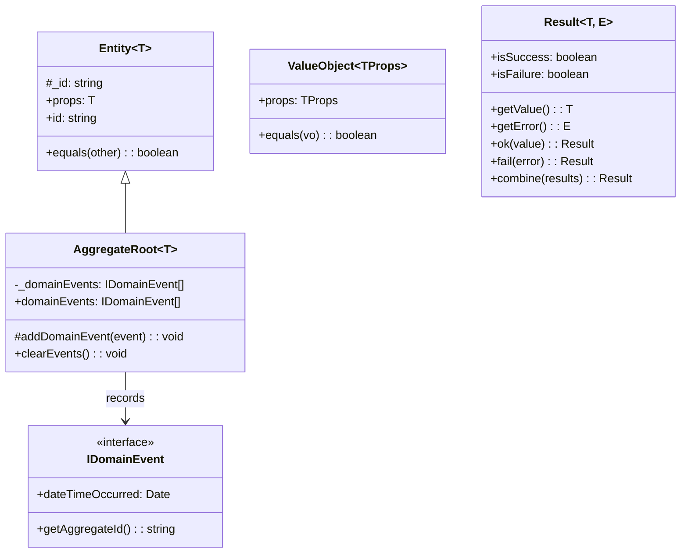

# Domain-Driven Design (DDD) Strategy

The Kinergy Platform uses **Domain-Driven Design (DDD)** to model complex energy management business domains into software.

---

## Tactical DDD Patterns



### Core Abstractions (`apps/api/src/shared/kernel/`)

1. **`Entity<T>`**:
   - Object defined by its **identity** (`id`), not by its attributes.
   - Generates a UUID by default if no ID is specified upon instantiation.
   - Equality is strictly determined by matching IDs (`equals()`).
2. **`AggregateRoot<T>`**:
   - An entity that acts as the root boundary for a cluster of associated domain objects.
   - Encapsulates transactional consistency boundaries.
   - Manages domain event recording (`addDomainEvent()`) and clearing (`clearEvents()`).
3. **`ValueObject<TProps>`**:
   - Immutable object defined purely by its **attribute values**.
   - Properties are frozen upon instantiation (`Object.freeze()`).
   - Equality is structural (`equals()`), comparing JSON serialization of properties.
4. **`Result<T, E>`**:
   - Functional error handling monad encapsulating explicit domain outcomes (`Result.ok()`, `Result.fail()`).
   - Replaces thrown runtime exceptions for expected business rule validation errors.
5. **`IDomainEvent`**:
   - Immutable event object capturing something meaningful that occurred within the domain (`dateTimeOccurred`, `getAggregateId()`).

---

## Shared Domain Kernel

The **Shared Kernel** contains core domain primitives that are shared across all bounded contexts without introducing inter-context coupling.

```mermaid
graph LR
    subgraph Shared Domain Kernel
        ENT[Entity Base]
        AGG[AggregateRoot Base]
        VO[ValueObject Base]
        RES[Result Monad]
        EVT[IDomainEvent Port]
        REPO[IRepository Port]
    end

    BC_MONITORING[Energy Monitoring Context] --> Shared Domain Kernel
    BC_ASSET[Asset Management Context] --> Shared Domain Kernel
    BC_ANALYTICS[Analytics Context] --> Shared Domain Kernel
```

### Shared Kernel Principles

- **Framework Independence**: Pure TypeScript logic without external imports.
- **Generic Applicability**: Parameterized via TypeScript generics (`Entity<TProps>`, `ValueObject<TProps>`).
- **Ubiquitous Language**: Standardized domain vocabulary applied consistently across engineering and business teams.
