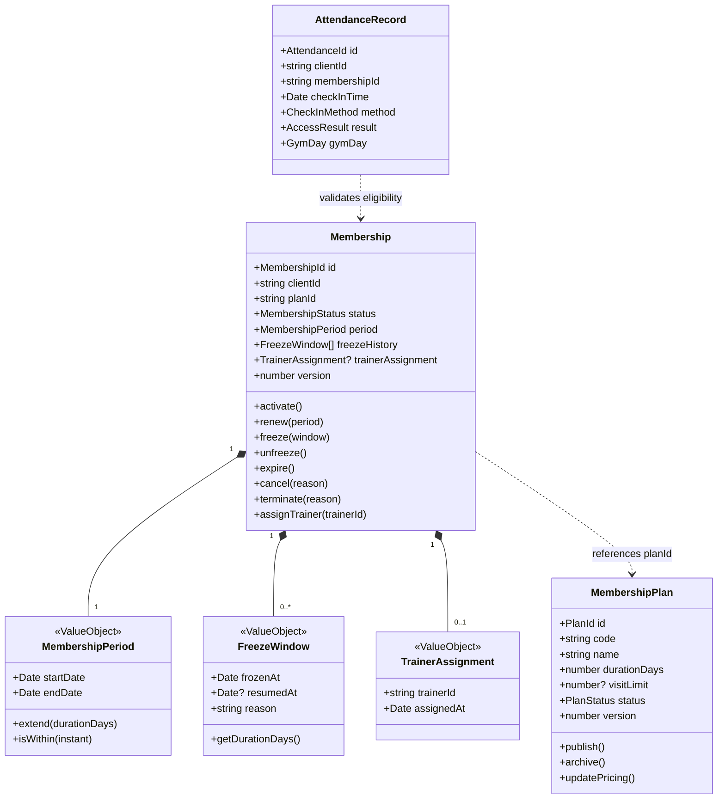

# Gym Management — Aggregate Boundaries & Consistency Architecture

- **Status**: Authoritative Architectural Baseline
- **Bounded Context**: Gym Management (`packages/core/src/gym/`)
- **ADR Reference**: [ADR-0056](../adr/0056-gym-management-aggregate-discovery-and-boundary-decisions.md)

---

## 1. Domain Aggregate Model Overview

---

## 2. Selected Domain Aggregates

### 2.1 `Membership` (Aggregate Root)

The `Membership` aggregate is the primary consistency boundary governing customer fitness facility entitlements.

#### Internal Structure

- **Root Entity**: `Membership` (`id: MembershipId`, `version: number`)
- **Value Objects**:
  - `MembershipPeriod` (`startDate`, `endDate`)
  - `FreezeWindow[]` (Ordered list of past and active freeze intervals)
  - `TrainerAssignment` (Optional operational assignment holding `trainerId: string`)
  - `MembershipStatus` (Enum: `PENDING`, `ACTIVE`, `FROZEN`, `EXPIRED`, `CANCELLED`, `TERMINATED`)

#### Protected Invariants

1. **Valid State Transitions**:
   - `PENDING` $\rightarrow$ `ACTIVE`
   - `ACTIVE` $\rightleftharpoons$ `FROZEN`
   - `ACTIVE` | `FROZEN` $\rightarrow$ `EXPIRED`
   - `ACTIVE` | `FROZEN` | `PENDING` $\rightarrow$ `CANCELLED`
   - Any status $\rightarrow$ `TERMINATED` (Irrevocable terminal state)
2. **Temporal Period Rule**: `period.startDate <= period.endDate`.
3. **Freeze Extension Rule**: When `unfreeze()` is invoked, the `period.endDate` is extended by the exact number of days elapsed between `frozenAt` and `resumedAt`.
4. **Optimistic Concurrency**: Any mutation increments `version: number`.
5. **Decoupled Identity**: Holds `clientId: string` without holding master `Client` aggregate objects.

---

### 2.2 `MembershipPlan` (Aggregate Root)

The `MembershipPlan` aggregate governs commercial product catalog definitions.

#### Internal Structure

- **Root Entity**: `MembershipPlan` (`id: PlanId`, `code: string`, `version: number`)
- **Value Objects**:
  - `PlanDuration` (`durationDays: number`)
  - `VisitQuota` (Optional `maxVisits: number`)
  - `PlanStatus` (Enum: `DRAFT`, `ACTIVE`, `ARCHIVED`)

#### Protected Invariants

1. **Code Uniqueness**: Business code (e.g. `ANNUAL_VIP`, `MONTHLY_STANDARD`) must be unique.
2. **Strict Positive Duration**: `durationDays` must be an integer $\ge 1$.
3. **Immutability of Active Agreements**: Archiving or altering a `MembershipPlan` never retroactively changes terms of active `Membership` instances.

---

### 2.3 `AttendanceRecord` (Append-Only Entity / Log)

The `AttendanceRecord` represents an immutable check-in log entry.

#### Characteristics

- **DDD Type**: Append-Only Entity / Audit Stream (NOT a mutating Aggregate Root).
- **Write Pattern**: High-throughput write-once inserts (`append(record)`).
- **Why not an Aggregate Root?**
  - Check-ins are never modified or cancelled after entry.
  - Eliminates transactional database row lock contention on turnstiles during peak morning/evening facility rushes.
- **Fields**: `id: string`, `clientId: string`, `membershipId: string`, `checkInTime: Date`, `method: CheckInMethod`, `result: AccessResult`, `gateId: string`, `gymDay: GymDay`.

---

## 3. Rejected Aggregate Candidates & Rationale

| Candidate              | Proposed Role                                                        | Reason for Rejection                                                                                                                | Selected Model                                                      |
| :--------------------- | :------------------------------------------------------------------- | :---------------------------------------------------------------------------------------------------------------------------------- | :------------------------------------------------------------------ |
| **`GymMember`**        | Monolithic Aggregate Root combining Client + Membership + Attendance | Creates massive database contention; violates Bounded Context boundaries; locks client master profile during badge taps.            | **Decoupled `Membership` referencing `clientId: string`**.          |
| **`MembershipPeriod`** | Independent Aggregate Root                                           | Has no independent lifecycle or meaning outside parent `Membership`; requires distributed transactions to manage freeze extensions. | **Value Object encapsulated inside `Membership`**.                  |
| **`Attendance`**       | Mutating Aggregate Root with `CHECKED_IN` / `CHECKED_OUT` states     | 95%+ of fitness turnstiles operate without mandatory checkout. Mutating aggregates introduce unnecessary row locks.                 | **Append-Only `AttendanceRecord` Entity**.                          |
| **`Trainer`**          | Gym-owned Aggregate Root                                             | Duplicates IAM `User` identity, password hashes, and system permissions.                                                            | **Scalar reference `trainerId: string` in `TrainerAssignment` VO**. |

---

## 4. Aggregate Dependency & Communication Rules

1. **Zero Direct Aggregate References**: An aggregate must NEVER hold a direct object reference to another aggregate root. References are strictly maintained via scalar IDs (`clientId: string`, `planId: string`, `trainerId: string`).
2. **Zero Cross-Aggregate Transactions**: A single application transaction must mutate at most ONE aggregate root instance. Cross-aggregate coordination occurs via domain events and eventual consistency.
3. **Pure Domain Core**: The domain models in `packages/core/src/gym/domain/` have zero dependencies on `@nestjs/*`, `@prisma/*`, or HTTP frameworks.
