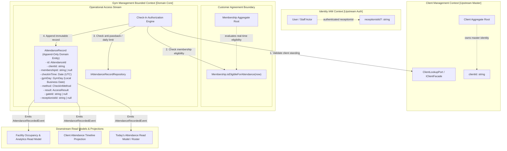
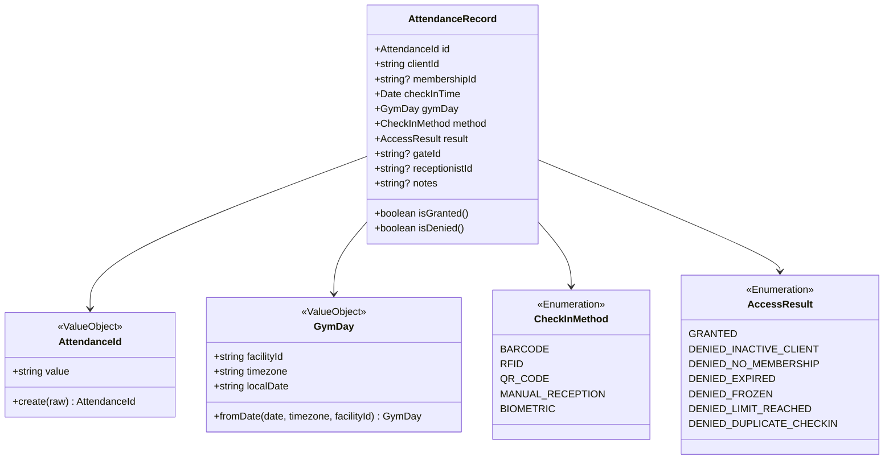
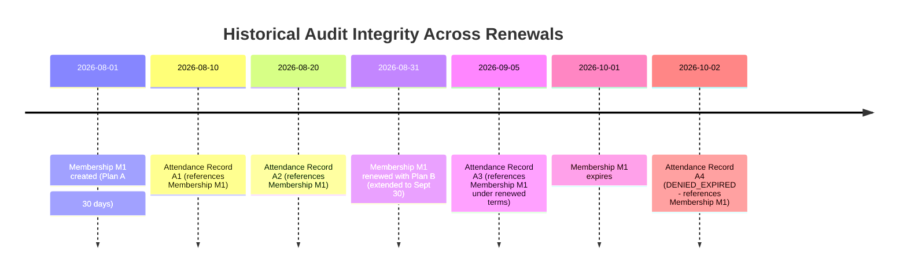
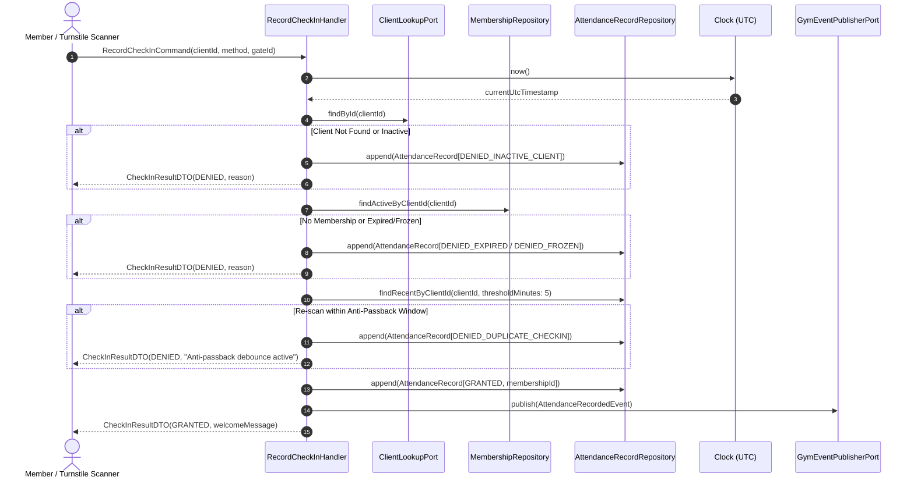

# Gym Management — Attendance Domain, Boundary & Operational Access Architecture

- **Status**: Authoritative Architectural Specification
- **Phase**: 5.5-A
- **Bounded Context**: Gym Management (`packages/core/src/gym/`)
- **ADR References**: [ADR-0054](../adr/0054-gym-management-bounded-context-ownership-and-context-map.md), [ADR-0056](../adr/0056-gym-management-aggregate-discovery-and-boundary-decisions.md), [ADR-0064](../adr/0064-gym-management-attendance-domain-boundary-identity-and-append-only-log-model.md)

---

## 1. Executive Summary & Authoritative Ownership

Attendance represents the physical access control and presence auditing subsystem of the **Gym Management Bounded Context**.

### 1.1 The Authoritative Attendance Invariant

> **Gym Management is the sole authoritative owner of facility attendance tracking, access authorization decisions, physical check-in audit logs, and operational facility occupancy streams.**
>
> **Attendance owns the immutable business fact that: A person was admitted to / recorded as attempting entry to the gym at a specific point in time according to the gym's check-in policy.**

Attendance explicitly does **NOT** own:

- Master client identity or demographics (owned by `Client Management`).
- Staff practitioner credentials or role permissions (owned by `Identity IAM`).
- Membership subscription lifecycle, pricing, freeze windows, expiration, or renewal rules (owned by `Membership` in Gym Management).
- Appointment attendance compliance or room schedule allocations (owned by `Scheduling`).
- Clinical treatment sessions or physical therapy progress notes (owned by `Kinesiology`).

---

## 2. Context Map & Interaction Architecture

---

## 3. Canonical Domain Vocabulary

| Term                   | Domain Type                 | Canonical Meaning                                                                                                                                                                         | Prohibited Aliases                                                |
| :--------------------- | :-------------------------- | :---------------------------------------------------------------------------------------------------------------------------------------------------------------------------------------- | :---------------------------------------------------------------- |
| **`AttendanceRecord`** | Domain Entity (Append-Only) | The persisted immutable record representing a physical check-in event.                                                                                                                    | `GymVisit`, `TurnstileEvent`, `AttendanceEntry`, `MemberPresence` |
| **`CheckIn`**          | Domain Action / Command     | The operational physical attempt by a client to gain entry to the facility.                                                                                                               | `Scan`, `Admission`, `Login`, `PunchIn`                           |
| **`CheckInTimestamp`** | Value Object / Instant      | The exact UTC point-in-time (`checkInTime: Date`) when the check-in occurred.                                                                                                             | `timestamp`, `scannedAt`, `entryTime`                             |
| **`GymDay`**           | Value Object                | The facility-local calendar day (`facilityId`, `timezone`, `localDate: YYYY-MM-DD`).                                                                                                      | `BusinessDate`, `CalendarDay`, `LocalDay`                         |
| **`AccessResult`**     | Value Object / Enum         | The outcome of the check-in attempt (`GRANTED`, `DENIED_INACTIVE_CLIENT`, `DENIED_NO_MEMBERSHIP`, `DENIED_EXPIRED`, `DENIED_FROZEN`, `DENIED_LIMIT_REACHED`, `DENIED_DUPLICATE_CHECKIN`). | `AttendanceStatus`, `ScanStatus`, `ResultCode`                    |
| **`CheckInMethod`**    | Value Object / Enum         | The ingress mechanism (`BARCODE`, `RFID`, `QR_CODE`, `MANUAL_RECEPTION`, `BIOMETRIC`).                                                                                                    | `InputSource`, `ScanType`                                         |
| **`DuplicateCheckIn`** | Domain Policy / Rule        | Re-scanning credentials within the anti-passback debounce window or exceeding daily visit quota.                                                                                          | `DoubleScan`, `ReEntry`                                           |
| **`DailyAttendance`**  | Read Model / DTO            | The aggregated list and metrics of granted check-ins for a specified `GymDay`.                                                                                                            | `DailyVisits`, `Roster`                                           |

---

## 4. Aggregate & Entity Design Decisions

### 4.1 Why Attendance is an Append-Only Entity, Not an Aggregate Root

- **Zero Row-Lock Contention**: Modeling attendance as a mutating aggregate root creates database write locks during rush hours. In contrast, an append-only log allows turnstiles to insert events concurrently with sub-millisecond persistence latency.
- **Immutability of Historical Facts**: A physical entry at 08:14:22 UTC on August 19, 2026 is an immutable fact. It is never edited, rescheduled, or cancelled.
- **Consistency Enforcement**: All business rules (active client standing, membership eligibility, anti-passback) are evaluated stateless by the application use case handler prior to persisting the record.

---

## 5. Cross-Context & Historical Integrity Rules

### 5.1 Client Association

- `AttendanceRecord` references scalar `clientId: string`.
- No client names, emails, phone numbers, or demographic fields are copied into the record.
- Client active standing is verified synchronously via `ClientLookupPort` (`IClientFacade`).

### 5.2 Membership Association & Historical Explainability

- `AttendanceRecord` captures the scalar `membershipId: string` that was active when access was evaluated.
- **Tenure Continuity**: When a membership is renewed or upgraded to a different plan, past attendance records remain permanently linked to the historical `membershipId`, ensuring full auditability.

---

## 6. Temporal Semantics & The `GymDay` Model

1. **Authoritative Timestamp**:
   - `checkInTime` is stored as an exact UTC timestamp derived from `clock.now()`.
   - Browser time or client-provided timestamps are strictly ignored.
2. **Business Date (`GymDay`) Calculation**:
   - Converts UTC timestamp to the facility's local calendar day using the gym's configured timezone (e.g. `America/Montevideo`, `America/Sao_Paulo`, or `UTC`).
   - Ensures turnstile check-ins late in the evening (e.g. 23:45 local time) are attributed to the correct local operational date.
3. **DST Invariant**:
   - Day calculation uses timezone-aware date arithmetic. Chronological ordering in UTC is preserved without clock shift anomalies.

---

## 7. Operational Check-In Flow

---

## 8. Duplicate Check-In & Anti-Passback Policies

1. **Anti-Passback Debounce**:
   - Re-scanning the same client credential within a configurable window (default: 5 minutes) triggers `DENIED_DUPLICATE_CHECKIN`.
   - Protects against credential sharing at turnstiles.
2. **Daily Quota Enforcement**:
   - If a plan enforces a daily visit cap (e.g. 1 visit/day), the access engine queries existing granted records for the current `GymDay`. If count $\ge limit$, access is `DENIED_LIMIT_REACHED`.
3. **Unlimited Access**:
   - For unlimited plans, multiple visits per `GymDay` are permitted as long as the anti-passback window has elapsed.

---

## 9. Check-Out Decision: Check-In Only for MVP

- **MVP Scope**: **Check-in Only**.
- Gym operations in MVP monitor arrivals and access authorization. Exit turnstiles are mechanical/unmonitored.
- **Future Extension Point**: When occupancy tracking or duration analytics are prioritized, a non-breaking `CheckOutRecord` or `VisitSession` projection can be added.

---

## 10. CQRS Read Models & Query Boundaries

To prevent loading aggregates or full event streams for dashboards:

1. **`GetTodayAttendanceQuery`**:
   - Optimized indexed lookup by `gymDay`.
   - Returns paginated `DailyAttendanceItemDTO[]` (time, client name via lookup, method, gate, status) for front-desk reception monitors.
2. **`GetClientAttendanceHistoryQuery`**:
   - Indexed lookup by `clientId`.
   - Returns chronological paginated history for client timeline integration.
3. **`GetFacilityOccupancySummaryQuery`**:
   - Aggregates total entries, peak hours, and check-in method distribution.

---

## 11. Architectural Compliance & Quality Gates

- **Zero Domain Infrastructure Leaking**: Verified by `gym-architecture-boundaries.spec.ts`.
- **Clock Authority**: All temporal decisions use `Clock.now()`.
- **Monorepo Quality Gate Baseline**: Strict compliance with Prettier, ESLint, TypeScript compilation, and comprehensive unit tests.
