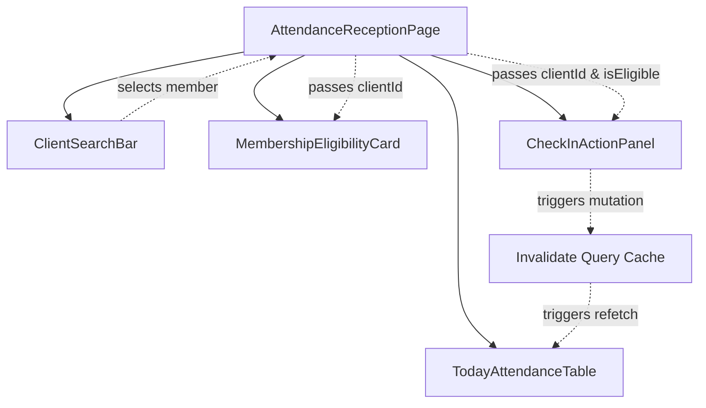

# Gym Management — Daily Reception Workflow & Frontend Access Architecture

- **Status**: Authoritative Architectural Specification
- **Phase**: 5.5-G
- **Module**: `apps/web/src/modules/attendance/`
- **ADR References**: [ADR-0054](../adr/0054-gym-management-bounded-context-ownership-and-context-map.md), [ADR-0064](../adr/0064-gym-management-attendance-domain-boundary-identity-and-append-only-log-model.md), [ADR-0065](../adr/0065-gym-management-membership-eligibility-contract-and-cross-context-integration.md), [ADR-0066](../adr/0066-gym-management-record-check-in-use-case-anti-passback-and-idempotency.md), [ADR-0067](../adr/0067-gym-management-duplicate-check-in-concurrency-and-idempotency-architecture.md), [ADR-0068](../adr/0068-gym-management-attendance-history-and-operational-read-models.md), [ADR-0069](../adr/0069-gym-management-daily-reception-workflow-frontend-architecture.md)

---

## 1. Executive Summary

This specification establishes the reception desk user experience and frontend architecture for Gym Attendance. It enables receptionists, desk staff, and turnstile attendants to:

1. **Instantly Search & Identify Members**: Keyboard-navigable debounced search.
2. **Inspect Authoritative Eligibility**: Visual rendering of backend decisions (`ELIGIBLE`, `EXPIRED`, `FROZEN`, `NO_MEMBERSHIP`, `NOT_YET_ACTIVE`).
3. **Execute One-Click Admissions**: Channel selector (`MANUAL_RECEPTION`, `QR_CODE`, `RFID`, `BARCODE`, `BIOMETRIC`) with idempotency nonce protection.
4. **Monitor Real-Time Daily Ingress**: Live 15-second polling table and KPI statistics without navigating away.

---

## 2. Component Hierarchy & Data Flow

---

## 3. Frontend Invariant Rules

1. **Zero Client-Side Rule Recalculation**: The frontend does not calculate remaining membership days or parse temporal boundaries to decide if a member is admitted. It renders the backend's `MembershipEligibilityDTO.outcome` verbatim.
2. **Idempotency Nonce Generation**: Each ingress action creates a unique submission nonce (`web_desk_${clientId}_${timestamp}_${nonce}`) to protect against network retries.
3. **Targeted Cache Refetching**: Ingress actions only invalidate `['attendance', 'today']`, `['attendance', 'eligibility']`, and `['attendance', 'client-history']`.

---

## 4. Verification Suite

- API Client Tests: [`apps/web/src/modules/attendance/__tests__/attendance-api.spec.ts`](file:///c:/Projects/kinergy-platform/apps/web/src/modules/attendance/__tests__/attendance-api.spec.ts) (4/4 tests passing).
- Workflow UI Tests: [`apps/web/src/modules/attendance/__tests__/attendance-reception-workflow.spec.tsx`](file:///c:/Projects/kinergy-platform/apps/web/src/modules/attendance/__tests__/attendance-reception-workflow.spec.tsx) (4/4 tests passing).
- Total Attendance Frontend Tests: 8/8 tests passing (100%).
