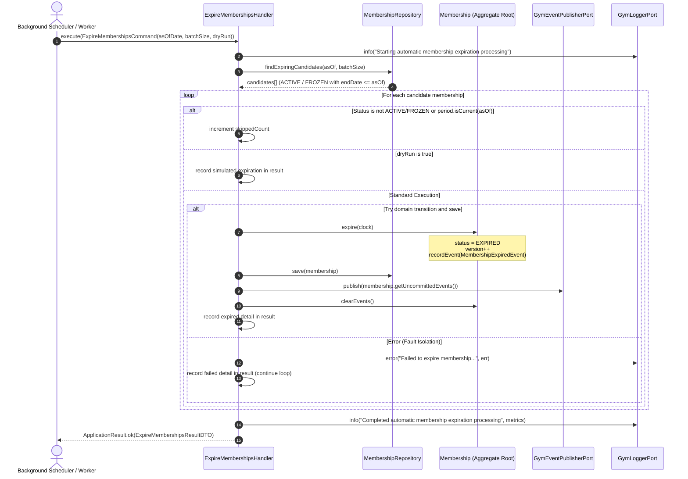

# Gym Management — Automatic Membership Expiration Processing

## Phase 5.4-E Architecture Specification

---

## 1. Overview & Objective

In accordance with [ADR-0062](../adr/0062-gym-management-membership-expiration-temporal-semantics-and-canonical-eligibility-model.md) and the Model C (Ground Truth Temporal Interval + Dual-Tier Lifecycle Processing) architecture, **Membership Expiration** is determined by the canonical temporal interval:

$$[startDate, endDate) = \{ t \in \text{Time} \mid startDate \le t < endDate \}$$

While **Tier 1 (Real-Time Derived Gate Evaluation)** immediately denies physical access at turnstiles and fast API endpoints with 0ms latency when $t \ge endDate$, **Tier 2 (Asynchronous Persistent Lifecycle Reconciliation)** materializes `status = EXPIRED` in the database, increments the aggregate version, and emits `MembershipExpiredEvent` domain events.

The [`ExpireMembershipsHandler`](../../packages/core/src/gym/application/handlers/expire-memberships.handler.ts) orchestrates this deterministic, idempotent, and fault-isolated batch processing workflow.

---

## 2. Processing Contract & Architecture

---

## 3. Query Strategy & Database Scope

To prevent loading the entire database or thrashing memory:

1. **Query Filter**: `status IN ('ACTIVE', 'FROZEN') AND endDate <= :asOfDate`.
2. **Chunking / Pagination**: Paginated by `batchSize` (default: 500).
3. **Idempotency Guard**: Already `EXPIRED`, `CANCELLED`, or `TERMINATED` records are excluded at the query level and double-checked by the handler filter.

---

## 4. Concurrency & Failure Isolation

- **Item-Level Fault Isolation**: A single failed record (e.g. database lock timeout or transient constraint error) does not abort the entire batch. The error is captured, structured log emitted, error added to summary DTO, and remaining candidates continue processing.
- **Optimistic Concurrency Control (OCC)**: Aggregate version monotonicity ensures that if a member renews concurrently while the worker is processing, the version check detects the conflict and safely rejects the stale expiration write.
- **No Duplicate Events**: Events are only published after aggregate mutation and database persistence succeed.

---

## 5. Observability & Telemetry

The command returns an [`ExpireMembershipsResultDTO`](../../packages/core/src/gym/application/dtos/expire-memberships-result.dto.ts) containing:

- `processedCount`: Total candidate records evaluated.
- `expiredCount`: Count of records successfully transitioned to `EXPIRED`.
- `skippedCount`: Count of records safely skipped (already expired, cancelled, or currently valid).
- `failedCount`: Count of records that failed transition.
- `durationMs`: Wall-clock processing time in milliseconds.
- `dryRun`: Boolean indicating whether execution was simulated.
- `expired`: Array of `{ membershipId, clientId, previousStatus, expiredAt }`.
- `errors`: Array of `{ membershipId, error }`.

Structured logs are emitted at job start, per-item error, and job completion.
