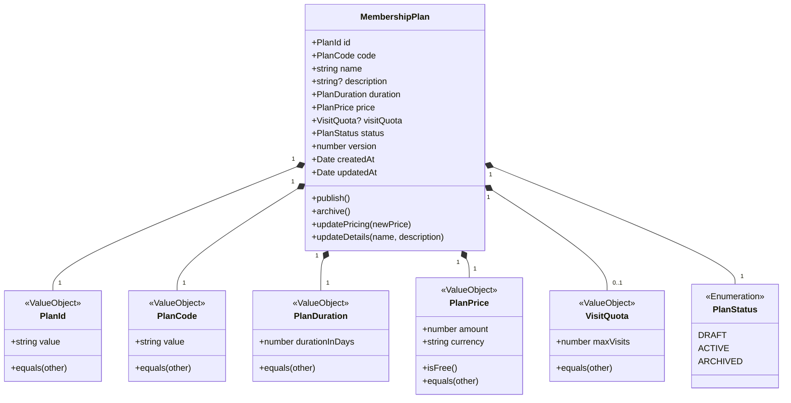

# Gym Management — Commercial Model & MembershipPlan Specification

- **Status**: Authoritative Commercial Architecture Baseline
- **Bounded Context**: Gym Management (`packages/core/src/gym/`)
- **ADR Reference**: [ADR-0058](../adr/0058-gym-management-membership-plan-commercial-and-pricing-model.md)

---

## 1. Executive Summary

In Kinergy Gym Management, **Membership Plans** define the commercial offerings available to fitness facility clients. A Membership Plan governs contract validity durations, financial pricing tiers, optional visit quotas, and catalog availability lifecycles.

This document establishes the official domain model, property rules, mathematical duration semantics, pricing value objects, and historical preservation guarantees for `MembershipPlan`.

---

## 2. Commercial Model Architecture



---

## 3. MembershipPlan Aggregate Responsibilities

The `MembershipPlan` aggregate root is responsible for:

1. **Catalog Integrity**: Protecting unique commercial identification codes (e.g. `MONTHLY_STANDARD_2026`).
2. **Contract Term Definition**: Enforcing non-negotiable duration invariants ($\ge 1$ integer day).
3. **Monetary Rate Configuration**: Encapsulating non-negative pricing and currency specifications.
4. **Catalog Availability**: Controlling state transitions between staging (`DRAFT`), live sale (`ACTIVE`), and retirement (`ARCHIVED`).
5. **Decoupled Evolution**: Guaranteeing that commercial updates never mutate active customer agreements retroactively.

---

## 4. Property Specifications & Domain Invariants

### 4.1 Plan Identity & Code

- **`PlanId` (VO)**: Explicit identifier (`value: string`). Must be a non-empty, valid UUID/string.
- **`PlanCode` (VO)**: Machine-readable uppercase business code (`value: string`).
  - Format: Must match `^[A-Z0-9_]{3,50}$` (e.g. `STD_MONTHLY`, `VIP_ANNUAL_2026`).
  - Invariant: Unique per facility/tenant; immutable once created.

### 4.2 Descriptive Metadata

- **`name: string`**: Human-readable display title (e.g. "Standard Monthly Access").
  - Invariant: Trimmed, non-empty, 1 to 100 characters.
- **`description?: string`**: Optional marketing/contractual description.
  - Invariant: Max 500 characters when provided.

### 4.3 Duration Model (`PlanDuration`)

- **Duration Representation**: Explicit integer days (`durationInDays: number`).
- **Invariant**: `durationInDays >= 1` and must be an integer.
- **Why Fixed Days?**
  - Eliminates ambiguity across calendar months with variable days (28, 29, 30, 31).
  - Eliminates leap year and daylight savings calculation errors.
  - Allows facility managers to configure flexible commercial durations (e.g. 1-day pass, 14-day trial, 30-day monthly, 90-day quarterly, 365-day annual).

### 4.4 Price Model (`PlanPrice`)

- **Composition**:
  - `amount: number`: Non-negative amount in minor currency units / cents or 2-decimal precision ($\ge 0$).
  - `currency: string`: ISO-4217 3-letter uppercase currency code (e.g. `USD`, `EUR`, `CAD`, `MXN`).
- **Invariants**:
  - `amount >= 0` (Zero-price plans are permitted for complimentary, promo, or staff passes).
  - Negative amounts are strictly forbidden.
  - `currency` must be exactly 3 uppercase alpha characters.
- **Price Evolution**: Updating a plan's price creates a new version for subsequent membership purchases.

### 4.5 Visit Quotas (`VisitQuota`)

- **Composition**: Optional `maxVisits: number`.
- **Invariants**: When defined, `maxVisits` must be an integer $\ge 1$. If `null` / undefined, visits are unlimited within the contract period.

---

## 5. Availability & Catalog Lifecycle

```text
       ┌─────────┐
       │  DRAFT  │ (Under construction; hidden from sales)
       └────┬────┘
            │ (publish)
            ▼
       ┌─────────┐
       │ ACTIVE  │ (Published in catalog; available for purchase)
       └────┬────┘
            │ (archive)
            ▼
       ┌──────────┐
       │ ARCHIVED │ (Retired from sales; immutable end state)
       └──────────┘
```

| Lifecycle State | New Purchases Allowed? |      Renewals Allowed?       | Editable Properties                                   |
| :-------------- | :--------------------: | :--------------------------: | :---------------------------------------------------- |
| **`DRAFT`**     |         ❌ No          |            ❌ No             | Name, Description, Duration, Price, Quota.            |
| **`ACTIVE`**    |         ✅ Yes         |            ✅ Yes            | Name, Description, Price, Quota (Duration is locked). |
| **`ARCHIVED`**  |         ❌ No          | ❌ No (unless grandfathered) | None (Immutable terminal state).                      |

---

## 6. Historical Integrity & Decoupling from Membership

> **Core Architectural Invariant**: Altering or archiving a `MembershipPlan` never modifies the historical or active state of an existing `Membership`.

- When a client purchases a membership:
  1. The application queries an `ACTIVE` `MembershipPlan`.
  2. A new `Membership` is created with `planId: plan.id.value`.
  3. The `MembershipPeriod` is calculated as `[startDate, startDate + plan.duration.durationInDays]`.
- If the club later raises the plan price or archives the plan:
  - The existing `Membership` continues until its contracted `endDate` without price or duration alterations.

---

## 7. Open Commercial Decisions for Future Milestones

1. **Prorated Upgrades / Mid-term Plan Switches**:
   - Switching an active membership to a higher plan tier mid-term will be modeled via dedicated domain service in Phase 5.5.
2. **Promotional Discounts & Coupons**:
   - Temporary discounts applied at the point of sale will be managed in application billing services without polluting the core catalog plan model.
