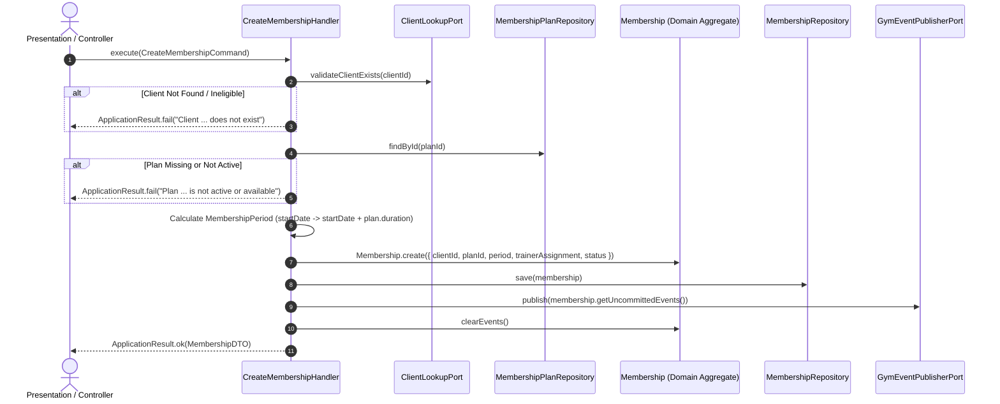

# Create Membership for Client — Application Use Case Specification

- **Status**: Authoritative Application Specification (Phase 5.3-D)
- **Bounded Context**: Gym Management
- **Layer**: Application / CQRS Command Handler
- **Primary Handler**: `CreateMembershipHandler`

---

## 1. Overview & Objective

The `CreateMembershipHandler` orchestrates the commercial onboarding of a validated gym client into an active or pending membership agreement. It acts as the explicit boundary between presentation/HTTP controllers and the pure domain layer, ensuring zero leakage of business invariants into user interfaces or transport controllers.

---

## 2. Architecture & Responsibility Split

| Layer            | Component                                                                                                                                                                                                                                                                     | Ownership & Responsibilities                                                                                                                                                                      |
| :--------------- | :---------------------------------------------------------------------------------------------------------------------------------------------------------------------------------------------------------------------------------------------------------------------------- | :------------------------------------------------------------------------------------------------------------------------------------------------------------------------------------------------ |
| **Presentation** | Controller / Route                                                                                                                                                                                                                                                            | Receives HTTP payload, passes typed `CreateMembershipCommand` to handler.                                                                                                                         |
| **Application**  | [`CreateMembershipHandler`](file:///c:/Projects/kinergy-platform/packages/core/src/gym/application/handlers/create-membership.handler.ts)                                                                                                                                     | Validates external client reference via port; queries active commercial plan; evaluates period; orchestrates atomic persistence and event publishing; returns `ApplicationResult<MembershipDTO>`. |
| **Domain**       | [`Membership`](file:///c:/Projects/kinergy-platform/packages/core/src/gym/domain/membership/membership.aggregate.ts), [`MembershipPeriod`](file:///c:/Projects/kinergy-platform/packages/core/src/gym/domain/membership/membership-period.vo.ts)                              | Enforces invariants, state machine, freeze rules, turnstile attendance eligibility. Zero framework/DB coupling.                                                                                   |
| **Ports**        | [`ClientLookupPort`](file:///c:/Projects/kinergy-platform/packages/core/src/gym/application/ports/client-lookup.port.ts)                                                                                                                                                      | Decouples Gym Management from direct Client aggregate queries.                                                                                                                                    |
| **Repositories** | [`MembershipRepository`](file:///c:/Projects/kinergy-platform/packages/core/src/gym/domain/repositories/membership.repository.ts), [`MembershipPlanRepository`](file:///c:/Projects/kinergy-platform/packages/core/src/gym/domain/repositories/membership-plan.repository.ts) | Abstract persistence contracts for Gym aggregates.                                                                                                                                                |

---

## 3. Orchestration & Validation Pipeline

1. **Input Validation**:
   - `clientId`: Required non-empty string.
   - `planId`: Required non-empty string.
2. **Client Validation**:
   - Invokes `ClientLookupPort.validateClientExists(clientId)`.
   - Rejects if client is missing or inactive in the Client bounded context.
3. **Commercial Plan Verification**:
   - Invokes `MembershipPlanRepository.findById(planId)`.
   - Validates `plan.isAvailableForPurchase()` is `true` (`status === PlanStatus.ACTIVE`).
   - Rejects plans in `DRAFT` or `ARCHIVED` status.
4. **Deterministic Period Calculation**:
   - `startDate`: Provided timestamp or defaults to `clock.now()`.
   - `endDate`: Computed authoritative via `plan.duration.calculateEndDate(startDate)`.
   - Period instantiated as `MembershipPeriod.create(startDate, endDate)`.
5. **Aggregate Construction**:
   - `Membership.create({ id, clientId, planId, period, trainerAssignment, status })`.
   - Emits `MembershipCreatedEvent`.
6. **Atomic Persistence & Events**:
   - `MembershipRepository.save(membership)` stores aggregate state.
   - `GymEventPublisherPort.publish(events)` dispatches uncommitted domain events.
   - `membership.clearEvents()` clears domain event buffer.
7. **Response Mapping**:
   - `MembershipMapper.toDTO(membership)` returns structured `MembershipDTO`.

---

## 4. Failure Conditions & Error Handling

| Scenario                      |   Result Status   | Error Message / Outcome                                                                 |
| :---------------------------- | :---------------: | :-------------------------------------------------------------------------------------- |
| Missing `clientId`            | `isFailure: true` | `"Client ID is required."`                                                              |
| Missing `planId`              | `isFailure: true` | `"Plan ID is required."`                                                                |
| Client does not exist         | `isFailure: true` | `"Client with id '...' does not exist or is not eligible for gym membership."`          |
| Plan not found in catalog     | `isFailure: true` | `"Membership plan with id '...' not found."`                                            |
| Plan in `DRAFT` or `ARCHIVED` | `isFailure: true` | `"Membership plan '...' is not active or available for new memberships (status: ...)."` |
| Invalid `startDate` format    | `isFailure: true` | `"Invalid startDate '...'."`                                                            |
| Aggregate invariant violation | `isFailure: true` | Explicit domain invariant error message.                                                |

---

## 5. Duplicate & Overlap Policy Note

As specified in Phase 5.3-D, complex duplicate / overlapping membership resolution rules are governed by Phase 5.3-E. The handler provides a clean orchestration foundation ready for 5.3-E policy plug-ins.
