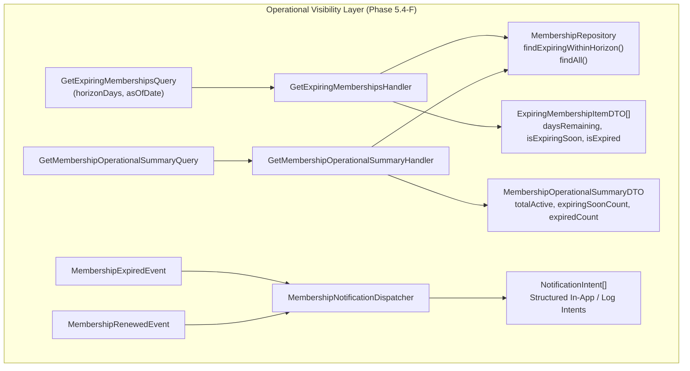

# Gym Management — Expiration Indicators, Notifications & Operational Read Models

## Phase 5.4-F Architecture Specification

---

## 1. Overview & Objective

This document defines the operational visibility layer for **Membership Expiration** in Kinergy. It formalizes:

1. The **Expiring-Soon** calculation and temporal threshold.
2. Front-desk dashboard status indicators (`ACTIVE`, `EXPIRING_SOON`, `EXPIRED`, `FROZEN`).
3. The CQRS read model architecture separating operational queries from aggregate business invariants.
4. The notification boundary for the MVP, cleanly decoupling domain events from deferred external communication integrations.

---

## 2. Expiring-Soon Definition & Rules

- **Operational Concern**: "Expiring Soon" is strictly an operational projection and query concern. It is **not** a state in `MembershipStatus`.
- **Temporal Horizon**:
  $$\text{ExpiringSoon}(t) \iff (\text{status} \in \{\text{ACTIVE}, \text{FROZEN}\}) \land 0 < (endDate - t) \le \text{horizonMs}$$
  - Default horizon: **7 days** ($604,800,000\text{ ms}$).
  - Configurable in query parameters (`horizonDays`).
- **Timezone Purity**: Calculated using UTC timestamps evaluated by the application `Clock`.

---

## 3. Dashboard Status Interpretation Matrix

Frontends must never evaluate raw `Date.now()` logic. All indicators originate authoritatively from the backend:

| State Displayed     | Backend Condition                                       | Indicator / Badge             |
| :------------------ | :------------------------------------------------------ | :---------------------------- |
| **`ACTIVE`**        | `status == ACTIVE && !isExpiringSoon && isCurrent(now)` | Green ("Active")              |
| **`EXPIRING_SOON`** | `(status == ACTIVE                                      |                               | status == FROZEN) && isCurrent(now) && (endDate - now <= horizonMs)` | Amber ("Expiring in N days") |
| **`EXPIRED`**       | `status == EXPIRED                                      |                               | (endDate <= now)`                                                    | Gray / Red ("Expired")       |
| **`FROZEN`**        | `status == FROZEN && !isExpiringSoon`                   | Blue ("Frozen")               |
| **`PENDING`**       | `status == PENDING && (now < startDate)`                | Purple ("Upcoming / Pending") |
| **`CANCELLED`**     | `status == CANCELLED`                                   | Slate ("Cancelled")           |
| **`TERMINATED`**    | `status == TERMINATED`                                  | Dark Red ("Terminated")       |

---

## 4. CQRS Read Model Architecture

---

## 5. Notification Architecture & MVP Boundaries

1. **In-Scope (MVP)**:
   - Domain Event Publication: Aggregate publishes `MembershipExpiredEvent` and `MembershipRenewedEvent`.
   - Notification Dispatcher: [`MembershipNotificationDispatcher`](../../packages/core/src/gym/application/event-handlers/membership-notification.dispatcher.ts) listens to domain events, eliminates duplicates idempotently, and records operational notification intents.
2. **Deferred (Future Phase)**:
   - External delivery infrastructure (Twilio WhatsApp, SMS, SendGrid SMTP) is cleanly separated and will subscribe to Gym domain events via the Communications bounded context.
