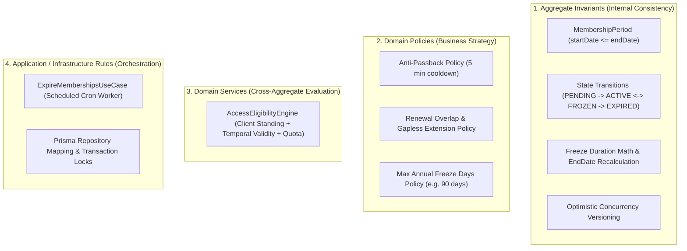

# Gym Management — Lifecycle Models & Domain Invariants

- **Status**: Authoritative Architectural Baseline
- **Bounded Context**: Gym Management (`packages/core/src/gym/`)
- **ADR Reference**: [ADR-0057](../adr/0057-gym-management-domain-invariants-and-lifecycle-model.md)

---

## 1. Domain Invariant Catalog

### 1.1 `Membership` Aggregate Invariants

1. **Client Singularity**: A `Membership` must belong to exactly one client (`clientId: string`).
2. **Plan Integrity**: A `Membership` must reference a valid `planId: string` at creation. Modifying plans in the catalog never alters an existing active membership retroactively.
3. **Period Positivity**: `period.startDate` must be $\le$ `period.endDate`. Zero or positive duration only.
4. **State Machine Strictness**: Transitions between lifecycle states must obey the deterministic state transition matrix. Any illegal transition throws `InvalidMembershipStateTransitionException`.
5. **Freeze Conservation**: Freezing is allowed only when `status === ACTIVE`. Resuming from freeze recalculates `period.endDate = period.endDate + elapsedFreezeDays`.
6. **Renewal Determinism**:
   - Renewing an `ACTIVE` membership sets `newStartDate = currentEndDate` and `newEndDate = currentEndDate + planDurationDays`.
   - Renewing an `EXPIRED` membership sets `newStartDate = paymentDate` and `newEndDate = paymentDate + planDurationDays`.
7. **Concurrency Versioning**: Every state transition or period change increments `version: number`.

---

### 1.2 `MembershipPlan` Invariants

1. **Plan Code Uniqueness**: Business codes (e.g. `ANNUAL_VIP`, `MONTHLY_BASIC`) must be non-empty and unique per tenant/branch.
2. **Positive Duration**: `durationDays` must be an integer $\ge 1$.
3. **Valid Quotas**: `visitLimit` if defined must be $\ge 1$.
4. **Archive Immutability**: Once `status === ARCHIVED`, a plan cannot be purchased for new enrollments.

---

### 1.3 Operational Turnstile Access & Eligibility Invariants

1. **Client Master Standing**: Turnstile access requires active client standing (`IClientFacade.isClientActive(clientId) === true`). If client profile is `ARCHIVED`, access is denied (`DENIED_INACTIVE_CLIENT`).
2. **Temporal Window Evaluation**: Even if status is stored as `ACTIVE`, entry is denied if `clock.now() > period.endDate` (`DENIED_EXPIRED`).
3. **Freeze Enforcement**: Frozen memberships are denied entry (`DENIED_FROZEN`).
4. **Anti-Passback Cooldown**: A client cannot record another entry at the same turnstile/gate within 300 seconds (5 minutes) (`DENIED_ANTI_PASSBACK_COOLDOWN`).
5. **Visit Quota Enforcement**: If a membership plan specifies a `visitLimit`, total granted check-ins cannot exceed `visitLimit` (`DENIED_LIMIT_REACHED`).

---

## 2. Invariant Classification Matrix



---

## 3. Canonical Time & Timezone Model

1. **UTC Storage**: All database columns (`start_date`, `end_date`, `check_in_time`, `created_at`, `updated_at`) store ISO 8601 UTC timestamps.
2. **Local Business Day (`GymDay`)**: Daily quotas and visit logs calculate against the facility's local timezone (e.g. `America/Guayaquil`):
   ```typescript
   export class GymDay {
     private constructor(
       public readonly localDate: string, // YYYY-MM-DD
       public readonly timezone: string,
     ) {}
   }
   ```
3. **Explicit Clock Injection**: All domain code depends on the `Clock` interface (`now(): Date`, `timezone(): string`). Production uses `SystemClock`; unit tests use `TestClock`.
