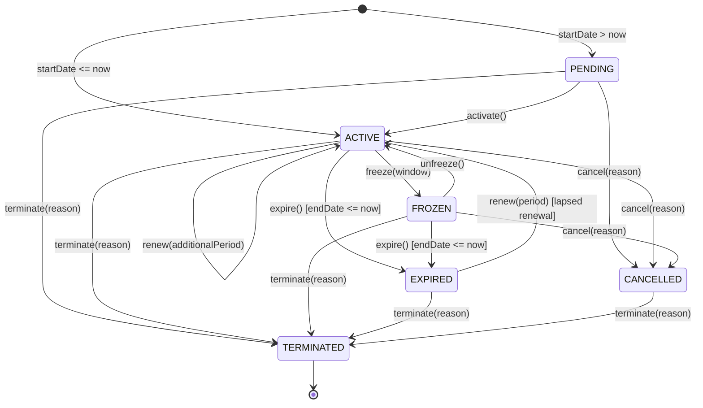

# Gym Management — Membership Lifecycle Integration & Consistency Audit

## Phase 5.4-G Architecture Audit Report

---

## 1. Overview & Core Architectural Invariant

The central architectural requirement of the Kinergy Gym Management Bounded Context is:

> **"API, dashboard, scheduler, and future integrations must invoke the same business semantics."**

This document records the formal lifecycle consistency audit across creation, renewal, expiration, attendance eligibility, plan mutability, lifecycle state transitions, events, and historical integrity.

---

## 2. Actual Lifecycle State Machine

Extracted directly from [`packages/core/src/gym/domain/membership/membership.aggregate.ts`](../../packages/core/src/gym/domain/membership/membership.aggregate.ts):

### Transition Guards & Invariant Enforcement

1. **Terminal States**: `TERMINATED` is an irrevocable terminal sink. No unfreeze, renewal, expiration, cancellation, or trainer assignment is permitted from `TERMINATED`.
2. **Renewal Guards**: Only `ACTIVE` and `EXPIRED` memberships may be renewed. `FROZEN`, `CANCELLED`, `PENDING`, and `TERMINATED` memberships reject renewals.
3. **Expiration Guards**: Only `ACTIVE` and `FROZEN` memberships may expire.

---

## 3. Time Consistency Audit

- **Clock Authority**: All domain operations and application use cases accept an injectable [`Clock`](../../packages/core/src/gym/domain/shared/clock.ts).
- **Zero Temporal Leaks**:
  - `Date.now()` is restricted exclusively to unique random ID generation (`eventId`, `membershipId`, `planId`) and telemetry latency metrics.
  - All temporal threshold evaluations and interval boundaries use UTC timestamps derived authoritatively from `clock.now()`.
  - Frontend components receive pre-computed operational indicators (`isExpiringSoon`, `daysRemaining`, `isExpired`) and execute zero client-local date arithmetic for domain decisions.

---

## 4. Single Authoritative Renewal & Expiration Paths

- **Renewal**: All entry points (HTTP API, Reception UI, scheduled renewal triggers, external webhooks) MUST invoke [`RenewMembershipHandler`](../../packages/core/src/gym/application/handlers/renew-membership.handler.ts), which delegates to `membership.renew(...)`.
- **Expiration**: All expiration triggers MUST execute [`ExpireMembershipsHandler`](../../packages/core/src/gym/application/handlers/expire-memberships.handler.ts), which invokes `membership.expire(clock)`. No direct database writes or external workers may update `status = EXPIRED` independently.

---

## 5. Canonical Attendance Eligibility Contract

- **Single Predicate**:
  $$\text{IsEligibleForAttendance}(t) \iff (\text{status} = \text{ACTIVE}) \land \neg \text{IsCurrentlyFrozen}(t) \land (t \in [\text{startDate}, \text{endDate}))$$
- Attendance verification and gate check-ins across the platform consume this single method on the aggregate root.

---

## 6. Historical Integrity & Plan Decoupling

The end-to-end multi-lifecycle audit confirmed:

1. **Catalog Decoupling**: Mutating a `MembershipPlan` (e.g. changing price from $50 to $65, or archiving the plan) has **zero retroactive effect** on existing active or expired `Membership` records.
2. **Snapshot Invariance**: Historical periods, freeze histories, and versions remain immutable once committed.

---

## 7. Quality Gates & Architectural Tests

Verified by:

- [`gym-lifecycle-integration-consistency.spec.ts`](../../packages/core/src/gym/gym-lifecycle-integration-consistency.spec.ts)
- [`gym-architecture-boundaries.spec.ts`](../../packages/core/src/gym/gym-architecture-boundaries.spec.ts)
- Monorepo test suite: **97 core test suites (896 tests) passing**.
