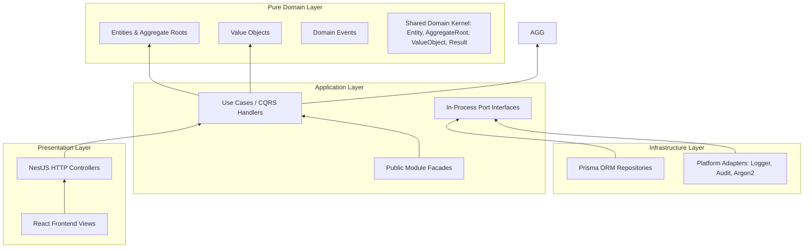
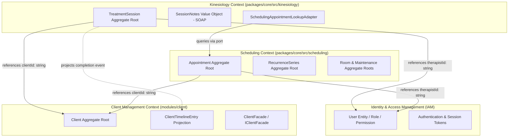

# Gym Management — Repository Reconnaissance & Architecture Alignment (Phase 5.1-A)

- **Status**: Approved Reconnaissance & Architecture Baseline
- **Date**: 2026-08-18
- **Author**: Principal Software Architect & Senior DDD Engineer
- **Scope**: Phase 5.1-A — Repository Reconnaissance, Bounded Context Boundaries, and Architectural Constraints for Gym Management

---

## 1. Repository Architecture Summary

The **Kinergy Platform** is an enterprise multi-tenant SaaS system architected as an **Nx integrated monorepo** governed by **Clean Architecture**, **Domain-Driven Design (DDD)**, and **Hexagonal (Ports & Adapters)** principles.

### 1.1 Structural Topology

| Path                   | Architectural Purpose                                       | Layer & Technologies                                           |
| :--------------------- | :---------------------------------------------------------- | :------------------------------------------------------------- |
| `apps/api/`            | Backend REST API application host                           | NestJS 10, Express, Swagger, Zod configuration                 |
| `apps/web/`            | Frontend single-page application host                       | React 18, Vite 5, TanStack Query 5, Tailwind CSS               |
| `modules/client/`      | Client Management Bounded Context                           | Pure Domain, Hexagonal Application, Prisma Repo, Public Facade |
| `packages/core/`       | Core Bounded Contexts library (`scheduling`, `kinesiology`) | Pure Domain Kernel, CQRS Application, Infrastructure Adapters  |
| `packages/types/`      | Workspace-wide shared TypeScript types                      | Ambient types, `Result<T, E>`, `Nullable<T>`, `EntityId`       |
| `packages/ui/`         | Shared UI component library                                 | Radix UI primitives, Tailwind CSS composition, Lucide icons    |
| `packages/utils/`      | Shared platform utilities                                   | Pure functional helpers, string formatters, date utilities     |
| `packages/validation/` | Shared schema validation rules                              | Zod domain schemas, common sanitization rules                  |
| `packages/config/`     | Shared application environment config                       | Zod configuration validators                                   |
| `packages/testing/`    | Reusable testing harnesses                                  | Jest utilities, in-memory repositories, mock factories         |
| `infrastructure/`      | Containerized development platform                          | Docker Compose, PostgreSQL 16, Adminer                         |
| `prisma/`              | Single physical database schema & migrations                | Prisma 6 ORM, PostgreSQL schema, seed runners                  |
| `docs/`                | Authoritative architecture, business & API specs            | Markdown ADRs (0001–0053), context specs, checklists           |

### 1.2 Clean Architecture Layer Invariants

Dependencies flow strictly inward: **Presentation $\rightarrow$ Infrastructure $\rightarrow$ Application $\rightarrow$ Domain Kernel**.



- **Domain Layer (`domain/`)**: Pure TypeScript without framework, HTTP, or ORM dependencies (`@nestjs/*`, `@prisma/*`, `express` are strictly forbidden). State mutations are guarded by invariants and optimistic concurrency versioning (`version: number`).
- **Application Layer (`application/`)**: Implements use cases via Command/Query handlers, defines repository ports (`IRepository<T>`), anti-corruption ports, and orchestrates domain entities.
- **Infrastructure Layer (`infrastructure/`)**: Implements persistence via Prisma adapters, security adapters, external services, and anti-corruption adapters.
- **Presentation Layer (`presentation/` & `apps/api/src/`)**: NestJS controllers, DTO validation pipes, exception filters, and OpenAPI annotations.

---

## 2. Existing Bounded Contexts

The repository currently establishes four bounded contexts across Phases 0–4:



### Context Breakdown

| Bounded Context                        | Code Location                     | Primary Aggregates / Entities                                  | Public Exposure Contract                                                                                            |
| :------------------------------------- | :-------------------------------- | :------------------------------------------------------------- | :------------------------------------------------------------------------------------------------------------------ |
| **Identity & Access Management (IAM)** | `apps/api/src/platform/identity/` | `User`, `Role`, `Permission`, `RefreshToken`                   | Auth Guards, Request Context (`ReqUser`), Password Hasher Port                                                      |
| **Client Management**                  | `modules/client/`                 | `Client`, `ClientTimelineEntry`                                | `IClientFacade` (`CLIENT_FACADE_TOKEN`), `ClientSummaryDto`, Integration Events (`@kinergy-platform/client-domain`) |
| **Scheduling**                         | `packages/core/src/scheduling/`   | `Appointment`, `RecurrenceSeries`, `Room`, `MaintenanceWindow` | CQRS Queries (`GetAppointmentByIdQuery`), HTTP Controllers                                                          |
| **Kinesiology**                        | `packages/core/src/kinesiology/`  | `TreatmentSession`, `SessionNotes`                             | REST API (`apps/api/src/kinesiology/`), `TreatmentSessionCompletedEvent`                                            |

---

## 3. Existing Dependency Rules

### 3.1 Hard Layer Boundaries

1. **Pure Domain Rule**: Production code under `domain/` directories MUST NOT import from `@nestjs/*`, `@prisma/*`, `express`, `fastify`, or foreign bounded contexts.
2. **Public Barrel Boundary**: External modules may only import from a bounded context's root public barrel (`index.ts` / `@kinergy-platform/<context>`). Internal subdirectories (`domain/aggregates/`, `infrastructure/persistence/`, `application/use-cases/`) are strictly private.
3. **Hexagonal Port-Adapter Rule**: Domain layers define ports (`IRepository`, `ISchedulingAppointmentLookupPort`). Infrastructure layers implement ports. Application layers inject ports via Dependency Injection tokens.
4. **Zero Cross-Context Aggregate Nesting**: Aggregates never contain instances of foreign aggregates. Foreign entities are referenced exclusively via scalar identifiers (`clientId: string`, `therapistId: string`, `appointmentId: string`).
5. **Zero Distributed Transactions**: Bounded contexts do not share database transactions, two-phase commits ($2\text{PC}$), or database foreign key constraints across context boundaries.

---

## 4. Client Ownership Analysis

### 4.1 Authoritative Owner

The **Client Management Bounded Context** (`modules/client/`) is the **sole authoritative owner** of master client records, personal demographics, E.164 phone normalization, accent-insensitive search indexing, and the client longitudinal activity timeline.

### 4.2 Separation of User vs Client

As mandated by **ADR-0002** and **ADR-0030**:

```text
┌─────────────────────────────────────────┐       ┌─────────────────────────────────────────┐
│       IDENTITY CONTEXT (IAM)            │       │        CLIENT MANAGEMENT CONTEXT        │
│                                         │       │                                         │
│  User Aggregate Root                    │       │  Client Aggregate Root                  │
│  - id: string (UUID)                    │       │  - id: string (UUID)                    │
│  - email: string                        │       │  - referenceNumber: string (CLT-...)    │
│  - passwordHash: string (Argon2id)      │       │  - identityId: string | null            │
│  - status: UserStatus                   │       │  - firstName / lastName: string         │
│  - roleId: string                       │◄──────┼── - email / phone: string               │
│                                         │ (1:1) │  - normalizedEmail / phone / searchName │
│  ZERO Profile / Personal / Gym Data     │ Opt.  │  - version: number (OCC)                │
└─────────────────────────────────────────┘       └─────────────────────────────────────────┘
```

- **`User`**: Owns authentication credentials, password lifecycle, session tokens, and RBAC permissions. Has zero personal profile data (no names, phones, emergency contacts, memberships).
- **`Client`**: Owns personal demographics, profile lifecycle (`ACTIVE`, `ARCHIVED`), and timeline history. May exist without a `User` (e.g. walk-in clients have `identityId: null`).
- **Late Binding**: An identity is linked optionally via `linkIdentity(identityId)`.

### 4.3 Client Consumption Rules for Gym Management

1. **NO Domain Class Imports**: Gym Management MUST NEVER import `Client`, `ClientProps`, `PrismaClientRepository`, or `ClientNotFoundException`.
2. **Synchronous Lookups via `IClientFacade`**: When Gym Management needs to verify if a client exists or is active (e.g. purchasing a membership or checking in), it must inject `IClientFacade` via `CLIENT_FACADE_TOKEN` from `@kinergy-platform/client-domain`.
3. **Identity Storage**: Gym Management entities (e.g. `Membership`, `Attendance`) must store client references strictly as scalar `clientId: string` (UUID).
4. **Activity Timeline Feeds**: Gym Management lifecycle events (e.g. membership purchased, check-in recorded) must be dispatched as immutable integration events to be projected into `client_timeline_entries` asynchronously without coupling to the Client write-model.

---

## 5. Cross-Context Integration Patterns

The repository utilizes three standardized cross-context integration patterns:

```mermaid
graph TD
    subgraph "Pattern A: Scalar ID Reference"
        AGG_A[Aggregate Root] -->|stores scalar| ID_VAL["foreignId: string (UUID)"]
    end

    subgraph "Pattern B: Synchronous In-Process Facade / Port"
        DOWNSTREAM_UC[Downstream Use Case] -->|injects| FACADE_TOKEN[IFacade Token]
        FACADE_TOKEN --> FACADE_IMPL[Public Facade]
        FACADE_IMPL --> READ_DTO[Public Summary DTO]
    end

    subgraph "Pattern C: Asynchronous Integration Event"
        PRODUCER[Domain Action] -->|emits| INT_EVENT[Integration Event (readonly, schemaVersion)]
        INT_EVENT -->|EventBus / Dispatcher| HANDLER[Timeline / Read-Model Projection]
    end
```

### Pattern Matrix

| Pattern                                 | Mechanism                                   | Use Case in Kinergy                                                  | Example in Codebase                                                                   |
| :-------------------------------------- | :------------------------------------------ | :------------------------------------------------------------------- | :------------------------------------------------------------------------------------ |
| **A. Scalar Identifier Reference**      | Immutable string UUID field                 | Storing foreign aggregate links in domain entities                   | `TreatmentSession.clientId`, `Appointment.clientId`                                   |
| **B. Synchronous Public Facade**        | In-Process Interface + Token + DTO          | Verifying external aggregate status during command execution         | `IClientFacade.isClientActive(clientId)` via `CLIENT_FACADE_TOKEN`                    |
| **C. Anti-Corruption Layer (ACL) Port** | Application Port + Infrastructure Adapter   | Translating external upstream query models to consumer-specific DTOs | `ISchedulingAppointmentLookupPort` $\rightarrow$ `SchedulingAppointmentLookupAdapter` |
| **D. Integration Event Projection**     | Immutable event contract + Event dispatcher | Projecting activity summary entries to client timeline               | `TreatmentSessionCompletedEvent` $\rightarrow$ `ClientTimelineProjectionHandler`      |

---

## 6. Relevant Existing ADRs

| ADR                                                                                                                  | Title                                              | Key Architectural Precedent for Gym Management                                                                                           |
| :------------------------------------------------------------------------------------------------------------------- | :------------------------------------------------- | :--------------------------------------------------------------------------------------------------------------------------------------- |
| **[ADR 0002](../adr/0002-client-domain-foundation.md)**                                                              | Client Domain Foundation & Identity Decoupling     | Establishes `Client` aggregate independence from `User` and optimistic concurrency control (`version`).                                  |
| **[ADR 0010](../adr/0010-backend-clean-architecture-layering.md)**                                                   | Backend Clean Architecture Layering                | Enforces strict 4-layer architecture (`kernel` $\rightarrow$ `application` $\rightarrow$ `infrastructure` $\rightarrow$ `presentation`). |
| **[ADR 0012](../adr/0012-shared-domain-kernel-abstractions.md)**                                                     | Shared Domain Kernel Abstractions                  | Mandates usage of `Entity<T>`, `AggregateRoot<T>`, `ValueObject<T>`, `Result<T, E>`, and `IDomainEvent`.                                 |
| **[ADR 0021](../adr/0021-transactional-consistency-unit-of-work.md)**                                                | Transactional Consistency & Unit of Work           | Local transaction boundaries; no cross-context distributed transactions.                                                                 |
| **[ADR 0030](../adr/0030-user-administration-identity-boundary-architecture.md)**                                    | User Administration & Identity Boundary            | Strict prohibition of business profile data in Identity `User` model.                                                                    |
| **[ADR 0045](../adr/0045-kinesiology-bounded-context-and-cross-context-identifiers.md)**                             | Cross-Context Identifiers & Zero Aggregate Nesting | Mandates scalar string identifiers for foreign references; strictly forbids embedding foreign entities.                                  |
| **[ADR 0048](../adr/0048-scheduling-to-kinesiology-anti-corruption-layer-port-architecture.md)**                     | Anti-Corruption Layer Port Architecture            | Standardizes Customer-Supplier port-adapter pattern for cross-context lookups.                                                           |
| **[ADR 0049](../adr/0049-cross-context-lifecycle-independence-and-non-corruption-invariants.md)**                    | Cross-Context Lifecycle Independence               | Prevents changes in one context from silently corrupting or mutating entities in another context.                                        |
| **[ADR 0052](../adr/0052-client-longitudinal-activity-timeline-and-cross-context-event-projection-architecture.md)** | Client Longitudinal Timeline Event Projection      | Standardizes asynchronous integration event contracts (`schemaVersion: 1`, `readonly` properties).                                       |

---

## 7. Relevant Existing Architecture Tests

The repository actively enforces bounded context isolation through automated architectural unit tests:

1. **Client Bounded Context Architecture Test (`modules/client/__tests__/architecture.spec.ts`)**:
   - **Rule 1**: The public barrel (`index.ts`) MUST NOT re-export internal aggregates, Prisma repositories, domain errors, command handlers, or controllers.
   - **Rule 2**: The `public/` layer MUST NOT import from `infrastructure/` or `presentation/`.
   - **Rule 3**: Integration event contracts MUST be immutable (all properties declared `readonly`, explicit literal `schemaVersion = 1 as const`).
   - **Rule 4**: `ClientSummaryDto` MUST NOT expose internal fields (`identityId`, `version`, `createdAt`, `updatedAt`).
   - **Rule 5**: `IClientFacade` MUST declare all required query methods and the `CLIENT_FACADE_TOKEN` injection symbol.
2. **Kinesiology Bounded Context Architecture Test (`packages/core/src/kinesiology/kinesiology-architecture-boundaries.spec.ts`)**:
   - Enforces zero Prisma, NestJS, Express, or foreign domain aggregate imports in `domain/` production files.
   - Enforces zero direct Scheduling domain aggregate imports in `application/` production files.

---

## 8. Gym Management Constraints

Based on repository facts and architecture invariants, Gym Management must respect the following integration constraints:

```mermaid
graph TD
    subgraph Allowed Dependencies for Gym Management
        KERNEL_DEP["@kinergy-platform/types, /utils, /validation"]
        PLAT_DEP["PrismaService, ILoggerPort, IAuditService"]
        CLIENT_FACADE_DEP["IClientFacade via CLIENT_FACADE_TOKEN"]
        AUTH_GUARD_DEP["AuthenticationGuard & ReqUser (Actor Context)"]
    end

    subgraph Prohibited Dependencies for Gym Management
        NO_CLIENT_DOM["❌ modules/client/domain/aggregates/client.aggregate"]
        NO_USER_DOM["❌ User Aggregate / Password / Auth state machine"]
        NO_KIN_DOM["❌ Kinesiology TreatmentSession / SOAP Notes"]
        NO_SCHED_DOM["❌ Scheduling Recurrence / Room internals"]
        NO_DIRECT_DB["❌ Direct cross-context Prisma table queries (clients, appointments)"]
    end

    GYM_BC[Gym Management Bounded Context] --> Allowed Dependencies for Gym Management
    GYM_BC -.->|BLOCKED BY ARCHITECTURE RULES| Prohibited Dependencies for Gym Management
```

### Specific Integration Answers

| #     | Architectural Question                                                           | Authoritative Answer & Implementation Rule                                                                                                                                                                                                                                                       |
| :---- | :------------------------------------------------------------------------------- | :----------------------------------------------------------------------------------------------------------------------------------------------------------------------------------------------------------------------------------------------------------------------------------------------- |
| **1** | **What existing contexts can Gym Management depend on?**                         | `Shared Kernel` (`@kinergy-platform/types`, `@kinergy-platform/utils`, `@kinergy-platform/validation`), `Platform Infrastructure` (`PrismaService`, `ILoggerPort`, `IAuditService`), `Client Public Facade` (`@kinergy-platform/client-domain`), and `Identity Guards` for route authentication. |
| **2** | **What contexts must Gym Management never depend on directly?**                  | `Kinesiology` domain/tables (clinical SOAP notes, treatment sessions), internal `Scheduling` domain aggregates, internal `Client` domain aggregates/repositories, and internal `Identity` user credentials/repositories.                                                                         |
| **3** | **How should Client identity be referenced?**                                    | Strictly via scalar opaque string UUID `clientId: string`. Synchronous profile/status queries must pass through `IClientFacade` via `CLIENT_FACADE_TOKEN`.                                                                                                                                       |
| **4** | **Should Gym Management know anything about User?**                              | Only the authenticated request actor ID (`req.user.id`) for auditing/authorization and assigning staff/trainers via scalar `trainerId: string` (referencing `User.id`). It must NOT duplicate User credentials or authentication state.                                                          |
| **5** | **Should Gym Management know anything about Kinesiology treatment details?**     | **Zero knowledge.** Clinical notes, diagnoses, and SOAP assessments are strictly confidential medico-legal records encapsulated in Kinesiology.                                                                                                                                                  |
| **6** | **Should Gym Management know anything about Scheduling implementation details?** | **Zero knowledge.** Recurrence algorithms, room turnaround buffers, and calendar math remain inside Scheduling.                                                                                                                                                                                  |
| **7** | **What information may cross context boundaries?**                               | Scalar identifiers (`clientId`, `trainerId`, `membershipId`), public query DTOs (`ClientSummaryDto`), and immutable integration event contracts (`schemaVersion: 1`).                                                                                                                            |
| **8** | **Which layer is responsible for translating external contracts?**               | The **Application & Infrastructure Anti-Corruption / Port Adapter Layer**. The domain layer remains 100% pure TypeScript.                                                                                                                                                                        |

---

## 9. Architectural Risks

1. **Risk of Model Duplication**: High temptation to create a duplicate `GymMember` or `GymUser` domain entity that copies client demographics or user authentication details.
   - _Mitigation_: Strictly model `Membership` and `Attendance` aggregates referencing `clientId: string`. Use `IClientFacade` for any presentation-layer name/contact hydration.
2. **Risk of Shared Prisma Schema Coupling**: Prisma schema defines all models in a single `prisma/schema.prisma` file.
   - _Mitigation_: Do not add cross-context foreign key relations (`@relation`) from new Gym models directly to `Client` or `User` models if it enforces strict relational cascades or cross-context schema lock-in.
3. **Risk of Distributed Concurrency Conflicts on Check-in**: Concurrent check-ins or simultaneous membership status transitions could result in race conditions.
   - _Mitigation_: Enforce optimistic concurrency control (`version: number`) on `Membership` aggregate and deterministic state machines for membership lifecycles (`ACTIVE`, `FROZEN`, `EXPIRED`, `CANCELLED`).
4. **Risk of Barrel File Leakage**: Accidentally exporting internal use cases, repositories, or domain entities from Gym Management's public barrel.
   - _Mitigation_: Author dedicated architectural boundary tests (`gym-architecture-boundaries.spec.ts`) mirroring `modules/client/__tests__/architecture.spec.ts`.

---

## 10. Decisions That Must Be Made in Milestone 5.1

The following architectural decisions are **PENDING** and must be resolved in **Milestone 5.1-B (Bounded Context Ownership & Context Map)**:

1. **Package / Module Placement**: Should Gym Management be placed as an independent module under `modules/gym/` (mirroring `modules/client/`) or under `packages/core/src/gym/` (mirroring `packages/core/src/scheduling/`)?
2. **Aggregate Boundary Identification**: Define the exact aggregate root boundaries within Gym Management (e.g. `Membership` aggregate root vs `MembershipPlan` aggregate root vs `AttendanceRecord` entity/aggregate).
3. **Trainer Concept Modeling**: Clarify how `Trainer` is represented—whether purely as `trainerId: string` (referencing `User.id`) or as a specialized role/profile value object in the Gym context.
4. **Membership Lifecycle State Machine**: Specify the formal state transitions (`PENDING`, `ACTIVE`, `FROZEN`, `EXPIRED`, `CANCELLED`, `TERMINATED`) and allowed triggers.
5. **Context Map Relationship Matrix**: Formally document the Upstream/Downstream and Customer/Supplier relationships between Gym Management, Client Management, Identity, Scheduling, and Billing.

---

## 11. Quality Gates & Verification Commands

The repository provides the following standardized verification scripts in `package.json`:

```bash
# Code Style & Formatting Check
pnpm format:check

# Formatting Auto-Fix
pnpm format

# Workspace Linter (Nx across all 10 projects)
pnpm lint

# Strict TypeScript Compilation Check (Root & all packages)
pnpm typecheck

# Full Test Suite (Jest across all 10 projects)
pnpm test

# Full Production Build (Nx across all 10 projects)
pnpm build

# Complete Quality Gate Pipeline
pnpm validate
```

All 6 quality gates were executed and confirmed **100% passing (67 test suites, 341 tests passed)** prior to finalizing this baseline.
