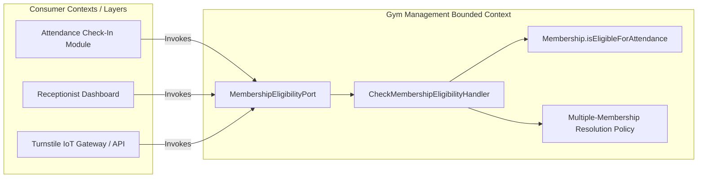
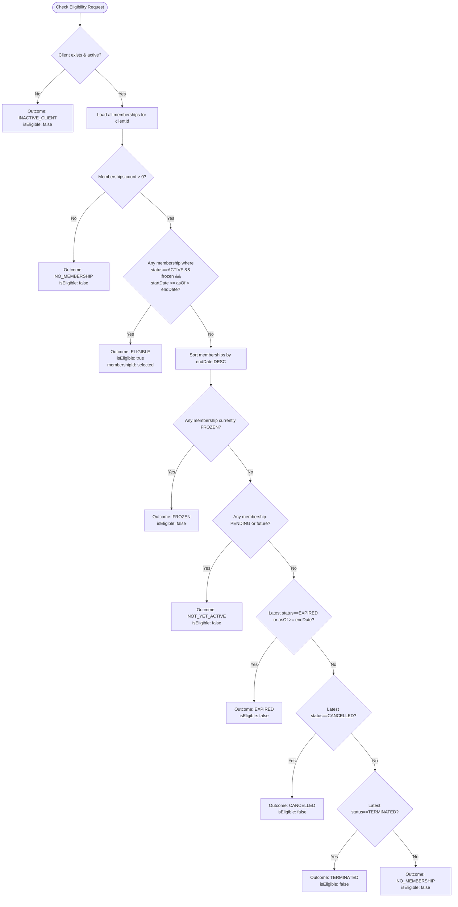

# Gym Management — Membership Eligibility Contract & Cross-Context Architecture

- **Status**: Authoritative Architectural Specification
- **Phase**: 5.5-B
- **Bounded Context**: Gym Management (`packages/core/src/gym/`)
- **ADR References**: [ADR-0054](../adr/0054-gym-management-bounded-context-ownership-and-context-map.md), [ADR-0060](../adr/0060-gym-management-duplicate-and-overlapping-membership-policy.md), [ADR-0062](../adr/0062-gym-management-membership-expiration-temporal-semantics-and-canonical-eligibility-model.md), [ADR-0064](../adr/0064-gym-management-attendance-domain-boundary-identity-and-append-only-log-model.md), [ADR-0065](../adr/0065-gym-management-membership-eligibility-contract-and-cross-context-integration.md)

---

## 1. Executive Summary & Authoritative Ownership

The **Membership Eligibility Contract** provides the definitive, real-time answer to the core question:

> **"Can this Client check in to the gym right now?"**

### 1.1 The Authoritative Boundary Invariant

> **Gym Management (specifically the Membership domain and application service layer) is the sole authoritative owner of membership admission eligibility evaluation.**
>
> **Attendance and other consumers must NEVER inspect membership end dates, status strings, or freeze windows directly to infer eligibility.**



---

## 2. Eligibility Evaluation Formula & Rules

Eligibility is evaluated through a strict 3-tier check:

$$\text{Eligible} \iff \text{ClientExistsAndActive} \land \exists m \in \text{Memberships}(\text{clientId}) \text{ s.t. } \text{IsMembershipEligible}(m, asOf)$$

Where:
$$\text{IsMembershipEligible}(m, asOf) \iff (m.status == ACTIVE) \land \neg m.\text{isCurrentlyFrozen}(asOf) \land (asOf \ge m.startDate \land asOf < m.endDate)$$

---

## 3. Decision Matrix & Diagnostic Decision Tree



---

## 4. Contract Specification

### 4.1 Port Interface

`packages/core/src/gym/application/ports/membership-eligibility.port.ts`:

```typescript
export interface MembershipEligibilityPort {
  evaluateEligibility(clientId: string, asOf?: Date): Promise<MembershipEligibilityResultDTO>;
}
```

### 4.2 Diagnostic DTO & Outcome Codes

`packages/core/src/gym/application/dtos/membership-eligibility-result.dto.ts`:

```typescript
export interface MembershipEligibilityResultDTO {
  readonly isEligible: boolean;
  readonly outcome: MembershipEligibilityOutcome;
  readonly membershipId: string | null;
  readonly planId: string | null;
  readonly period: {
    readonly startDate: string;
    readonly endDate: string;
  } | null;
  readonly evaluatedAt: string;
  readonly reason: string;
}
```

---

## 5. Multi-Membership Resolution Invariants

1. **At Most One Active Commitment**: Enforced at creation/renewal time by `MembershipOverlapPolicy` (ADR-0060).
2. **Deterministic Priority**: If an active eligible agreement exists, it is selected immediately regardless of the count of past expired or future pending agreements.
3. **Audit Continuity**: Historical memberships remain unmodified. Querying eligibility evaluates against the point-in-time state without side effects or database mutations.

---

## 6. Security & RBAC Mapping

- **Turnstile / IoT Gateway**: Requires client identification token/badge ID, executed under machine/system credential with `attendance:record` scope.
- **Reception Desk**: Requires authenticated staff user with role `RECEPTIONIST`, `ADMIN`, or `TRAINER`.
- **Self-Service Check-In Kiosk**: Requires authenticated client session or validated QR code token.
- Uses existing platform authorization decorators and guards.

---

## 7. Verification & Testing Baseline

- **Test Suite**: [`check-membership-eligibility.handler.spec.ts`](file:///c:/Projects/kinergy-platform/packages/core/src/gym/application/queries/check-membership-eligibility.handler.spec.ts)
- **Scenarios Verified**:
  - Active within period $\rightarrow$ `ELIGIBLE`.
  - Non-existent/inactive client $\rightarrow$ `INACTIVE_CLIENT`.
  - No memberships $\rightarrow$ `NO_MEMBERSHIP`.
  - Past end date $\rightarrow$ `EXPIRED`.
  - Active freeze window $\rightarrow$ `FROZEN`.
  - Future period $\rightarrow$ `NOT_YET_ACTIVE`.
  - Cancelled status $\rightarrow$ `CANCELLED`.
  - Terminated status $\rightarrow$ `TERMINATED`.
  - Multi-membership (expired history + active) $\rightarrow$ `ELIGIBLE`.
  - Half-open interval ($1\text{ ms}$ before $endDate$ vs exact $endDate$) $\rightarrow$ `ELIGIBLE` vs `EXPIRED`.
