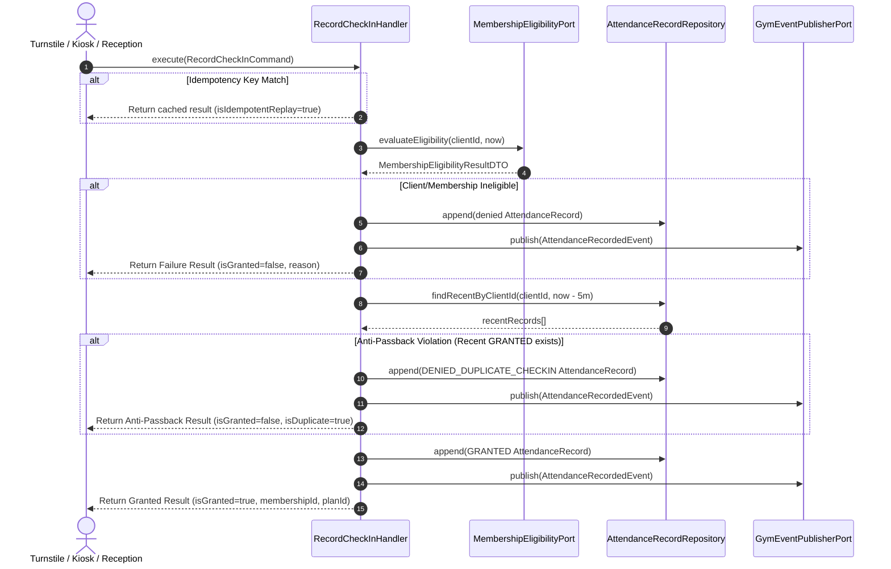

# Gym Management — Record Gym Check-In Use Case Architecture

- **Status**: Authoritative Architectural Specification
- **Phase**: 5.5-D
- **Bounded Context**: Gym Management (`packages/core/src/gym/`)
- **ADR References**: [ADR-0054](../adr/0054-gym-management-bounded-context-ownership-and-context-map.md), [ADR-0062](../adr/0062-gym-management-membership-expiration-temporal-semantics-and-canonical-eligibility-model.md), [ADR-0064](../adr/0064-gym-management-attendance-domain-boundary-identity-and-append-only-log-model.md), [ADR-0065](../adr/0065-gym-management-membership-eligibility-contract-and-cross-context-integration.md), [ADR-0066](../adr/0066-gym-management-record-check-in-use-case-anti-passback-and-idempotency.md)

---

## 1. Executive Summary & Flow

The **Record Gym Check-In Use Case** orchestrates admission into physical facilities.



---

## 2. Ingress & Duplicate Policies

### 2.1 Anti-Passback Cooldown Rule

- When an admission is granted, a member is barred from re-scanning into the same facility within **5 minutes** (`300,000 ms`).
- Re-scans within the window generate a `DENIED_DUPLICATE_CHECKIN` record in the audit log.
- Failed attempts (e.g. invalid membership) do **not** initiate or trigger anti-passback cooldown.

### 2.2 Network Retry Idempotency

- Requests containing an `idempotencyKey` are cached for 10 minutes.
- Retries return identical responses with `isIdempotentReplay: true` without creating redundant database records.

---

## 3. Interfaces & Contracts

### 3.1 Command Contract

`packages/core/src/gym/application/commands/record-check-in.command.ts`:

```typescript
export interface RecordCheckInInput {
  readonly clientId: string;
  readonly method: CheckInMethod;
  readonly gateId?: string | null;
  readonly receptionistId?: string | null;
  readonly notes?: string | null;
  readonly facilityId?: string | null;
  readonly timezone?: string | null;
  readonly idempotencyKey?: string | null;
  readonly asOf?: Date | null;
}
```

### 3.2 Response Contract

`packages/core/src/gym/application/dtos/record-check-in-result.dto.ts`:

```typescript
export interface RecordCheckInResultDTO {
  readonly isGranted: boolean;
  readonly outcome: AccessResult;
  readonly attendanceId: string | null;
  readonly clientId: string;
  readonly membershipId: string | null;
  readonly planId: string | null;
  readonly checkInTime: string;
  readonly gymDay: {
    readonly localDate: string;
    readonly timezone: string;
    readonly facilityId: string;
  };
  readonly method: CheckInMethod;
  readonly gateId: string | null;
  readonly receptionistId: string | null;
  readonly isDuplicate: boolean;
  readonly isIdempotentReplay: boolean;
  readonly denialReason: string | null;
}
```

---

## 4. Verification & Testing

- Unit test suite: [`record-check-in.handler.spec.ts`](file:///c:/Projects/kinergy-platform/packages/core/src/gym/application/handlers/record-check-in.handler.spec.ts) (12/12 passing).
- Coverage includes RFID check-ins, manual reception entries, all eligibility rejection paths, 5-minute anti-passback enforcement, cooldown expiration, idempotency replay, and error handling.
