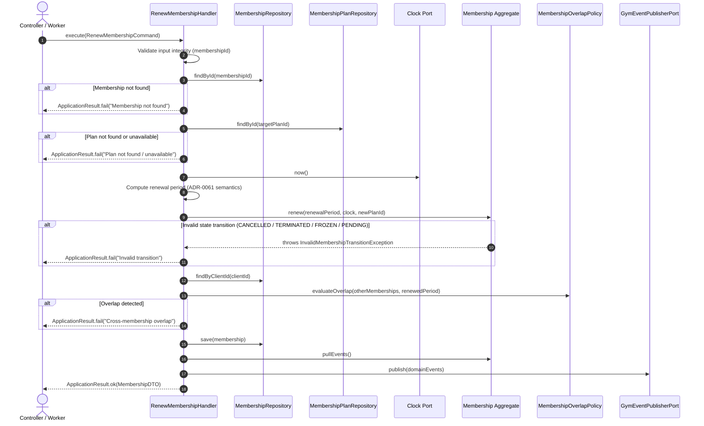

# Gym Management — Renew Membership Use Case Specification

**Context**: Gym Management Bounded Context  
**Artifact**: Architecture Specification  
**Phase**: 5.4-C  
**Author**: Senior Application Architect  
**Status**: Approved / Implemented

---

## 1. Overview & Objective

The **Renew Membership** use case orchestrates the commercial extension or re-activation of an existing client `Membership` aggregate within the **Gym Management** bounded context.

The use case acts strictly as an application coordinator:

- **Application Layer Orchestrates**: Loads entities, queries repository ports, obtains authoritative clock time, evaluates cross-aggregate overlap constraints, persists atomically, and dispatches domain events.
- **Domain Decides**: The `Membership` aggregate root authoritatively enforces lifecycle transitions, date extension math, and emit invariants.
- **Infrastructure Persists**: The database repository persists aggregate state under optimistic concurrency control.

The use case produces identical deterministic outcomes whether invoked by HTTP API, reception dashboard, scheduled worker, or future partner integration.

---

## 2. Use Case Flow

---

## 3. Dependency Ports

The use case interacts solely through decoupled dependency ports and domain interfaces:

1. **`MembershipRepository`**: Port for loading and persisting `Membership` aggregates.
2. **`MembershipPlanRepository`**: Port for loading commercial `MembershipPlan` aggregates.
3. **`Clock`**: Injected time abstraction (`now(): Date`, `timezone(): string`).
4. **`GymEventPublisherPort`**: Outbox/Event bus port for publishing domain events after transaction commit.
5. **`MembershipOverlapPolicy`**: Pure domain policy evaluating cross-membership interval overlaps for the client.

---

## 4. Transaction Boundary & Atomicity

- **Unit of Work Atomicity**: The persistence of the renewed `Membership` aggregate, its updated `period`, `planId`, incremented `version`, and recorded outbox event must occur in a single atomic database transaction.
- **Fail-Safe Invariant**: If any step fails (plan unavailable, overlap detected, concurrency conflict, database outage), zero database changes are committed and zero domain events are published to external brokers.

---

## 5. Concurrency Strategy

- **Optimistic Concurrency Control (OCC)**: `Membership` aggregates carry an integer `version` field incremented on every state-mutating operation.
- **Race Condition Prevention**:
  - If two staff members or workers attempt to renew the same `Membership` concurrently, both load `version = N`.
  - The first transaction commits and increments `version = N + 1`.
  - The second transaction detects `version` mismatch at the persistence boundary and rejects with a concurrency conflict error.
  - This prevents lost updates, double date extensions, and duplicate domain events.

---

## 6. Idempotency Strategy

- **Command Keying**: `RenewMembershipCommand` supports an optional `idempotencyKey?: string` in `RenewMembershipInput`.
- **Deduplication**: Upstream HTTP controllers or workers can track `idempotencyKey` in the transaction store. If a network retry occurs with the same key for an already completed renewal, the application returns the cached `MembershipDTO` without executing duplicate renewals or double charging.

---

## 7. Error Mapping & Taxonomy

| Failure Scenario                     | Domain / Application Error             | Error Message Format                                                                      |
| :----------------------------------- | :------------------------------------- | :---------------------------------------------------------------------------------------- |
| **Missing Membership ID**            | Validation Failure                     | `"Membership ID is required."`                                                            |
| **Membership Not Found**             | Resource Missing                       | `"Membership with id '{id}' not found."`                                                  |
| **Plan Not Found**                   | Catalog Missing                        | `"Membership plan with id '{planId}' not found."`                                         |
| **Plan Inactive / Draft / Archived** | Commercial Invariant                   | `"Membership plan '{code}' is not active or available for renewal (status: {status})."`   |
| **Invalid Effective Date**           | Format Invariant                       | `"Invalid effectiveDate '{input}'."`                                                      |
| **Terminal State Renewal**           | `InvalidMembershipTransitionException` | `"Only ACTIVE or EXPIRED memberships can be renewed."`                                    |
| **Cross-Membership Overlap**         | Policy Invariant                       | `"Requested period [{start} - {end}] overlaps with existing {status} membership '{id}'."` |
| **Concurrency Conflict**             | Optimistic Lock Error                  | Handled by repository OCC rollback.                                                       |

---

## 8. Verification & Quality Gates

The implementation is verified by:

- `packages/core/src/gym/application/handlers/renew-membership.handler.spec.ts` (15 unit tests covering all success, boundary, error, and overlap workflows).
- `packages/core/src/gym/gym-architecture-boundaries.spec.ts` (boundary isolation and documentation tests).
