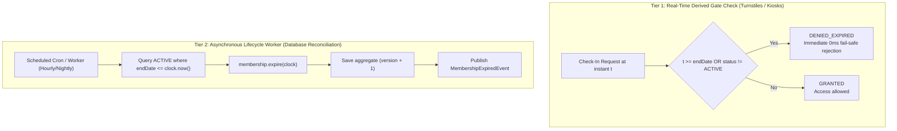

# Gym Management — Membership Renewal Semantics & Expiration Lifecycle Rules

- **Status**: Authoritative Architectural Baseline (Phase 5.4-A)
- **Bounded Context**: Gym Management (`packages/core/src/gym/`)
- **ADR Reference**: [ADR-0061](../../docs/adr/0061-gym-management-membership-renewal-and-expiration-temporal-semantics.md)
- **Deciders**: Principal Domain Architect, Senior Application Architect

---

## 1. Executive Summary

This document establishes the exact temporal model, lifecycle state transitions, and boundary rules governing **Membership Renewal** and **Membership Expiration** in Kinergy. It provides a single, deterministic interpretation of membership time across domain aggregates, application handlers, scheduled background workers, and physical turnstile check-in kiosks.

---

## 2. Canonical Time Model: Half-Open Intervals $[startDate, endDate)$

In accordance with [ADR-0055](../../docs/adr/0055-gym-management-canonical-domain-vocabulary-and-semantic-contracts.md) and [ADR-0057](../../docs/adr/0057-gym-management-domain-invariants-and-lifecycle-model.md):

1. **Storage & Representation**: All domain timestamps are UTC ISO 8601 strings (`YYYY-MM-DDTHH:mm:ss.sssZ`).
2. **Interval Contract**: `MembershipPeriod` intervals are **start-inclusive, end-exclusive** $[startDate, endDate)$.
3. **Current Instant Evaluation**:
   $$\text{isCurrent}(t) \iff \text{startDate} \le t < \text{endDate}$$
4. **Boundary Condition ($t = endDate$)**:
   At the exact millisecond $t = endDate$, the membership is **strictly expired** ($\text{isCurrent}(t) = \text{false}$).

---

## 3. Renewal Temporal Rules

### 3.1 Scenario 1: Renewal Before Expiration ($now < endDate$)

- **Business Goal**: Allow active members to renew in advance without losing any already-paid membership days.
- **Formula**:
  $$\text{newEndDate} = \text{currentEndDate} + \text{planDurationDays}$$
  $$\text{startDate} \text{ remains unchanged}$$
- **Example**: Member on a 30-day plan [June 1, 00:00 $\rightarrow$ July 1, 00:00) renews on June 20 for another 30 days. The resulting period becomes [June 1, 00:00 $\rightarrow$ July 31, 00:00). All 10 remaining unused days are preserved.
- **Identity / Execution Model**:
  - _Same Plan_: In-place aggregate extension via `membership.renew(additionalPeriod, clock)`, which records `MembershipRenewedEvent` and increments optimistic `version`.
  - _Plan Switch_: Pre-scheduled consecutive new `Membership` aggregate with $\text{startDate} = \text{current.endDate}$, compliant with [ADR-0060](../../docs/adr/0060-gym-management-duplicate-and-overlapping-membership-policy.md).

### 3.2 Scenario 2: Renewal at Expiration Boundary ($now == endDate$)

- **Formula**:
  $$\text{newStartDate} = \text{currentEndDate} = now, \quad \text{newEndDate} = now + \text{planDurationDays}$$
- **Outcome**: Seamless continuation with zero access interruption.

### 3.3 Scenario 3: Renewal After Expiration ($now > endDate$)

- **Business Goal**: Fair treatment of lapsed members. Members are not charged or backdated for days when facility entry was not permitted.
- **Formula**:
  $$\text{newStartDate} = now, \quad \text{newEndDate} = now + \text{planDurationDays}$$
- **Example**: Membership expired on July 1. Member returns and renews on July 10 for 30 days. The new period is [July 10, 00:00 $\rightarrow$ August 9, 00:00). The gap between July 1 and July 10 is not backdated.
- **State Transition**: `EXPIRED` $\rightarrow$ `ACTIVE` via `renew()`, emitting `MembershipRenewedEvent`.

---

## 4. Master Lifecycle & Renewal State Matrix

| Current State    | Temporal Condition | Command         | Allowed? | Resulting State | Date Math                                               | Emitted Event            |
| :--------------- | :----------------- | :-------------- | :------: | :-------------- | :------------------------------------------------------ | :----------------------- |
| **`ACTIVE`**     | $now < endDate$    | `renew(period)` |    ✅    | `ACTIVE`        | $endDate_{new} = endDate_{curr} + duration$             | `MembershipRenewedEvent` |
| **`ACTIVE`**     | $now == endDate$   | `renew(period)` |    ✅    | `ACTIVE`        | $endDate_{new} = endDate_{curr} + duration$             | `MembershipRenewedEvent` |
| **`ACTIVE`**     | $now > endDate$    | `renew(period)` |    ✅    | `ACTIVE`        | $startDate_{new} = now, endDate_{new} = now + duration$ | `MembershipRenewedEvent` |
| **`EXPIRED`**    | $now > endDate$    | `renew(period)` |    ✅    | `ACTIVE`        | $startDate_{new} = now, endDate_{new} = now + duration$ | `MembershipRenewedEvent` |
| **`FROZEN`**     | $now < endDate$    | `renew(period)` |    ✅    | `FROZEN`        | $endDate_{new} = endDate_{curr} + duration$             | `MembershipRenewedEvent` |
| **`PENDING`**    | $now < startDate$  | `renew(period)` |    ✅    | `PENDING`       | $endDate_{new} = endDate_{curr} + duration$             | `MembershipRenewedEvent` |
| **`CANCELLED`**  | Any                | `renew(period)` |    ❌    | —               | Throws `InvalidMembershipTransitionException`           | None                     |
| **`TERMINATED`** | Any                | `renew(period)` |    ❌    | —               | Throws `InvalidMembershipTransitionException`           | None                     |

---

## 5. Two-Tier Expiration Processing



### 5.1 Tier 1: Real-Time Gate Evaluation

- **Why**: Zero dependency on background job timing. Even if a background worker is delayed or restarts, turnstiles evaluate `period.isCurrent(clock.now()) && status === ACTIVE` in memory. If $now \ge endDate$, physical entry is instantly denied with `DENIED_EXPIRED`.

### 5.2 Tier 2: Persistent Lifecycle Worker

- **Why**: Keep database state, reporting dashboards, and client profiles synchronized with the passage of time.
- **Worker Contract**:
  - Command: `ExpireMembershipsCommand`.
  - Handler: `ExpireMembershipsHandler`.
  - Batching: Process in batches with optimistic concurrency versioning.
  - Idempotency: Running the worker multiple times is completely idempotent. If a record is already `EXPIRED`, it is skipped without error.

---

## 6. Physical Attendance Eligibility Contract (Phase 5.5 Handover)

The future **Attendance / Access Control** subsystem (Phase 5.5) MUST verify the following canonical contract:

```typescript
export interface AttendanceEligibilityEvaluation {
  readonly isEligible: boolean;
  readonly reason?:
    | 'GRANTED'
    | 'DENIED_EXPIRED'
    | 'DENIED_FROZEN'
    | 'DENIED_INACTIVE_CLIENT'
    | 'DENIED_LIMIT_REACHED'
    | 'DENIED_ANTI_PASSBACK_COOLDOWN';
}
```

**Canonical Invariants**:

1. `membership.status === MembershipStatus.ACTIVE`
2. `membership.period.isCurrent(clock.now()) === true`
3. `membership.isCurrentlyFrozen(clock.now()) === false`
4. `client.status === ClientStatus.ACTIVE` (verified via `ClientLookupPort`)
5. `membership.remainingVisits > 0` (if limited-visit plan)
6. `timeSinceLastCheckIn >= 300` seconds (anti-passback cooldown)

---

## 7. Notification & Expiration Warning Strategy

1. **Expiring-Soon Projection**: A daily query identifies active memberships where $endDate - clock.now() \le 7\text{ days}$.
2. **Event Dispatching**: Emits `MembershipExpiringSoonIntegrationEvent` for consumption by the Notifications and Timeline contexts.
3. **Audit Trail**: All lifecycle transitions dispatch immutable domain events (`MembershipRenewedEvent`, `MembershipExpiredEvent`).
