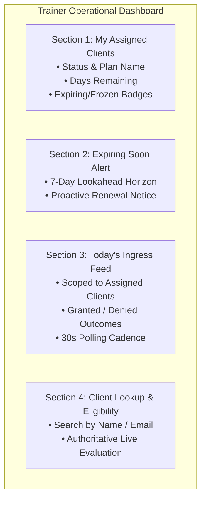

# Gym Management — Trainer Operational Dashboard Specification

- **Status**: Authoritative Architectural Specification
- **Bounded Context**: Gym Management (`packages/core/src/gym/`) & Frontend (`apps/web/src/modules/gym/trainer-dashboard/`)
- **ADR Reference**: [ADR-0073](../adr/0073-trainer-operational-dashboard-domain-boundaries-and-read-model-architecture.md)

---

## 1. Executive Summary

The **Trainer Operational Dashboard** empowers fitness trainers to manage their assigned clients and gym floor interactions during daily operations.

It is designed under strict Domain-Driven Design (DDD) boundaries:

1. **Operational, Not Administrative**: Focuses on floor supervision and member awareness; excludes billing, membership creation/renewal, and reception check-in actions.
2. **Value Object Trainer Assignment**: `TrainerAssignment` is an immutable Value Object on `Membership` (`trainerId: string`, `assignedAt: Date`). No duplicate `Trainer` aggregate is created.
3. **Server-Side Expiration Calculations**: All temporal indicators (`isExpiringSoon`, `daysRemaining`, `isExpired`, `isCurrentlyFrozen`) are computed by backend CQRS read-model handlers.
4. **Zero Cross-Context Table Joins**: Client identity resolution is performed via in-process facades or dedicated search APIs.

---

## 2. Information Ownership Matrix

| Data Element                                                 | Authoritative Owner                 | Trainer Dashboard Role     | Mutation Permitted? |
| ------------------------------------------------------------ | ----------------------------------- | -------------------------- | ------------------- |
| **Client Identity** (`id`, `fullName`, `email`, `status`)    | Client Management                   | Read-Only                  | ❌ No               |
| **Trainer Identity** (`userId`, `roles`, `permissions`)      | Identity (IAM)                      | Enforce via Auth Session   | ❌ No               |
| **Trainer Assignment** (`trainerId`, `assignedAt`)           | Gym Management (`Membership`)       | Read (Filter Criteria)     | ❌ No               |
| **Membership Lifecycle** (`status`, `period`)                | Gym Management (`Membership`)       | Read-Only                  | ❌ No               |
| **Plan Name & Metadata** (`name`, `durationDays`)            | Gym Management (`MembershipPlan`)   | Read-Only                  | ❌ No               |
| **Commercial Pricing** (`amount`, `currency`)                | Gym Management (`PlanPrice`)        | **Excluded**               | ❌ No               |
| **Attendance Check-Ins** (`checkInTime`, `result`, `method`) | Gym Management (`AttendanceRecord`) | Read-Only (Assigned Scope) | ❌ No               |
| **Eligibility Outcome** (`MembershipEligibilityDTO`)         | Gym Management                      | Read-Only Diagnostic       | ❌ No               |

---

## 3. Dashboard Scope & 4 MVP Sections

### 3.1 Section 1: My Assigned Clients

- **Purpose**: Displays active, frozen, and pending memberships assigned to the authenticated trainer.
- **Source**: `GET /api/v1/gym/memberships/assigned?trainerId={id}&statuses=ACTIVE,FROZEN,PENDING`
- **Handler**: `GetAssignedClientMembershipsHandler` projecting `AssignedClientMembershipDTO`.

### 3.2 Section 2: Expiring Soon (My Clients)

- **Purpose**: Highlights assigned memberships reaching expiration within the configured horizon (default 7 days).
- **Source**: `GET /api/v1/gym/memberships/expiring?trainerId={id}&horizonDays=7`
- **Handler**: `GetExpiringMembershipsHandler`.

### 3.3 Section 3: Today's Check-Ins (My Clients)

- **Purpose**: Live arrival feed showing whether assigned clients have entered the facility today or were turned away.
- **Source**: `GET /api/v1/gym/attendance/today?assignedClientIds={id1,id2}`
- **Handler**: `GetDailyAttendanceHandler` with client whitelist filtering.
- **Freshness**: 30-second background polling.

### 3.4 Section 4: Client Lookup & Live Eligibility

- **Purpose**: Enables rapid on-demand search of any client by name/email and checks real-time admission eligibility.
- **Components Reused**: `ClientSearchBar` and `MembershipEligibilityCard` from `@kinergy-platform/web/modules/attendance`.

---

## 4. Authorization & Security Requirements

| Role / Permission          | Enforcement Level                    | Policy                                                                               |
| -------------------------- | ------------------------------------ | ------------------------------------------------------------------------------------ |
| **Role Requirement**       | Frontend Route & API Controller      | User must hold `Trainer` (or `Owner`) role                                           |
| **Permission Requirement** | `@RequirePermission('clients.read')` | Enforced at route guard and backend endpoints                                        |
| **Data Isolation**         | Query Scoping                        | Queries strictly filter by `assignedTrainerId = currentUser.id`                      |
| **Least Privilege**        | Zero Financial Exposure              | Trainer persona has no `billing.*` permissions; pricing fields are omitted from DTOs |

---

## 5. Domain Terminology & Ubiquitous Language

- **`TrainerAssignment`**: The Value Object linking a member with their assigned personal trainer (`trainerId: string`).
- **`isExpiringSoon`**: A boolean projection true when $0 < \text{endDate} - \text{asOf} \le \text{horizonDays}$.
- **`isCurrentlyFrozen`**: A boolean projection true when status is `FROZEN` or $\text{asOf} \in \text{FreezeWindow}$.
- **`MembershipEligibility`**: Authoritative evaluation result from `MembershipEligibilityPort` determining if a client is authorized for entry right now.
